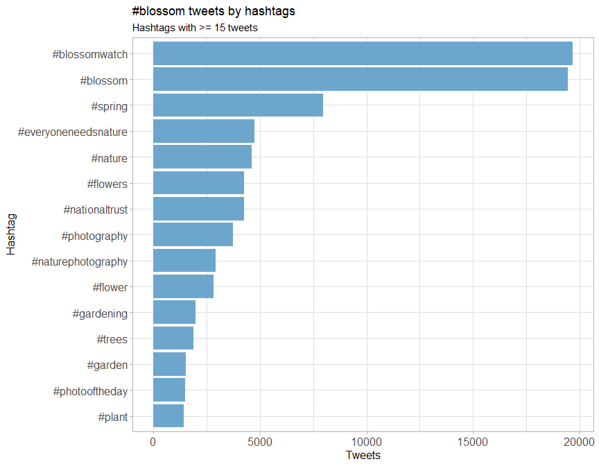
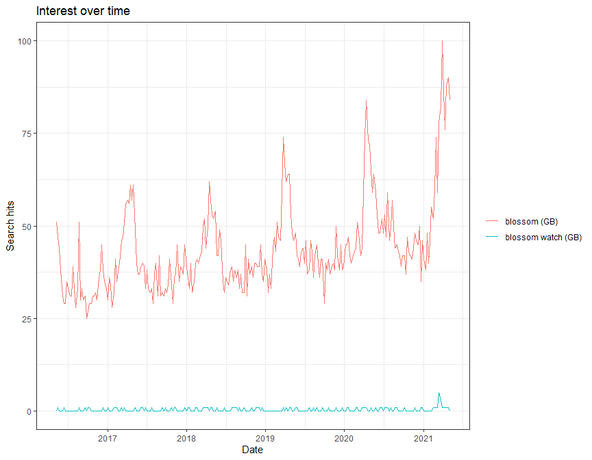
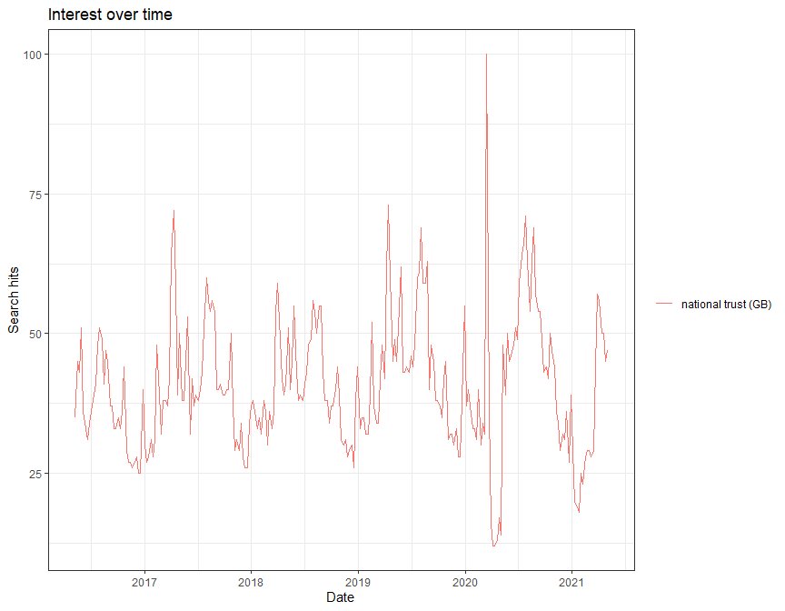

National Trust Blossom Watch 2021
================
Alan Millington
2021-05-06 19:56:13

## Interactive Blossom Map

Click the markers to view the tweets where an image and the \#blossom
hashtags exist. Zoom out for the world view!

Currently showing: 1253 markers.

<script type="application/json" data-for="htmlwidget-d04bf31de138a2cafa9d">{"x":{"options":{"crs":{"crsClass":"L.CRS.EPSG3857","code":null,"proj4def":null,"projectedBounds":null,"options":{}}},"setView":[[52.8781,-2.836],6,[]],"calls":[{"method":"addTiles","args":["//{s}.tile.openstreetmap.org/{z}/{x}/{y}.png",null,null,{"minZoom":0,"maxZoom":18,"tileSize":256,"subdomains":"abc","errorTileUrl":"","tms":false,"noWrap":false,"zoomOffset":0,"zoomReverse":false,"opacity":1,"zIndex":1,"detectRetina":false,"attribution":"&copy; <a href=\"http://openstreetmap.org\">OpenStreetMap<\/a> contributors, <a href=\"http://creativecommons.org/licenses/by-sa/2.0/\">CC-BY-SA<\/a>"}]},{"method":"addProviderTiles","args":["Esri.WorldImagery",null,null,{"errorTileUrl":"","noWrap":false,"detectRetina":false}]},{"method":"addMarkers","args":[[51.57300845,51.4892630317277,51.4892630317277,52.3070035454784,52.3070035454784,43.6556039114105,52.5260564712242,52.5260564712242,54.326605,54.326605,-27.6096907,45.2487908,45.2487908,52.4939665,53.447963,53.4569527,53.4569527,53.447963,53.447963,54.4284636,55.8429150437375,55.9431955,53.4716109609929,56.019801,43.6470719284023,51.344775,53.9318445886624,49.0869965,39.7665555,51.5925145468334,51.1568243,35.9582372465706,53.4569527,52.41191295,40.15251,40.15251,54.2614201510058,52.4419474170229,51.5609551690173,51.7283335,52.3070035454784,52.3128745,50.9975070174853,51.4405145,51.457877,51.4040047259898,53.8159335,51.739893,35.7970524,51.9894059,51.3129313,54.0207341713066,55.02800925,51.6072097777512,52.05786875,51.3796495,33.9752445,53.765817,53.99123085,50.9975070174853,50.7422682,51.5494385,45.4020999985347,49.257639,55.9431955,52.4008822,38.195555,52.5260564712242,52.84708985,51.5187078092668,52.4939665,51.4651305,43.629311,55.8583027,40.780709,51.530479459494,54.040881755799,50.7937289931518,52.6671547,50.4155726,53.69084575,53.2878285,53.22072115,51.4777479687988,51.4777479687988,51.358931,51.4447792430922,51.457877,51.2525461,54.2560084,52.8981655,53.72852395,26.205625,52.381068,52.29326265,53.99123085,51.3794825,48.4962255,52.240044,53.9134215,51.3854457438995,50.447559,52.109571,51.2443596169533,53.0737115,51.130903858363,51.281874750166,40.780709,34.55390115,53.6473925,56.4750177339694,52.20097375,54.45963955,51.5644360946971,51.707054,39.190894,51.5144805,51.5475708085849,51.5616322914475,51.5493255397632,51.5541179261843,51.566400193638,51.5541179261843,55.958773,12.92311465,46.14907835,38.8767468034677,53.38316455,52.5260564712242,50.9975070174853,55.79477815,55.79477815,51.457877,53.2498555,50.9213275,50.8953309848861,53.4569527,53.4569527,53.4569527,53.4569527,53.4569527,53.4569527,53.4569527,50.3470693519556,50.3470693519556,28.6384895,28.6384895,51.5879017,51.5771512584608,51.609359,52.7708368,51.5467500298058,54.0207341713066,51.5111700083324,51.5257136956869,51.8721308,51.709302,52.3113850994157,51.26357875,33.8733656,43.534199,54.85516525,51.61190415,49.111519,51.3618974,52.936641819736,52.969719,52.969719,52.9781588269353,50.7209398,12.92311465,53.470654512907,50.4950842488306,52.927051,51.125974,51.5330931619969,51.514033722788,51.5337497930697,51.4796031543878,51.4796031543878,50.958566,34.17713365,51.41074675,52.0571133,51.6353266108753,51.3589593158177,51.459975,39.1000485,53.293526,38.8797083781284,51.3731466722201,51.57300845,52.5184148,52.51603485,51.5424365,50.551466,50.5805081916207,51.4046741440723,43.8371045,52.4008822,51.46468585,51.3513705,52.969719,51.4402245,51.6698936542289,52.24893435,51.4423724917568,51.448178365443,24.854815,53.6527212420572,52.91553,50.7422682,51.7512701486406,54.67042135,51.39432035,52.23207065,51.499152450233,51.59925535,55.0121532,51.823612,53.4330035,51.4405145,52.3412533020337,51.405621,55.1314181993042,48.8465094126524,51.9051824,52.22603495,51.530479459494,52.447226,51.9169878,50.3540316826565,53.4198785,53.90989885,52.6671547,52.6671547,52.447226,52.447226,38.2238192529641,32.099476,52.4008822,51.8963135,55.8788402873915,53.8019562,53.9318445886624,54.09053925,51.3560575476424,52.4939665,52.4939665,53.33554395,53.393049,54.881608,53.6861987185163,51.50378615,52.7967914597022,52.683319,54.2335656139689,53.2084675,53.3675705,51.4703703140249,51.663038972571,51.108528184894,52.792553,53.765817,51.4895962028972,51.57300845,52.2718633724262,51.707054,50.9776165,52.45973335,34.12167,51.14192525,52.4939665,53.5841845,50.78489249184,54.13324515,51.3865931384482,51.52209335,51.5596614470699,30.2369635,52.5888515,51.020124,54.6476704,51.6542828,51.0389977876047,51.0723185,51.045345,52.5260564712242,53.743824,51.4985987485087,52.1165373971181,50.1090181240071,52.20097375,50.83957475,52.948112,52.1935851,51.4742436312553,53.20178205,40.9445675,51.3560575476424,40.0048655,51.544536290336,51.41074675,36.3231153959885,30.3206725,30.3206725,30.3206725,51.3138810363931,50.8425192512683,51.1689825137067,54.465360399383,54.465360399383,54.550999948693,54.465360399383,54.465360399383,53.50482315,50.4155726,50.4155726,-42.834749085,34.0961174888911,54.85516525,54.5756271777146,54.4542366156765,50.40221485,50.40221485,53.38316455,53.38316455,40.0048655,50.753621373209,51.707054,53.73959575,22.6127055,53.3582585,47.6148172,54.4486261103131,33.712431,52.91553,52.91553,52.347556248267,52.0838943645944,52.4044359515416,53.4198785,52.4956863690086,56.0697156146907,56.0706581378584,51.457877,51.5388496203318,51.52916,52.55439305,55.0655544243453,51.454107,40.7895377,53.01939665,53.01939665,1.31199165,34.3996145,50.7283545,53.38316455,51.4088470948396,45.2487908,45.2487908,45.2487908,45.2487908,45.2487908,45.2487908,53.4569527,53.4472583231038,53.447963,53.4569527,53.4569527,53.4569527,53.4472583231038,53.4472583231038,53.4569527,35.7970524,48.85883375,52.592258,51.8963135,52.220450544867,51.3701525,51.5121365,50.7263177410494,34.166235,51.3658056994292,53.168767,52.699658,52.3113850994157,52.3070035454784,51.6698936542289,51.6698936542289,52.5260564712242,51.7542859,51.7542859,52.41191295,30.8641075,11.404229,51.41074675,38.195555,54.0803810748977,53.0126970263489,50.3470693519556,48.382929,40.7055975,38.8894941938122,34.1581827157672,53.45599825,33.4623048322042,51.5609551690173,50.958566,52.48042,35.447269,51.90077225,53.0737115,53.0737115,52.4956863690086,40.758497,53.3501600437301,53.47530345,39.095196889414,51.4336231,33.69254185,51.4780018885732,51.4780018885732,51.4533419760658,54.5874982105622,50.9975070174853,51.3854457438995,52.323753,53.3666986,55.8583027,52.0620328256443,38.3045585,48.85883375,52.205345391514,52.5260564712242,51.3856155903035,32.576227,32.576227,51.41365925,33.69254185,51.0793705,52.49165685,51.4108755,50.1891845,50.4412216049694,50.1891845,52.3043768,52.6671547,51.5879017,52.2802965,52.4105664,51.5424365,52.6431521026568,52.6431521026568,55.9399570044867,51.344775,35.814519,35.814519,32.0685025,52.806216,30.683649,33.7473135,52.4939665,53.3786502127734,52.150242,53.96620645,51.8872693,51.59925535,53.302379,51.5609551690173,53.9404352358173,52.4044359515416,50.9975070174853,51.6000045,51.461742,51.5424365,51.5424365,50.9975070174853,53.415257,52.4748866118269,50.8623332,53.6940406395793,53.38316455,49.257639,47.27302215,52.12672645,52.12672645,51.63335475,49.2396535,52.6671547,52.792553,51.50378615,38.884193,26.03967995,51.4684019,51.3796495,40.15251,53.08446,54.1159327,37.18040885,31.8172605,50.63443015,51.707054,28.39084945,38.884193,40.780709,28.6255723,52.68982785,54.881608,51.2128565,52.29326265,52.4008822,38.89860285,38.89344685,51.403087787328,51.3796495,51.26025005,51.61188465,52.6201447823283,53.5841845,49.3156065,51.500474,50.40221485,51.26357875,53.54345385,52.889063,52.0372527,47.6572364311446,37.7331893019858,37.6439065,53.8159335,53.685942,51.6681553634086,53.4049518335666,51.3618974,53.38316455,50.9213275,52.5892333984375,53.4569527,52.48042,29.997796,40.722238,52.6210942802199,51.4715045,51.4405145,52.5962595,54.068005031081,33.12148405,33.8091385,33.12148405,49.257639,51.6868715,35.7970524,53.8312725,53.58988825,53.27350265,40.655138,34.55390115,53.38316455,53.38316455,53.8019562,51.5318706,52.41191295,39.9795289609063,33.7671944,54.326605,40.735941,53.8744222,52.5260564712242,54.1689266,53.382608,53.382608,53.382608,53.382608,50.136584660057,55.0829877797496,37.761711,29.982601,41.9382285,-32.8310399554273,47.0360363275528,51.3711543,54.0207341713066,52.201290479797,51.4777479687988,40.730831,44.94151555,37.895187036902,40.655138,55.925904918419,50.8313395,52.486366,45.2487908,51.94056115,55.9399570044867,54.8377904,54.465360399383,35.3336365,50.5280985,53.9134215,53.96620645,54.4124737,51.4620823949652,50.6274375,51.10216445,53.9318445886624,51.1217935302582,52.1210831334818,51.2787159,51.6698936542289,52.3768816023225,50.4155726,51.530479459494,53.38316455,34.0207895,54.4009318102878,54.465360399383,51.358931,52.7591759823594,53.4198785,51.358931,50.685254,50.8399078640097,48.382929,38.195555,52.4044359515416,53.447963,55.8583027,51.5691003401619,51.4892630317277,52.2215204,51.2012465,19.2097970788853,51.5144805,38.8873567,20.6934485,52.220450544867,51.6093578,48.382929,45.2487908,45.2487908,53.4569527,50.840332,50.3815971392456,51.57300845,52.3070035454784,55.1314181993042,53.433531,51.403087787328,51.4777479687988,53.447963,55.0829877797496,54.4124737,50.112015,52.5801345,52.410038,54.0207341713066,55.0055239412672,37.34593685,51.3854457438995,50.8767376,42.9488405,38.997936,55.9399570044867,53.3819972913423,51.639024,51.5732714807788,52.5260564712242,52.4939665,28.39084945,53.38316455,53.38316455,53.447963,53.4569527,53.447963,53.4569527,53.4569527,36.692933,52.6200574599687,53.6791975,36.0651420940417,38.884193,50.9184667,53.05342655,28.4456541640149,34.0628185,51.4970016,32.576227,50.7072682489962,38.8808445,52.71523275,34.67690515,54.0207341713066,52.6090042753881,51.8895475,50.9213275,55.1314181993042,6.91650044390615,-34.847270505,50.3328854815073,51.7542859,51.4603395,52.9268753447383,52.3113850994157,55.79477815,55.79477815,55.79477815,55.79477815,55.79477815,51.94056115,38.9109735889597,51.00449715,51.2443596169533,52.1935851,35.306377,41.7870504139422,43.534199,52.5260564712242,38.89860285,52.40551,38.89860285,38.89860285,53.4146085,55.02800925,51.274357,38.7936215,51.5715133403422,51.5879017,28.773568,56.6320519185345,35.6952221,51.45479,35.727197,35.727197,51.4603395,50.4422296548448,52.2802965,52.91553,53.25728295,52.4939665,45.2487908,38.2906475,35.7970524,51.5476447,52.4044359515416,51.457877,55.9431955,53.4146085,53.2498555,54.881608,52.205345391514,50.3823607723363,53.4569527,51.5469264,52.3128745,52.5260564712242,53.3627219444545,51.36433785,51.457877,51.457877,51.2787159,51.0676529225596,45.2487908,34.55390115,55.9431955,53.4569527,51.1847462412382,55.9685475304656,52.5260564712242,54.85516525,53.5558197,54.068005031081,51.5348059145846,51.5343008802551,50.7422682,50.7422682,50.7422682,51.4892630317277,51.4892630317277,51.52895,51.52908575717,51.5300656454401,34.55390115,52.65776925,51.3001085,50.9975070174853,53.99123085,52.5260564712242,51.3701525,51.3701525,52.3113850994157,54.0207341713066,52.5684863,45.2487908,45.2487908,41.5556915578081,51.34679605,52.22972525,51.804306,53.4569527,53.447963,55.8583027,51.6698936542289,52.79911,51.4447792430922,56.2948535,62.3784279973812,59.333671,55.9399570044867,51.0441669700602,50.7422682,53.18795945,32.576227,52.24893435,50.727532,53.556467,55.8583027,35.7970524,50.8717924,51.6698936542289,50.6274375,50.13433815,53.0181554,53.0737115,51.2536425395192,50.7422682,56.4643872356254,41.1179365,42.111057,40.730831,53.447963,53.4569527,53.47530345,52.220450544867,53.70181935,52.1548945,50.8188645,51.649205,51.6698936542289,45.4020999985347,39.2114315,53.29861785,52.4939665,45.2487908,45.2487908,48.82544985,51.3701525,51.3701525,40.15251,53.32798,50.103560614406,52.9579559,50.851063,52.4939665,53.4569527,38.195555,53.4569527,51.524037,50.7283545,53.0181554,51.358931,51.4447792430922,53.35490235,51.1217935302582,55.91087275,52.6262635,51.70340255,50.9975070174853,53.4569527,53.4569527,51.42572495,51.5146946,51.5061144033011,51.5146946,51.5146946,51.5101382250562,50.9975070174853,51.403087787328,53.38316455,51.4892630317277,51.4970016,53.38316455,51.3796495,51.560466390998,52.4939665,53.47530345,51.57300845,53.47530345,51.923774,52.220450544867,53.3479777416993,38.195555,54.881608,54.9210315,51.5724332096913,53.930725,50.7422682,50.7845814,52.969719,52.4321580334175,51.4879907112178,51.4422024766838,51.641268,51.523971512164,51.4771391442992,51.57300845,51.57300845,51.57300845,51.457877,52.1378415,54.45963955,54.6476704,51.4325655,51.8198085,51.3854457438995,51.3854457438995,52.4044359515416,52.0073683886465,52.2873250438644,52.2873250438644,51.8619632002243,51.6542828,53.35490235,51.4425709129071,53.77409075,51.454107,52.6262691106391,52.6240873261068,52.9795270046008,53.4198785,37.34593685,52.4044359515416,51.39432035,52.20097375,53.4945977,51.4177594523945,51.3618974,53.863767,52.0663965,51.52483525,51.3687545,54.12075775,53.58069795,53.69631,53.4198785,50.9975070174853,50.1055354176437,50.840332,50.840332,50.9975070174853,54.0207341713066,52.12672645,53.38013535,53.38013535,53.38013535,53.38013535,50.9975070174853,51.61085,52.0058876140953,52.0058876140953,50.4112243,52.91553,52.24816545,52.5260564712242,51.5424365,52.7741925,52.410038,52.7178727507917,52.20097375,51.3854457438995,52.3128745,53.863767,53.8473695,51.4933706930549,54.6633135,51.59583285,50.9213275,54.4264665,51.39432035,52.0578418,51.9907533264146,51.20665495,52.7033911202131,53.0984755,51.5148305,51.59925535,52.5260564712242,45.2487908,45.2487908,53.765817,43.6439835,52.510696,38.195555,55.6726621,53.556467,53.349264949238,50.8188645,51.5476447,53.4569527,51.4892630317277,51.26357875,51.26357875,51.2364205,51.9894059,53.8019562,51.5424365,53.4198785,50.9975070174853,51.344775,56.476952,51.6442892,53.4838395,53.69084575,52.792553,50.7209398,53.77409075,53.77409075,53.38316455,53.5558197,51.2160253,50.8313395,51.361573,51.06424,51.4777479687988,51.530479459494,51.7542859,53.4569527,53.7532448028791,42.323239,53.31532565,54.068005031081,52.03918185,53.2475037,55.9431955,53.47530345,51.46468585,53.501557,52.8009185496991,51.49852657601,53.38316455,53.96620645,52.6376424027289,50.83957475,51.6700501411903,53.38316455,51.3711543,51.6485405,51.494151,51.52895,51.529993,53.1973495,53.1973495,52.3799753,55.9431955,50.7422682,54.6474614343007,50.7209398,53.0737115,53.863767,51.3701525,50.112015,51.142153,53.0644032,51.70273,53.673599,54.659457,52.4939665,50.90743075,52.79469115,53.9620318609946,31.8172605,51.4516565,51.4108755,52.1560286,51.447433,51.125974,52.1090273096011,51.3854457438995,52.057782,52.0616055176627,51.4715045,52.20097375,52.20097375,51.57300845,52.1577465,51.508115,51.5448215,50.9109885,52.969719,54.0207341713066,53.3817131522171,50.9975070174853,51.482425211511,53.4198785,50.4950842488306,51.6651123,55.1314181993042,55.9714556140012,51.3704006431775,51.5499845945891,55.9431955,52.9247914,51.5244503,53.2595922689112,50.64591003,51.4970016,52.5962685,51.5424365,53.38316455,53.38316455,53.38316455,53.38316455,51.3796495,51.4775207762235,51.4892630317277,52.20097375,32.93183385,50.858975,54.068005031081,51.5160475,51.39432035,51.39432035,51.39432035,35.7970524,53.5821395,51.8728579,34.0628185,52.109571,51.41074675,56.05516,52.62506455,51.4970016,51.1691013,51.69888645,51.52209335,40.67087955,53.99123085,55.9431955,52.98532585,50.7209398,51.5542074035805,51.5542074035805,40.15251,53.77409075,-8.7059682,51.5879017,53.8228056373844,51.4970016,50.447559,48.382929,35.7970524,19.50964685,53.4569527,40.5838765,53.517648,52.5891797539027,52.0838943645944,51.5370612,51.46582015,43.6686215,52.220450544867,53.501557,52.667682,51.5491632337706,51.36826,51.4944418205454,27.698682,51.2443596169533,52.914004,55.9431955,55.9588241781371,55.9588241781371,51.26282585,53.688763,53.2650091310044,49.668152,51.54085685,53.45599825,52.691791,51.4200915,34.0628185,34.0628185,53.3728461925499,55.972333,54.5958689,55.8447377446142,53.01939665,50.3743172540898,51.4509314325664,40.4777947,50.9975070174853,51.8410975207607,51.39094805,51.5469264,50.9975070174853,51.536548,51.546021,52.0058876140953,51.5312884055612,51.5160475,45.2487908,43.629311,43.629311,51.7542859,38.7537935,54.881608,51.66506264281,34.249106,51.50009175,52.29326265,51.7502220185233,54.068005031081,38.9125027309268,50.8120498503313,51.5499845945891,52.41191295,52.3070035454784,52.20097375,50.83957475,54.068005031081,54.068005031081,51.4516565,51.57300845,42.4817015,40.4777947,51.461742,53.501557,54.12075775,47.645245,51.461742,53.0660016674255,51.454107,-27.6096907,55.02800925,51.52483525,52.2253735928879,12.9965030630416,50.9975070174853,45.2487908,45.2487908,52.20097375,55.8583027,51.4516565,40.780709,51.5071878926179,51.7145187,35.8305215,55.9399570044867,51.9119195678758,35.7970524,52.033567,52.220450544867,51.3854457438995],[-1.7856897,-0.088160668539883,-0.088160668539883,0.299247873387757,0.299247873387757,-79.3600502244065,-2.20386837034641,-2.20386837034641,-2.7412463,-2.7412463,-48.478899,-75.8001415,-75.8001415,-1.8906405,-2.285012,-2.23348,-2.23348,-2.285012,-2.285012,-2.96281655,-4.32767488848884,-3.20300845,-3.01769374275087,-3.91956715,-79.4137559260075,-0.2609153,-1.20748274252911,-122.2670745,-86.441236,-0.0217475773302509,-0.9668875,14.3390268688572,-2.23348,-1.51865165,-76.303738,-76.303738,-5.84482674195805,-1.7666299992437,-3.0275194003425,0.5810675,0.299247873387757,0.300456,-3.92711909960321,-0.306996,-2.58539,-0.186735391616821,-1.76682,0.478479,75.18362705,-1.69879795,0.8891865,-1.211187268522,-1.458029,-2.21486054987515,-2.7131526,-2.3669332,-118.4478401,-0.3339427,-1.5418761,-3.92711909960321,-1.85260705,0.7212505,9.12885599906986,-123.123581,-3.20300845,0.2619012,-85.7223455,-2.20386837034641,-2.29813415,-0.0620325338645491,-1.8906405,-0.5351442,-79.2725695,-4.24175135,-73.9685415,-0.153765678405762,-2.79453712389731,-1.06011629104614,-2.451174,-5.075986,-1.30439735,-0.2983925,-0.54738995,-0.296630859375,-0.296630859375,-0.092633,-3.30206494302962,-2.58539,1.0142459,-3.0683044,-1.327288,-2.48375065,92.862467,-2.250699,-1.5314199,-1.5418761,1.3579225,-123.370838,0.2450375,-1.940163,-0.25275396881444,-3.5456951,-0.4225935,0.0833174164591258,-2.115866,0.263146417180255,-2.76703607316986,-73.9685415,76.1316244,-1.811758,-2.89794449221972,0.1359161,-6.3276914,-0.167362547654193,-0.619748,-120.108808,-0.0929107,-0.0549004430668343,-0.0513318626310328,-0.0534480678508875,-0.0328419795881899,-0.0470352172851562,-0.0328419795881899,-3.95155735,77.5584482,14.99299715,-77.0222983883958,-1.449612,-2.20386837034641,-3.92711909960321,49.06963465,49.06963465,-2.58539,-1.4390975,-1.3964671,-1.37607422747178,-2.23348,-2.23348,-2.23348,-2.23348,-2.23348,-2.23348,-2.23348,-3.53450775146484,-3.53450775146484,77.095086,77.095086,-0.102162,-1.80634607058954,-1.821235,-0.9242905,-1.7579329675681,-1.211187268522,-0.306749515305811,-0.149538516998291,-2.45591005,-2.29923,0.30264208891327,0.5277305,35.8495147,-80.240128,-1.8361299,-3.22762495,-122.818486,-0.1815875,-1.14470074146029,-1.17226615,-1.17226615,-1.14864796973305,-3.5148765,77.5584482,-2.27642924051656,-4.22527313232422,-1.2673735,-0.0252675,-0.0898841836732431,-0.0768483785850381,-0.0682997703552246,-0.157252550125122,-0.157252550125122,-0.1326032,74.73630415,-0.75426135,1.161663,-2.15994000434875,0.55556058883667,0.717528462409973,-94.5592817,-3.8153015,-77.025511264801,-0.14556884765625,-1.7856897,-8.7613189,-1.7394725,-0.159403,-3.543954,-3.46839398145676,0.532222808613383,-79.5657915,0.2619012,-0.07060315,1.0234735,-1.17226615,0.206629,-4.06788110733032,0.40698405,-2.62101173400879,-2.61401697023205,121.23214,-2.64227538600224,-1.4707785,-1.85260705,-1.22128928613946,-5.96405615,0.02629885,-1.15307235,-1.12146377563477,-0.018734,-3.4468685,-0.191992,-1.36686735,-0.306996,-1.70767274248292,-2.417913,-1.73961937576872,2.25254891572218,-1.15006,0.5199494,-0.153765678405762,-1.7874956,4.5961144,-4.17594194412231,-2.915427,-1.75219495,-2.451174,-2.451174,-1.7874956,-1.7874956,13.3172535896301,-81.267942,0.2619012,-2.0877745,-4.28937020452919,-1.56549,-1.20748274252911,-1.3953955,-0.381201894516243,-1.8906405,-1.8906405,-3.1018291,-2.0706834,-1.423629,-1.77131914054931,-0.1891901,-0.838055440310995,-1.229427,-5.85988902645503,-2.7132183,-2.17398345,-0.15181303024292,-0.410650459441209,-1.05363012634158,-2.0147955,-0.3339427,0.296380934606476,-1.7856897,-2.08290532051142,-0.619748,-1.444367,-6.5793881,-117.56215255,0.8731216,-1.8906405,-2.4349527,-1.35427108047748,-0.79479625,0.503139495849609,-3.3226471,-0.159639057036471,68.1303685,-2.2635525,-1.31428,-5.6676009,-1.5847118,-2.2259791342284,-1.801981,-1.786945,-2.20386837034641,-0.357954,-0.0547128696238566,-1.93819479700697,-5.1170121346919,0.1359161,-0.1917231,-1.0334275,-1.59895855,-2.57827427079912,-1.2165772,-73.860857,-0.381201894516243,-75.117998,0.608369958778082,-0.75426135,74.6695044622426,78.00876,78.00876,78.00876,-0.473204356821209,-0.15031099319458,-0.839222432841159,-6.6570689149677,-6.6570689149677,-5.60104259584009,-6.6570689149677,-6.6570689149677,-1.0750482,-5.075986,-5.075986,147.373521824,74.8782986875605,-1.8361299,-3.20489863326151,-3.21155608068628,-4.14292995,-4.14292995,-1.449612,-1.449612,-75.117998,0.272424491686624,-0.619748,-1.590952,88.352242,-2.8793305,-122.3306024,-5.82846241923107,73.0768205,-1.4707785,-1.4707785,-1.59065580570293,-1.74438596716137,-4.00161693005789,-2.915427,-2.37380555334549,-3.46770302892585,-3.45052242279053,-2.58539,-0.0751975293751333,-0.083724,1.0560422,-1.5047103708158,-0.01799,-80.13991495,-2.1540125,-2.1540125,103.83645695,74.27974845,-1.9522795,-1.449612,-0.304838400868996,-75.8001415,-75.8001415,-75.8001415,-75.8001415,-75.8001415,-75.8001415,-2.23348,-2.29269494551524,-2.285012,-2.23348,-2.23348,-2.23348,-2.29269494551524,-2.29269494551524,-2.23348,75.18362705,2.34700295,-2.1064075,-2.0877745,0.511578099341896,-2.807474,-2.68004325,-2.84124511553927,-106.026119,-2.20254421234131,-1.308719,-2.0080795,0.30264208891327,0.299247873387757,-4.06788110733032,-4.06788110733032,-2.20386837034641,-1.23343335,-1.23343335,-1.51865165,72.3554985,76.71297,-0.75426135,-85.7223455,-2.83381703164297,-2.17187977227053,-3.53450775146484,31.18144605,-73.977717,-77.0352490246296,74.9041811185527,-2.33123045,-117.706446765436,-3.0275194003425,-0.1326032,-0.9213098,136.7823045,-1.9467334,-2.115866,-2.115866,-2.37380555334549,-73.4541735,-2.99844079297978,-2.3495665,-84.51043009758,-2.7615757,-117.9987325,-2.55002975463867,-2.55002975463867,-2.60667187068004,-3.37058073872717,-3.92711909960321,-0.25275396881444,-0.125486,-1.99676205,-4.24175135,-1.34329039408168,-92.4367735,2.34700295,-1.62095389879685,-2.20386837034641,-2.35517263412476,-86.6807375,-86.6807375,0.46074465,-117.9987325,1.120798,-2.9985779,-0.189289,-5.41346,-4.69684161154812,-5.41346,-2.7005202,-2.451174,-0.102162,-1.5742461,-4.06973375,-0.159403,-2.45129097744253,-2.45129097744253,-3.22292768628507,-0.2609153,139.32664,139.32664,77.403878,-1.63649455,-88.1615555,-117.993728,-1.8906405,-2.7339112611166,0.781894,-1.08532465,5.39845295,-0.018734,-1.476763,-3.0275194003425,-1.10406438600845,-4.00161693005789,-3.92711909960321,-1.109582,-0.3506925,-0.159403,-0.159403,-3.92711909960321,-2.85165605,-0.927700996398926,-2.157358,-1.6314711990335,-1.449612,-123.123581,-120.882482,-2.74171975,-2.74171975,-2.6772815,-122.958344,-2.451174,-2.0147955,-0.1891901,-77.039314,-80.1783915,0.08932425,-2.3669332,-76.303738,-1.572729,-0.39445665,-3.59796735,77.2970165,-2.05486115,-0.619748,84.13302055,-77.039314,-73.9685415,-81.43917755,4.926024,-1.423629,-1.4949326,-1.5314199,0.2619012,-77.0143985,-77.0146485,0.486359596252441,-2.3669332,-0.71720965,-0.21089455,-2.50667511767071,-2.4349527,-123.070225,-0.059305,-4.14292995,0.5277305,-2.65323795,-1.1534925,4.3243611,-122.307186126709,-120.216682944605,-77.5223735,-1.76682,-2.8455146,-1.91127223431832,-2.2795630432176,-0.1815875,-1.449612,-1.3964671,0.605095028877258,-2.23348,-0.9213098,79.309181,-73.9951705,-1.07614515332915,0.01498965,-0.306996,-1.999259,-2.7751314905012,-117.2879235,-117.220413,-117.2879235,-123.123581,-4.1407616,75.18362705,-1.9532139,-0.6419347,-6.39952115,-73.9487755,76.1316244,-1.449612,-1.449612,-1.56549,-3.38291165,-1.51865165,-75.1964539289474,-84.433106,-2.7412463,-73.9905015,-3.0079355,-2.20386837034641,-2.8250405,-2.5933005,-2.5933005,-2.5933005,-2.5933005,-5.69270997522822,-1.49618576424674,-122.4149485,-90.011008,-93.38986395,150.054346764436,-122.900869462812,0.5824536,-1.211187268522,0.118661870259925,-0.296630859375,-73.99653315,-93.1056485,-82.0031668505632,-73.9487755,-3.18328572130479,-0.39004055,-0.68406,-75.8001415,-1.55178155,-3.22292768628507,-1.348041,-6.6570689149677,139.541035,-3.6081815,-1.940163,-1.08532465,-6.14791205,-2.63912200927734,-2.4692695,-1.7859396,-1.20748274252911,-1.19887260332679,-1.39845763325673,0.1862015,-4.06788110733032,1.00817799568176,-5.075986,-0.153765678405762,-1.449612,-118.4119065,-2.96461678969529,-6.6570689149677,-0.092633,-2.74904161325173,-2.915427,-0.092633,-2.1252649,-0.145253599731272,31.18144605,-85.7223455,-4.00161693005789,-2.285012,-4.24175135,-4.2889555759545,-0.088160668539883,0.6736882,-4.0265185,72.8737680645336,-0.0929107,-77.00034365,76.9795085,0.511578099341896,-1.2470612,31.18144605,-75.8001415,-75.8001415,-2.23348,-0.13035585,-4.08245086669922,-1.7856897,0.299247873387757,-1.73961937576872,-1.1094555,0.486359596252441,-0.296630859375,-2.285012,-1.49618576424674,-6.14791205,-5.5402523,-2.147965,0.250594,-1.211187268522,-1.61989947171222,-5.74195415,-0.25275396881444,-2.9613821,-81.2487865,-105.5508905,-3.22292768628507,-2.40137100219727,-2.1558,-4.11235178348592,-2.20386837034641,-1.8906405,84.13302055,-1.449612,-1.449612,-2.285012,-2.23348,-2.285012,-2.23348,-2.23348,-79.9379225,-2.50641703605652,-1.508545,129.310719021942,-77.039314,-1.5011952,-2.98207385,77.5106047573966,72.098744,-3.1797998,-86.6807375,-1.92639148547122,-77.101999,-2.7621095,76.42905465,-1.211187268522,1.25266646550244,0.553941,-1.3964671,-1.73961937576872,80.7886934280395,138.69898794,-4.75733534011691,-1.23343335,-0.115406,-2.15118437913587,0.30264208891327,49.06963465,49.06963465,49.06963465,49.06963465,49.06963465,-1.55178155,-77.0447949132204,-0.9311725,0.0833174164591258,-1.59895855,-77.7938005,-87.5827159501261,-80.240128,-2.20386837034641,-77.0143985,0.538715,-77.0143985,-77.0143985,-2.1556405,-1.458029,-0.8421635,-77.277155,-0.166813976375338,-0.102162,77.4233395,-2.88118600845337,-97.455741,-0.990589,139.4737255,139.4737255,-0.115406,-3.70831835749714,-1.5742461,-1.4707785,-6.1743983,-1.8906405,-75.8001415,-122.46199,75.18362705,-0.0601675,-4.00161693005789,-2.58539,-3.20300845,-2.1556405,-1.4390975,-1.423629,-1.62095389879685,-3.58761045945201,-2.23348,-0.10918145,0.300456,-2.20386837034641,-6.23450223398156,0.51854575,-2.58539,-2.58539,0.1862015,-0.0885305183368697,-75.8001415,76.1316244,-3.20300845,-2.23348,-1.47290422626299,-3.1806028608236,-2.20386837034641,-1.8361299,-113.4926175,-2.7751314905012,0.708203955543203,0.708427902759787,-1.85260705,-1.85260705,-1.85260705,-0.088160668539883,-0.088160668539883,-0.06533,-0.0713184951677868,-0.0696516036987305,76.1316244,-1.8560589,0.458439,-3.92711909960321,-1.5418761,-2.20386837034641,-2.807474,-2.807474,0.30264208891327,-1.211187268522,-7.2938105,-75.8001415,-75.8001415,-87.7895883166879,-2.9451297,1.43648525,-1.671465,-2.23348,-2.285012,-4.24175135,-4.06788110733032,-1.4519981,-3.30206494302962,-3.709326,27.434401497841,17.9800589,-3.22292768628507,-1.15136452790167,-1.85260705,-2.19569335,-86.6807375,0.40698405,7.103964,-0.07847665,-4.24175135,75.18362705,0.565823,-4.06788110733032,-2.4692695,-5.3483719,-2.2472365,-2.115866,-0.0133202313794523,-1.85260705,-3.01029682159424,-77.604684,-72.41198,-73.99653315,-2.285012,-2.23348,-2.3495665,0.511578099341896,-1.664672,-0.192591,-1.06698545,-1.623476,-4.06788110733032,9.12885599906986,-85.922362,-3.41219105,-1.8906405,-75.8001415,-75.8001415,-124.059031,-2.807474,-2.807474,-76.303738,-2.7164625,-5.54887148490587,-6.39531535,-1.1703515,-1.8906405,-2.23348,-85.7223455,-2.23348,-0.128907,-1.9522795,-2.2472365,-0.092633,-3.30206494302962,-6.24762135,-1.19887260332679,-4.42514965,-1.13067,-0.42087915,-3.92711909960321,-2.23348,-2.23348,-2.2076586,-0.59259935,-0.579210010120463,-0.59259935,-0.59259935,-0.451625004353145,-3.92711909960321,0.486359596252441,-1.449612,-0.088160668539883,-3.1797998,-1.449612,-2.3669332,-1.85481701580612,-1.8906405,-2.3495665,-1.7856897,-2.3495665,4.488295,0.511578099341896,-1.83252663213792,-85.7223455,-1.423629,-7.8662907,-0.149861674828775,-0.77955586,-1.85260705,-1.6007441,-1.17226615,-1.8929359400072,-2.52786939492779,-2.57887672238918,-1.859814,-0.0597511840896708,-0.285033155594215,-1.7856897,-1.7856897,-1.7856897,-2.58539,-1.6068285,-6.3276914,-5.6676009,0.361443,-1.28813835,-0.25275396881444,-0.25275396881444,-4.00161693005789,-5.06732517626005,-1.53310775756836,-1.53310775756836,-2.64597773551941,-1.5847118,-6.24762135,-0.149543291952515,-2.7016375,-0.01799,1.23646382040458,1.24074957634996,-1.1532818581463,-2.915427,-5.74195415,-4.00161693005789,0.02629885,0.1359161,-6.23571995,-0.0677938798571342,-0.1815875,-1.90861655,-0.3954875,-0.1731149,-0.4952195,-3.21253355,-2.30475815,-1.40585265,-2.915427,-3.92711909960321,-5.12121736727527,-0.13035585,-0.13035585,-3.92711909960321,-1.211187268522,-2.74171975,-3.17086005,-3.17086005,-3.17086005,-3.17086005,-3.92711909960321,-1.8194134,-1.86319149111143,-1.86319149111143,-3.8130721,-1.4707785,0.7177809,-2.20386837034641,-0.159403,0.52291,0.250594,0.505740996373791,0.1359161,-0.25275396881444,0.300456,-1.90861655,-2.13602805,-2.62624876774848,-2.75272655,-0.3370625,-1.3964671,-6.4357343,0.02629885,-1.339156,-1.74431932320427,-0.8339127,-2.76306800609593,-1.3367745,-0.0350195,-0.018734,-2.20386837034641,-75.8001415,-75.8001415,-0.3339427,-79.3324205,-1.193262,-85.7223455,-3.81079165,-0.07847665,-1.80970533304585,-1.06698545,-0.0601675,-2.23348,-0.088160668539883,0.5277305,0.5277305,-0.5701173,-1.69879795,-1.56549,-0.159403,-2.915427,-3.92711909960321,-0.2609153,-2.95504505,-3.9457349,-1.2357245,-1.30439735,-2.0147955,-3.5148765,-2.7016375,-2.7016375,-1.449612,-113.4926175,1.3792345,-0.39004055,-0.5309195,-1.3255455,-0.296630859375,-0.153765678405762,-1.23343335,-2.23348,-2.70255975187756,-71.1421555,-3.77912765,-2.7751314905012,-2.4280387,-3.64208985,-3.20300845,-2.3495665,-0.07060315,-2.504527,-1.45790039497646,-0.0796093870157584,-1.449612,-1.08532465,-2.10240081849394,-0.1917231,-0.0150608434882999,-1.449612,0.5824536,-3.804292,-2.467896,-0.06533,-0.072788,-2.8948825,-2.8948825,1.11658395,-3.20300845,-1.85260705,-2.59500507454131,-3.5148765,-2.115866,-1.90861655,-2.807474,-5.5402523,0.2515055,-2.51425775,-0.40555,-1.884469,-5.918957,-1.8906405,-3.94836175,0.46793915,-1.07977151870728,77.2970165,-0.1937195,-0.189289,1.59094915,-2.1458817,-0.0252675,-1.46049983235294,-0.25275396881444,1.23678585,1.15769499596968,0.01498965,0.1359161,0.1359161,-1.7856897,-1.509577,-3.58689045,0.0249962,-2.7921715,-1.17226615,-1.211187268522,-2.93661117553711,-3.92711909960321,-0.0857877731323242,-2.915427,-4.22527313232422,0.2739535,-1.73961937576872,-3.16486404496429,-0.0916671752929688,-1.78156318471418,-3.20300845,-0.3189186,-2.5650223,-3.97426984843072,-2.4174091,-3.1797998,-2.2009845,-0.159403,-1.449612,-1.449612,-1.449612,-1.449612,-2.3669332,0.000858306884765625,-0.088160668539883,0.1359161,-97.079654,-3.39527255,-2.7751314905012,0.044914,0.02629885,0.02629885,0.02629885,75.18362705,-1.7836735,0.6929986,72.098744,-0.4225935,-0.75426135,-3.30245005,1.4405175,-3.1797998,-0.64988635,-0.189868,-3.3226471,-73.8311875,-1.5418761,-3.20300845,-1.1140985,-3.5148765,-0.0617551803588867,-0.0617551803588867,-76.303738,-2.7016375,115.2261395,-0.102162,-1.57908094022724,-3.1797998,-3.5456951,31.18144605,75.18362705,-80.571292,-2.23348,-80.0280425,-1.1393597,-1.97149897263938,-1.74438596716137,-0.4423608,-2.49250775,-79.3672705,0.511578099341896,-2.504527,-1.110696,-0.123655403741887,-0.09228241,-3.15654734825101,-83.804475,0.0833174164591258,-0.6384715,-3.20300845,-3.21007147654711,-3.21007147654711,-1.0945886,-1.310968,-1.0634532072928,14.0081249,-0.66622315,-2.33123045,-1.836005,0.2567799,72.098744,72.098744,0.22863001311987,-3.280301,-5.9284131,-4.42043198511958,-2.1540125,-4.11502361297607,-0.106065273284912,-3.70350755,-3.92711909960321,-4.14997354884501,-2.81962375,-0.10918145,-3.92711909960321,-0.038972,-0.050581,-1.86319149111143,0.0172212458222643,0.044914,-75.8001415,-79.2725695,-79.2725695,-1.23343335,-90.2710258,-1.423629,-4.12535548210144,-118.6107403,-0.148936,-1.5314199,-1.24485448451854,-2.7751314905012,-76.969717668544,-0.37067675639285,-1.78156318471418,-1.51865165,0.299247873387757,0.1359161,-0.1917231,-2.7751314905012,-2.7751314905012,-0.1937195,-1.7856897,-79.347762,-3.70350755,-0.3506925,-2.504527,-3.21253355,15.931417,-0.3506925,-2.02901601791382,-0.01799,-48.478899,-1.458029,-0.1731149,-0.893186409681752,80.249869628274,-3.92711909960321,-75.8001415,-75.8001415,0.1359161,-4.24175135,-0.1937195,-73.9685415,-0.16373062186176,-1.96546875,-85.9785995,-3.22292768628507,4.47301268577576,75.18362705,-0.7640637,0.511578099341896,-0.25275396881444],{"iconUrl":{"data":"http://alanmillington.com/blossom/images/oakleaf.png","index":0},"iconWidth":37,"iconHeight":51,"iconAnchorX":0,"iconAnchorY":0,"shadowUrl":{"data":"http://alanmillington.com/blossom/images/marker-shadow.png","index":0},"shadowWidth":51,"shadowHeight":41,"shadowAnchorX":13,"shadowAnchorY":15},null,null,{"interactive":true,"draggable":false,"keyboard":true,"title":"","alt":"","zIndexOffset":0,"opacity":1,"riseOnHover":false,"riseOffset":250},["
<\/center><b>@RachaelHWarren<\/b>: Pretty sure this is where fairies live ✨ \n\nSimply magical. #EveryoneNeedsNature #bluebells https://t.co/JGMkQHsYlD ","
<\/center><b>@JohalSean<\/b>: Listening to the Friday feeling. The tree branches provide the ripples of our journeys.\n\nEnergizing with #springtime 2021\n\n#energyiseverything\n #tree \n#stayfit #blossom \n  #glutesworkout #kettlebellworkout #kettlebell #gym #motivation #u2beautifulday \n#health #dontgiveup https://t.co/RrmWUgGRsb ","
<\/center><b>@JohalSean<\/b>: Sideshots of Freedom and Appreciation\n#themindisthebestweapon\n#journey #tree #fashion\n#stayfit #blossom \n #laterbecomesnever \n #health #travel #travelphotography #glutesworkout #kettlebellworkout #kettlebell #gym #motivation #u2beautifulday \n#health #dontgiveup #life https://t.co/qGSPEBZBrD ","
<\/center><b>@WickenFenNT<\/b>: Swans on Burwell Lode, we can look forward to seeing their Cygnets later on @NearbyWild @Britnatureguide @NatureUK @SwanwatchUk #EveryoneNeedsNature #Swans #Reflection https://t.co/lG0TXKMazA ","
<\/center><b>@WickenFenNT<\/b>: Two of the Highland calves on Burwell Fen @East_England_NT #EveryoneNeedsNature https://t.co/kwTX4tNCgW ","
<\/center><b>@justindwtn<\/b>: Cherry, Forsythia and more Forsythia! #BlossomWatch #FlowerReport #FlowerHunting https://t.co/tqsKfM0NK5 ","
<\/center><b>@HanburyHallNT<\/b>: You know what your feed’s missing this morning? Even more blossom 🌸🌸🌸 #BlossomWatch https://t.co/cHxZqiQ7k6 ","
<\/center><b>@HanburyHallNT<\/b>: Harry &amp; Georgina, brightening up your Sunday morning’s since 1701 😎 (okay, maybe not quite that long, but you get the jist).\n\n#EveryoneNeedsNature https://t.co/2QsNdcRWsv ","
<\/center><b>@JulieMerrall1<\/b>: \"Go out, go out I beg of you And taste the beauty of the wild. Behold the miracle of the earth With all the wonder of a child.\" Edna Jaques  #Ullswater #LakeDistrict #Birks #getoutside #EveryoneNeedsNature #YouMatter #breathe #mentalhealth #myphoto #beautifulworld #hiking https://t.co/5PPmdbLL7s ","
<\/center><b>@JulieMerrall1<\/b>: \"Almost every person, from childhood, has been touched by the untamed beauty of wildflowers.\" Lady Bird Johnson.\n\n#WildflowerWednesday #Ulgraves #LakeDistrict #woodanemone #violet #cuckooflower  #EveryoneNeedsNature #worldatmyfeet #mentalhealth\n#naturequotes https://t.co/T7NGJ04mZu ","
<\/center><b>@SvenChi887<\/b>: https://t.co/NFB0jY1IXa\nI am Live at Telegram🙏🎶🙏\n#AktivateYourHealer #GottesSegenAufAllUnserenWegen #foryou #meditation #foryoupage #picoftheday #redhair #yoga #happy #dankbarkeit #russia #faith #positiv #vibes #mindsetting #love #aboundance #freedom #blossom  #christos ❤️❤️❤️ https://t.co/1grpjcyDiw ","
<\/center><b>@ImeePlurad<\/b>: ;&gt; “No matter how chaotic it is, wildflower will still spring in the middle of nowhere” Sheryl Crow #LiberationDay #BlossomWatch #FlowerHunting #flowerphotography #Canada #NaturePhotography #PhotoOfTheDay #PhotoOfTheDay #spring #TwitterNatureCommunity #ottawatourism https://t.co/rEffg03cla ","
<\/center><b>@ImeePlurad<\/b>: Yellow tulips 🌷 #Yellow #BlossomWatch #Canada #ctvottawaphotooftheday #discoverottawa #fujifilm #MyOttawa #PhotoOfTheDay #NaturePhotography #TwitterNatureCommunity #photograghy #Flowers #walking #flowerphotography #spring  #photograghy @CdnTulipfest @Ottawa_Tourism @CCN_NCC https://t.co/UZWAnGpmXr ","
<\/center><b>@lucyvreid<\/b>: Daily blossom and birdsong top-up.  \n\nVolume up. \n\n#BlossomWatch #Birmingham \n\n@nationaltrust https://t.co/ODjvRIKS9T ","
<\/center><b>@TherapyUpNorth<\/b>: pretty #wildflower cardamine pratensis aka cuckoo flower, lady’s smock &amp; mayflower at dusk last night on @ryebankfields #Manchester \n#365dayswild #everyoneneedsnature #natureconnection #nature #therapy #outdoors #mindfulness #naturephotography  #naturelovers #wellbeing #selfcare https://t.co/gOifuikdth ","
<\/center><b>@TherapyUpNorth<\/b>: #bird boxes &amp; #birdsong on @ryebankfields #manchester - part of https://t.co/D7T7CPO7hJ bird box trail around the local #community - these are designed by @FernieTure \n\n#365dayswild #everyoneneedsnature #urban #forestbathing #nature #outdoors #mindfulness #wellbeing #selfcare https://t.co/oP2nZRkmCw ","
<\/center><b>@TherapyUpNorth<\/b>: bit of #forestbathing &amp; a once around the #labyrinth on a #RainyDay in @ryebankfields #chorlton #manchester - so many shades of #green after the #rain &amp; that lovely smell (petrichor).\n\n#365dayswild #everyoneneedsnature #nature #therapy #outdoors #mindfulness #wellbeing #selfcare https://t.co/ofr6cZrvx6 ","
<\/center><b>@TherapyUpNorth<\/b>: just another lovely #sunset on @ryebankfields #chorlton #manchester &amp; some of the mighty manchester black poplar #trees\n#365dayswild #everyoneneedsnature #natureconnection #nature #outdoors #mindfulness #naturephotography #TwitterNatureCommunity #naturelovers #wellbeing #selfcare https://t.co/jcCRV29b08 ","
<\/center><b>@TherapyUpNorth<\/b>: refreshing #BankHoliday #walk in the #rain @ryebankfields #manchester - #hawthorn just about to open #blossomwatch\n#365dayswild 🐝#everyoneneedsnature #natureconnection #nature #therapy #outdoors #meditation #mindfulness #wellbeing #selfcare #TherapistsConnect #BankHolidayMonday https://t.co/U7bBIi3ADu ","
<\/center><b>@ania_harrison<\/b>: I wonder what he was trying to tell me? 🦢 🤍 #evening #lakedistricuk #LakeDistrict #swan #wildlife #animals #sunset @lakedistrictnpa #nationaltrust @nationaltrust @CumbriaWeather @cumbriawildlife @cumbriatourism @BBC_Cumbria @LakeDistrictPR https://t.co/tEQuxXfoBv ","
<\/center><b>@Ka5hfa<\/b>: Beautiful wildflowers on today’s walking route #WalkThisMay #BlossomWatch https://t.co/4HeCD4DwoA ","
<\/center><b>@AmyMacpherson<\/b>: Before the snow, blossom (with bonus water wheel included)\n\n#blossom #edinburgh #leith #waterwheel https://t.co/5ebTdRWmWX ","
<\/center><b>@BrennansCider<\/b>: #BlossomWatch looking lovely in the urban orchard at the minute https://t.co/FVIq11rIlf ","
<\/center><b>@AberJohnny<\/b>: Nice #BlossomWatch about in the morning sunshine https://t.co/T9HPYuakZw ","
<\/center><b>@MarinaPiccioni<\/b>: A photo a day for 2021\n125 - 365\n#cherryblossom #sakura #spring #japan #flowers #nature #cherryblossoms #love #pink #photography #blossom #art #cherry #thevamps #flower #naturephotography #toronto #highpark #jamesmcvey #tristanevans #photo #travel #photooftheday #toronto_shooterz https://t.co/CB2NMeTbxL ","
<\/center><b>@indiraflack<\/b>: Apple blossom\n.\n.\n#dailyexercise #nature #blossom #apple #surrey #flowers #photography #savetheartsuk https://t.co/KfPkxp6XXX ","
<\/center><b>@BedellPoet<\/b>: Clumber park, Worksop Nottinghamshire, UK #nationaltrust #photography https://t.co/Fr5YvrnZPF ","
<\/center><b>@MonaLucas_Photo<\/b>: #Dogwood #blossom in my back yard.\n#Abbotsford #thefraservalley #flowers https://t.co/rYUuyV0F8U ","
<\/center><b>@MaggieMarieMetz<\/b>: Be the one who looks past the weeds of outer appearance and seeks what is on the inside, the beautiful flowers blossoming inside the heart!\n\n-MM\n\n#mindfulmotherhoodpodcast #mindfulmotherhood #flowers #bloom #blossom #winniethepooh https://t.co/KflvDupKsj ","
<\/center><b>@anneqy<\/b>: beautiful #Blossom blown away \n#BlossomWatch https://t.co/LkChUAUuck ","
<\/center><b>@DamonSmoke76<\/b>: Every year they just amaze.......\n#Bluebells #Springtime #Spring #BankHolidayWeekend #Woodland #HintonAmpner #Hampshire #VisitHampshire #NationalTrust https://t.co/tx4zGOTsGc ","
<\/center><b>@MajjistralPark<\/b>: #SpanishBroom is one of #Malta’s rarest #indigenous shrubs in bloom at the moment.\n\n👮🏼‍♀️It’s protected by law; schedule II of L.N. 200/2011.\n\n➡️ We’re joining @nationaltrust to celebrate #spring with their campaign #BlossomWatch. https://t.co/GLsLAuLR9X ","
<\/center><b>@philipmanc<\/b>: Some of the blossom is now on the floor like soggy confetti after the Bank Holiday weekend weather. But the trees are still looking beautiful, and there is a queue to get in Central Library @MancLibraries #BlossomWatch https://t.co/h5Xdc7ROdn ","
<\/center><b>@yasmine_oozeear<\/b>: Bed of #blossom 🌸🌸🌸 due to strong winds 🌬 https://t.co/Aw3mNKn9Zx ","
<\/center><b>@janportwood<\/b>: New. Its 1st #spring at my #house. #Delicate #white #blossoms in the #early #light. Touched by #shadows from above. #april #yard #flowers #tree #backyard #flower #shotoniphone #bloom #focus #story #nature #photography #blossom #sunlight #leaves #morning #outside #bokeh #day https://t.co/fuVIoFquso ","
<\/center><b>@janportwood<\/b>: #Portrait of #Spring. #White on black. Bold. Defying the #shadow. Glistening in the #morning #light. #april #yard #flowers #tree #backyard #flower #flowerphotography #dark #fujifilm  #bloom #focus #story #nature #photography #blossom #sunlight #early #earlymorning #outside #day https://t.co/sJhbGocDsa ","
<\/center><b>@jasper_nutkins<\/b>: Back in work today after 10 days off and what a difference, everywhere is bursting with greenery and life. The birds are chirping and the bluebells are out in force :) #EveryoneNeedsNature https://t.co/4r44CHKt5u ","
<\/center><b>@ElmdonPark<\/b>: A beautiful carpet of blossom in #ElmdonPark today 🌸 \n\n#nature #spring #BlossomWatch #beauty \n\nPhoto courtesy of Henry Iskhakov https://t.co/F9XbNiP8Ft ","
<\/center><b>@NTTredegarHouse<\/b>: The apple trees are looking bloomin' lovely in the orchard garden. Be sure to stop and enjoy the sweet scent of blossom when you're exploring the gardens this weekend! 🌸 \nTickets for the #BankHoliday are now available on our website: https://t.co/5StfwVCqnb\n#BlossomWatch https://t.co/S3H63jhvEU ","
<\/center><b>@glynpierson<\/b>: Bluebells &amp; Yellow archangel in Blake’s Wood, Essex @BSBIbotany @wildflower_hour @East_England_NT @nationaltrust @NearbyWild #bluebellwood @ThePhotoHour #EveryoneNeedsNature #landscapephotography #trees #Spring #maybankholiday #BankHolidayWeekend https://t.co/1YVaHxpSX3 ","
<\/center><b>@glynpierson<\/b>: Yesterday I heard my first Cuckoo of the year @WickenFenNT @nationaltrust @East_England_NT @NearbyWild @NatureBftB @Britnatureguide @NatureUK @Team4Nature #MOTHER...\n@WysingArtsCentr @NewGeog @ace_national #birding #EveryoneNeedsNature @StormHour @FascinatingFens https://t.co/tdSbMr1IWX ","
<\/center><b>@glynpierson<\/b>: Super cute Highland mini moo &amp; mum, I watched them for ages #EveryoneNeedsNature @WickenFenNT @nationaltrust @nationaltrust @ElyPhotographic @SpottedInEly @ElyIslandPie @NearbyWild @NatureBftB @Britnatureguide @NatureUK https://t.co/Tajqf2TNsj ","
<\/center><b>@bramble444<\/b>: Images from this day last year - this year, the oak is barely showing and the copper beech not at all. Apple and lilac are still thinking about it. #exmoor #cold #springislate #mygarden #weather #BlossomWatch https://t.co/E0IyAodHL7 ","
<\/center><b>@AndyCraddPhotos<\/b>: Bluebell time #springday #spring #nationaltrust #hintonampner #hampshire #Bluebells #bluebellwoods #bluebellwood #visithampshire #England  #StormHour @RMetS @nationaltrust @HintonAmpnerNT @VisitHampshire @timestravel @mailtravel @ST_TravelMag @StormHour https://t.co/Hkmwaj5ZES ","
<\/center><b>@OnFliss<\/b>: Skylarks at sunrise from Great Mis Tor #Dartmoor. I felt so peaceful and recharged 💚\n#EveryoneNeedsNature #Natureformentalhealth #awesomenature #Nature #sunrise #birdsong https://t.co/TU8jms5l5a ","
<\/center><b>@JThambyrajah<\/b>: Fantastic afternoon at @MordenHallPkNT @nationaltrust Kids loved exploring , feeding ducks &amp; catching bugs ! 🧭🦆🐛 \n#nationaltrust #familytime #BankHolidayMonday https://t.co/7WPFk4iuIH ","
<\/center><b>@sc_UTB<\/b>: Bolling Hall today #bradford #BlossomWatch https://t.co/i4fc8wil0z ","
<\/center><b>@pbenf123<\/b>: Love this time of the year #chelmsford #ontheavenue #blossom https://t.co/xFrPCJp1YV ","
<\/center><b>@taseerbeyg<\/b>: \"Doorway to Empyrean\"\n\nGojal Hunza.\n#taseerbeyg #hunza #gojal #photography #blossom #photojournalism https://t.co/MTxRyrWPCD ","
<\/center><b>@snowshillmanor<\/b>: On #InternationalJazzDay what better reason to take a look at one of the trumpets in Charles Wades collection.\n\nThis slide trumpet is made of brass with ornate silver mounts, dated to c1840.\n.\n.\n.\n#NationalTrust #Cotswolds #Snowshill #Music https://t.co/bqjgQcleNM ","
<\/center><b>@emilyjanelovell<\/b>: Beautiful blossom trees at Brogdale Collections @VisitBrogdale #Faversham #Kent 🌸🌸🌸 \n\n#blossomwatch #sakura https://t.co/osCrXJ68Xb ","
<\/center><b>@NTBeningbrough<\/b>: As #NationalGardeningWeek wraps up, here’s a wander under the pear arch from last week, on a day with a little more sunshine than today.\n \n#RHSPartnerGardens #BlossomWatch @The_RHS #EveryoneNeedsNature #PearArch #Blossom #GrowYourOwn https://t.co/5kC0ik8MTR ","
<\/center><b>@ChrissieBeee<\/b>: A day out with my daughter at last! #alnwickgardens #taihaku #BlossomWatch #BankHolidayWeekend https://t.co/0zyKMmbXm4 ","
<\/center><b>@LyndaCheckley<\/b>: Not all out yet but the rhododendrons at @WestonbirtArb are looking beautiful #flowers #westonbirt #BlossomWatch #NaturePhotography https://t.co/c6xObI6JDB ","
<\/center><b>@MotherHenGifts<\/b>: Love the scent of May blossom #may #Hawthorn #shropshire #motherhen #knitting #knittingtwitter #BlossomWatch https://t.co/mu4VawBINS ","
<\/center><b>@dunkablebath<\/b>: Tranquility at the Kennet and Avon Canal ...looking 👀 just delightful in the spring 🌸late evening sun ☀️\n\n@ThePhotoHour #visitbath #Travel\n#bathuk #widcombe #spring #canal #barge #blossom #BankHolidayWeekend https://t.co/WCfPSONGMM ","
<\/center><b>@CARMELFiSHER<\/b>: Bloom where you’re planted 🌼\n.\n#life #growth #progress #flowers #myvida #blossom #seedling\n📸 @paolakats https://t.co/WtEpUoPIF1 ","
<\/center><b>@HullImages<\/b>: Hull Western Cemetary looking beautiful with the Spring blossom.\n\n#hull #yorkshire #travel #spring #blossom https://t.co/1G9HtzykOE ","
<\/center><b>@HWhitbyLife<\/b>: ‘Life is beautiful, brief &amp; as delicate as Cherry Blossom. Seize the day’ 🌸\nA couple more shots of cherry blossom from my visit to Harrogate today. Just love it \n               💕🌸💕🌸💕🌸💕🌸\n#blossom #life #beautiful #brief #delicate #harrogate #NorthYorkshire https://t.co/7siJ2EIsWv ","
<\/center><b>@gmoroder<\/b>: Apple tree grown from a cutting from William Morris’ tree at @RedHouseNT finally in blossom in Cornwall  #BlossomWatch #blossom2021 https://t.co/SJhCOqJ9Md ","
<\/center><b>@Nippy_Nige<\/b>: Todays mostly Pinkish garden captures. \n#garden #BlossomWatch @StormHour\n@macro_lab @StormHourMark @twtnaturephoto @NatureofDorset @StormHourAdele @AlexisGreenTV #photograghy @ThePhotoHour\n@MacroHour @LensAreLive https://t.co/do2fKnVrEK ","
<\/center><b>@tjw19<\/b>: Blossom on Southend Cliff Gardens\n\n#blossom #blossomwatch #SouthendCliffGardens #Southend #SouthendOnSea #Essex https://t.co/H1fbiH6hmi ","
<\/center><b>@barbaravitali2<\/b>: Happy Birthday @JennavonOy May 2,1977 #Blossom @missmayim  @joeylawrence #TheParkers #JennaVonOy https://t.co/lFcldaK5yv ","
<\/center><b>@dznyzl<\/b>: Apple blossom, 2021 \n\n#art #ArtistOnTwitter #apple #blossom #spring #sketch https://t.co/QVouuHJMFW ","
<\/center><b>@KraftyKoffeedof<\/b>: The Meadows in bloom. #Edinburgh #TheMeadows #BlossomWatch #Blossom https://t.co/Bh1ZHKQXos ","
<\/center><b>@janeteaching<\/b>: Cherry blossom collection 🌸 #sakura #BlossomWatch https://t.co/eQfworgPa4 ","
<\/center><b>@dwightfan1988<\/b>: My All Time Favorite Talented Best Actor And Huge Big Fan @MikeStoyanov \n\n#TonyRusso #Blossom #Nineties #Classic @missmayim @BiaIikBreakdown 🌟🌟🌟🌟👏🏻🙏🏻👍🏻😎😃💻📱 #Idol #RoleModel #Legend https://t.co/3ygFlS89Gb ","
<\/center><b>@CraigDa53206253<\/b>: Coughton court #EveryoneNeedsNature @nationaltrust @NTCoughton https://t.co/mZQ5I0tFUg ","
<\/center><b>@MaraVerse<\/b>: #pink and #white #blossom. \n\nDescribe what you hear, see, smell, taste, feel...\n\n#imagery #afternoon #england #uk \n#creativewriting #GCSE #English #Language #writing #Paper1  #fiction  #AQA  \n\n@Team_English1\n #teamenglish #LitdriveUK \n\n#students #fe #teach #learn #maraverse https://t.co/luJCxZmYsy ","
<\/center><b>@AdamDyster<\/b>: Unexpected #BlossomWatch just yards from Whitechapel Road! https://t.co/5aOQe9RuOS ","
<\/center><b>@TCV_Birmingham<\/b>: Beautiful #Blossom surrounds us at our Health for Life food growing space @qehbham this week. Such a lovely place at this time of year. @MDLZ @UHBCharity @TCVtweets https://t.co/K7O0sg4zoH ","
<\/center><b>@SurreyPuma<\/b>: Early morning drawing.\n\n#drawing #sketch #pens #penandink #landscape #surrey #stmaryspriory #nationaltrust #yew #treesoftwitter #treedrawing https://t.co/G91rpoceMI ","
<\/center><b>@Oasisantonio<\/b>: #Blossom (@ Trinity Bellwoods Park in Toronto, ON) https://t.co/HMig6F5Dku https://t.co/z5E1xW2iig ","
<\/center><b>@mcsinton<\/b>: Not a bad view on the walk home through Kelvingrove Park this week 😍 \n\n#Spring #Blossom #Glasgow https://t.co/Qh8DzvP7MU ","
<\/center><b>@JOlivero16<\/b>: Welcome May, the prettiest month of the year with a day in the park. Señora Flamingo is already there admiring the flowers...come and join her! https://t.co/4ipC5y0dUT\n\n#spring #picnic #piquenique #blossom #petal #bloom #petals #sunnyday #lake #smile #instagram #sunday #relax https://t.co/OxNlbfDe7e ","
<\/center><b>@ksbrittain<\/b>: Springtime in Regent’s Park 🌸#blossomwatch #Bluebells https://t.co/lTtCdCrjgp ","
<\/center><b>@Julia__Susan<\/b>: Beautiful #cherryblossom walk this afternoon #BlossomWatch https://t.co/y5uYTiWkmx ","
<\/center><b>@SkyBlueWho<\/b>: @Philippa_Perry Yes! My little-un is loving it and asking lots of questions about the blossom. Our lovely helpful librarian @PortsmouthReads found us the perfect book last week for #BlossomWatch https://t.co/1907KpUpgI ","
<\/center><b>@Bratley_666<\/b>: I have walked past this tree so many times, this time I had my camera. Absolutely beautiful #Blossom #blossomwatch @nationaltrust https://t.co/wY9iD2hQdM ","
<\/center><b>@tobyabbsauthor<\/b>: Happy Beltane 🙏\n\n#newquay #cornwall #mayday #blossom #garden #home #homesweethome #lovewhereyoulive #lovenewquay #beltaneblessings #beltane https://t.co/xjchzUGx2G ","
<\/center><b>@AvenueFree<\/b>: We shared Books Under the Blossom this afternoon at @ponte_valley \n#BlossomWatch #Pontefract https://t.co/iadplEKiqq ","
<\/center><b>@Rach_Archaeo<\/b>: Rainy day #blossomwatch. Chambers Wood. https://t.co/DzLgG3Y1vL ","
<\/center><b>@Rach_Archaeo<\/b>: #blossomwatch on evening walk. https://t.co/OWDnyiYqAl ","
<\/center><b>@dollysdailypics<\/b>: Magnolia to make you smile #nofilter #kewgardens  #ThePhotoHour #magnolia   @LensAreLive @MacroHour #YourAwesomePics @ThePhotoHour #macro #YourAwesomePics #blossom  #spring  #photographer #mothernature #dollysdailypics #thedollygallery https://t.co/yfvkcgYfP6 ","
<\/center><b>@dollysdailypics<\/b>: Spring time blossom #nofilter #kewgardens  #ThePhotoHour #cherryblossom  @LensAreLive @MacroHour #YourAwesomePics @ThePhotoHour #macro #YourAwesomePics #blossom  #spring  #photographer #mothernature #dollysdailypics #thedollygallery https://t.co/etxbWhQBgA ","
<\/center><b>@maxbhill<\/b>: Which view of the Cherry 🍒 Blossom do you like #Cherry #Blossomwatch #NationalGardeningWeek #Hope #Gardening #photography https://t.co/TGUegtgkkg ","
<\/center><b>@NTDyffrynG<\/b>: Our new wild play area is now open! Jump, leap, run and clamber, getting closer to nature with the little ones.\n\nYou can even help choose the name 🪵 Try it out and cast your vote here: https://t.co/sGBW2VKmzT\n\nPre-book tickets online 🎟\n\n@NTWales #wildplay #EveryoneNeedsNature https://t.co/k174DZJWu2 ","
<\/center><b>@WillReidWeb<\/b>: Lovely day for a protest #KillTheBill #Bristol #Blossom cast https://t.co/CATsl87hjo ","
<\/center><b>@PKnndyMartin<\/b>: Lovely spring blossom in the garden this year.\n@StormHour @ThePhotoHour @LensAreLive #spring #blossom2021 #BlossomWatch https://t.co/L26V5wqlzo ","
<\/center><b>@RuskinsGardens<\/b>: In the crown of 'Beauty of Bath' .\n\n#blossomwatch #appleblossom #tree #spring #malus #gyo #fruit #orchard #LakeDistrict #coniston #Ruskin #brantwood https://t.co/ALSQzdt7ln ","
<\/center><b>@jlfsmortgages<\/b>: #hellomay\n\nWho’s looking forward to moving house this month?! \n\n#sakura #Blossom https://t.co/Kyjqn0nmRG ","
<\/center><b>@Shigufta1<\/b>: It looks like a beautiful morning &amp; it's time for the #SaturdayMorning breakfast show with @Gillylancs on @BBCLancashire #CatsOfTwitter #Caturday #BlossomWatch https://t.co/KDY1sdnz7K ","
<\/center><b>@_miss_tarali_<\/b>: 🌹❤✨ A FLOWER DOES NOT THINK OF COMPETING WITH THE FLOWER NEXT TO IT..IT JUST BLOOMS🌹❤✨\n           ~ZEN SHIN✨❤\n#FLOWER #LOVE #BLOSSOM🌸 #FEELING #FLOWERFUL❤ https://t.co/SwxX1zZhSM ","
<\/center><b>@StuJ_tweets<\/b>: The (former) Mill Street Infirmary, Kidderminster. \n\n#architecture #building #Worcestershire #hospital #MillStreetInfirmary #spring #blossom https://t.co/qfxSka9Y3d ","
<\/center><b>@Tazzyb<\/b>: A pink pompon tree! 😆 #apring #blossom #BlossomWatch https://t.co/qS1GEDjt0m ","
<\/center><b>@gisellemkerry<\/b>: It’s that time of year again 😍 #harrogate #BlossomWatch https://t.co/kdExAPcpcf ","
<\/center><b>@Hewrace<\/b>: @nationaltrust here are some snaps of our fruit trees. Planted in 2015. Pear, Cherry, Golden Delicious. #BlossomWatch #Margate https://t.co/MQlaFHtJqc ","
<\/center><b>@GeoffWilmshurst<\/b>: @Camosun Interurban blossoms in all their glory today. #BlossomWatch #yyj https://t.co/r3gPpBqJrw ","
<\/center><b>@LWL_community<\/b>: Caught sight of this beautiful #Blossom just on the footpath near @AngleseyAbbeyNT https://t.co/wGHiQMMHPH ","
<\/center><b>@Jan_Lentzos<\/b>: Looking up at the side of my house...\nOur Cherry Blossom is a sight to behold ☺️\n#CherryTree #Blossoming #InMyGarden #WhiteBlossom #CherryBlossom #Springtime #Blossom #NatureAsNurture #SpringGarden #BlossomWatch #GardenJoy #SolaceInNature #ConnectWithNature #MyGardenSanctuary https://t.co/2wQRZeedQ0 ","
<\/center><b>@MattBuswell<\/b>: Lovely morning @nationaltrust Greys Court. #BlossomWatch https://t.co/wrreMHvLe9 ","
<\/center><b>@FiDarby1<\/b>: Apple (my first) and crab apple blossom. Who knew fruit and vegetable gardens (even urban ones) could be so beautiful.\n#GetOutside #growyourownfoods #BlossomWatch #fruittrees #permaculture #beautiful https://t.co/q5VJ3OJZQ0 ","
<\/center><b>@Rajayshworld<\/b>: Had to pause during my walk today, to marvel at this - cherry blossom - beautiful nature @Stevewal63 @StormHour #StormHour #ThePhotoHour #BlossomWatch #TwitterNatureCommunity #NaturePhotograph https://t.co/kq4N3QdfPF ","
<\/center><b>@MasonTheHiker<\/b>: “You have enemies? Good. It means you’ve stood up for something, sometime in your life.” - Winston Churchill\n\n#WinstonChurchill #Chartwell #HikingAdventures #Kent #Outdoors #Hiking #QuoteOfTheDay #NationalTrust https://t.co/p9xeg0cck2 ","
<\/center><b>@JoePorterUK<\/b>: More absolutely stunning blackthorn blossom in the hedgerows! 🌸🌸🌸 #BlossomWatch https://t.co/44J8PfT5er ","
<\/center><b>@TheBarnTWells<\/b>: Loving the #Blossom around down Lonsdale road at this time of year. 🌸 😍 \n#BlossomWatch #Tunbridgewells #ThursdayThoughts #Thursday https://t.co/fOdtwRiyUF ","
<\/center><b>@charchristine_<\/b>: few more from this weekend at chedz 🌲🪵⛰ #tbt #cheddargorge #views #nationaltrust https://t.co/lskckI8Zxn ","
<\/center><b>@KellyrKopp<\/b>: Belvedere Castle, Central Park🌷 #BlossomWatch #CentralPark #NewYork #NYC https://t.co/ceEGeDMmZo ","
<\/center><b>@caramjeet<\/b>: Spring breaths new life into the world around us.\n\n#apricotblossom \n\n#bloom #nature #blossom #spring #tourism #kargil #ladakh #mountains #river #landscapephotography #dji \n\n@ladags @santoshsukhdeve @AnayatAliIPS @tourismgoi @incredibleindia @DJIGlobal @NatGeoIndia https://t.co/tWVuGLBcDm ","
<\/center><b>@JDPPhotoUK<\/b>: A couple of Panoramic images shot today up at #PuleHill. Straight out of the camera. shot on the @DJIGlobal MavicPro.\n#Huddersfield #MarsdenMoor #NationalTrust https://t.co/waMxhBjeE7 ","
<\/center><b>@chrisphin<\/b>: I promised myself I’d go and look at the cherry blossom in Dawson Park today (especially after seeing @CllrAlexander retweeting @KazGunn12’s photos of a few days ago). Thanks, me. 🌸 #blossom #sakura https://t.co/NQM5bI3va8 ","
<\/center><b>@masplenlufc<\/b>: Early morning walk around Anglesey Abbey, Cambridgeshire #NationalTrust plenty of bird song, fresh air and very peaceful. Good for the soul. https://t.co/aghwGE66It ","
<\/center><b>@stephentrew<\/b>: #Blossom On the Gilford Road in Lurgan. It is such a beautiful morning to connect with nature today #NatureHeals\n @NTDirectorNI https://t.co/Sop8KzghGY ","
<\/center><b>@AnthophileLDN<\/b>: I just can’t get enough 🌸 https://t.co/rSEQKyC5Pn  #BlossomWatch #LondonInBloom #Sakura #HampsteadHeath #LookUp https://t.co/I3Tyt1nkJZ ","
<\/center><b>@gemmak500<\/b>: Spring colour.\n#chesham #chilterns #buckinghamshire #tree #aonb #blossom #spring #walking #10kaday #fitness #fitbit #waterside #blossomtree #pink #flower #springhassprung #springcolour https://t.co/w6HCwN92iB ","
<\/center><b>@dblake963<\/b>: rip the old pfp &amp; drop some respect on Killua’s name 😤⚡️💪🏻🥰💖🌸  #NewProfilePic #awesome #blossom https://t.co/59hUeYhygA ","
<\/center><b>@MyTravelingJoys<\/b>: Yesterday's #BlossomWatch in Central #London! The cherry blossoms are in full bloom now. https://t.co/gtjlXyUhaD ","
<\/center><b>@N16Breda<\/b>: A grey morning for the #BlossomWatch https://t.co/Jjg8AFknYD ","
<\/center><b>@N16Breda<\/b>: All the pinks for #BlossomWatch 🌸 https://t.co/eJCkQzCWtE ","
<\/center><b>@N16Breda<\/b>: Spring #BlossomWatch this morning https://t.co/vTRJ7Euiuq ","
<\/center><b>@N16Breda<\/b>: And a cloud of white #BlossomWatch https://t.co/I0zYXJRWki ","
<\/center><b>@N16Breda<\/b>: A grey day today but still a lot to admire for #BlossomWatch https://t.co/NDK3WYpRSn ","
<\/center><b>@N16Breda<\/b>: A wall of pink #BlossomWatch this morning 🌸 https://t.co/axXxXqislc ","
<\/center><b>@jaclyndangerous<\/b>: Thistles &amp; daisies 🏴󠁧󠁢󠁳󠁣󠁴󠁿❤️ some Scottish beauty 🌼 #thistles #Scotland #flowers #nature #daisy #scottishflora #beauty #BlossomWatch #NaturePhotography #beautiful #flowerofscotland #scottish https://t.co/qkJU3Aospv ","
<\/center><b>@asheeshpal<\/b>: Found this beauty just beside the Samba Parmeshwara temple in our campus at the @thebangaloreashram !\n\nSuch a beauty!\n\nGuess it's name?\n\n#beauty #flower #nature #beautyofnature #flowers #blossom #purple https://t.co/kPSojR7yGr ","
<\/center><b>@Eghuu<\/b>: Blooming 🌺 #spring #blossom #macrophotography #macro https://t.co/BMnokhNnoA ","
<\/center><b>@KoppDC<\/b>: 🌸🌸🌸 BLOSSOM WATCH UPDATE 🌸🌸🌸\n\nWeeping willows and a few other trees are in bloom on Hains Pt!\n\n@CherryBlossFest #flowers #BlossomWatch #swdc #hainspoint #ward6 #cityinbloom #cherryblossoms #pink #spring @NatlParkService https://t.co/ycfPU7BS0g ","
<\/center><b>@meandaringalong<\/b>: That time of year again #Blossom 🌸💮🏵 #bees 🐝#Spring is here, yippee! 🌈🏵💮🌸 #Flowers are lovely ⚘⚘⚘⚘⚘⚘⚘ https://t.co/4y0ttheFKf ","
<\/center><b>@INFOJRTT<\/b>: The National Trust in the UK is inviting people wherever they live to join in with its #BlossomWatch campaign. https://t.co/6hO7e6toDt https://t.co/VduTjzFFvb ","
<\/center><b>@Moon_beam1989<\/b>: #BlossomWatch - in my newly planted tree! https://t.co/i8q9d0Wc5n https://t.co/jqDisBQ1G6 ","
<\/center><b>@ramazan_sadykov<\/b>: Owner's inst: @shima.33r\n\n#NISSAN #NISMO #jdm #Japan #Blossom #cherryblossom #SAKURA #GTR #r33 #folloback #japancars https://t.co/0vgZYCRVAQ ","
<\/center><b>@ramazan_sadykov<\/b>: Owner's inst: @kazu.hcr32\n\n#Nissan #NISMO #jdm #Japan #blossom #cherryblossom #sakura #GTR #r32 https://t.co/RmEp6s9QVG ","
<\/center><b>@DGypsysoul<\/b>: Spring is in the Air #spring #BlossomWatch #bluesky #sunshine #rainbow https://t.co/rthbt6FrUT ","
<\/center><b>@artypartyco<\/b>: It’s time to blossom ....... Holymoorside today #BlossomWatch #Blossom #flowers #cherryblossom #CherryMagic #bloom #wild #flower #beauty #Breathe #Derbyshire #peakdistrict @vpdd @derbyshire_live @D_Times @ReflectionsMag @DesChes @arborsmarty @artsderbyshire #tree #art #PHOTOS https://t.co/laqYStcTk4 ","
<\/center><b>@JamesGABrown<\/b>: Today's #BlossomWatch offering from walks around the #Southampton neighbourhood. #everyoneneedsnature #dailyexercise #dailycommute https://t.co/vmEGshFlKg ","
<\/center><b>@JamesGABrown<\/b>: A colourful morning walk to drop the kids at school. #BlossomWatch #Woolston #Southampton #everyoneneedsnature https://t.co/FJNZOfhj3K ","
<\/center><b>@TherapyUpNorth<\/b>: #day76 #lockdown3 #wildlockdown - #blossomwatch #manchester - \n#everyoneneedsnature especially during #lockdown \n\n#natureconnection #nature #therapy #outdoors #mindfulness #naturephotography #walking #naturelovers #wellbeing #selfcare #gratitude #staysafe #TwitterNatureCommunity https://t.co/rlwp3nnEXC ","
<\/center><b>@TherapyUpNorth<\/b>: lovely #lunchtime #lockdown #exercise #walk today in #beautiful @ryebankfields #chorlton #manchester - any of these views pleasing to the  #naturelovers @OurChorlton for the community collage?\n\n#everyoneneedsnature #nature #Wellbeing #freshair #BiodiversityCrisis #ClimateCrisis https://t.co/H2qYaYPs6E ","
<\/center><b>@TherapyUpNorth<\/b>: #spring morning deer watching at @DunhamMasseyNT 🦌 - #day75 #lockdown3 #wildlockdown\n\n#healthy #freshair #everyoneneedsnature #nature #outdoors #mindfulness #naturevideo #lockdown #walking #naturelovers #wellbeing #selfcare #ThinkBIGSundayWithMarsha #TwitterNatureCommunity 🌿 https://t.co/x6sasbYYI0 ","
<\/center><b>@TherapyUpNorth<\/b>: thinking of everyone affected by loss &amp; suffering during the covid era on this day of reflection.\n\n#nature has been a real comfort &amp; tonic this year-especially the deer @DunhamMasseyNT \n▶️ https://t.co/LJiyuOAXp6\n\n#DayOfReflection #OneYearOn #everyoneneedsnature #natureconnection https://t.co/jiOrjc4ZEU ","
<\/center><b>@TherapyUpNorth<\/b>: #day73 #lockdown3 #wildlockdown\n#lockdown #fitness #walk in @ryebankfields #manchester \n\ncan you see the heart shaped cloud?\n\n#healthy #freshair #everyoneneedsnature #natureconnection #nature #therapy #mindfulness #NaturePhotography #wellbeing #selfcare #TwitterNatureCommunity https://t.co/Hw6sLxzzgr ","
<\/center><b>@TherapyUpNorth<\/b>: #day78 #lockdown3 #wildlockdown - lovely lunchbreak #walk @ryebankfields #manchester\n\n#freshair #everyoneneedsnature #natureconnection #nature #therapy #outdoors #mindfulness #wildflowers #biodiversity #naturephotography #naturelovers #wellbeing #selfcare #TwitterNatureCommunity https://t.co/PzH6bK1wLq ","
<\/center><b>@TherapyUpNorth<\/b>: #day79 #lockdown3 #wildlockdown\n#lockdown #exercise #walk looking up @ryebankfields #chorlton #manchester #everyoneneedsnature #freshair #spring #natureconnection #nature #outdoors #mindfulness #naturephotography #naturelovers #wellbeing #biodiversity #TwitterNatureCommunity https://t.co/4obI17BgW9 ","
<\/center><b>@NTRiviera<\/b>: #BlossomWatch has begun at Coleton Fishacre... we’re waiting patiently for the showstoppers to bloom on Seemly Terrace. Fingers crossed only a few more days! @nationaltrust https://t.co/XbjM3D4k3l ","
<\/center><b>@NTRiviera<\/b>: Blossom appearing among the coastline gorse. \n#BlossomWatch https://t.co/BUJhvOtz9w ","
<\/center><b>@prarthana_delhi<\/b>: If you like a flower you pluck it, if you love a flower you water it and watch it grow- Buddha #TeachingGoals #NatureLove #EnvironmentalEducation #BlossomWatch #FlowersandFruits https://t.co/Q8ktZy1cnR ","
<\/center><b>@ADITYA197778<\/b>: Heaven is under our feet as well as over our heads..\n.\n#spring #prilaga #photooftheday #blossom #petals https://t.co/7yx32pbW5a ","
<\/center><b>@MusicNewsWeb<\/b>: https://t.co/cGbkkwFHAS Blanketman National Trust - @blanketmanband @piasrecordings #blanketman #nationaltrust - National Trust https://t.co/SUtpqJ1amu https://t.co/UNtxmQ1eGK ","
<\/center><b>@duncanogleskan<\/b>: #BlossomWatch weekend https://t.co/UlUPrtxAVP ","
<\/center><b>@duncanogleskan<\/b>: #BlossomWatch is only just beginning really https://t.co/DJ5gWkTkFc ","
<\/center><b>@BrocklebysPies<\/b>: 🌸Beautiful blue sky morning here at the Bakery today. Some of the trees are even in blossom🌸\n\n#meltonmowbray #ruralcapitaloffood #meltonmowbrayporkpie #springiscoming #blossom #blueskies #positivevibes #handmadepies https://t.co/lkvn9zJyp4 ","
<\/center><b>@mtthrdy<\/b>: Early morning #BlossomWatch. https://t.co/Jzav3y9KlT ","
<\/center><b>@NTBeningbrough<\/b>: Spring is teasing us with buds bulging, ready to burst open into flower. Have a close look on your next walk and see how they evolve over the next few weeks.\n \n#EveryoneNeedsNature https://t.co/e8eyYJm8kn ","
<\/center><b>@Pitzhanger<\/b>: #BlossomWatch: we raise you this video of Pitzhanger this morning 🌸\n\nCan anyone top this? \n\n#BlossomWatch @nationaltrust https://t.co/Udt4lEY3ES ","
<\/center><b>@londonwhispers<\/b>: Had an early start this morning ... just listen to this birdsong #SpringEquinox #birdwatching #BlossomWatch #londonlockdown https://t.co/S0573sfJhr ","
<\/center><b>@CarlWatola<\/b>: 📍MayHill, Longhope. Nothing but blue skies, low lying fog and my own thoughts 😁. #peaceful #hikes #sunrise #nationaltrust #views #photographs #photography #outdoors #nature #landscapes #landscapephotography #youtube #creator https://t.co/nlxCIhukQW ","
<\/center><b>@CarlWatola<\/b>: It’s these moments we need to cherish, here a family enjoying the sunset together and what a sunset it was. #family #sunsets #goldenhour #hikes #outdoors #photography #landscapes #nationaltrust #beautiful #visitengland #nikonphotography #photootd @nationaltrust @VisitBritain #sun https://t.co/fHSxGddsyr ","
<\/center><b>@WickenFenNT<\/b>: Striking a pose for the camera!\nOne of the Highland Bulls here at Wicken Fen #EveryoneNeedsNature @nationaltrust @East_England_NT  📸 @glynpierson https://t.co/Kotm90DMvi ","
<\/center><b>@elise_john85<\/b>: @nationaltrust Spotted this amongst the moss at @scotneycastleNT on Sunday. Think it might be one of my favourite photos that I’ve taken #EveryoneNeedsNature https://t.co/GPagpaiOAu ","
<\/center><b>@mzeinab<\/b>: Don’t worry about #your #future ..\nDo #your #present #well, and the #future will #blossom  #Yess #Happiest @ishafoundation @FIIKSA \n#صباح_الخير #صباح_السعاده \n#Beirut #lebaleb \n#Ten_years_ago #TwitterSpaces #celebrate #2011vs2021 #SadhguruQuotes #inspiringquotes https://t.co/D5BhDuc7CI ","
<\/center><b>@macroguelph<\/b>: On today’s edition of what’s blooming: Cherry trees! (Or crab apple, I’m not sure which).\n\n#BlossomWatch #cherryblossom #naturephotography @MacroHour https://t.co/6Hgun74L8L ","
<\/center><b>@vibetankmusic20<\/b>: One of my fave picnic spots \nMeditation centre, Loweswater ©\n#nationaltrust #yourhike #gloriousbritain #adventurer\n#n #outandabout #igerscumbria \n#cumbria #lakelanders #lakedistrictuk #nationalparks \n#travelphotography #hiker #lakesistrichikers #hike #greatoutdoors #scenery https://t.co/q0Ilt3i8VF ","
<\/center><b>@TrekkingTony68<\/b>: @nationaltrust #BlossomWatch in Llanbradach by Rhymney River https://t.co/lRBekvVBXH ","
<\/center><b>@FolderRed<\/b>: It’s that time of year again - Pink Blossoms! 🌸 🌸 🌸 \n\nI love walking in my neighbourhood and seeing the the trees come alive.  \n\n#Blossom #spring #BlossomWatch https://t.co/RZFpdnGwg8 ","
<\/center><b>@HippyNeal<\/b>: Spring blossom. Carshalton. A3 Pastel on paper. Plein air sketch in wonderful light. #blossom2021 #BlossomWatch #art #pleinair https://t.co/22d93VZvyu ","
<\/center><b>@LilianGreenwood<\/b>: @nationaltrust Went for a run this afternoon and spotted lots of spring loveliness for your #BlossomWatch blossom map https://t.co/VUr5FwTVBt ","
<\/center><b>@tom_wd68<\/b>: More from the blossom trees of #Nottingham \n#BlossomWatch https://t.co/g0tbjYKgdY ","
<\/center><b>@tom_wd68<\/b>: More blossom on today's wander\n#BlossomWatch https://t.co/bzEyOvg44Z ","
<\/center><b>@tom_wd68<\/b>: Signs of spring on today's stroll\n#BlossomWatch #Nottingham https://t.co/K9KKRMHL8Q ","
<\/center><b>@Skeates2<\/b>: Starting to look like #spring at #chateauneufdeskeates \n\n#BlossomWatch https://t.co/LhRSoU2Xih ","
<\/center><b>@sandipandey1993<\/b>: Every flower is a soul blossoming in nature\n#nature #Blossom #soul #kalanchoe  #photography #Viral https://t.co/xqn8MhG7GX ","
<\/center><b>@mirandaclarke<\/b>: Beautiful trees in Ordsall Park thanks to @SalfordWildlife for looking after them they make everyone smile @SalfordCouncil @MattersSalford #blossom2021 #BlossomWatch #parks https://t.co/B80WP0XNR7 ","
<\/center><b>@trudgeon_molly<\/b>: Sunny walk at Cotehele for Dad’s bday, really peaceful, lovely daffs☀️🌼 #cotehele #cornwall #nationaltrust https://t.co/qGyTISd10g ","
<\/center><b>@suziwald<\/b>: One of my favourite things at this time of year is looking at all the blossom, so loving @nationaltrust doing #BlossomWatch - this is from today’s lunchtime walk https://t.co/MXYmNGTUmj ","
<\/center><b>@angelagill501<\/b>: Spring at @StandenNT #nationaltrust #spring 🌺🌸🌺 https://t.co/EqZULG16Qw ","
<\/center><b>@AdamDyster<\/b>: Another day, another #BlossomWatch spot! https://t.co/t32UNKJE8r ","
<\/center><b>@AdamDyster<\/b>: So I've been using #BlossomWatch as an excuse to get away from the desk and out into the city, and today's trip to Aldgate Square is pretty spectacular https://t.co/aYRNwugvSA ","
<\/center><b>@AdamDyster<\/b>: Beauty and the Blossom! \n#BlossomWatch https://t.co/8zCyiJ7yDJ ","
<\/center><b>@nanonov<\/b>: More blossoms from #London #BlossomWatch https://t.co/ATE7H720vb ","
<\/center><b>@nanonov<\/b>: The playful #London parakeets plucking cherry blossoms from cherry trees only to drop them .. #Battersea #BlossomWatch https://t.co/xFuMzUDZKo ","
<\/center><b>@Lorien82<\/b>: Out for a quick lunch time walk to the post office #BlossomWatch #NationalTrust https://t.co/aHFdGBFWLq ","
<\/center><b>@hawkviewtravels<\/b>: The glory of women is still unmatched,from the daughter to mother every role of women is thankless but yet very important . The World without them is incomplete,the kind hearted mother or a carrying wife is the same women behind that mask.\n#blossom #springseason #hawkviewtravels https://t.co/NE6rMp344F ","
<\/center><b>@DuncanYeardley<\/b>: There’s some beautiful blossom blooming in Bracknell at the moment. This stunner was spotted in Forest Park this week 😍\n\nGo on, we’d love to see your pics of blooming blossoms! 👀\n\n#blossom #springblossoms https://t.co/iCtyY7yf88 ","
<\/center><b>@matt_smith1979<\/b>: Took the camera out on my lockdown walk and captured the blossom on my local park and even from the pavement in peoples gardens. 📸🌸  @nationaltrust #BlossomWatch https://t.co/YmViDE4lZQ ","
<\/center><b>@KateEastham9<\/b>: Spotted more beautiful Blossom on my morning dog walk around Tetbury #BlossomWatch 🌸 https://t.co/nFth4Bpw9r ","
<\/center><b>@MugsForum<\/b>: Lovely walk in the sunshine at #CapstoneFarmCountryPark this morning 🌞 #BlossomWatch https://t.co/SMJiRzqvWP ","
<\/center><b>@MugsForum<\/b>: Beautiful blossom at Grain Coastal Path 🌸 #BlossomWatch #nature #Medway #greenspaces https://t.co/YnQHN3nxkI ","
<\/center><b>@IrishGirlJillE<\/b>: Bittersweet Rapture by Jill Ervin. Spring brings beautiful blooms!🌹 #photography #spring #tulipseason #Missouri #firstdayofspring #macro #BlossomWatch #photographer https://t.co/QUPonutYlM ","
<\/center><b>@hwilko17<\/b>: Conwy Castle lit up yellow tonight to remember those who have lost their lives of covid 19 #conwy #conwycastle #yellow #covid_19 #lockdown #rememberance #wales #nationaltrust https://t.co/dJnJAjkuq9 ","
<\/center><b>@SWDCnewsies<\/b>: Pretty petal pink adding a splash of color to this gray day! #BlossomWatch #cherryblossom https://t.co/gLdD8IMBa9 ","
<\/center><b>@jed_dwight<\/b>: More blossom spotting on my walk back from the station this afternoon. 🌸😍 #BlossomWatch https://t.co/HoYCUcOMQ1 ","
<\/center><b>@RachaelHWarren<\/b>: Did a branch tip swing up my nose as I went in for a sniff? Yes.\n\nWill I learn for next time? Probably not. #BlossomWatch https://t.co/6gHrncpJom ","
<\/center><b>@SeanRyanT<\/b>: #100daysofwalking #Limerick #Rain #Sun #Yellow #Theme #tuesdayvibe #Daffodils #Wildflowers #Dandelion #GardenColour #BlossomWatch #ThomondPark #BarringtonsPier #TedRussellPark @Westfieldslands #RiverShannon @LimerickEnviron #Ireland \nCheck 💐 \nhttps://t.co/Wmj2lJNVfX @zoedev1174 https://t.co/Jy5RL40wta ","
<\/center><b>@mrsMajorS2009<\/b>: Lovely blossom on this evening’s dog walk #BlossomWatch https://t.co/6vb5tRVKgm ","
<\/center><b>@IndyStephenson<\/b>: #blossom season giving us life again 🙏 https://t.co/56hMmLHsZG ","
<\/center><b>@djade80<\/b>: #BlossomWatch lovely to watch the Blossom open out in The Spring https://t.co/oNUkhZOMdi ","
<\/center><b>@djade80<\/b>: #BlossomWatch Looks lovely and smells beautiful https://t.co/V00zfrhEin ","
<\/center><b>@MarkHamilton76<\/b>: St Mary’s Island / Chatham Marina #BlossomWatch @bbcsoutheast @Kent_Online @medway_council https://t.co/XBImu9GqEZ ","
<\/center><b>@mapledentist<\/b>: Spring is here! ........ Feel free to call us and book your appointment now! Start your spring with clean sparkling teeth! 905-832-5292!! #HappySpring #BlossomWatch #spring #cleanteeth #greatsmile https://t.co/QSsVnIaknU ","
<\/center><b>@MsClaireCowley<\/b>: Today's (slightly extended) #schoolrun #Ely #BlossomWatch https://t.co/0rsu4knsPX ","
<\/center><b>@brixspindoctor<\/b>: Beautiful blossom has come out in HernHill #drivebyshooting #blossom #hernehill #se24 #vanlife #ontheroad #southlondon https://t.co/WcgVeX2vjv ","
<\/center><b>@dilmouse<\/b>: Managed to grab a few shots before the sunlight went #Macro #BlossomWatch #Flowers #buds #Whitstable #bees #bumblebee #pollinators #Spring https://t.co/1suo5uE9F9 ","
<\/center><b>@AlanDaffern<\/b>: #Blossom\n#female white #Persiancat \n#Neutered/#Microchipped \n#Lost 04/03/21\n#Pudsey #Leeds #WestYorkshire #LS28 \nHer family's home was broken into and ransacked and Blossom and her toys taken. \n#petheftawareness \nhttps://t.co/itoAWXy6nR https://t.co/DUwYEhbyfm ","
<\/center><b>@OldFriendsSPark<\/b>: It’s a #Blossom kinda day in #SouthwarkPark today #Spring has come and The #CherryBlossom trees are out!  #Almond #Plum #Apple #Blossoms everywhere! 🌳🌳🌳 https://t.co/pYvlC6T5bD ","
<\/center><b>@alison_harding1<\/b>: The anticipation of seeing blossom appear. #BlossomWatch #SpringPhotography https://t.co/QK4b8DKXVF ","
<\/center><b>@nigelgutgenug<\/b>: Spring..\n\n#fujifilm #fujifilm_xseries #fujifilmx100v #35mm #blossom #spring https://t.co/lvygyufjpK ","
<\/center><b>@MarkFunnell6<\/b>: #blossomwatch in Greville Smyth Park in Bristol. As the Guardian says today, here’s to the “Blissful colours of spring”. https://t.co/lqGRP88tVm #everyoneneedsnature https://t.co/iHQIpiBBGu ","
<\/center><b>@MarkFunnell6<\/b>: #blossomwatch early cherries! https://t.co/0a4dfE0Shk ","
<\/center><b>@NcUofficial<\/b>: Do you wanna take a walk in the snow?\n#snowflower #fringetree #Blossom https://t.co/7S9y0mfAhi ","
<\/center><b>@ChristineWarin1<\/b>: Photo of blossom for #BlossomWatch https://t.co/exyM2wDqGq ","
<\/center><b>@derby_parks<\/b>: Spring has definitely sprung out on parks. Have you ever taken the time to watch nature unfurl?\n\n📸 frogspawn at Sinfin Moor Park, trees bursting into leaf, blackthorn beginning to flower and newts at Dale Road Pond.\n\n#wildlife #nature #frogs #Ponds #blossom #leaves #trees https://t.co/WBrjQoUe9l ","
<\/center><b>@limetreecomms<\/b>: Spring is in the air @nationaltrust #blossomwatch https://t.co/kYIRLOzBlB ","
<\/center><b>@nickswarb<\/b>: And a last shot of my outing today. #Blossom #nurturebynature https://t.co/YBL6OtwR4S ","
<\/center><b>@donnaspongebob<\/b>: @nationaltrust @MichelleLefevr1 Not much in Newtownabbey, Northern Ireland yet...but I did find this lone tree 🌸 #BlossomWatch https://t.co/6EXN2zn3ZJ ","
<\/center><b>@DrZofia<\/b>: It was a lovely day for a #blossom filled #spring walk https://t.co/Mw0SGiOM2Z ","
<\/center><b>@timothydbradley<\/b>: @nationaltrust #BlossomWatch\nNewnham, #Northamptonshire at sunset this evening 🌸🌸🌸 https://t.co/irUueEsEvr ","
<\/center><b>@sebastianconway<\/b>: Lovely afternoon walk around the park #BlossomWatch #nationaltrust https://t.co/A0LidmFkvC ","
<\/center><b>@Caro_Jones<\/b>: Spring blossom and buds in bloom. #Spring #Blossom #trees #walthamstow https://t.co/qEN99deYx0 ","
<\/center><b>@LaurelB017<\/b>: 🌸First days of Spring🌸\n#blossom #nature #Spring #SpringIsComing https://t.co/3ZXPgaCrNo ","
<\/center><b>@dollysdailypics<\/b>: Because it’s spring and blossom 🌸#nofilter #hertfordshire #ThePhotoHour #blossom @LensAreLive #YourAwesomePics @ThePhotoHour #macro #YourAwesomePics #photo_collab #blossomwatch  #spring @The_PhotoBattle #photographer #mothernature #dollysdailypics #thedollygallery https://t.co/QlLGSg6a7x ","
<\/center><b>@tazandtommy<\/b>: Blackthorn Blossom\nSeen in Boston Castle Woods #Rotherham  #BlossomWatch https://t.co/01HYnY90gy ","
<\/center><b>@AndyCraddPhotos<\/b>: Springtime!\n#loveukweather #SpringTime #springblossom #blossom #Spring2021 #springday #StormHour #London #surrey #richmonduponthames #teddington #teddingtontown #flowerphotography #trees @bbcweather @itvweather @StormHour @BBCLdnWeather @weatherchannel https://t.co/7kBWRIeg0g ","
<\/center><b>@SusanAlbrighton<\/b>: Had a lovely weekend visiting @nationaltrust @NTPackwood and @NTBaddesley a bit of tranquil peace before starting a new week.\n\nThis Canada Goose was loving the daffodils surrounding his home and posing for a pic 😂🦆\n\n#EveryoneNeedsNature\n#NationalTrust\n#FSPrintMonday\n@bbcmtd https://t.co/4h4yF01mg9 ","
<\/center><b>@immytea<\/b>: #BlossomWatch making getting back into running slightly more tolerable https://t.co/iMiR6TuNzZ ","
<\/center><b>@FordandEtal<\/b>: It's official, spring has arrived! This is the first tree @fordandetal to bloom and the bees are loving it! @visitnorthumberland @northnta @discovernland #springblossomn #blossomwatch https://t.co/TrzLewDK1v ","
<\/center><b>@LuxeElite_<\/b>: The #spring is -almost- a fact in #Paris. #Magnolias are blossoming in the #Serres d\"Auteuil #park\n#auteuil #paris16 #Blossom #flower #pinkishue #sundayvibes https://t.co/jHjxf4vdFg ","
<\/center><b>@shepline<\/b>: Cherry blossom in the woods...\n\n#blossom #Spring https://t.co/AEWjoK8LnN ","
<\/center><b>@SazmatazW<\/b>: Sunny Sunday springtime wanderings - so pretty. \n‘Spring : a lovely reminder of how beautiful change can truly be’\n#BlossomWatch #Daffodils #SpringEquinox #nature #sundayvibes https://t.co/Zgc8s1guQQ ","
<\/center><b>@AnthophileLDN<\/b>: It’s the most wonderful time of the year 🌸 https://t.co/9eFqu0Byr9 #BlossomWatch #Sakura #RegentsPark #CherryBlossom https://t.co/jnpSkYwqss ","
<\/center><b>@dispense_digest<\/b>: #Spring is here! The #azalea is out #BlossomWatch 🌸 The #birds and the #bees are out! 💗🐝🐦 https://t.co/n0fz4X1SDb ","
<\/center><b>@wimensing<\/b>: Spring has arrived - Het is lente #spring #lente #flowers #blossom #shotonnokia #nokia8dot3 #zeiss #pureview #nokia #nban #lookingup #nature https://t.co/ACZD9gMkpV ","
<\/center><b>@garethdempster<\/b>: Beautiful smelling magnolia @mt_edgcumbe #BlossomWatch https://t.co/a5JpV8gzEw ","
<\/center><b>@squashliverpool<\/b>: For #worldpoetryday - here's the beautiful poem 'Apple Blossom Tree' by Anita Welsh, commissioned for our new 'Sign of the Times' exhibition on Windsor Street\n#poetry #apple #appletree #blossom #signsofthetimes #street #gallery #100yearstreet #liverpool https://t.co/U8jBXBlbma ","
<\/center><b>@DougWhincup<\/b>: Blossom by blossom, the spring begins 😍 @Britnatureguide @LensAreLive @ThePhotoHour @YorksWildlife @30DaysWild @BBCSpringwatch #spring #firstdayofspring #Blossom #NaturePhotography #TwitterNatureCommunity @Sigma_Photo @UKNikon https://t.co/Gwoi9vlRLh ","
<\/center><b>@Bratley_666<\/b>: Beautiful and in full bloom\n#BlossomWatch #NationalTrust #Telford #Shropshire #Spring @nationaltrust https://t.co/FifNaz3X45 ","
<\/center><b>@Bratley_666<\/b>: #BlossomWatch 2 locations in #Randlay #Telford #Shropshire https://t.co/SxvGfqJFR8 ","
<\/center><b>@LvBrookes<\/b>: Not sure how long it’s been in bloom or quite how I missed it but I’ve just noticed the Forsythia brightening up my front garden @nationaltrust #EveryoneNeedsNature https://t.co/r19B12ThT5 ","
<\/center><b>@LvBrookes<\/b>: It’s a shame about the lack of blue skies,  but on a positive note - my Magnolia Tree is beginning to bud 🌸 #BlossomWatch #magnolia #SpringEquinox #spring https://t.co/S48PS3fQaS ","
<\/center><b>@OmoladeWiwoloku<\/b>: How are you celebrating the first day of #spring? I had  a Spring Equinox Walk. #springtime #nature #flowers #naturephotography #may #instagood #photooftheday #springflowers #beautiful #flower #garden #springvibes #sunshine #landscape #primavera #blossom #sunnyday #springishere https://t.co/92PtvqTRYH ","
<\/center><b>@ShockRZR<\/b>: I finally did it ❤💙💚 #PowerpuffGirls  #blossom #bubbles #buttercup https://t.co/nPl7D7TKT0 ","
<\/center><b>@VeronicaJoPo<\/b>: My favourite photo from this morning 🌸🌸❤️🌸🌸\n\n\"Peace can become a lens through which you see the world. Be it. Live it. Radiate it out. Peace is an inside job.\" \n—Wayne Dyer\n\n#SpringEquinox #blossom #springblossom #photooftheday #sundayvibes https://t.co/IbvXkqJWDD ","
<\/center><b>@vaniaweddings<\/b>: Breathe the air, is #Spring #springtime #spring #nature #flowers #naturephotography #photography #love #naturelovers #ig #fr #may #instagood #photooftheday #springflowers #beautiful #flower #garden #picoftheday #springvibes #sunshine #landscape #primavera #blossom #sunnyday https://t.co/BFNvW1Vfoz ","
<\/center><b>@cara9878<\/b>: @nationaltrust #blossomwatch at the Glasgow Botanicgardens 🌸❤️ https://t.co/wU4ByY4RY4 ","
<\/center><b>@whisperbird3<\/b>: Lovely little white flowers in its full blossom ❤️Wonder if it is the damson trees, @nationaltrust . #BlossomWatch \n#はなみ https://t.co/22Q1y4zH7X ","
<\/center><b>@osborne_antony<\/b>: Sunny walk with blossom. Stanley Ferry near Wakefield #BlossomWatch https://t.co/hpQVmxRMWu ","
<\/center><b>@SpotterPD<\/b>: Welcome to the first day of Spring and hey presto my Nectarine bursts out in bloom. #BlossomWatch @BBCSpringwatch @SpotterjoD @PhilBeer83 @Andy007_SR_A @filipe2747 @thenurseries https://t.co/dzPfPv4Rkr ","
<\/center><b>@andrewdickens_<\/b>: First #NationalTrust of 2021  #EveryoneNeedsNature https://t.co/QPtrH4qZj6 ","
<\/center><b>@2Caipirinhias<\/b>: #blossomwatch (@ Wake Green Playing Fields in Birmingham) https://t.co/w5Q048Xf0m https://t.co/5mNZVleX7K ","
<\/center><b>@2Caipirinhias<\/b>: #blossomwatch #nationaltrust (@ Birmingham - @visit_bham in West Midlands) https://t.co/tEnmAXLggt https://t.co/tT0zqLZaVd ","
<\/center><b>@wooIIyback<\/b>: #Harrockwood #Thingwall #wirral Looks like the local #NationalTrust team have been hard at work since I was last here - the pathway is now clear of the large tree that came down in the last storm (Photo 1: Before: Photo 2: After) @nationaltrust 🐕🚶 https://t.co/veIUWFqRxB ","
<\/center><b>@lauraj84<\/b>: When we moved into our house there was just a long (33 metres!) patch of unloved grass and clay for a garden. 3 years later &amp; the planting is coming along #BlossomWatch https://t.co/6yCCcv8ybq ","
<\/center><b>@GemHobby<\/b>: Good morning my fabulous followers hope you have an amazingly awesome weekend 😘. Signs of spring popping up everyday I love it. Xx #blossom #signsofspring xx https://t.co/KDhn0Zfqoi ","
<\/center><b>@DeolFrench<\/b>: #BlossomWatch a beautiful start to #SpringEquinox #spring #beautiful https://t.co/CXYURPqxCK ","
<\/center><b>@BanerjeeShonali<\/b>: Took a long blossom-infused walk through Kensington this afternoon. 🌸\n\n#BlossomWatch https://t.co/XOr7rnbWf0 ","
<\/center><b>@joelmurray<\/b>: A well needed afternoon out in the spring air at @NTCalkeAbbey. Grateful for a beautiful family and takeaway coffee 😊\n\n#derbyshire #nationaltrust #calkeabbey #woods #woodlands #family #dadlife #freshair #spring #springequinox #fatherofdaughters @nationaltrust https://t.co/VJYfXeYfRG ","
<\/center><b>@HindlePaul<\/b>: Happy first day of spring! The blossom is glorious - here in Newtown Linford, Leicestershire 🌸🌳 #BlossomWatch #NationalTrust https://t.co/eXeSIGtUN2 ","
<\/center><b>@eamon_mccarron<\/b>: First Day of Spring ⛅️ @NTMurlough @Mournelive @BBCWthrWatchers #SaturdayMotivation #SpringHasSprung #SpringEquinox #NationalTrust #MurloughBeach #TheBiscuitJug #Nutmeg #DogsOfTwitter https://t.co/zn753LbUXk ","
<\/center><b>@cara_grime<\/b>: #BlossomWatch seen in Kelsall, Cheshire. I have been watching it for 30 seconds now is that enough? https://t.co/oAym9mxoRV ","
<\/center><b>@AndrewfrazerSk<\/b>: Plum blossom in Gatley, Cheadle, Cheshire.\n#BlossomWatch https://t.co/bwGQdjDjoG ","
<\/center><b>@smithdp12<\/b>: Battersea Blooms!🌸 #BlossomWatch https://t.co/IwDtB08Its ","
<\/center><b>@SarahKerenza<\/b>: Happy Spring Equinox \n#SpringEquinox #Watford #Cassiobury #blossom https://t.co/X9XLLlBW0A ","
<\/center><b>@Leonard_Write<\/b>: Joyful to be outdoors with my mum yesterday 🌞🌸🐝❤ Started #volunteering at her care home last year - mostly just talking to residents or going out for walks. She misses her garden and fresh air but #BlossomWatch just the tonic for us both! https://t.co/mdxN4Stklq ","
<\/center><b>@TrishAtAspire<\/b>: A morning brew with a beautiful view! \n@nationaltrust Shugborough Hall #EveryoneNeedsNature https://t.co/wU6SWwCuXt ","
<\/center><b>@DrMattMorgan<\/b>: @nationaltrust Cherry and willow opening here in Hull #BlossomWatch https://t.co/Q52rWA3ovH ","
<\/center><b>@Kitty_458<\/b>: My plum tree has blossomed😍🌳🌸 Sooo pretty😍 #BlossomWatch https://t.co/E26HSLHyfR ","
<\/center><b>@jacqui_sealy<\/b>: This is the face you get when you go for a socially distanced walk with your work wife who you've not seen for over a month (apart from virtually) ❤️ @CourtneyFrance8 @nationaltrust\n🌸#BlossomWatch https://t.co/4ovwxrpsT5 ","
<\/center><b>@HanburyHallNT<\/b>: Spring you’ve finally offically arrived and we couldn’t be happier 💐🌸🌺 \n\nBring on the longer days strolling in the sunshine, birds singing high in the trees and baby animals wobbling on new legs 💕 \n\n#SpringEquinox #BlossomWatch https://t.co/D6Qewxlnuv ","
<\/center><b>@gemmak500<\/b>: In the pink.\n#chesham #chilterns #buckinghamshire #tree #aonb #blossom #spring #walking #10kaday #fitness #fitbit #pednor #pink #flower #walkallovercancer #springhassprung https://t.co/EzaA4vcAiO ","
<\/center><b>@shiyanming<\/b>: #Spring brings lot of energy to us, take this opportunity to spend sometime with the mother nature. It's so beautiful! Don't you think?\n\n#springiscoming #springtime  #nature #natgeo  #naturelovers #blossom #blossomtree https://t.co/gfeiCv2grW ","
<\/center><b>@hap_healing_art<\/b>: Spring has sprung, as they say #springishere #inbloom #pinkflowers #blossom #pearsepark #townpark #NewRoss #Wexford #Ireland https://t.co/AngZfOU8TK ","
<\/center><b>@TeamLorge<\/b>: Happy First Day of Spring!!🌷🌷🌷\n.\n.\n#firstdayofspring #springtime #spring #nature #flowers #love #naturelovers #march #springflowers #beautiful #flower #garden #picoftheday #springvibes #sunshine #blossom #sunnyday #springishere #flowerstagram #happy #realtor #realestate https://t.co/SbPy0dhrGE ","
<\/center><b>@jonnyfp<\/b>: Blossom - things really are looking brighter 🙏\n#BlossomWatch #hanami https://t.co/W22lPt07FN ","
<\/center><b>@yvelynch<\/b>: And just like that .... ‘Blossom’ appeared ! 😍\n\n#capturingmomentsintime💚\n#yvonnelynchphotography \n#blossomwatch https://t.co/pThpUOfM9A ","
<\/center><b>@V_BradK<\/b>: Went on a #BlossomWatch hunt around Doffcocker Lodge, #Bolton today. Not much yet, but it's just about coming through in nearby gardens. https://t.co/jrVK1N2xWs ","
<\/center><b>@LepeCountryPark<\/b>: Spring is here! #spring #BlossomWatch #lovelepe https://t.co/LpjRmCtYXm ","
<\/center><b>@DerwentDiggers<\/b>: @nationaltrust #BlossomWatch @visitmalton North Yorkshire 👀👍😀 https://t.co/9F2OdhyGK1 ","
<\/center><b>@DJDriva<\/b>: #BlossomWatch a cherry tree I believe @rochester_the https://t.co/LAkZUAE0EM ","
<\/center><b>@RachMorriss<\/b>: Nice surprise to find blossom in our garden after moving in the new year #BlossomWatch #GwleddYGwanwyn @nationaltrust\n\nAny help in identifying this spring blossom greatly appreciated 🌸 https://t.co/1BU2ovfXLH ","
<\/center><b>@ricotheyounger<\/b>: Oof. North London’s magnolias are about to pop  #BlossomWatch https://t.co/JNLPFm11yR ","
<\/center><b>@tripplanner12<\/b>: Cherry blossom season #nature #pak #Cherry #blossom #beauty #beautiful #adventuretime #awesome #trip #tourism #BeautifulPakistan #GilgitBaltistan \nDo contact for amazing trips and tours towards Gilgit Baltistan \n📲 00923413337347\nGmail exploringbaltistan@gmail.com https://t.co/3fFwjwKvwA ","
<\/center><b>@gracemathornton<\/b>: Caught the tail end of what looks like a female Great Crested Newt whilst at @HidcoteNT the other day. Lovely to see so many newts in their little pond. #GCN #Greatcrestednewt #nationaltrust #Hidcote https://t.co/tlwsWZ7Aiz ","
<\/center><b>@Gilbert_Yates<\/b>: Lovely to see this sign of spring today. #BlossomWatch https://t.co/WFdZZ9Ydkv ","
<\/center><b>@tweettarac<\/b>: Cheating now with a #throwback picture of blossom from last year but I want to make sure Northern Ireland is on the blossom map @nationaltrust #BlossomWatch https://t.co/Bg2yM0afzU ","
<\/center><b>@aerawcliffe<\/b>: An evening of #BlossomWatch https://t.co/hI97UqmvD1 ","
<\/center><b>@SarahBott20<\/b>: #BlossomWatch North Dorset blossom ❤️ https://t.co/cycgOl9WGn ","
<\/center><b>@gardener_the<\/b>: And here we are on the @nationaltrust blossom map!\n#BlossomWatch https://t.co/eIcOxAgA8D ","
<\/center><b>@gardener_the<\/b>: First Blackthorn blossom in our native hedge\n#BlossomWatch https://t.co/ylXIbpssIa ","
<\/center><b>@SpetchleyPark<\/b>: @bbchw @aloejaney @justjonsimpson #BlossomWatch tweeted today #spetchley blossom https://t.co/3gx8cIBEI9 ","
<\/center><b>@sunnyjim591<\/b>: #blossom watch https://t.co/4it20rXIO7 ","
<\/center><b>@tamoralady<\/b>: Just metres away from the Rotherhithe Tunnel 🌸  #BlossomWatch #signsofspring https://t.co/ipfWd5dMAg ","
<\/center><b>@Facilitesman28<\/b>: “Pretty in Pink” #BlossomWatch @ITVCentral @itvweather @DESCOLEMAN @Lauratobin1 https://t.co/NTsYVeAkee ","
<\/center><b>@grace_pascoe<\/b>: Beautiful blossom on display @NTGlendurgan #BlossomWatch @itvwestcountry https://t.co/JfpGNPj6z2 ","
<\/center><b>@TravellingTbag<\/b>: Thought I’d share some damson(?) blossom from 7th March in Cambridge! #BlossomWatch https://t.co/TlsM1a6U23 ","
<\/center><b>@vickywoodgate<\/b>: #BlossomWatch #Hove @nationaltrust #Spring ❤️it SMELLS AMAZING https://t.co/uWnbgGdD3J ","
<\/center><b>@Whirlybird2<\/b>: #BlossomWatch One enthusiastic Blackthorn along a twiggy hedgeline. https://t.co/gpDV7QEI0X ","
<\/center><b>@MrsRuthieWebb<\/b>: School run blossom. One day it’s what looks like a random load of boring brown sticks then - B(l)OOM! A mass of delicate white petals appear. It’s no wonder so many families turn their heads to gaze and ever so slightly slow down as they march along this pavement. \n\n#BlossomWatch https://t.co/B8MnnvZxin ","
<\/center><b>@OnFliss<\/b>: #lambwatch thank goodness for the #cityfarm 😍 the lambs have arrived and we love to take an evening stroll to watch them gambol about ❤️ They give such joy to the whole neighbourhood at the moment 💫 #EveryoneNeedsNature https://t.co/hFLyGo7TeN ","
<\/center><b>@MarianneT70<\/b>: Spotted some blackthorn blossom in the hedgerows yesterday evening on walk around Shirebrook. Also a few bees enjoying the spring. #BlossomWatch https://t.co/7i8kTLIitZ ","
<\/center><b>@Butterflies2019<\/b>: “Spring: a lovely reminder of how beautiful change can truly be.” #Flowers #SpringTime #blossom #springflowers https://t.co/ceO29zYU26 ","
<\/center><b>@RebeccaJWallis<\/b>: Leopold defending his territory @ClaremontNT #EveryoneNeedsNature https://t.co/bLHiknjILg ","
<\/center><b>@BalintZKacsoh<\/b>: A little touch of spring with some flowers for the leaf cutter ants \n\n#BlossomWatch #April #ant #ants #antman #science #SciComm #ScienceCommunication #Flowers #NaturePhotography #antslife #AcademicChatter #spring #springvibes https://t.co/eLY4KJA6Ko ","
<\/center><b>@ebrousse<\/b>: Around Hadleigh Castle #spring #walk #clouds #trees #Blossom @bbcweather @Schafernaker @liamdutton @YourSouthend https://t.co/OSSVh0WPkS ","
<\/center><b>@DuncanYeardley<\/b>: The blossom keeps blooming and it’s a beautiful day! ☀️ Have a good week everyone.\n\n#Spring #Blossom https://t.co/nKMmQwS41P ","
<\/center><b>@FaixanNisar<\/b>: \"lone wanderer\"\n______\nBlossom photo Walk 2021\n#photography #flower #NaturePhotography #BlossomWatch #hunza #GilgitBaltistan https://t.co/oMxZAsnN2g ","
<\/center><b>@UrvashiDehradun<\/b>: Cymbidium, commonly known as boat orchids!\nYou will go nuts for its fragrance.\nGorgeous flowers.\nPS : These are from my loving Aunt's Garden. Today I visited her to exchange some flower and seeds 😍❤️.\nHappy Weekend everyone!.\n#gardening #BlossomWatch #flower #Garden #spring https://t.co/2983fcvbhr ","
<\/center><b>@UrvashiDehradun<\/b>: PORTULACAS!\nThese Gorgeous big bloom portulaca are easy growing hardy perennial. These produce blooms profusely and provide beautiful ground cover as well as looks magnificent in hanging baskets. Requires least care 😍😇\n#Flowers #BlossomWatch #spring #gardening #garden https://t.co/M2Ctq5ymyi ","
<\/center><b>@UrvashiDehradun<\/b>: Anemones all the way from Manchester! \nA very dear friend of mine shared these Gorgeous anemone pics from his Garden yesterday. It was not enough, I asked him to get me some seeds of these anemones 😂😂. He will be visiting during Diwali ❤️❤️.\n#flower #gardening #BlossomWatch https://t.co/IvuogrvCoX ","
<\/center><b>@acreswildgarden<\/b>: Making an Entrance 🌸🌸🌸 The grove of Yoshino Cherries ether side of the entrance hall at @RHSWisley in bloom at #Easter Exceptional #landscapedesign by #christopherbradleyhole 🌸🌸🌸 #hanami #flowerviewing #cherrytrees #blossomwatch @The_RHS #gardendesign https://t.co/gyFcjq0aV1 ","
<\/center><b>@acreswildgarden<\/b>: Magnolia Mania 🌸🌸🌸 The #Magnolias in #prestonpark put on a glorious display for that unexpectedly sunny Easter weekend  ☀️🌸☀️🌸☀️ #EasterWeekend #easter #spring #BlossomWatch #Springwatch #Brighton #garden #Magnolia #gardens #NaturePhotography https://t.co/Vc41DkCgeU ","
<\/center><b>@Leonard_Write<\/b>: Well, why wouldn't you spend Easter Monday chilling (haha 🥶) in the treetops? Thanks @GoApeTribe for getting us up and #outdoors (with a bit of #BlossomWatch too - beautiful!) https://t.co/zM6zZf4aZe ","
<\/center><b>@eamon_mccarron<\/b>: We couldn’t get any choclate eggs; but the hens have been generous this morning! Happy Easter 🐣#HappyEaster   #HappyEasterWeekend #SpringHasSprung #SundayMorning #Hens #FreeRange #TheArgory #NationalTrust https://t.co/pQBhDhGeKD ","
<\/center><b>@eamon_mccarron<\/b>: A walk in the sunshine to start the Easter Holidays @NationalTrustNI #SpringHasSprung #EasterWeekend #FridayFeeling #Daffodils #Tulips #TheBiscuitJug #TheArgory #NationalTrust https://t.co/tloTsxKhbt ","
<\/center><b>@eamon_mccarron<\/b>: Spring flowers blooming at Mount Stewart 🌼 ☀️ @NTmountstewart @NationalTrustNI #SaturdayMorning #SpringHasSprung #Daffodil #Easter2021  #MountStewartHouse #NationalTrust https://t.co/4S8deBjQJN ","
<\/center><b>@eamon_mccarron<\/b>: Early morning walk🐕 Wishing Everyone a Happy Easter! 🐣 @NationalTrustNI #HappyEaster  #SundayMorning #Sunrise #Nutmeg #DogsOfTwitter #TheArgory #NationalTrust https://t.co/RWzhIaRQpK ","
<\/center><b>@eamon_mccarron<\/b>: It’s beginning to look a lot like.....Easter ❄️ ⛄️ @bbcniweather @BBCWthrWatchers @angie_weather @barrabest #TuesdayVibes #TuesdayMotivation #Easter #SpringHasSprung #SnowDay #NationalTrust #TheArgory https://t.co/zl6KSXoMWz ","
<\/center><b>@markdonnyiron<\/b>: Nice start to a 10 day break from work... \n\n#ClumberPark #NationalTrust https://t.co/NMyosR4kiJ ","
<\/center><b>@SteveDee22<\/b>: Spring blossom #nationaltrust #BlossomWatch  #lanhydrock https://t.co/sjgt5VERgy ","
<\/center><b>@SteveDee22<\/b>: Spring blossom #BlossomWatch #Nationaltrust #lanhydrock #rhododendron https://t.co/dYvvSUn9ar ","
<\/center><b>@hubacekjirka<\/b>: #photoOfTheDay shot on iPhone X, in 2021. TwitterBot (GitHub: https://t.co/HrXewkdeqn) AWS #rekognition sees: 99% #Plant 97% #Flower 97% #Blossom 93% #Acanthaceae 74% #Leaf https://t.co/nT0u3ullX8 ","
<\/center><b>@NamrataWakhloo<\/b>: Not only roses are red! Gul-e-Lala!\n#BlossomWatch #Reds #Kashmir https://t.co/h3pEirtYvT ","
<\/center><b>@vibetankmusic20<\/b>: Happy Easter\n#LakeDistrict #lockdown2021 #nationaltrust #cumbria\n#EasterWeekend #Easter #Holi2021 #springbreak2021 #spring #farming #CuteAnimals #cute #EasterWeekend2021 #Easter https://t.co/bh2Y4G3EDp ","
<\/center><b>@vibetankmusic20<\/b>: Nice day trip to my beloved Lakes. Wanted to climb Catbells (chocka!). Ended up on sedate Causy Pike !\n#Freedom #LakeDistrict #nationaltrust #lockdown2021 #photography #walking #EasterWeekend #countryfile #hillsize #100daysofwalking https://t.co/4rszDQL9Kk ","
<\/center><b>@vibetankmusic20<\/b>: Freedom beckons\n#LakeDistrict #scafell #nature #Freedom #nationaltrust #Cumbria #lockdown2021 #walkchallenge https://t.co/EwfRhyeVKx ","
<\/center><b>@LeilaNottage<\/b>: Beautiful blossom in Dawlish, finally seeing my Nan! ❤️ #dawlish #blossom #familytime https://t.co/MXIgUjNp8e ","
<\/center><b>@LeilaNottage<\/b>: We enjoyed our first trip to @NTKillerton today. What a beautiful place! Love a #nationaltrust day out. #devon #EasterMonday https://t.co/y614Z7UKko ","
<\/center><b>@meandaringalong<\/b>: More #blossom in the Peace Gardens #BlossomWatch https://t.co/0jupt7XEiQ ","
<\/center><b>@meandaringalong<\/b>: Hope you've all got blossom out where you live, its Natures way of cheering us up! It doesn't last long so am seeing as many as i can 🏵🌸🏵🌸🏵🌸🏵🌸#Blossom #BlossomWatch #Trees 🏵🌸 https://t.co/yPLA94czCs ","
<\/center><b>@RandyGyllenhaal<\/b>: This is now a Philly cherry blossoms stan account @NBCPhiladelphia #philly #cherryblossoms #phl #cherryblossom #BlossomWatch https://t.co/w9InnJ1uOr ","
<\/center><b>@takenbakimages<\/b>: I travelled to the Eastbourne archives today  - sundown at Holywell  Beach, July '19\n#holywell #lumixlx100 #eastbourne #lx100 #beachyhead\n#sundown #sunset #sussex #eastsussex #takenbak #takenbakimages #cliffs #yourshotphotographer #nationaltrust https://t.co/0Ggpna0QXp ","
<\/center><b>@1000Rach<\/b>: #SeeDifferently within #1000Steps of my door #91 #BlossomWatch https://t.co/9VI6DwnMu0 ","
<\/center><b>@BuntysBoutique<\/b>: Easter Blue Sky #spring @ntbeningbrough #hyacinth #walledgarden #ponds #landscape #heritage #nationaltrust @gorgeousyorkshire #northyorkshire #york #yorkshire https://t.co/MMmTdDmPqJ ","
<\/center><b>@suvrodey6<\/b>: Black-throated Sunbird\n#BBCWildlifePOTD #BirdsSeenIn2021 #TweeterNatureCommunity #BlossomWatch #photography #nikon #wildlife #bestbirdshots #birds #nature #birdwatching #photo #africa #birding #bird_brilliance #birdsofinstagram #outdoors #birdphotography #birdstagram #cute #wild https://t.co/PzmqjMGh1T ","
<\/center><b>@matthewquinton<\/b>: Beautiful #NationalTrust visit today... https://t.co/95m4jQCXID ","
<\/center><b>@Aish_G_<\/b>: Day dreaming in “cherry blossom land” #cherryblossoms #spring #BlossomWatch #seattle https://t.co/EfDBfGFyuR ","
<\/center><b>@NationalTrustNI<\/b>: Nature is putting on a spectacular floral show at Rowallane Garden. Don’t forget to share your blossom pictures with us #BlossomWatch #NationalTrust https://t.co/6R0E5bNync ","
<\/center><b>@Safa_Mall<\/b>: Spring Season in Islamabad is at Full blossom.\n#safagoldmall #islamabad #twincitybestmall #shopping #fun #entertainment #spring #Blossom #flowers #green #butterfly #springbreak2021 #SpringTime #springbling2k21 https://t.co/nqOxNxmchm ","
<\/center><b>@kimwright741<\/b>: Calke Abbey walk today. Trees, walled gardens, a grotto, orchards, bee hives, new born lambs and deer, beautiful 😊 #Derbyshire #NationalTrust #TreeClub @ResponsePS https://t.co/y8muLHQqep ","
<\/center><b>@kimwright741<\/b>: Calke Abbey\n#Derbyshire #NationalTrust https://t.co/wE6ZMpQbS7 ","
<\/center><b>@MrsRuthieWebb<\/b>: I couldn’t help but think of candy floss when I saw the blossom in the gatehouse garden @EHKenilworth. \n\n#BlossomWatch #Easter\n#EasterInWarwickshire https://t.co/jyEp4fJFEb ","
<\/center><b>@MrsRuthieWebb<\/b>: The blossom game is strong @HidcoteNT. 🌸\n\n#BlossomWatch https://t.co/lzGWOwVGAj ","
<\/center><b>@dinibach<\/b>: Lovely visit to @NTPlasNewydd today. First visit to the Rhododendron Garden. \n#nationaltrust #Rhododendron #beautiful #nature https://t.co/bW1WTTvsbp ","
<\/center><b>@wetakeuoutside<\/b>: Blossom time down on the allotment. Plum blossom first to make an appearance. #BlossomWatch #spring #allotmentlife https://t.co/lfeksZ4UQL ","
<\/center><b>@BenGrainger20<\/b>: A bright and brilliant bank holiday Monday out of the house and amongst nature. @NTDudmaston #shropshire #nationaltrust https://t.co/nzBCyWdky8 ","
<\/center><b>@mum_pum<\/b>: 🌸Stunning #cherryblossom 🌸flowering in #Pittencrieff park #Dunfermline #Spring #flowers #BlossomWatch #Fife @JapanScotland 💗 https://t.co/B69Rm5zCaE ","
<\/center><b>@mum_pum<\/b>: Beautiful Cherry blossoms starting to flower in public park #Dunfermline #Fife #SpringTime #cherryblossoms #BlossomWatch 🌸🌸🌸 https://t.co/JF9AL4jzRu ","
<\/center><b>@OnFliss<\/b>: The sounds add so much to a feelgood nature moment ✨\nLive stream from The Cotswolds 💚💫 #EveryoneNeedsNature #listentonature #Natureformentalhealth https://t.co/ibkL3j4xVe ","
<\/center><b>@AdamDyster<\/b>: Picture-perfect #BlossomWatch in Dalston! https://t.co/Y52XA0kea2 ","
<\/center><b>@AdamDyster<\/b>: Coming soon... Blossom as the flagbearer of hope and good times to come 🌸 #BlossomWatch https://t.co/IMBDFNiwwL ","
<\/center><b>@HayleyWander<\/b>: Balckthorn blossom - @nationaltrust Blossom Watch 👀 🌸🍃 #blossom #identification #flowers #norfolk #wild #nature #naturephotography #spring #EasterWeekend #birds #nationaltrust #BlossomWatch https://t.co/DHMPiwsUFe ","
<\/center><b>@andrew_villis<\/b>: Spring is definitely here, even if it’s freezing out today ☀️🌳🍃🌿\n\n#holywelldene #robin #nuthatch #blossom #blackbird https://t.co/QW0rU1sG2O ","
<\/center><b>@gojauntly<\/b>: Loving the guerilla gardening in #SE23 🌸🌼 Spotting these colourful blooms brightened up the day 💚\n\n#NatureNotes #BlossomWatch #HappinessOutdoors #HonorOak #StreetTrees #LocalWalks https://t.co/wlwDATZ99H ","
<\/center><b>@TheKenAshley<\/b>: All around these rocks, the same blooms are barely peeking out of soft ground.\n\nYet here, where the breakthrough is the hardest, they are bigger and taller.\n\nI suspect energy from #effort. Then once free, momentum enabled them to spring to the sky.\n\n#blossom #grow #breakthrough https://t.co/LdicCk7Mgm ","
<\/center><b>@Stuart64455497<\/b>: Wild cherry blossom \n#blossom #springtime #nature #staffordshire #britishcountryside #woodland #forrest #localpatch https://t.co/CcBx1WDFNA ","
<\/center><b>@Stuart64455497<\/b>: Blackthorn Blossom is putting on a show all over this morning \n#blossom #springtime #nature #staffordshire #britishcountryside #localpatch #wildflowers #woodland #forrest https://t.co/k6mNLSUOrH ","
<\/center><b>@iamshilpa__<\/b>: Singapore’s very own Sakura season is back 🌸 #Sakura #BlossomWatch #photography #iPhone12ProMax https://t.co/5F4rDqdI7r ","
<\/center><b>@blacckcoat<\/b>: The tulip &amp; the iris, immediately after morning shower. #Kashmir #Landofflowers #GardenersWorld #BlossomWatch #SpringBreak https://t.co/2cotqhgdP3 ","
<\/center><b>@Clareslade2<\/b>: The Chiffchaff stayed around all day yesterday enjoying the blossom on the plum tree. @harbourbirds @DorsetBirdClub @DorsetWildlife #BlossomWatch #TwitterNatureCommunity #spring https://t.co/mCRnHKHSSL ","
<\/center><b>@andrew_raine1<\/b>: Snowy start to Easter Monday 🌸 #blossomwatch #Sheffield @SheffLocal https://t.co/J6r7SnjPkw ","
<\/center><b>@davies_white<\/b>: I’ve never noticed this lone tree at the junction of St James Road and Eden Street in #KingstonuponThames. Several others walking past also stopped to look and admire 🌸🌳🌸 A #GreenRecovery for our high streets is what we need after #COVID19 #BlossomWatch #HighStreets https://t.co/DJx3I9Vig7 ","
<\/center><b>@ImeePlurad<\/b>: Flowers of spring #beautiful #flower #MyOttawa #spring #NaturePhotography #hope #nature #photography #ottawatourism #BlossomWatch #DiscoveryPlus #discoverontario #discoverottawa #crocus https://t.co/HQPUlEkyuL ","
<\/center><b>@ImeePlurad<\/b>: Flowers of spring #beautiful #discoverottawa #beauty #BlossomWatch #Canada #flower #MyOttawa #NaturePhotography #fujifilm #spring #photography #ottawatourism #crocus #flowersofspring #nature #Ottawa https://t.co/5AMg9sUDKK ","
<\/center><b>@ImeePlurad<\/b>: Flowers of spring ♥️ #BlossomWatch #Canada #beautiful #flowers #spring #discoverontario #Ottawa #myottawa #NaturePhotography #ottawatourism #photography #daffodil #hope #fujifilm #Ottawa https://t.co/PA5jl3V6HS ","
<\/center><b>@ImeePlurad<\/b>: #LILAC buds... can’t wait for them to bloom #BlossomWatch #photography #NaturePhotography #nature #FlowerHunting #flower #Ottawa #Canada https://t.co/vw89ZCGsO2 ","
<\/center><b>@ImeePlurad<\/b>: Full bloom crocus #BlossomWatch #discoverontario #Canada #flowers #myottawa #NaturePhotography #nature #spring #photography #Ottawa #ottawatourism https://t.co/1uq0qBHATR ","
<\/center><b>@ImeePlurad<\/b>: Flowers of spring #beauty #BlossomWatch #Canada #fujifilm #spring #NaturePhotography #Colors #myottawa #nature #Ottawa #MyOttawa #FlowersOnFriday #flower #flowersofottawa #discoverontario #ottawatourism #spring #photography #discoverontario https://t.co/jAnGGGBt1E ","
<\/center><b>@TherapyUpNorth<\/b>: last nights #sunset at @ryebankfields #manchester (by the labyrinth).\n#spring #freshair #everyoneneedsnature #natureconnection #nature #therapy #outdoors #mindfulness #naturephotography #walking #relax #naturelovers #wellbeing #selfcare #dailydoseofnature #wildlockdown #staysafe https://t.co/gDe3isH27Y ","
<\/center><b>@TherapyUpNorth<\/b>: #lovely #daffodils at #dusk in @Longford_Park \n#day85 #lockdown3 #wildlockdown #spring #freshair #everyoneneedsnature #nature #therapy #outdoors #mindfulness #NaturePhotography #naturelovers #wellbeing #selfcare #dailydoseofnature #staysafe #TwitterNatureCommunity https://t.co/In5Ay7tRgO ","
<\/center><b>@TherapyUpNorth<\/b>: #day89 #lockdown3 #wildlockdown - looking up in the hedgerow/treeline between @ryebankfields &amp; @Longford_Park at enriqueta rylands trees\n#spring #blossom #blossomwatch #trees #everyoneneedsnature #nature #outdoors #mindfulness #naturephotography #naturelovers #wellbeing #selfcare https://t.co/bN7XIXrh3M ","
<\/center><b>@TherapyUpNorth<\/b>: last nights #sunset @ryebankfields #manchester\n\n#spring #trees #everyoneneedsnature #natureconnection #nature  #outdoors #mindfulness #naturephotography #walking #naturelovers #wellbeing #selfcare #dailydoseofnature #gratitude #ThinkBIGSundayWithMarsha #TwitterNatureCommunity https://t.co/zU1MFYUDOx ","
<\/center><b>@TherapyUpNorth<\/b>: people with common mental health problems who noticed good things about urban nature showed clinically significant improvements in life: https://t.co/RywDXRS09I \n#NaturePhotography of #day88 #lockdown3 #wildlockdown #Manchester #nature #outdoors #wellbeing #EveryoneNeedsNature https://t.co/RhGRzIKWVh ","
<\/center><b>@TherapyUpNorth<\/b>: #day86 #lockdown3 #wildlockdown - 3 nests in @ryebankfields \n\n#spring #mindfulness #freshair #everyoneneedsnature #natureconnection #nature #therapy #outdoors #naturephotography #walking #naturelovers #mothernature #wellbeing #selfcare #dailydoseofnature #TwitterNatureCommunity https://t.co/D3RzhWEwRx ","
<\/center><b>@TherapyUpNorth<\/b>: my favourite #blossom #tree @longford_park is in #bloom at #sunset #day84 #lockdown3 #wildlockdown #spring #freshair #everyoneneedsnature #nature #therapy #outdoors #lockdown #mindfulness #naturephotography #naturelovers #BlossomWatch #wellbeing #selfcare #TwitterNatureCommunity https://t.co/2084x7rUEg ","
<\/center><b>@TherapyUpNorth<\/b>: #beautiful #blossom @Longford_Park @MCRDiscGolf at #sunset tonight. #day83 #lockdown3 #wildlockdown #BlossomWatch #freshair #everyoneneedsnature #natureconnection #nature #biodiversity #therapy #outdoors #mindfulness #naturephotography #naturelovers #wellbeing #exercise #selfcare https://t.co/JRrBgxv9Rj ","
<\/center><b>@TherapyUpNorth<\/b>: #sunrise @ryebankfields #wild green space #manchester today\n#day87 #lockdown3 #wildlockdown #everyoneneedsnature #natureconnection #nature #NaturePhotography #ClimateCrisis #therapy #outdoors #mindfulness #wellbeing #selfcare #cleanair #dailydoseofnature #TwitterNatureCommunity https://t.co/Icxoo4zN2Z ","
<\/center><b>@H_Haiderium<\/b>: #BlossomingGhizer \n#BlossomWatch \nHome Town Gilgit Khomer ❤ https://t.co/maZRcWKGf3 ","
<\/center><b>@abuckeyeinparis<\/b>: Paris in bloom. 🌼🌺🌷🌸🌻🌹\nA few blossoms from my walk last week. \n\n#parisjetaime #parismaville #Paris #cherryblossoms #spring #BlossomWatch #Flowers #urbansider #thefrancophiles #lavieparisienne #howtobeparisian https://t.co/fjr2UVBVlf ","
<\/center><b>@RedDiana<\/b>: @nationaltrust A Wolverhampton beauty #BlossomWatch https://t.co/CV9FyxdIH9 ","
<\/center><b>@menon_esther<\/b>: Beautiful magnolia in Leckhampton, Cheltenham  #BlossomWatch https://t.co/jnJnVKphqa ","
<\/center><b>@HashtagRookieG<\/b>: Happy Easter to everyone 🐣 \nAnd what a beautiful day it has been.\n#Rookieg #nature #blossom #cherryblossom #tree #flower #spring #norwich #norfolk #uk #countrypark #costessey #canonphotography #photooftheday #pictureoftheday https://t.co/7QKyd0sNJp ","
<\/center><b>@paws4thought09<\/b>: Appreciating nature #BlossomWatch #NaturePhotography #nature #TwitterNatureCommunity @bbcpointswest @nationaltrust https://t.co/6yOq9Dw55T ","
<\/center><b>@SoNieuf<\/b>: Lunch time\n\n#nature #bumblebee #blossom2021 #BlossomWatch #flowers #spring #lockdown2021 #pollinators https://t.co/4Kh19IexEL ","
<\/center><b>@jsfseward<\/b>: Rex prefers the woods than the view. To be expected I guess! 🐶🤷‍♂️📸#NaturePhotography #rescueismyfavouritebreed #dogsoftwitter #RescueDogs #NationalTrust #goldencap #jurassiccoast #Dorset #dogslife #dogoftheday https://t.co/MTfbIINEQT ","
<\/center><b>@TyesPerspective<\/b>: The tree I despised has started to grow on me.\n\n04.04.2021 - Signs of Spring.\n\n#nature #photography #spring #blossom #tree #outdoors #Beclabito #NewMexico https://t.co/QGQZchqTeW ","
<\/center><b>@Tofrek<\/b>: Snow, what snow?\n@nationaltrust Great Charfield Manor was magnificent in the glorious Easter sunshine. \nAnother delightful day out. \n#nationaltrust \n#greatchalfieldmanor \n#EasterWeekend \n#lockdown2021 https://t.co/j9a5SG8WHy ","
<\/center><b>@RPGilb<\/b>: Took the kids on a #EasterHunt today at @nationaltrust at Hardwick Hall. Glorious sunshine, ice cream, chocolate eggs and a grand old hall! #EveryoneNeedsNature #Derbyshire https://t.co/t49jNn8Kdq ","
<\/center><b>@lbickley95<\/b>: Lovely hint of blossom on our Easter walk ☀️☀️ #BlossomWatch https://t.co/7HQq4UQ8zz ","
<\/center><b>@WickenFenNT<\/b>: A grey morning on Burwell Fen which is part of Wicken Fen @SpottedInEly @ElyPhotographic @ElyIslandPie #EveryoneNeedsNature https://t.co/jx03IJnoEh ","
<\/center><b>@WickenFenNT<\/b>: Portrait &amp; landscape images of Reach Lode in early morning light @nationaltrust @East_England_NT #EveryoneNeedsNature @SpottedInEly @SpottedInEly @ElyPhotographic @StormHour @ThePhotoHour @Fen_SCENE @FascinatingFens #landscape  📸 @glynpierson https://t.co/aK8GwEXF00 ","
<\/center><b>@alison_harding1<\/b>: There’s a lot of pink around! #BlossomWatch #Magnolia #Camellia #EasterEggHunt https://t.co/BsrxH88yjP ","
<\/center><b>@alison_harding1<\/b>: Mid afternoon walk in the hazy Spring sunshine #BlossomWatch #NaturePhotography https://t.co/I3rZOpVkEd ","
<\/center><b>@HanburyHallNT<\/b>: Spring, glorious spring 🌸 \n\nSigns of spring are popping up throughout the gardens, just in time for the Easter Weekend 🐰🐰🐰 \n\n#BlossomWatch #Spring #EasterWeekend https://t.co/GxZnsIHKtb ","
<\/center><b>@JYparadoxchild<\/b>: Magical blossom #bluesky #blossom https://t.co/OknxlxEhvl ","
<\/center><b>@JYparadoxchild<\/b>: University parks oxford today full of blossom and sunshine 🌸🌸🌸#oxforduniversity #university #parks #oxford #blossom #studentslife #magical #cherryblossom #magnolia #spring #nature #garden https://t.co/qvz2hYeRBw ","
<\/center><b>@covcultureshow<\/b>: Lovely walk along the #RiverSowe today! Beautiful colours 😍 #Coventry #Blossom #BlueSky https://t.co/TqPIgjmtbl ","
<\/center><b>@shakildohat<\/b>: A virtual tour to #Ghizervalley GILGIT-BALTISTAN. \n\n#BlossomingGhizer #blossom2021 #BlossomWatch https://t.co/1KWdDpAKV3 ","
<\/center><b>@HillVloger<\/b>: Ooty Garden\n https://t.co/BGkpTEfuVM\n#gardening #GardenersWorld #BlossomWatch #NaturePhotography #vlogger https://t.co/mBduk8lEjl ","
<\/center><b>@BrainTrainM<\/b>: Happy Easter! Beautiful sunny day full of the promise of spring and new life ahead of us. ⠀\n💙✝️🐣⠀\n“Hope is being able to see that there is light despite all of the darkness.” – Desmond Tutu⠀\n⠀\n#easter #EasterSunday #bluesky #bkueskies #Blossom  #spring #SpringBreak https://t.co/kcaEJoThPV ","
<\/center><b>@dwightfan1988<\/b>: Hey @missmayim \n\nPlease Get My Favorite Actor @MikeStoyanov On A New Podcast Episode Of #bialikbreakdown Been A Huge Longtime Big Fan Since 1989  #missmayim #AnthonyRusso #Blossom #MikeStoyanov 📱😎🙏👏👍💻🇺🇸📱✅ https://t.co/LDD3IpxHMD ","
<\/center><b>@wandersmiles<\/b>: 🐣 𝗛𝗔𝗣𝗣𝗬 𝗘𝗔𝗦𝗧𝗘𝗥! Enjoy your weekend filled with happiness, hope, and chocolate eggs! #HappyEaster \n\n🌸 Having lived in Dubai where the seasons are warm to really hot, it is fab to see the UK seasons unfold! Love the @nationaltrust #BlossomWatch campaign https://t.co/cdnFJN6J7R ","
<\/center><b>@GrowingC0ncern<\/b>: We’re helping @nationaltrust track the changing seasons with #BlossomWatch \n\n“Blossom is not only beautiful to look at, it also supports a variety of wildlife.” https://t.co/oq6UeGkKEE ","
<\/center><b>@NTRiviera<\/b>: The sun is shining, the bees are buzzing and the cherry blossom has burst into all its wonderful glory. \n\nWishing you all a safe and happy Easter Sunday, and a big thank you for your continued support. We couldn’t look after this special places without your support. #BlossomWatch https://t.co/vm7cESYtcA ","
<\/center><b>@m2niac<\/b>: Chamomile, inside\n#spring #blossom #flower #chamomile #whiteflower #yellowstamens #april #selectivefocus #details #nature #macro_mood #macrophotography #macrophoto #macro #closeup #photo #photographer #photography #фото #m_hladchenko #youpicmacro #youpic #500px #500pxphotos https://t.co/v6zq6ZIMhy ","
<\/center><b>@benngoodman<\/b>: By @CCNYCampus &amp; Hamilton Grange at @stnickpark. #Bloom #Blossom #Park #SpringTime #Trees https://t.co/c7Mcb7MRxJ ","
<\/center><b>@anu2000m<\/b>: Blossoms and ice? That’s an April morning. Nice! #Sakura #cherryblossoms #BlossomsDC \n#BlossomWatch #spring #April #SaturdayMorning #EasterWeekend \n@capitalweather @NationalMallNPS @CherryBlossFest 🌸💜🌸 https://t.co/w198ZVMYVq ","
<\/center><b>@Danish_nisar_03<\/b>: “A flower must bloom inside first before revealing its beauty to the world.” \n.\n📸 @Danish_nisar_03\n#blossom #flowers #nature #flower #spring #bloom #flowerstagram #beautiful #love #flowersofinstagram #floral #naturephotography #plants #garden #bl #photography #flowermagic #summe https://t.co/cVjri9M9pi ","
<\/center><b>@glitterant<\/b>: @NTAlderleyEdge @nationaltrust a day of warm sunshine and bracing breezes! #EveryoneNeedsNature https://t.co/inUgK8VmfR ","
<\/center><b>@Michsteer<\/b>: Happy Saturday my friends! \n6.6 miles  of happiness in flowers! The pink flowers are everywhere and those bougainvillea are ultra bright! #running #SaturdayThoughts #BlossomWatch https://t.co/kF3LwLXInP ","
<\/center><b>@rosie_t44<\/b>: Magnolias at work are looking so pretty 😍 #BlossomWatch #GwleddYGwanwyn https://t.co/qSmIqsP4E4 ","
<\/center><b>@Lorien82<\/b>: Beautiful evening blossom #BlossomWatch https://t.co/LwVaKWSlS5 ","
<\/center><b>@traceyfoster77<\/b>: Willow, blossom and blue skies.\nSpring has sprung.\n#spring #BlossomWatch \n#blossom2021 https://t.co/6J2tmVugJg ","
<\/center><b>@shogo_Vlogger<\/b>: Cerry blossom viewing\n\n https://t.co/URhzxQBQot\n\n#Blossom #CherryBlossom #SAKURA \n#花見 #YouTuber https://t.co/fLKgmjBBS1 ","
<\/center><b>@LindyLouMac<\/b>: Photo from a trip to the National Trust Brockhampton Estate. These unusual attractive oak chairs are dated between 1650 and 1750. Not sure how comfortable a triangular seat would be though. What do you think? #fmsphotoaday #fms_chair #antique #nationaltrust #brockhamptonestate https://t.co/TnmZzjLaTJ ","
<\/center><b>@JoePorterUK<\/b>: Outstanding cascades of blackthorn blossom! 🌸🌸🌸\n\n#GardenersWorld #BlossomWatch https://t.co/3FXaW9vAMM ","
<\/center><b>@JoePorterUK<\/b>: The joys of vibrant cherry blossom during spring! 🌸🌸🌸 #BlossomWatch https://t.co/8ZxYEXtSR9 ","
<\/center><b>@g0blinkingxo<\/b>: Today was so pretty and mind cleansing. \n🌿☀️🍃✨ \n\n#nationaltrust \n@nationaltrust \n@NTDudmaston https://t.co/aw01dFQsTQ ","
<\/center><b>@Irishroots115<\/b>: Spring is springing #BlossomWatch #gardening #Springcleaning #April https://t.co/IWRMhhTtxO ","
<\/center><b>@Thefullminty<\/b>: #BlossomWatch two of many trees seen today! So beautiful! #PortSunlight https://t.co/KLmT540Q3W ","
<\/center><b>@CarolMunshi<\/b>: Garden in spring bloom . some of the flowers making me happy today 🥰#happy #GardenersWorld #gardening #BlossomWatch #outdoor #nature https://t.co/Gt8Xc0QXaA ","
<\/center><b>@CorrieCarswell<\/b>: Stars in their eyes. #spring #cincyparks #flowers #BlossomWatch #gardening https://t.co/5P2K028xaJ ","
<\/center><b>@MicheleRickard<\/b>: Lovely  family walk round the beautiful  Stourhead yesterday I just love it there #Stourhead #nationaltrust #swan https://t.co/vsoUmG3Mqc ","
<\/center><b>@CorysPhotos<\/b>: Wishing everyone a wonderful Saturday!🌸\n\n#photography #photographer #NaturePhotography #flowers #macrophotography #spring #springtime #nature #TwitterNatureCommunity #gardening #BlossomWatch @ThePhotoHour https://t.co/t7s9Gs6jnx ","
<\/center><b>@MarkFunnell6<\/b>: Alright petal? #blossomwatch ⁦@nationaltrust⁩ ⁦@EastvillePark⁩ ⁦@BristolLive⁩ ⁦@BristolCouncil⁩ ⁦@duncanogleskan⁩ https://t.co/S5AHgnj1Yk ","
<\/center><b>@MarkFunnell6<\/b>: And it’s going to snow next week?!! #blossomwatch https://t.co/rKYiUslYKG ","
<\/center><b>@MarkFunnell6<\/b>: Don’t worry, bee happy #blossomwatch @nationaltrust https://t.co/o9OhOQ165I ","
<\/center><b>@Sabretooth_Ruth<\/b>: #BlossomWatch at Loweswater https://t.co/OP5BPQHoyG ","
<\/center><b>@Fossefarmhouse<\/b>: Cherry blossom is blooming in my garden! Alice is reminded of the time that she spent in Japan with Shinobu and her friends #kiniro_mosaic #kinmosa #Prettydays #cherryblossom #Blossom #anime #Japaneseanime #Bibury #Cherry #Alicecartelet @nishiasuka @Manami__TANAKA @kinmosa_anime https://t.co/aYmTo2zlEj ","
<\/center><b>@kuvolo<\/b>: Lovely walk this morning around ##Newtown with gorgeous #blossom and fun things to see. #pureislandhappiness #IsleofWight @VisitIOW @jaymar6665 @nationaltrust @IsleofWightNT 😃🐥🌿🌸 https://t.co/NK18jUZgqF ","
<\/center><b>@TrishAtAspire<\/b>: Today’s #BlossomWatch is from the beautiful village of Hemingford Abbots @nationaltrust https://t.co/xjljfnIaQf ","
<\/center><b>@LucaMaxiMorgan<\/b>: Longshaw Estate &amp; Padley Gorge @nationaltrust were glorious yesterday! Such a great place to take the kids &amp; the adults had some fun too!  Saw grouse on the moor, there were some rare ducks &amp; plenty of frogs spawning in the pond. #EveryoneNeedsNature #Derbyshire #walks #nature https://t.co/XDNGuAl0Xd ","
<\/center><b>@roketronnie<\/b>: Alphabet Saturday....\n#Apartments\n#Blossom\n#Crane\n#Dipper \n\n#Glasgow #Dawsholm https://t.co/lGISBF2MjV ","
<\/center><b>@hollylp2487<\/b>: Banbury Blossom Bomb!\n@southeastNT @nationaltrust #BlossomWatch https://t.co/hoHuoMeqqq ","
<\/center><b>@JeffreyScott17<\/b>: ✔ Planted too late last year to bloom so hopefully this year/month it will bloom little pink flowers - can't wait! \n\n#Clematis #PinkFlowers #New #FirstYear #MontanaRubens #Backyard #April #SpringFlowers #BlossomWatch #Bloom #Grow #Vine #NowGrow #Gardening #Flowers #Plants https://t.co/DwA7DO9NpM ","
<\/center><b>@VVialou<\/b>: Springtime even for my #cactus #BlossomWatch https://t.co/bOhEENjTX6 ","
<\/center><b>@AinsleyNaomi<\/b>: Spring has sprung \nBeautiful Blossoms \n@nationaltrust \n #BlossomWatch https://t.co/W2rjCxFKUs ","
<\/center><b>@SpetchleyPark<\/b>: #BlossomWatch come and see Spring in full bloom @SpetchleyPark to book a ticket go to https://t.co/kI3Sv5D00z #spring #BritishSummerTime #worcestershirehour @bbchw @WorcesterTIC @OneWorcs @TheMalvernsTIC https://t.co/wGR2MU73V0 ","
<\/center><b>@Sarah_Gaunt90<\/b>: No better excuse than #BlossomWatch to get out and explore our new town (and perve at all the pretty houses we’ll never own 🤤). I think I’m gonna like Bath a lot. https://t.co/KtIsFbajwr ","
<\/center><b>@tiffofthesouth<\/b>: A cluster of my single petal rosa’Esperanza’ ❣️ have an awesome Wednesday ☺️#RoseWednesday #BlossomWatch #gardening https://t.co/MmanOaqAJe ","
<\/center><b>@tiffofthesouth<\/b>: My #FlowersOnFriday is mostly foliage: Creeping Jenny, hosta ‘Francee’, ‘Bloodgood’ Japanese maple, and my ‘Belinda’s Dream’ rose has several buds 💚 #BlossomWatch https://t.co/sHxb6olJRP ","
<\/center><b>@helengoddard<\/b>: So nice to go out out with the Pickards 🙌🙌\n\n#nationaltrust\n#scotneycastle https://t.co/lIgUktmgqE ","
<\/center><b>@tom_nt<\/b>: Cherry blossoms in a night, 2021\n\nhttps://t.co/IFAZeDA82i\n\nhttps://t.co/JSE1Ihzj79\n\n#CherryBlossom #Blossom #Flower #Sakura #Spring \n#Night #Anjo #Aichi #Japan \n#桜 #櫻 #さくら #夜桜 #春 #安城 #愛知 #日本 \n#HuntingtonBeach\n#Sony #RX100M7\n#photography  #Photo #写真 #花 #夜景 https://t.co/01CIwhKEet ","
<\/center><b>@DollyATL<\/b>: We’ve been to stalk our new house 🏡 \n\nYou just just see it sneaking beneath the blossoms 🌸 \n\nCan’t come soon enough 😀\n\n#newhouse #moving #village #BlossomWatch #HappyFriday https://t.co/qW6Y1jBMyA ","
<\/center><b>@Adamroyle_uk<\/b>: Cherry blossom in Mum and Dad's garden #BlossomWatch https://t.co/IGy6jzqYH4 ","
<\/center><b>@GeorginaTall<\/b>: I love when the London blossom trees start to bloom! Really feels like the start of spring #BlossomWatch https://t.co/vbLWaZiIP8 ","
<\/center><b>@JackiHicks<\/b>: We were followed around @LanhydrockNT today by this Robin ❤️ I wonder if it had something to do with us feeding him 🤔 @nationaltrust @NTSouthWest #EveryoneNeedsNature https://t.co/tPsl4bcL6e ","
<\/center><b>@JackiHicks<\/b>: Not a bad lunchtime view I guess 🌸🌿🌺 @LanhydrockNT #BlossomWatch #EveryoneNeedsNature @nationaltrust @NTSouthWest https://t.co/cV2UNMlHR6 ","
<\/center><b>@JackiHicks<\/b>: Glorious colours at #Lanhydrock today #blossomwatch 🌺🌸#EveryoneNeedsNature @LanhydrockNT @nationaltrust @NTSouthWest https://t.co/Ihcttqm29F ","
<\/center><b>@nickcomley<\/b>: Brimfield Village Hall #BlossomWatch North Herefordshire https://t.co/7rK1Jf8SR7 ","
<\/center><b>@Bratley_666<\/b>: My Cherry Blossom has finally come to life 😍 #BlossomWatch #cherryblossom @nationaltrust https://t.co/JlrY5hYXsJ ","
<\/center><b>@redcloud6<\/b>: #BlossomWatch \n\nBlossoms in Golders Green yesterday. https://t.co/gJSMOzP9iv ","
<\/center><b>@tinsalltown<\/b>: Dubs blossom #BlossomWatch https://t.co/beRDppiX19 ","
<\/center><b>@tomkendall22<\/b>: Spring blossom in the garden.  #BlossomWatch 💛🌻🌼🌿 https://t.co/ah4M0GLkgP ","
<\/center><b>@MilaGriebel<\/b>: My neighbours garden smells heavenly . Such a joy to look at . Thank you lovely person. #gardens #blossom2021 #BlossomWatch https://t.co/DrXq8cyjol ","
<\/center><b>@MrPaulBoden<\/b>: White Cherry Blossom at The Gate House\n.\n.\n.\n#madeleycourthotel #madeleycourttelford #mercurehotel #thegatehouse #historicengland #historicbuildings #whitecherryblossom #blossom🌸#jessops #jessopsmoment https://t.co/Jx09N454mV ","
<\/center><b>@MrPaulBoden<\/b>: 🌸 A Courtyard of Colour 🌸 \n.\n.\n.\n#madeleycourthotel #madeleycourttelford #mercurehotel #thegatehouse #historicengland #historicbuildings #whitecherryblossom #blossom🌸#jessops #jessopsmoment https://t.co/23YtdUPRel ","
<\/center><b>@DalryCemetery<\/b>: Cherry blossoms! 🌸🌸🌸\n.\n#cherry #cherryblossom #cherryblossoms #blossom #blossomtree #cemetery #cemeteryphotography #dalry #dalrycemetery #edinburgh #scotland https://t.co/OBdarMqi6B ","
<\/center><b>@indiraflack<\/b>: Over the bridge\n.\n.\n#dailyexercise #nature #trees #blossom #spring #sunshine #morninglight #surrey #surreylive #photography #shadows #savetheartsuk https://t.co/3yrYr9qu36 ","
<\/center><b>@LittleColdPine<\/b>: Cherry blossom don’t differ from life cycle—we experience to fall, dry but after that we always get the golden time to bloom.\n#Japan #SAKURA #さくらの日 #BlossomWatch #cherryblossoms #spring #さくら #春野サクラ生誕祭2021 #春 #日本 #photography #カメラ #NightPhotography #travel https://t.co/X4acr9GpFI ","
<\/center><b>@LittleColdPine<\/b>: Cherry blossom don’t differ from life cycle—we experience to fall, dry but after that we always get the golden time to bloom.\n#Japan #SAKURA #桜 #さくら #さくらの日 #NightPhotography #cherryblossom #BlossomWatch #cherryblossoms #春野サクラ生誕祭2021 #春 #信号 #カメラ #travel https://t.co/RPQeIIxCfC ","
<\/center><b>@atmanuallaya<\/b>: Bee Happy...!!!\n@atmanuallaya \n.\nhttps://t.co/nThyXbNGmy\n.\n#atmanuallaya #manuallaya #manuallayaresortspa #manuallayaresort #honeybee #cherrytree #blossom #thehimalayas #manali #himachalpradesh https://t.co/7kSSzo9m9z ","
<\/center><b>@DerekWainwright<\/b>: #BlossomWatch in Burton Upon Trent https://t.co/lvZw4P1FB1 ","
<\/center><b>@JennaPetracciWX<\/b>: #BlossomWatch at the Mobile Japanese Garden 🌸 https://t.co/AFXHjoupSg ","
<\/center><b>@MikeACroom1775<\/b>: Yaalll so I got on #Grindr .... I know I can’t believe it either. Someone asked: “how sexual are you 😈” \nI said; “I think about  #Buttercup from #PowerpuffGirls now a days”😆\nHe hasn’t responded back - but bitch I’m no fuckin’ #Bubbles or #Blossom 😅🙂 #LGBTQ #BraceYourselves 💯 https://t.co/IdyaISXPs7 ","
<\/center><b>@welovecuriosity<\/b>: Blossom soup 🌸🌼🌺\nThank you @beckichildminding for these joyful pictures \n\n#playmatter #happiness #spring #Blossom #sensoryplay #getoutside https://t.co/sZxSMhHdjH ","
<\/center><b>@JayneDennett<\/b>: Loving my garden bulbs #BlossomWatch https://t.co/HclyTxCoDB ","
<\/center><b>@windmillsuffolk<\/b>: It's been a beautiful week at @windmillsuffolk ☀️😍\nA taste of the UK summer to come - fingers crossed! 🤞\n#staycation #EasterWeekend #holidayaccommodation #holiday #springtime #summertime #blossom #bluesky #windmill #suffolk #views #architecture #architecturephotography #Easter https://t.co/5dRBsFAXKH ","
<\/center><b>@frankiepos1<\/b>: The quince and plum blossom has now burst in my garden in York. Let's hope there is fruit to follow. #BlossomWatch https://t.co/tVrk8vGSrj ","
<\/center><b>@UitInTiel<\/b>: Dear (future) foreign visitors of #Tiel in the heart of the #Betuwe: the first Dutch blossom has been spotted! 🌸\nCheck this out 👉 https://t.co/lZ9smbADt0\n\n#holland #tourism #blossom #visitholland #visitthenetherlands #gelderland #holiday #Easter https://t.co/11swdVIu9j ","
<\/center><b>@Caro_Jones<\/b>: Spring is officially here.  \n#spring #flowers #blossom https://t.co/pqdTP1CQGr ","
<\/center><b>@kerry642<\/b>: Beautiful blossom trees from our living room window! They help to brighten up a dull day 🌸 #365dayswild #BlossomWatch https://t.co/EyvMsXpEn7 ","
<\/center><b>@leeannelewis79<\/b>: Ah outdoors &amp; still local. Great using our NT Membership again! @NTTredegarHouse @NTWales missed exploring the gardens and the grounds. Made all the more exciting by the Easter Egg Trail, some chocolate &amp; a picnic. Thank you! #HappyEaster #outdoors @visitwales #nationaltrust https://t.co/9RtW2hVgan ","
<\/center><b>@NTGoddards<\/b>: The last few days of sunshine have made such an impact to the garden with a little more opening each day. Here’s hoping the forecast snow doesn’t affect spring.  #BlossomWatch https://t.co/vrVf7O5UhT ","
<\/center><b>@LucyAMac<\/b>: So very jealous of my next door neighbours this time every Spring! Blooming gorgeous 😍 🌸 #SpringTime #BlossomWatch https://t.co/KyzFh3xzWq ","
<\/center><b>@ToweyLinda<\/b>: Lush morning @ntstourhead #everyoneneedsnature #BlossomWatch \n\n*picnic was left over Ham and Pineapple pizza if anyone is interested * https://t.co/eZO5f9rgd0 ","
<\/center><b>@stephen_turner1<\/b>: #BlossomWatch on the @UK_CEH site I found on my lunchtime wander! @nationaltrust https://t.co/Moia6xnys8 ","
<\/center><b>@AbundanceLondon<\/b>: As cherry #BlossomWatch season begins &amp; the paths fill up with dreaded cherry debris, Abundance will be working with local councils &amp; volunteers to remove cherry trees around Chiswick. Sign up here if you  know how to use a saw or an axe. https://t.co/NDCPDVli6Z ","
<\/center><b>@jesswade<\/b>: when the wind comes the petals fall like snow. 🌸💞 #BlossomWatch https://t.co/k3MF1C5ks5 https://t.co/moD1wvpEMr ","
<\/center><b>@jesswade<\/b>: oh my gosh, the bumble bees in the blossom are extraordinary 🐝🌸💞 #BlossomWatch https://t.co/2P0TIERlId ","
<\/center><b>@DocMilk<\/b>: Who doesn't love spring??🌷🌻🌺⚘☀️ #BlossomWatch #lockdowneasing #nationaltrust https://t.co/zTjT8zRN7p ","
<\/center><b>@alandean1878<\/b>: Some images from our garden taken yesterday. #BlossomWatch https://t.co/kMt37OBQGX ","
<\/center><b>@AlanWearringS<\/b>: The sweet scent of blossoms is one of the most popular choices for perfume. #japanesecherryblossom #spring #blossom #blossomwatch #blossomtree #blossomseason https://t.co/59fmTfAkRU ","
<\/center><b>@CakesChristine<\/b>: Blackthorn, Prunus Spinosa in a Dorset hedge #blossomwatch https://t.co/V5NnNSFC8z ","
<\/center><b>@hck1976<\/b>: #BlossomWatch Sprinkwell Mills, Bradford Road, Dewsbury W. Yorks (breaking up the gloom ) https://t.co/3ijbe8TTi9 ","
<\/center><b>@KateyDent<\/b>: @nationaltrust #blossomwatch #blossom \nA different slant but we have two beautiful indoor blossom trees at our beautiful wedding venues @bawtry_hall &amp; @crownbawtry @VisitBawtry\nBoth have thousands of fairy lights weaved within the tree blossom 🥰 https://t.co/4A3gE1hcrl ","
<\/center><b>@VPDBikes<\/b>: The City is in full Cherry Bloom. When you cycle the Coal Harbour Seawall look for these trees. @VancouverPD #copsonbikes #cherryblossoms #BlossomWatch https://t.co/NxYTjkwDCb ","
<\/center><b>@tommegma<\/b>: Loved the weather today!\nGot to enjoy views of: Mt Hood, punky Steller's Jay, Mt St Helens, and blue sky behind cherry blossom.\n\n@NatashaKOIN6 @JosephForecast \n\n#weather #spring #mountains #jay #MtHood #MtStHelens #blossom #cherryblossom https://t.co/WeN5uvZO9X ","
<\/center><b>@MattDrewNT<\/b>: This is peak magnolia. #BlossomWatch #nationaltrust https://t.co/Od1hGCFgYl ","
<\/center><b>@MattDrewNT<\/b>: How can something so spiky and aggressive yield such beautiful bloom? #blossomwatch #blackthorn https://t.co/sfeq2ahRaj ","
<\/center><b>@Janeynoblet<\/b>: Thank you Nature! Stopping to wonder at this beauty is a highlight of my post work walk 😍 #BlossomWatch https://t.co/jLFhZxzi9v ","
<\/center><b>@TriedTruePlants<\/b>: Cherry blossoms celebrate the arrival of spring. Take a stroll around your local neighbourhood and discover their beauty. \n#cherryblossom #flowers #spring #BlossomWatch #photooftheday #GardenersWorld #Garden #beauty #nature #Vancouver #pink #pinkwednesday #pinkflowers https://t.co/AYUPvkCar7 ","
<\/center><b>@davejackson1954<\/b>: It's Wednesday its another @nationaltrust walk.\n@NTDudmaston beautiful views. Feels like summers here.\n#EveryoneNeedsNature https://t.co/cdtiSAzVCk ","
<\/center><b>@davejackson1954<\/b>: It's Spring. Another day another @nationaltrust stroll. I always feel young on these and as Lin said. You get the impression everyone here has been vaccinated.😊\n@shugboroughNT  #EveryoneNeedsNature https://t.co/MCT6eoeCSw ","
<\/center><b>@Chestertons<\/b>: Even the blossom is on brand outside our Kensington branch 🌸💜 \n\n#TeamChestertons #SpringIsHere #Spring #BlossomWatch #Nature https://t.co/o6g07AjvzI ","
<\/center><b>@monicamets31<\/b>: First time cherry blossom viewer 🌸💗@CherryBlossFest #cherryblossoms #BlossomWatch https://t.co/H9XV53t0BN ","
<\/center><b>@BigBudP<\/b>: Homemade fit\n#blossom #keeptrying #wakeup #motivation #blessings #youcandoit #focused #weightloss #smilemore #praymore #havemorefun #motivation #mood #nutraburst #lifechanger #tlcproducts #tlchq #getfit #getactive #naturalproducts #helponeanother #helpingothers #dmme #contactus https://t.co/idcA7jpGhZ ","
<\/center><b>@AndyDHodgson<\/b>: Jennifer loving the Magnolia in the back garden. #SpringTime #Flowers #Blossom @Deakz14 https://t.co/PPFg33xHiI ","
<\/center><b>@oobishnuu<\/b>: @NHSuk @NHSEngland @NHSBSWCCG I love this cherry blossom tree outside the A&amp;E of @RUHBath - it really is beautiful and my favourite sight of Spring. I hope it helps patients as they walk out of A&amp;E. #BlossomWatch #cherryblossom #ruhbath #cherryblossoms #spring #SpringHasSprung 🌸 https://t.co/KkFy0sn9Nt ","
<\/center><b>@janportwood<\/b>: Against a #watercolor background, the bundle of #blooms takes center stage. Strong yet #delicate. Bursting into #Spring. #march #bokeh #backyard #yard #landscape #pink #tree #fujifilm #light #flower #story #nature #photography #blossom #cherryblossom #cherry #morning #early https://t.co/eFbLtwxBfz ","
<\/center><b>@Jen_thompson83<\/b>: Life in full bloom 🌹. Harrison drive ready for this Easter bank holiday 🐣 @KevinTros1 @JakeSkidmore7 @ben_birdsall @mycoopfood #wirksworth #Easter2021 #flowers #blossom https://t.co/TB7uIfSP2t ","
<\/center><b>@adamk8<\/b>: 50 seconds of a buzzing Cherry Tree. The bees are out in force and absolutely loving the blossom 🐝🌸 @BBCSpringwatch @ChrisGPackham @MeganMcCubbin @Lucy_Lapwing @HannahStitfall @IoloWilliams2 @Yorkshire_Wolds @WeatherWolds @WoldsWeekly #spring #sunshine #bees #nature #blossom https://t.co/jlXzbHMgZ4 ","
<\/center><b>@lavaazulada<\/b>: This is Lila and she's in bloom for the first time this year 🥰\n\nShe's a part of my terrace garden🪴which I would like to one day move to a real flower garden or even butterfly sanctuary, maybe will make this journey a thread😏\n\nStack: @T_Zahil's plants manager 😬🌱 #BlossomWatch https://t.co/pOi1AMqX3L ","
<\/center><b>@Bhavya100<\/b>: Do visit our farm, have a look on beautiful lilium’s blooming #beautiful #BlossomWatch #explore #csir_ihbt #csir_ind #liliums #Himachal #Himalayas https://t.co/S6aNPNTxjd ","
<\/center><b>@inDorsetuk<\/b>: Misty morning at Corfe Castle. Taken 30th March 2021. \n\n#corfecastle #purbeck #isleofpurbeck #nationaltrust #castle #mist #mistymorning #fog #foggy #sunrise #sunrisephotography #dorset #lovedorset #exploredorset #jurassiccoast #dorsetcoast #visitdorset please #staysafe #inDorset https://t.co/JjXcnvw2aC ","
<\/center><b>@gemmak500<\/b>: Blossom days.\n#chesham #chilterns #buckinghamshire  #sky #countryside #aonb #landscape #landscapephotography #lake #blossom #park #lowndespark #spring #tree #church #stmaryschurch #walkallovercancer #fitbit #walking #fitness #10kaday https://t.co/AIl5uG9S3P ","
<\/center><b>@kelishrestha<\/b>: Spring is here!! #March #SpringTime #BlossomWatch https://t.co/2JF92T5JoB ","
<\/center><b>@WalterDeleonDC<\/b>: Biked down to see the Cherry Blossoms in peak bloom today 🌸 #BlossomWatch #spring https://t.co/PeEa2NKdDs ","
<\/center><b>@lorifaithnyc<\/b>: A sparrow, a cardinal and a few blooming trees. #SpringTime #CentralPark #birdcpp #nyc #BlossomWatch https://t.co/frwvIqB20E ","
<\/center><b>@halehawk<\/b>: Close-up of my fringe tree blossoms. #OrlandoBloom  #gardening #BlossomWatch #beauty #flowers #nativeplants #Florida #science #spring https://t.co/LzPMh1psS8 ","
<\/center><b>@DannyGooyer<\/b>: Blossom announces spring \n#bavo #basiliek #leidsevaart #haarlem #holland #noordholland #spring #blossom https://t.co/L5FAUU00QF ","
<\/center><b>@GemHobby<\/b>: Lovely walk around rainton meadows today. Xx #nature @WildlifeTrusts #birds #swan #pheasent #blossom #robin @RSPBEngland @Natures_Voice xx https://t.co/CVX1regXvS ","
<\/center><b>@sarah_mcginty<\/b>: So nice to visit @MottisfontNT @nationaltrust  today- first time in ages - Such a lovely selection of flowers on display!  #nationaltrust #mottisfont https://t.co/cKOcRL03En ","
<\/center><b>@zoeboulton<\/b>: Cherry blossom coming out in Christchurch Gardens, Leamington Spa, on a beautiful Spring evening #BlossomWatch #spring #StormHour https://t.co/YJwFuuIhkL ","
<\/center><b>@VeronicaJoPo<\/b>: Love this Magolia Tree in the @Ely_Cathedral gardens and what a beautiful day we have had. #magnolia #magnoliatree #BlossomWatch @BBCSpringwatch https://t.co/XXeJuKnM9b ","
<\/center><b>@StRegisDC<\/b>: DC is in full bloom, and it is beyond magical. #cherryblossoms #BlossomWatch https://t.co/SxSAWjyhOe ","
<\/center><b>@gsojudy<\/b>: Spring is Mother Nature's reward for making it thru Winter. #cherryblossoms #FullBloom #BlossomWatch https://t.co/lEvKMuYEoE ","
<\/center><b>@BroomhillPark_<\/b>: Beautiful #blossom in the Old Orchard at #broomhillparkstrood.\n#greenspace #blossomwatch #loveyourpark #medwayinspring @MugsForum https://t.co/i7IE2oPfNm ","
<\/center><b>@NigelJGardner52<\/b>: Lark Place #Bath #BlossomWatch https://t.co/lSaubgXFpt ","
<\/center><b>@Claire57611973<\/b>: A nice afternoon improtu photo session in the garden. Found this bee having a feast on the plum blossom.\n#BlossomWatch #bee #bees #blossom #bluesky #nikonphotography #nikond5600 https://t.co/yYCWaviEPl ","
<\/center><b>@LooiPeggy<\/b>: The sun is shining ! \n#sunnyday #blossom #spring https://t.co/idXWXz4E3w ","
<\/center><b>@thesalopgarden<\/b>: Cracking day. \n\n#BlossomWatch https://t.co/DqlXVvtU2L ","
<\/center><b>@V_BradK<\/b>: Finally getting there with #blossomwatch in #bolton #nationaltrust. https://t.co/HMzBbHRd11 ","
<\/center><b>@Praetorna<\/b>: Today was a nice day today!\nThe cherry blossom trees are in full bloom by my house! They’re all over my city ☺️ it will be nice to look at for the next couple of weeks! #daily #walk #BlossomWatch #pretty https://t.co/EFjCVlMpK5 ","
<\/center><b>@Monsi2011<\/b>: Cherry Garden St doing it’s thing! Peak #Blossom any day now!\n#BlossomWatch #cherryblossom  #Rotherhithe #SE16 https://t.co/KGY0irFi0G ","
<\/center><b>@MsClareMBaker<\/b>: Good morning Today’s #signofspring is cherry #blossom. We have just 2 native species wild and bird cherry but a number of stunning new varieties have been imported. One of the most beautiful places to see the blossom locally is RHS Garden Rosemoor North Devon. #nature #spring https://t.co/Njy0K5kgvo ","
<\/center><b>@FlowerVinetta<\/b>: Blossoming day today ☀️☀️☀️\n\n#blossom #sunshine #photooftheday #flowershop #maidstoneflorist https://t.co/7OQQngLcOn ","
<\/center><b>@PhysioDunbar<\/b>: Last year we looked to the blossom as a symbol of new beginnings &amp; hope on our daily exercise. I was so looking forward to seeing them bloom.\n\nThen I got covid.\n\nBy the time I could walk far enough to see them, the blossom had passed. Never again #BlossomWatch #covid https://t.co/2xvFKBO8zc ","
<\/center><b>@Kattenboo<\/b>: Riding the #BlossomWatch wave, because why wouldn't you? #itsbeginningtolookalotlikespring https://t.co/x9IHqLs4io ","
<\/center><b>@ErikvdVeer<\/b>: \"Blossom in full moon\"\n\n#blossom #fullmoon #rijswijk \n#thenetherlands 🇳🇱 https://t.co/GaS4wlSWSR ","
<\/center><b>@SuzyDintzis<\/b>: @uwlabmedpath breast pathologists escape the Epic go-live to see if the cherries are blooming.  Not quite!  But spring is in the air.  @UWLMPathRes #BlossomWatch https://t.co/fxLPsVsyEV ","
<\/center><b>@zeehphotograph1<\/b>: Looking like spring #poppy #California #BlossomWatch #mariposa #spring #springvibes @OutdoorPhotoMag @TravelLeisure https://t.co/842D40XjuC ","
<\/center><b>@LEssentials_<\/b>: If you love crystals, sun catchers, colorful, pretty tingz. Sign up to my newsletter https://t.co/3cvXJI5L3U🌈🌸✨🦋🔮🧿🌙🌻🌷🍄💕 #RT #BlossomWatch #affordable #blackaf #BlackOwned #SmallBusiness https://t.co/RFSG1TCODd ","
<\/center><b>@christolsonHT<\/b>: Beautiful day &amp; so much to enjoy😊 #sunshine #sunset #icecream #blossom #spring #halfterm #nature https://t.co/fJ8OvvIGLC ","
<\/center><b>@mackaycs<\/b>: First full #BlossomWatch out up north, started 3 days ago and today fully in blossom https://t.co/gKaTiIRArm ","
<\/center><b>@emmust<\/b>: Sunny evening walks and blossom #BlossomWatch #NationalTrust https://t.co/gV4lnyiDsw ","
<\/center><b>@LifeforaLifeMF<\/b>: #Mondaymotivation! Working with @CityofTreesMcr , @ManCityCouncil and @ForestryEngland through the Urban Tree Challenge, the team have planted some Japanese cherry trees at Wythenshawe Park. They will not only be great for pollinators but will add some colour! #BlossomWatch https://t.co/qgttuGT25V ","
<\/center><b>@MidlifeMollie<\/b>: A few moments in the sunshine can make such a difference, especially when there’s beauty like this around. #MentalHealthMonday #sunshine #blossom https://t.co/WEsa5meXdn ","
<\/center><b>@meandaringalong<\/b>: Loved walking through these #Blossom trees 🌸 hope my Twitter friends are all ok, sending love &amp; hugs to anyone struggling, these are challenging times 🙏 #KeepGoing #naturelover #love 🌸 https://t.co/v79JreHqlZ ","
<\/center><b>@anniebreilly<\/b>: Backyard blooms despite the frost. Alright Spring...let’s see what you’ve got! #BlossomWatch https://t.co/j6HWA422Mq ","
<\/center><b>@EnjoyingNorfolk<\/b>: A Visit to Gooderstone Water Gardens...\nGetting back to nature in a wonderful outdoor space that is lovingly maintained and open all year round. \nRead more: https://t.co/m3Otz9JDSx\n\n#flowers #gardening #BlossomWatch #EnjoyingNorfolk https://t.co/AKowtAaFxM ","
<\/center><b>@geraldinethomp9<\/b>: No space for the sky, blossom tree.\n@_photo_BW\n#blackandwhitephotographyoftheday #blackandwhiteflowers🌸⚪️⚫️ #blackandwhitephotos #blackandwhitephotographylovers #blackandwhite_photos #bnw_captures #bnwphotography #blackandwhitephotography #BlossomWatch #photography https://t.co/dlyAIX7g4F ","
<\/center><b>@traceyfoster77<\/b>: The fabulousness of cherry blossom.\n#BlossomWatch https://t.co/NrwrBWMqXR https://t.co/ZLV2jEPWEs ","
<\/center><b>@S0FTMEDIA<\/b>: lots of cluster figgs \n@SanjayKRai3 @praveen21tiwari #BlossomWatch #wildflowerhour #research #EasterWeekend https://t.co/uMRCYzCTBu ","
<\/center><b>@benngoodman<\/b>: Spring on Mulberry Street. #Bloom #BlossomWatch #Spring #SpringTime #SpringVibes https://t.co/Hq2g3lAgku ","
<\/center><b>@AlanWearringS<\/b>: The allotment in blossom... European Plum (prunus domestic), Blackthorn (prunus spinosa), Sweet Cherry (prunus avium) and Common Fig (ficus Garcia)! #allotmentlife #allotment #allotmentering #blossom #blossoms #blossomwatch #marchdays #spring #springtime #spring2021 https://t.co/qp8H2rIdkn ","
<\/center><b>@queenscroftpark<\/b>: Aw, lovely blossom! #BlossomWatch #blossom https://t.co/aBWcuNb00E ","
<\/center><b>@AndyCraddPhotos<\/b>: Mmm... Delicious! #spring #SpringFlowers #SpringTime #BlossomWatch #blossom2021 #StormHour #Blossom #RSPB #birds #parakeet #delicious @Natures_Voice @RSPBEngland @RSPBNews @StormHour @SurreyComet @itvweather @bbcweather @WildlifeMag @SurreyWT @WildlifeTrusts @_BTO https://t.co/87DVWMfOXP ","
<\/center><b>@Sallyh_Mohamed<\/b>: Our university looks beautiful this time of the year😍 @unibirmingham #Birmingham #university #April #blossom #blossom2021 https://t.co/WwaqcAXa2T ","
<\/center><b>@NorfolkFlyer100<\/b>: Tatton Park looking good. #Tatton #tattonpark #knutsford #Cheshire #England #Countryside #nature #spring #UK #NaturePhotography #cloud #lockdown #COVID19 #freedom #travel #deer #sheep #walking #Manchester #nationaltrust https://t.co/p1Gzhga9hb ","
<\/center><b>@URIELMEDINA02<\/b>: Flower Field 🌸 \n#photography #BlossomWatch #PhotoOfTheDay #photographer #photoshop #flower #art  \nInstagram: itake.pix https://t.co/0sR776ors1 ","
<\/center><b>@URIELMEDINA02<\/b>: 🥀\n#canon #canonphotography #flowers #flowerfields #canonphotographers #photography #photo #photographer #photoshoot #photographylovers #photoshop #canonrebelt8i  #BlossomWatch #PhotoOfTheDay #photoshop #flower #art  \nInstagram: itake.pix https://t.co/fXPTh44zkZ ","
<\/center><b>@URIELMEDINA02<\/b>: A little up close 📷 \n#canon #canonphotography #flowers #flowerfields #canonphotographers #photography #photo #photographer #photoshoot #photographylovers #photoshop #canonrebelt8i \n #BlossomWatch #PhotoOfTheDay #photographer #photoshop #flower \nInstagram: itake.pix https://t.co/Cq42MKkuBK ","
<\/center><b>@harrietglynn<\/b>: Gorgeous day. Had to kick off with a blossom walk. Too much tension in the universe. #BlossomWatch #blossombore https://t.co/9R0hukYgbO ","
<\/center><b>@LyndaMcKennaPh1<\/b>: Taken in between lockdowns last year. #paxtonstower #blackandwhitephotos #fineartphotography #visitwales @visitwales #carmarthenshire #folly #lyndymacphotos #Wales #landscapephotography #nationaltrust @nationaltrust #lordnelson https://t.co/rDh8VJR43h ","
<\/center><b>@Uzairo2020<\/b>: Yasin valley apricot blossom in peak❤️\n@GHIZERNEWS @TeamGhizer @BGhizer  @BlossomsBand  @ginblossoms #uzairclick #BlossomWatch #NaturePhotography #spring #blossomingghizer https://t.co/Hq0KF6dBrA ","
<\/center><b>@Roam_Everywhere<\/b>: Home of the famous Brontë sisters, Haworth is an undisputed literary mecca, attracting visitors from all around the world. 🙌\n\n📍- Haworth\n\n📸 - @chasingthelongroad (ROAM Wanderer of the Day) 🦁✨\n\n#Yorkshire #yorkhour #travel #BlossomWatch https://t.co/2wWtQ9QS97 ","
<\/center><b>@Darren_Barton19<\/b>: Beautiful lunchtime walk around Kingsway Gardens @NorthLincsCNews, @nationaltrust #BlossomWatch https://t.co/Vv5Kz8s8Nu ","
<\/center><b>@InterConDublin<\/b>: Stunning blooms on our Terrace Garden #BlossomWatch #Dublin #terracegarden https://t.co/D1e5JKmX0v ","
<\/center><b>@GCPBID<\/b>: “Love is the flower you've got to let grow.” — John Lennon\n\nA glimpse at the multitude of tulips along Park Avenue. This particular color combination is at East 47th &amp; Park. #nyc #BlossomWatch #thisisnewyorkcity https://t.co/EkpwOMe3ky ","
<\/center><b>@caramjeet<\/b>: With the onset of spring season, visit Kargil to witness apricot trees bloom.\n\n#Ladakh #Kargil #india #bloom #apricot #BlossomWatch #apricotblossom @tourismgoi @incredibleindia @NatGeoIndia @NGTIndia @NikonIndia @santoshsukhdeve @AnayatAliIPS @IftkharTalib @LPMagIn @CNTIndia https://t.co/EnV3AdJlaY ","
<\/center><b>@meandaringalong<\/b>: Captured a skateboarder whilst admiring the #Blossom he'd been resting under this tree 🌸💮🏵 #SpringTime 🌱 https://t.co/b5XNetBIlQ ","
<\/center><b>@meandaringalong<\/b>: Can't get enough of #Blossom looking at the photos rekindles the memories of where i was, this is Crookes Valley Park in #Sheffield 🌸 #blossom2021 🌸 #SpringTime 🌱 https://t.co/HpRFjtkND9 ","
<\/center><b>@rbbellz<\/b>: Happiness blooms from within. \n\n #BlossomWatch #britishsummertime #yorkshire #April #SpringBreak #leedslife #kirkstillabbey https://t.co/hmtTxalEbo ","
<\/center><b>@Christi40330644<\/b>: My Iford weeping cherry. #BlossomWatch https://t.co/v9PdJcL7rf ","
<\/center><b>@yasmine_oozeear<\/b>: The beautiful #blossom \n\n....🌺...🌸.....\n\n#MyCollection 📱 https://t.co/MDblVqzcPk ","
<\/center><b>@CSalas98<\/b>: Blossom!  \n\nIt’s spring time in Phialdelphia. Trees along the Schuylkill River. \n\n#Spring #KellyDrive #Blossom #Cycling #CyclingLife #Philadelphia #AprilFlowers https://t.co/joogkNzsUo ","
<\/center><b>@Ajc_Tm<\/b>: Today's #photooftheday driving home came across a beautiful hidden park and had to pull over. #Atlanta #parksandrecreation #BlossomWatch # https://t.co/26zNKWfvey ","
<\/center><b>@JulieMerrall1<\/b>: “ #Nature is an infinite sphere whose center is everywhere and whose circumference is nowhere.” – Blaise Pascal.   Views to the Kentmere Valley from Reston Scar. \n#GoodNightEveryone #SweetDreams #mentalhealth #getoutside #lakedistrict #EveryoneNeedsNature https://t.co/8e9IznSbeJ ","
<\/center><b>@benngoodman<\/b>: In Full Bloom at @UnionSquareNY. #Bloom #BlossomWatch #Park #Spring #SpringTime https://t.co/nERlWPHKMV ","
<\/center><b>@RoderickTrain<\/b>: Love this time of year #Spring when all the #Blossom is coming out https://t.co/PDaqsMBawf ","
<\/center><b>@andrew_s_music<\/b>: Lovely afternoon visiting the NT! Wightwick Manor and Moseley Old Hall :) \n\n#WightwickmanorNT #MoseleyOldHallNT #NationalTrust #holidays #headspace https://t.co/8ChpwCKJCI ","
<\/center><b>@leemanoflancs<\/b>: A video of a mini snow shower on our walk yesterday around Silverdale. Yes! My husband is eating snow and balancing on one leg but don’t let that put you off from enjoying the sheer beauty of this little hidden woodland in April #snowinapril #nationaltrust https://t.co/OKvSCsgIos ","
<\/center><b>@DanSh1elds<\/b>: Chilly afternoon but a great day out 🦌 #DunhamMassey #NationalTrust https://t.co/K0W7fcTi2V ","
<\/center><b>@DanSh1elds<\/b>: Jackdaw doing a bit of nest building today at Dunham Massey 🦌 #DunhamMassey #NationalTrust #Jackdaw https://t.co/n5qY7aWQ50 ","
<\/center><b>@DanSh1elds<\/b>: Robin having a bad hair day over at Dunham Massey today 💇🏻‍♂️😫 #DunhamMassey #Robin #NationalTrust https://t.co/kObQ7LQ3uM ","
<\/center><b>@DanSh1elds<\/b>: Is this a mouse or a vole peeping today at Dunham Massey? #DunhamMassey #NationalTrust #Vole? https://t.co/DneUDNNtzL ","
<\/center><b>@frankbatt<\/b>: I have spent a fabulous day at @TinCoastNT Botallack Count House Cafe - what a lovely team to work with with and a quite stunning #viewfromtheoffice \n#EveryoneNeedsNature https://t.co/6Rl1borMBb ","
<\/center><b>@Skumbo75<\/b>: Getting some fresh air at @SeatonDelavalNT this afternoon. #NationalTrust #Ootside https://t.co/2oF0q1q67r ","
<\/center><b>@konstantine15<\/b>: Blossoms everywhere 🌸#nature #BlossomWatch #flowers #beauty #spring #SanFrancisco #California #photography https://t.co/PCfZkFqT9k ","
<\/center><b>@RirisuCo<\/b>: Pair the Blossom Asymmetric Leggings and Blossom Crop Hoodie to get the same look as @candypieuwu!🤗🌸\n\nCreate your look now!👀\n\n#ririsu #ririsuco #streetwear #streetstyle #comfort #leggings #anime #chibi #croptop #animestyle #nola #sakura #blossom #streetfashion #dopefits #dope https://t.co/3fFhTrqkeR ","
<\/center><b>@ISUExtension<\/b>: #Spring? \nIs that you?🌱🌼 👀\n\n#trees #Flowers #SpringTime #BlossomWatch #NaturePhotography #StrongIowa https://t.co/4JC0nuJimU ","
<\/center><b>@AnjanaRaiArts<\/b>: Reaching for the roots. 45.7 x 45.7 cm https://t.co/BvWMSpNT40.    #flowers #contemporarypainting #abstractart #art #ArtForSale #HomeDecor #sydneyinteriors #interiordesign #homeimprovement #white #FlowerPower #nature #naturelovers #BlossomWatch https://t.co/afxLEoLYRy ","
<\/center><b>@TwinaNobles<\/b>: 🌸Spring Has Sprung🌸...There’s a story behind the photos, read more: https://t.co/SzUMzV9J2n\n___\n#spring #blossom #hope #PNW #photography https://t.co/9vUyp5EgzD ","
<\/center><b>@GrahamHunt62<\/b>: Blossom at Riverside Country Park #BlossomWatch https://t.co/HB6aF4LR8p ","
<\/center><b>@NTBeningbrough<\/b>: Sound on for a few seconds of morning song and shadows. \n\nWe’ve space this Friday afternoon if you’re local and fancy an impromptu stretch in the sun. For further ahead, book on the website. #EveryoneNeedsNature https://t.co/XaQll7VyUj ","
<\/center><b>@purplepansy20<\/b>: Magnolia flowers in the sunshine this morning. Have a fantastic Friday 🌸💕 #FridayMotivation #fridaymorning #spring #BlossomWatch #Flowers #happy #wellbeing #Cambridge https://t.co/MIxjy0oJoU ","
<\/center><b>@dollysdailypics<\/b>: Everyone loves blossom #nofilter #kewgardens #ThePhotoHour #blossom @LensAreLive #YourAwesomePics @ThePhotoHour #macro #YourAwesomePics #BlossomWatch  #spring  #photographer #mothernature #dollysdailypics #thedollygallery https://t.co/QApJpUpFLB ","
<\/center><b>@benngoodman<\/b>: Village Florals. #BlossomWatch #Flowers #Park #Spring #Springtime https://t.co/8SxtYmKGqV ","
<\/center><b>@atsignjackie<\/b>: See, when you have a Super Gnerd read stuff, you hear when she says \"Dumbelia\". #Blossom https://t.co/OBwcKwlcCG ","
<\/center><b>@NaturalistLC<\/b>: White form of the Virginia bluebells. Never fails to stun! #BlossomWatch #TwitterNatureCommunity #wvstateparks #wildandwonderful #almostheaven https://t.co/HwGeQC2Poj ","
<\/center><b>@sweetescapes108<\/b>: And the prize for Brooklyn's prettiest spring bloom goes to this gorgeous Magnolia tree in #bayridge 😍 #BlossomWatch https://t.co/WMfwfRQEva ","
<\/center><b>@LStewart_books<\/b>: Blue sky and blossom today #BlossomWatch #Blossom #spring #weekend #Weather https://t.co/20CKKQ14hD ","
<\/center><b>@SDSussex<\/b>: TRAINING LAND NEEDED! CAN YOU HELP? Due to C19 and other circumstances we have recently had a number of our training grounds withdrawn. Do you know of any areas of woodland/common approx 50+ acres in size that we could use for training? #sussex #nationaltrust #ashdownforest https://t.co/Er9DVIZ9Fc ","
<\/center><b>@AlanWearringS<\/b>: Sweet cherry in Welland Park. allotmentlife #blossom #blossoms #blossomwatch #aprildays #sweetcherry #spring #springtime #spring2021 https://t.co/H3g8rYSyHR ","
<\/center><b>@ImeePlurad<\/b>: What I spotted while walking...beautiful tulip 🌷 buds... #photooftheday #gorgeous #BlossomWatch #beautiful #Canada #Colors #discoverontario #FlowerHunting #flower #discoverottawa #MyOttawa #FlowersOnFriday #nature #ottawatourism #spring #fujifilm #NaturePhotography https://t.co/ex0vQpzRHX ","
<\/center><b>@L_DunbarPhotos<\/b>: Beautiful blossom 🤍\n\n @BBCSpringwatch @WildlifeMag \n#photography #Stunning #photooftheday #nature #NaturePhotography #BlossomWatch #lockdown https://t.co/C472caqxPI ","
<\/center><b>@DalryCemetery<\/b>: The very first tree we planted! This plum tree was very kindly donated by Philippa, who lives in the lodge house, and now it’s blossoming! 🌸🌳🪦\n.\n#plum #blossom #blossomtree #cemetery #cemeteryphotography #dalry #dalrycemetery #edinburgh #scotland https://t.co/WFJudzwssr ","
<\/center><b>@GemHobby<\/b>: Beautiful colours  on the blossom trees xx #blossom #signsofspring #spring #nature #photography https://t.co/XyJ2jRQs9D ","
<\/center><b>@eamon_mccarron<\/b>: Saturday Morning Sunrise 🌅 #SaturdayMorning #SaturdayMotivation #Sunrise #SpringHasSprung #Boardwalk #TheArgory #NationalTrust https://t.co/1IdLVeJMGf ","
<\/center><b>@pakistan_Japan<\/b>: Good morning everyone 🌸😊#goodmorning #beauty #blossom #adventure #ApexLedgends #CHENLE #dukeofedinburgh #FalconAndWinterSoldier #nature #flowers #travel #mountains #beauty #الامير_فيليب #الكلاسيكو #الاتحاد_lلهلال https://t.co/03l5hMvMmb ","
<\/center><b>@WorksWalking<\/b>: Better late than never! We all had a lovely socially distant walk around Decoy Country Park yesterday! Even my grandson James was able to join us as it it’s the Easter Holiday! \nIt was lovely to see everyone! \n#motionislotion #DevonCAN #EveryoneNeedsNature #walking https://t.co/RbsBatSNDT ","
<\/center><b>@Jan_Lentzos<\/b>: My #EasterPresent 😊\nInstead of chocolate 😉\n#FeelingGrateful 😌\n📖 📚\n#NewBook: #SpringCannotBeCancelled #DavidHockney #InNormandy #MartinGayford #Art #Nature #Life #Artist #ArtCritic #Hockney #Landscapes #StillLifes #Sunsets #Blossom #Meadows #Orchards #Streams #Trees #Skies https://t.co/ReMN2yBHCr ","
<\/center><b>@greenbeltsal<\/b>: @Haggewoods @harphat A favourite #BlossomWatch https://t.co/58CO1gv6No ","
<\/center><b>@GeogenicAlex<\/b>: Spring 🌸🌳 #BlossomWatch https://t.co/voRjVjw7HW ","
<\/center><b>@MarkFunnell6<\/b>: 60ft high - blooming heck #blossomwatch https://t.co/mUd4Lq6UYE ","
<\/center><b>@johaine_<\/b>: Stunning flowers #spring #KingstonLacy @NTKingstonLacy #NationalTrust https://t.co/4VlzwNx9rv ","
<\/center><b>@WarrenZ10<\/b>: A couple of sunny pics from today @ntstourhead #BlossomWatch https://t.co/xLlX9Ield5 ","
<\/center><b>@NFerribyAllots<\/b>: Springtime @NFerribyAllots #allotment #allotmentlife #april #Blossom https://t.co/ad7TKdQhvt ","
<\/center><b>@Leonard_Write<\/b>: With any luck we'll be feasting on these damsons in a few months time! #BlossomWatch @nationaltrust https://t.co/OTaFDdERkK ","
<\/center><b>@MrsRuthieWebb<\/b>: Blue sky and pink blossom is a winning combination.\n\n #BlossomWatch https://t.co/aLE6ijxVqK ","
<\/center><b>@JMBNutrition<\/b>: Knole House 🏰\n\n#NationalTrust https://t.co/DdWGKjcx4r ","
<\/center><b>@alison_harding1<\/b>: Cherry Blossom season has just about arrived. #BlossomWatch #NaturePhotography https://t.co/iNERNQKZzY ","
<\/center><b>@eddietheaker<\/b>: Nice walk around #Redgraveandlophamfen  @suffolkwildlife a bit chilly with a couple of hail showers, but it was a bright sunny morning, #peaceful &amp; #tranquil  #birdsong  &amp; #Blossom followed by a #Coffee from #cafepiccolo what better way to spend a #SundayMorning . https://t.co/jUAfU0MmBN ","
<\/center><b>@SteveDee22<\/b>: Spring blossom against bluesky #lovecornwall #NaturePhotography #BlossomWatch #spring # https://t.co/gELSqbGky5 ","
<\/center><b>@emmalouiselayla<\/b>: It’s the most wonderful time of the year 🤍 https://t.co/l186tBieBd #BlossomWatch #RegentsPark #Sakura #LondonInBloom https://t.co/oWrdvkaavT ","
<\/center><b>@andrew_raine1<\/b>: Blue sky to start Sunday in Sheffield #sunrise #blossomwatch #Sunday #breakfast #Sheffield ❤️ @SheffLocal @BBCSheffield https://t.co/mYTRru8SmJ ","
<\/center><b>@ryanleighseaton<\/b>: hello, tiny young Schwimmer with the firm upper arms. Whut a dreamboat. #blossom https://t.co/OvFzcMt4qM ","
<\/center><b>@ania_harrison<\/b>: Wray Castle 🏰 Grand as always #architecture #wraycastle #design #LakeDistrict #lakedistricuk #nationaltrust @nationaltrust @lakedistrictnpa @CumbriaToday https://t.co/ZhjcMidR2J ","
<\/center><b>@eamon_mccarron<\/b>: Sunrise 🌄 Sunset 🌅 @NationalTrustNI @wearetrekni @DiscoverNI #SaturdayMood #SaturdayMotivation #Sunset #SpringHasSprung #TheArgory #NationalTrust #Armagh https://t.co/B7oVLjG3pj ","
<\/center><b>@maxbhill<\/b>: Apple Blossom time tomorrow they will be fruit today the beauty #BlossomWatch #Hope #Gardening #photography #photooftheday #NaturePhotography https://t.co/SP2pm07yzF ","
<\/center><b>@LindyLouMac<\/b>: I know lots of you have unexpected snow this morning, but pleased to say none in Shrewsbury this am. Cold but sunny as I venture out! #england #travel #permittedtravel #april2021 #blossom https://t.co/B3dTrMhEVK ","
<\/center><b>@Jokennedy81<\/b>: Gorgeous day @NTLymePark yesterday. Enjoyed all the British weather in the space of a couple of hours 🌤❄️🌨☀️💨🍃 #NationalTrust #everyoneneedsnature #NaturePhotography #SundayStrolls https://t.co/Nqfmn58MuJ ","
<\/center><b>@maxbhill<\/b>: Blossom time is there a better time #BlossomWatch #Hope #Gardening #NaturePhotography #photography https://t.co/X6IqTLyWx1 ","
<\/center><b>@inDorsetuk<\/b>: Chilly but stunning 5 miles loop walk around Wareham river and walls yesterday afternoon. Must be at least 30 years since we walked around here.\n\n#wareham #dorset #exploredorset #walkdorset #dorsetwalks #lovedorset #visitdorset #blossom #spring please #staysafe #inDorset https://t.co/7V3YxskEun ","
<\/center><b>@acreswildgarden<\/b>: HANAMI 🌸🌸🌸 Enjoying the transient beauty of cherry trees 🌸🌸🌸 And what better time when lockdown restrictions are released 🌸🌸🌸 #HANAMI #cherrytrees #lockdownrelease #treeoftheday #BlossomWatch #nature #cherrytrees #Springwatch #SAKURA #Brighton https://t.co/iezS1lL0tc ","
<\/center><b>@m2niac<\/b>: The fly on Blossom of Willow.\n--\n#fly #pollen #blossom #willow #willowblossom #animal #yellow #selectivefocus #details #nature #macro_mood #macrophotography #macrophoto #macro  #closeup #photo #photographer #photography #фото #m_hladchenko #youpicmacro #youpic #500px #500pxphotos https://t.co/qJFf6foiul ","
<\/center><b>@dwightfan1988<\/b>: Hey @MikeStoyanov \n\nYou Have To Do A Episode  Of The  @JimMastersTV Show Soon To Chat With Him About Everything From #Blossom To #Billions He Is The Best @YouTube Host \n\n#JimMastersTV 💻📱🙏👏😎🌟🤩👍 https://t.co/aesnhJhMQJ ","
<\/center><b>@Pembs_Farm<\/b>: The #pear #blossom survived the #spring #hail showers this morning ❄️\n\n#AprilShowers https://t.co/FBA9KldbNq ","
<\/center><b>@TherapyUpNorth<\/b>: #day97 #lockdown3 #wildlockdown #365dayswild\n#sunset in #ryebankfields #manchester - great place for a sunrise/sunset. \n#everyoneneedsnature #natureconnection #nature #therapy #outdoors #mindfulness #naturephotography #mothernature #wellbeing #selfcare #TwitterNatureCommunity https://t.co/GxQrZHmweT ","
<\/center><b>@HowManyMiles_<\/b>: It's been a while since I've shared one of my personal blogs but a recent @PathsforAll event has made an impression and I'm about ready to publish (I get nervous every time).\n\n#WalkinghWithNature #EveryoneNeedsNature https://t.co/WA68goqxjz ","
<\/center><b>@tjmaher_photo<\/b>: Such a special place #Gower #nationaltrust https://t.co/JXObvu54tv ","
<\/center><b>@Alla_Sanders<\/b>: Sleepy Christmas Rose in the Morden Hall Park, National Trust, London.\n🤗 Have a wonderful Sunday evening!\n#weekendvibes #flowers #fleurs #naturaphotography #nationaltrust #helleborus #London #gardening https://t.co/N0zQC0Da1A ","
<\/center><b>@GavElliott<\/b>: The Afternoon stroll around @IckworthNT 🚶‍♀️📸#Suffolk #nationaltrust #ickworth https://t.co/Pn6pjYzEpT ","
<\/center><b>@bjgw<\/b>: Aren’t I lucky to have this amazing countryside on my doorstep. Walking brings such solace #northdevon #NationalTrust https://t.co/aBDigum5Bj ","
<\/center><b>@satejss<\/b>: IN THE PINK OF HEALTH.....\nA #couple enjoys the #morning view that is punctuated by pink trumpet blossoms from the safety of their home in #ThakurVillage, #Kandivali. \n.\n📷 @satejss\n.\n#SatejShinde #MidDayIndia #DailyDossier #pinktrumpettree #blossom #blossoms https://t.co/f2Hg0p7jiR ","
<\/center><b>@VictoriaRTPI<\/b>: #Day30 of #NaturePhotography #PositiveEnergy #photosoftheday I did a spot of #BlossomWatch #blossom spotting this lunchtime in the city https://t.co/BJttk5gP2n ","
<\/center><b>@claylacepottery<\/b>: There are still so many beautiful #blossoms in my neighborhood! This pink #dogwoodtree was calling to me on my walk to the post office yesterday. \n\nWhat's blooming in your neighborhood?\n\n#dogwood #dogwoodflowers #springishere #springishere🌸 #spring #flowers #blossom #blossoms https://t.co/K00FzzSMdo ","
<\/center><b>@mdography<\/b>: Retweet and say me how is this one \n.\n.\n.\n\n•\n•\n•\n🌸 #flowers #flower #igscflowers #toptags #floral_splash #petal #garden_explorers #total_flowers #instablooms #flowerseverywhere #superb_flowers #blossom #sopretty #flowerzdelight #bestflowerspics #flowerstagram  #flowerdaily https://t.co/rpWrjJ1Usq ","
<\/center><b>@WickenFenNT<\/b>: Coltsfoot, bridge over Reach Lode &amp; a Red Kite over Tubney Fen  📸 @glynpierson @WildflowersUK @wildflower_hour @ThePhotoHour @SpottedInEly #birdphotography @ElyIslandPie @ElyPhotographic @FascinatingFens @Fen_SCENE #EveryoneNeedsNature #birdwatching #birdsofprey #BirdsSeenIn2021 https://t.co/60PbjuLxJa ","
<\/center><b>@thorneh<\/b>: A flypast of Uffington White Horse Hill (apologies if I have previously shared this already). Podcast: https://t.co/1vlJmQlSRs #uffingtonwhitehorse #NationalTrust #hillfort https://t.co/outOXJLGtq ","
<\/center><b>@m2niac<\/b>: Willow Blossom.\n--\n#pollen #blossom #willow #willowblossom #yellow #selectivefocus #details #nature #macro_mood #macrophotography #macrophoto #macro #universal_macro_ #gf_macro #closeup #photo #photographer #photography #фото #m_hladchenko #youpicmacro #youpic #500px #500pxphotos https://t.co/yzDitqLXaI ","
<\/center><b>@ImeePlurad<\/b>: I finally found magnolia 🌸📸♥️🇨🇦🇵🇭 #BlossomWatch #beautiful #discoverontario #Canada #Colors #MyOttawa #FlowerHunting #flowers #fujifilm #NaturePhotography #photograghy #hope #nature #TwitterNatureCommunity #spring #outdoor #ottawatourism #photo #PHOTOS #gorgeous #amazing https://t.co/y9Z5QmKOlE ","
<\/center><b>@ImeePlurad<\/b>: Flowers of spring 🌼📸♥️🇨🇦🇵🇭 #beautiful #Colors #BlossomWatch #discoverontario #discoverottawa #Canada #fujifilm #FlowerHunting #flower #NaturePhotography #Ottawa #ottawatourism #MyOttawa #TwitterNatureCommunity #outdoor #ottawaneighborhood #photography #PHOTOS #macrophotography https://t.co/Fa6Pb0TNRy ","
<\/center><b>@TherapyUpNorth<\/b>: the joy of small #wild things on a #lunchbreak in @ryebankfields #Manchester \n\n#365dayswild #spring #freshair #wildflowers #forestbathing #everyoneneedsnature #natureconnection #nature #therapy #outdoors #mindfulness #naturephotography #walking #naturelovers #wellbeing #selfcare https://t.co/EiNoL5bo0U ","
<\/center><b>@formii20<\/b>: Taking in the scenery on my walk home this evening 👌 \n\n@BlakersParkFrds #blossomwatch #fivewaysbrighton #brightonskies https://t.co/XfZyCfqm1Z ","
<\/center><b>@LeilaNottage<\/b>: We’re making the most of our @nationaltrust membership this Easter and it’s been so peaceful! Lovely afternoon at @SaltramHouseNT ☀️ #nationaltrust #EasterHolidays #family https://t.co/7GWjgIyI1p ","
<\/center><b>@We_Are_Swindon<\/b>: Here's a lovely video of #Blossom in #Swindon for you to enjoy amongst the tweets of arguing 🌸 \n#PositiveSwindon 😊 #We_Are_Swindon https://t.co/sHGV17uOo2 ","
<\/center><b>@glynpierson<\/b>: Red Kite over Tubney Fen, (which is part of) @WickenFenNT \n@ElyPhotographic @NearbyWild @NatureUK @NatureBftB @Britnatureguide #EveryoneNeedsNature #birdphotography #birdofprey #birdwatching https://t.co/ACQRZty2dr ","
<\/center><b>@njrchfoundation<\/b>: A lovely family trip to @NT_Gibside yesterday.🌳It was so nice to be outside &amp; exploring - it’s such a beautiful place x #nationaltrust @nationaltrust #northeast #hopeforbattens #gibside @NorthEastLife https://t.co/36tmOrLDl8 ","
<\/center><b>@ArtJillTemporal<\/b>: #artistchallenge Day 7️⃣\n⭐️I was nominated by @lorrainethorpe1 to post 10 of my paintings over 10 days and tag 10 artists  \n⭐️here is my painting “Three Cherry Blossoms” 2019 \n⭐️I now nominate Paul Freeman Art. \n#Blossom #pink #tree #art #artistsontwitter \nhttps://t.co/1TuPSz7rQy https://t.co/fEXmLuJa4u ","
<\/center><b>@BroomhillPark_<\/b>: A busy #bumblebee enjoying the #blossom in the orchard this morning 🐝\n@BumblebeeTrust #BlossomWatch https://t.co/kUT2tg22mo ","
<\/center><b>@dollysdailypics<\/b>: Sit down, and enjoy the blossom #nofilter #kewgardens #ThePhotoHour #blossom @LensAreLive #YourAwesomePics @ThePhotoHour #macro #YourAwesomePics #BlossomWatch  #spring  #photographer #mothernature #dollysdailypics #thedollygallery https://t.co/fcoLmgZS7P ","
<\/center><b>@TherapyUpNorth<\/b>: #365dayswild - #wild #lunchtime #walk in the aspen grove in @ryebankfields #manchester\n#freshair #trees #everyoneneedsnature #nature #natureconnection #therapy #outdoors #mindfulness #naturephotography #naturelovers #wellbeing #selfcare #ClimateAction #TwitterNatureCommunity https://t.co/QQuzsgL17m ","
<\/center><b>@nikkicrowley1<\/b>: So good to be off a screen &amp; out &amp; about with work @SeatonDelavalNT was looking pretty spectacular today #NationalTrust https://t.co/uoRoQ1lRBN ","
<\/center><b>@drumcovitt<\/b>: #BlossomWatch blackthorn hedge and whins on the Drumbroneth Road Dromore. https://t.co/aWQvOlDVEN ","
<\/center><b>@frankbatt<\/b>: What a delight to see Nic and Katie, our dear @LittleWonderPz friends having a wander around the gardens @TrengwaintonNT \n\n#lovecornwall #EveryoneNeedsNature https://t.co/kXBZDtYWlt ","
<\/center><b>@NTWightwick<\/b>: The cherry blossom is looking very resplendent on the tennis lawn this year 🌸 #BlossomWatch #EveryoneNeedsNature \n\n📷 @lindseybucknor https://t.co/Gudb5GAjER ","
<\/center><b>@glynpierson<\/b>: @East_England_NT Beautiful blossom in Ely where I regularly walk #Blossomwatch https://t.co/s7Onfqkd1Y ","
<\/center><b>@NTBeningbrough<\/b>: The pear arch is really teasing us…won’t be long before it’s fully open.\n \n#BlossomWatch https://t.co/CirGzzlD5c ","
<\/center><b>@Adamz09<\/b>: @CostaCoffee in the spring sunshine, this is how we luncheon ☕️👍\n\n#coffeebreak #Blossom https://t.co/GOuDXHnmvp ","
<\/center><b>@GospaCitrus<\/b>: Hidden in the calamondin (calamansi)... nature in Gospa Citrus land!😍\n🌿🍊🍊🍊🍊🍊🌿\n#oranges #organic #citruslove #citruslover #organicfarming #agrumes #bio #orangenmarmelade #gospasevilleoranges #stnicolaoranges #riverford #sainsburys #gospacitrus #citrus #blossom #flowers https://t.co/W1grh6Nrug ","
<\/center><b>@NigelJGardner52<\/b>: Cherry #Blossom @waterperry Gardens Oxfordshire https://t.co/f6hqlhiYLa ","
<\/center><b>@VickiBrake<\/b>: Lovely day out @ntstourhead so pretty and peaceful 🌳⛅🦆🌼🌷 #stourhead #nationaltrust #nature https://t.co/2FjbuP5w0D ","
<\/center><b>@keego1<\/b>: April showers and flowers ❤️ #Blossomwatch #blossom2021 https://t.co/oNvZyUF9dD ","
<\/center><b>@Partmagical<\/b>: Hello it’s finally spring #cottagecore #spring #Flowers #blossom #morigirl #potrait #weather #lightacademia #beauty #cottagecoreaestetic https://t.co/GTM070PqXO ","
<\/center><b>@DalryCemetery<\/b>: One of our new cherry trees last week! ☀️🌸🌳\n.\n#cherry #cherryblossom #cherryblossoms #blossom #blossomtree #cemetery #cemeteryphotography #dalry #dalrycemetery #edinburgh #scotland https://t.co/Kzw1VmkPxR ","
<\/center><b>@TherapyUpNorth<\/b>: #beautiful #sunset at @ntdunhammassey this evening. #freshair #trees #everyoneneedsnature #natureconnection #nature #therapy #upnorth #outdoors #mindfulness #naturephotography #naturelovers #wellbeing #selfcare #dailydoseofnature #gratitude #365DaysWild #TwitterNatureCommunity https://t.co/7boPdXX4VT ","
<\/center><b>@KateEastham9<\/b>: Thoroughly enjoying the ornamental cherry in my front garden 🌸 #BlossomWatch can’t wait for the wisteria to come out now! https://t.co/7LfPNMs6zs ","
<\/center><b>@KimBoland<\/b>: Making the most of a gorgeous evening. A walk after work around the cliffs at Pennard and over to Three Cliffs \n#Gower\n#Pennard\n#NationalTrust\n#ThreeCliffs\n#ThreeCliffsBay\n#Walking\n#CoastalWalks\n#StepChallenge \n#CaloriesInCaloriesOut\n#CalorieDeficit \n#TeamRH \n#TeamRHFitness https://t.co/QzjXrvzLcV ","
<\/center><b>@andrew_s_music<\/b>: Another double whammy day! Lovely walk around Croome and then the Trust10 at Hanbury Hall :) Enjoyed the beautiful weather, scenery and company :) \n\n#NationalTrust #hanburyhall #croomecourt #running #headspace #holidays https://t.co/ETLESOcQBY ","
<\/center><b>@yvelynch<\/b>: Blossom Watch ! 🙂\n\n#capturingmomentsintime💚\n#yvonnelynchphotography \n#blossomwatch https://t.co/QLu6sbxJJw ","
<\/center><b>@Sachinography11<\/b>: //🌸∆°Տᗅℕⅅℍℽᗅ ℱℒ⌾ᗯℰℛ °∆🌸//\nColour:white with pink pattern\n📷: @imsachinmehta\n#photography #photoshoot #photographylovers #photographie  #Nature #naturelove 💚 #sandhya #sanjha #Flowers 🌸 #blossom #color #colourful #white 🤍 #with #pink 💗 #pattern #loveit 💛 https://t.co/i7lYWh9NQc ","
<\/center><b>@meandaringalong<\/b>: I had some Nature Healing yesterday 💚 #BlossomWatch #Blossom #SolaceInNature 🌾💚 https://t.co/Ukr3iB8nSG ","
<\/center><b>@meandaringalong<\/b>: @shizlon678 Am waiting for this to blossom, this photo is from last year, i skipped through It! X🌸🌸🌸🌸🌸🌸🌸 #BlossomWatch #Blossom 🌸 https://t.co/20UJFbNcNZ ","
<\/center><b>@TherapyUpNorth<\/b>: watching the clouds moving quickly across the sky in a wild open space today at @ryebankfields #manchester - not many places you can do this in a city. \n\n#day81 #lockdown3 #wildlockdown #urban #nature #everyoneneedsnature #CleanAir #natureconnection #spring #outdoors #mindfulness https://t.co/sKCyCrnP7b ","
<\/center><b>@TherapyUpNorth<\/b>: the #labyrinth &amp; the #arch @ryebankfields #manchester #day80 #lockdown3 #wildlockdown #lockdown #exercise #walk in #nature #everyoneneedsnature #spring #freshair #natureconnection #therapy #outdoors #mindfulness #naturephotography #naturelovers #wellbeing #TwitterNatureCommunity https://t.co/baKbr334hw ","
<\/center><b>@TherapyUpNorth<\/b>: watching the #clouds breeze across a #wild #urban #nature space like @ryebankfields today is rare opportunity &amp; fundamental for physical &amp; #mentalhealth \n\n#day81 #lockdown3 #wildlockdown #wellbeing #everyoneneedsnature #freshair #naturelovers #NaturePhotography @OurChorlton https://t.co/G9gc3X7clK ","
<\/center><b>@TherapyUpNorth<\/b>: lots of #spring #sunshine &amp; #wildflowers in @ryebankfields #manchester today 🐝 #day83 #lockdown3 #wildlockdown #everyoneneedsnature #freshair #natureconnection #nature #biodiversity #therapy #outdoors #mindfulness #naturephotography #naturelovers #wellbeing #exercise #selfcare https://t.co/zB8E2JGASv ","
<\/center><b>@TherapyUpNorth<\/b>: #day82 #lockdown3 #wildlockdown #BST reminder. laurel in @ryebankfields #manchester looking lush in the rain &amp; about to #flower - #everyoneneedsnature #freshair #lockdown #natureconnection #spring #nature #mindfulness #naturephotography #wellbeing #ThinkBIGSundayWithMarsha https://t.co/dLFxinPPw1 ","
<\/center><b>@DBThielma<\/b>: Atlanta hostas thriving in Virginia! Bloom where you are planted.#BlossomWatch  #flowers #transplants https://t.co/M5ni50jGjN ","
<\/center><b>@davejackson1954<\/b>: #EveryoneNeedsNature @nationaltrust\nGreat day for a stroll around Benthall Hall https://t.co/PWjpPKwMQB ","
<\/center><b>@osborne_antony<\/b>: My wfh dining room window view courtesy of my lovely neighbours. Love the blossom. #BlossomWatch https://t.co/IakPyaccKg ","
<\/center><b>@AnkitaPandey3<\/b>: In-campus cherry blossom vibes #BlossomWatch #POSTECH #phdlife #AcademicTwitter https://t.co/WbS3BCWfZI ","
<\/center><b>@aquinsta<\/b>: Sunrise over peak bloom. 🌸☀️ #StepintoSpring #BlossomWatch https://t.co/i4japj8Wj0 ","
<\/center><b>@PaulCresser<\/b>: My magnolia against the pure blue sky.\n\n#nofilter #nofilters #magnolia #bluesky #bloom #blossom #flowers #spring #garden https://t.co/GBUhVjd9Aq ","
<\/center><b>@sleavesley<\/b>: @nationaltrust @Callebaut_UKIE @Taittinger_FR @waitrose @HurricaneAlpha @BodnantGardenNT Lovely day out at Powis Castle. Great staff and lovely gardens with magnificent redwoods and these show offs. #powiscastle #nationaltrust #wales https://t.co/IFjYdq9jOH ","
<\/center><b>@HEtanaru<\/b>: The festival of colors with nature \n#Colors #Holi #Holi2021 #photography #BlossomWatch #beauty #fantasy #PhotoOfTheDay #PhotographyRedefined https://t.co/SgpTP9GaSD ","
<\/center><b>@iamAamirRahman<\/b>: Spring shows what GOD can do with a drab and dirty world 🌱🌷🌲🌼🌻.\n\nChukail Banda Mankiyal Valley Swat Pakistan 🌎⛰\n\n#Kalam #Swat #Mountains #BlossomWatch #Flowers #Spring #Flowers #Mountains #Travel #Pakistan  #Colours  #nature #travel #tbt #twitter #photooftheday #beautiful https://t.co/rf7XbfdciY ","
<\/center><b>@re6ec2a<\/b>: The skies may have been gray yesterday but spring is on the way. #gwleddygwanwyn #BlossomWatch @NTWales https://t.co/60BsY5JAac ","
<\/center><b>@tiffofthesouth<\/b>: A little video of my garden as it is greening out. It’s slowly coming along 💚 #gardening #blossomwatch https://t.co/KH1hGGe1OP ","
<\/center><b>@alexander_hunt<\/b>: Blossom at Compton Acres, Poole #blossomwatch https://t.co/uZXKdQx4K9 ","
<\/center><b>@hhowardWTOP<\/b>: What a beautiful morning! Happy Monday #DMV. Look closely. You can see the cherry blossoms 'round the tidal Basin. 🌸😊 @WTOP @laurynricketts @nbcwashington #mondaythoughts #BlossomWatch https://t.co/w0lDdLQzJH ","
<\/center><b>@moominlady<\/b>: Our village churchyard was alive with birdsong, buzzy bees and beautiful blossom on the school run this morning. Just joyous! #BlossomWatch https://t.co/MxfTleUsFw ","
<\/center><b>@Danish31655655<\/b>: “A flower cannot blossom without sunshine, and man cannot live without love.”\n.\n#blossom #flowers #nature #flower #spring #bloom #flowerstagram #beautiful #love #flowersofinstagram #floral #naturephotography #plants #garden #bl #photography #flowermagic #summer #flowerslovers https://t.co/usQLsk0N4D ","
<\/center><b>@NTBeningbrough<\/b>: 15 seconds of birdsong and frogspawn on this Monday morning. Might not be the prettiest sight but a key part of nature’s life cycle. \n#EveryoneNeedsNature #FrogSpawn https://t.co/RXDklqnDDE ","
<\/center><b>@TheCellarHouse<\/b>: The blossom is out, the sun is shining. Time to get cracking on the garden. Two weeks today everyone!! @CampaignforPubs\n\n#endofpublockdown #pubgarden #spring #easter #blossom #gardening #gettingreadyforspring https://t.co/7LN6VMLPFq ","
<\/center><b>@RippingalesA<\/b>: Happt monday &amp; spring is in the air the conservatory. \n#vintagehome #vintagegarden #vintageconservatory #GardenersWorld #BlossomWatch #antiquesinsuffolk #visitclare https://t.co/H0M7HKFJH7 ","
<\/center><b>@JamesGABrown<\/b>: A sneaky peak for #FindsFriday of a huge variety of bottles found during ongoing work at Devil's Punchbowl Hindhead #NationalTrust #Surrey. They were found alongside old A3 route. We'll share more when volunteers have cleaned, recorded &amp; researched them @NatTrustArch @southeastNT https://t.co/yBrDMsZHIG ","
<\/center><b>@northumbforager<\/b>: A cute little bunch to brighten up your day! #flowers #BlossomWatch #SpringForward https://t.co/xpxS2prsGk ","
<\/center><b>@Rumeshi_Perera<\/b>: Enjoying every bit of this serenity!!! #Humans #serenity #campinglife #weekendvibes #campinglife #campfire #mountains #mistymountains #nature #outdoor #BlossomWatch #NaturePhotography #weather #campinglife #journey_ings https://t.co/OgbRzhV6DU ","
<\/center><b>@pamwhetnall<\/b>: Beautiful flowering eucalyptus packed with lorikeets and bees 🐝 - such a joy to stand and take it all in for a few moments #trees #parrots #lunchtimewalk #bees #eucalyptus #sunshine #blossom #eucbeaut @ParrotOfTheDay 1/2 https://t.co/DldpOwuyYR ","
<\/center><b>@ActionNan<\/b>: Beautiful blackthorn bursting into bloom along the hedgerows in Cornwall today ⁦⁦@nationaltrust⁩ #blossomwatch #blossom #hedge #spring ⁦@NTSouthWest⁩ https://t.co/ZjkDchltOd ","
<\/center><b>@JYparadoxchild<\/b>: What a beautiful day today really makes your heart feel good. #sunshine #trees #blossom #garden #birds #birdshome https://t.co/d2wg5o9RXo ","
<\/center><b>@Willtholmes<\/b>: Wonderful Yoshino Cherry Blossom in Winterbrook Road, Herne Hill #BlossomWatch https://t.co/rbzn6rEl4x ","
<\/center><b>@LeesSharon<\/b>: 4 mile treck round Barlaston downs @nationaltrust #barlastondowns #EveryoneNeedsNature https://t.co/pLqwC7Fyxi ","
<\/center><b>@WickenFenNT<\/b>: Sunrise behind the bridge over Reach Lode which is part of Wicken Fen &amp; Fen Skater (same location)\n#EveryoneNeedsNature https://t.co/juU0dScetI ","
<\/center><b>@ramazan_sadykov<\/b>: Owner's inst: @majorforce04\n\n#ae86 #levin #Toyota86 #toyota #Japan #jdm #trueno #initiald #SAKURA #Blossom #cherryblossom #rarecar #RARE https://t.co/q3muBrZ59N ","
<\/center><b>@ramazan_sadykov<\/b>: Owner's inst: @reece_l0we\n\n#mitsubishi #SAKURA #Blossom #cherryblossom #JDM #Japan #mitsubishievo #ce9a #evo2 #evogsr #gsr #lancer #evolution https://t.co/aHjIScTM0I ","
<\/center><b>@ramazan_sadykov<\/b>: Owner's inst: @matsui_ba4\n\n#SAKURA #Blossom #cherryblossom #JDM #Japan #Honda #vtec #vtec_society #prelude #ba4 #ba5 #ba7 #stance #usdm #preludenation #preludepower #3rdgenprelude #follobackforfolloback #folloback #folllowme https://t.co/cSDVhUSb8W ","
<\/center><b>@ramazan_sadykov<\/b>: Green honda's owner's Twitter: @ganeme_jp\nWhite honda's owner's Inst: @ckmo824o\n\n#JDM #Japan #honda #Blossom #cherryblossom #SAKURA #vtec #DC5 #rsx #clubrsx #TYPER https://t.co/dpmILTki9Y ","
<\/center><b>@ramazan_sadykov<\/b>: Owner's inst: @kazu_lower_14\n\n#Japan #SAKURA #japansakura #Blossom #cherryblossom #NISSAN #nissansilvia #silvia #s14 #sr20det #240sxgram #follobackforfolloback #FolloForFolloBack #folloback #folllowme https://t.co/LrshgXHpen ","
<\/center><b>@L_DunbarPhotos<\/b>: Where flowers bloom, so does hope! 🤍\n\n#BlossomWatch #photographer #beautiful #nature #Flowers #ThePhotoHour #lockdown2021 #TwitterNatureCommunity #sundayvibes #Motivation @BBCSpringwatch @bbcweather https://t.co/01DMkcdjNM ","
<\/center><b>@DupontCircleBID<\/b>: Thank you to everyone who came by today’s meet and greet with Rachael Bohlander, the artist behind Dupont’s ‘Cherry Blossom Picnic’ #ArtInBloom sculpture for @CherryBlossFest 🌸 #DupontInBloom #BlossomWatch https://t.co/jhMwf6GaPb ","
<\/center><b>@LouB3101<\/b>: @nationaltrust #BlossomWatch Petersfield 🌸🌸🌸🌸 https://t.co/HIywcvT6Pr ","
<\/center><b>@whereangiewand1<\/b>: A #beautiful woodland walk took me to this view point across #Chartwell - Winston Churchill’s country home and out over the #Kent countryside \n#weekendlife #nationaltrust #kentdowns #weekendvibes #england https://t.co/RX1b62WDeY ","
<\/center><b>@CharlecoteNT<\/b>: The first signs of spring blossoms are appearing here at Charlecote. It’s early days but they are a welcome sight indeed.\n#BlossomWatch https://t.co/p5bcRFLQpX ","
<\/center><b>@talkingforests<\/b>: My new house has: Clover 🍀,  Pink Sorrell, Common Blue Violet, Jonquils, Daffodils, Snowflake ❄ #Spring #SpringEquinox #gardening #BlossomWatch #flowers #garden https://t.co/dEhxcfLXpf ","
<\/center><b>@karen_szyjka<\/b>: follow my paper flower trail ~ to the miracle of (sakura) cherry blossom season HANAMI in CHICAGO. *right on target\n#StopAsianHateCrimes @CHIcherryblossoms @Mitsuwa_Chi #BlossomWatch  @ChicagoParks @JacksonParkAC @BarackObama @HydeParkTrish @myJASC @NAJapanGardens @ito_naoki https://t.co/xMSMCK8AeV ","
<\/center><b>@slowlygathered<\/b>: Shadows and flowers = 🥳 \n\n#artworks #Flowers ##lifeisbeautiful #BlossomWatch #spring #allthecolors #artistsofvibrancy #GardenersWorld https://t.co/Sc5gFptzyr ","
<\/center><b>@andrew_s_music<\/b>: First trip of the year - a lovely afternoon of blowing away the cobwebs and enjoying the countryside! National Trust Kedleston Hall :) \n#nationaltrust #kedleston #primaryteacher #headspace #weekend https://t.co/qHQd2APphY ","
<\/center><b>@Cigana3<\/b>: Beautiful Sakura in bloom in Washington DC! 🌸\n#sakura #flowers #BlossomWatch #cherryblossom #SpringIsHere https://t.co/4MCdMVcY3y ","
<\/center><b>@Andy_J_Roe<\/b>: @GWandShows I love this time of year...these beauties pop out.  I think they are related to a currant bush, but don't produce fruit (feel free to correct me).   I am not complaining, after winter they are an explosion of colour!!  #spring #gardening #BlossomWatch #GardenersWorld https://t.co/foLidYs2BA ","
<\/center><b>@WolfmanWit<\/b>: I think there might be cherry trees in front of my building? #BlossomWatch https://t.co/oB1CFHNKEC ","
<\/center><b>@WolfmanWit<\/b>: Also got these. Google thinks they're some kind of Prunus but can't seem to nail it down. #BlossomWatch https://t.co/60n6p117Xi ","
<\/center><b>@palmersquared<\/b>: #BlossomWatch @nationaltrust as the sun goes down #Stockport https://t.co/4DS2lqbJDn ","
<\/center><b>@ncl_helen<\/b>: Lovely day catching up with 'Douglas' @NTcragside \n#Ironbridge #Labyrinth #EveryoneNeedsNature #Northumberland https://t.co/0w0VcheThS ","
<\/center><b>@TrishAtAspire<\/b>: A Saturday stroll in the countryside and eye spy some beautiful blossom @nationaltrust #BlossomWatch https://t.co/7sXZPczPOc ","
<\/center><b>@trish_photograp<\/b>: Cherry blossom 🌸 #spring #cherylblossom @suepalkafox5dc @caitlinrothfox5 @TuckerFox5 @FitzFox5DC @TishaLewis @ErinFox5DC @ScottTaylorTV @ABC7News  @NOVAcommcollege @NOVAPresKress #photographers #BlossomWatch @GMA https://t.co/fPGs4dTjTP ","
<\/center><b>@ricotheyounger<\/b>: Watching a pollinator show, live under a gorgeous magnolia and a startling blue sky #BlossomWatch ⁦@EHKenwood⁩ https://t.co/Ft4qMOKzcI ","
<\/center><b>@MaretteHickford<\/b>: At last! A blossom tree in bloom! #BlossomWatch https://t.co/Kb5je7BRRm ","
<\/center><b>@menitinjain<\/b>: Journey of flowers : Exclusive photographs #flowers #trees #beautiful #beauty #architecture #BlossomWatch #environment #spring #autumn #summer #autumnfalls #WINTER @BearGrylls @SonuSood @LicypriyaK @flowers @TreePeople_org https://t.co/FHz43Tm8z2 ","
<\/center><b>@GillianDuff3<\/b>: I love where I live. Gorgeous waft of coconut from the wild gorse this morning. And look at that sky ... #Scotland #BlossomWatch #bluesky https://t.co/8rEZ07O0Qr ","
<\/center><b>@Wendy56257902<\/b>: Geraniums baskets are bright &amp; cheerful! Make your deck or patio POP with color today! @TLCGarden1 #geraniums #BlossomWatch #spring https://t.co/V6KvbcXgmM ","
<\/center><b>@the_vic<\/b>: #BlossomWatch on western elms, Reading West https://t.co/Kpt7wSUFAM ","
<\/center><b>@Yosuke19740814<\/b>: Nice view of the spring.🌸\nHave a funky Saturday.\n#blossom #SaturdayVibes\n#interfm897 #lazy897 #gps897 https://t.co/TuUOmSOe6k ","
<\/center><b>@Yosuke19740814<\/b>: Good morning Happy Saturday.\nThe day last year.\nWe had enjoyed the urban trail running.\n#memories #beyourself #blossom https://t.co/F5xpBFUbbH ","
<\/center><b>@matt_sexton<\/b>: #BlossomWatch @se1 St John's Waterloo https://t.co/Ziuw8DVoCJ ","
<\/center><b>@RalphieHutch<\/b>: #BlossomWatch signs of spring in the hedgerows on our local walk \n@nationaltrust https://t.co/b4D2jcZgeX ","
<\/center><b>@tinsalltown<\/b>: More of this #BlossomWatch https://t.co/CQuEd98MtD ","
<\/center><b>@derby_parks<\/b>: 🌳 #BlossomWatch 🍒 \n\nWe’re really excited to see 🌸unfurling on trees all around the city.\n\nIncluding, 32 cherry trees on Bass Recreation Ground, planted on 8 December 2020 as part of the Sakura Project.\n\n#SpringForward #spring #cherryblossom #blossom2021 #derby #derbyshire https://t.co/AfxeNItCB1 ","
<\/center><b>@sayanamk<\/b>: Blooms in MarlayPark \n\n#BlossomWatch #sixonsaturday https://t.co/og3WiZxLIe ","
<\/center><b>@2Caipirinhias<\/b>: On the way to the Common #blossomwatch (@ Birmingham - @visit_bham in West Midlands) https://t.co/W4NZeJmC1C https://t.co/RdkStdNRJ0 ","
<\/center><b>@ImeePlurad<\/b>: First flower of spring #spring #NaturePhotography #Ottawa #ottawatourism #nature #flowers #BlossomWatch #Canada #myottawa #Ottawa https://t.co/n7bjoMed4y ","
<\/center><b>@kvwtarot<\/b>: #Blossom from #survival to #thrival #yes I made up a word. #visionarywomantarot for full #daily #tarotreadings #damn #straight https://t.co/uSyz1jpZdz ","
<\/center><b>@The_North_Blood<\/b>: “The springtime of love has come to the garden of souls, look at the branches and leaves revealing their secrets”—#Rumi, Ghazal 2400\n\n#GilgitBaltistan #SpringBreak #SpringIsComing #BlossomWatch https://t.co/ALYR9zT97O ","
<\/center><b>@BanerjeeShonali<\/b>: My favorite shot from last weekend 😍. #BlossomWatch https://t.co/pIm7eknLpM ","
<\/center><b>@TreborthBG<\/b>: This week the botanic garden and grounds teams planted a beautiful pair of cherry trees @PontioTweets a gift as part of the @JapanUKSakura project to celebrate the relationship between Wales and Japan 🌸 🏴󠁧󠁢󠁷󠁬󠁳󠁿🇯🇵 \n\n#BlossomWatch #sakurablossom #gardening #horticulture #Cymru https://t.co/FTY3MSyxmk ","
<\/center><b>@AcerEcology<\/b>: This spring is particularly special.  As we reflect on one year since the first lockdown, we find comfort in the cycles of nature and the first signs of spring #BlossomWatch 🌸 https://t.co/zvx8XmOycF ","
<\/center><b>@WagwanEquation<\/b>: Enjoying the Botanical Gardens after the hail storm.\n\n@edinspotlight\n\n#photography #photooftheday #photo #photographylovers #photographer #flowers #BlossomWatch #NaturePhotography #spring https://t.co/Gjki88kizo ","
<\/center><b>@theoutdoorslady<\/b>: #Blackthorn #blossom appears before the leaves. Beautiful to see and a sure sign of #spring. \nThis glorious sight under a blue, blue sky was perfect after a day that saw all weathers! Including  mahoosive  hailstones! Dog walk delights! Happy Weekend 💚🌈 https://t.co/O3MN5UUMPV ","
<\/center><b>@artypartyco<\/b>: Spring has sprung here int’ Shire! 🌸❣️🌸 #blossomwatch #blossom #flowers #cherrytree #sakura #festivities #celebration #spring #change #season #creative #art #photography #zen #greatoutdoors #lookup #derbyshire #peakdistrict #getoutdoors #mindfulness #nature #therapy #grateful https://t.co/wv3BSOryHR ","
<\/center><b>@GemHobby<\/b>: Blossom and reflections between the rain xx #spring #BlossomWatch #blossom2021 #SpringIsComing #flowers #FlowersOnFriday #reflections https://t.co/9yKXV4pYFi ","
<\/center><b>@MrsRuthieWebb<\/b>: This brightened up a soggy morning. I couldn’t resist getting a snap of the beautiful blossom whilst getting my steps up in training for my sponsored walk for @ProstateUK next month: https://t.co/jVD9AuJVyf\n\n#BlossomWatch https://t.co/6IUlB7xWiW ","
<\/center><b>@NTRiviera<\/b>: The wonderful magnolias in bloom at Greenway are a real treat. \n #BlossomWatch https://t.co/ua6z6c2Sbe ","
<\/center><b>@BarlAD8<\/b>: Glorious Blackthorn in all it's glory with a moody old sky in The Upper Haughton and Whittles Meadows, Denton #BlossomWatch https://t.co/YZ1DZOE26a ","
<\/center><b>@AdamDyster<\/b>: Arlington Square looking beautiful on the morning run today! #BlossomWatch https://t.co/wEqi6j9Sxw ","
<\/center><b>@glynpierson<\/b>: As I walked around @WickenFenNT this morning I stopped numerous times to photograph small detail in nature such as;\nLadybird on blossom @ElyPhotographic @NearbyWild @NatureBftB @Team4Nature @ThePhotoHour @Britnatureguide #natureishealing #BlossomWatch @itvweather @East_England_NT https://t.co/8iXnwwlKg6 ","
<\/center><b>@CraigDa53206253<\/b>: Finally this place is back open and will going in a few weeks @nationaltrust #NationalTrust #coughtoncourt #stunning #architecture https://t.co/AuYe2tCq37 ","
<\/center><b>@kv_ofarrell<\/b>: Very first year of cherry blossom walk with a some flowers on the very young trees. @antaisce\n#BlossomWatch https://t.co/yKBaCgSIh9 ","
<\/center><b>@MarkHamilton76<\/b>: Springtime in Rochester 🌸\n\n#BlossomWatch #nature #spring @medway_council @Enjoy_Medway @Visit_Medway @rochester_the https://t.co/vuWAdoHCbJ ","
<\/center><b>@Blossomtreesluv<\/b>: Stunning quince, lovely sturdy blooms on these\n#blossom\n#beauty\n#flower https://t.co/agZjyheY8G ","
<\/center><b>@Blossomtreesluv<\/b>: This year my eyes have really been tuned to the joy of an Amelanchiaer\nDelicate and lots of it ❤️❤️❤️😁💮\n#BlossomWatch\n#beauty\n#spring\n#bristol https://t.co/wpOBm26NSd ","
<\/center><b>@ElOtoao<\/b>: Great spotted #woodpecker and a little red breast house #Robin munching on some breakfast this morning! 😍 #EveryoneNeedsNature https://t.co/e88SgW0Rgo ","
<\/center><b>@HospiceHeather<\/b>: So good to be back at @wakehurst_kew again. The kids loved the Denis &amp; Gnasher Big Bonanza! \n\n@nationaltrust @kewgardens \n#EveryoneNeedsNature #ProtectOurPlanet #Conservation #NationalTrust @RobCalver5 https://t.co/CmPwJTtJCy ","
<\/center><b>@ImeePlurad<\/b>: Thanks God for the rain 🌧 #Canada #discoverottawa #BlossomWatch #RAIN #discoverontario #flowers #walking #photography #ottawatourism #MyOttawa #naturelovers #fujifilm #NaturePhotography #nature #bokeh #outdoors #TwitterNatureCommunity #DiscoveryPlus https://t.co/igtyfm8Kc7 ","
<\/center><b>@kt_aslam<\/b>: We are like blossoming tree\nHolding on,letting go,rising &amp;\nFalling into our weathered souls.\n\n #garkhone #apricotblossom #blossom #dream #adventure #videography #facebookgood #lovethisplace #touristspot #kargiltourism #ladakhtourism \n@jtnladakh @FerozKhan_Kgl @santoshsukhdeve https://t.co/L0icsebHfx ","
<\/center><b>@edinsketcher<\/b>: A busy day today packing #Meadows #blossom gift cards  that will all be heading out across Edinburgh tomorrow morning. Thanks to all who have ordered so far, and for those that haven’t....\n\nhttps://t.co/VwcnYZgznt https://t.co/OVD52va3kZ ","
<\/center><b>@geraldinethomp9<\/b>: Blossom frenzy #Blossomwatch #Blossom #flowerphotography #flowerphoto #naturallightphotography #photography #PHOTOS #photographylovers #photographerlife https://t.co/j34YoK2pws ","
<\/center><b>@duncanogleskan<\/b>: #BlossomWatch \n\nCan confirm this tree looked significantly better than any of my golf shots. https://t.co/M18qxqgX7p ","
<\/center><b>@AmyMacpherson<\/b>: A row of blossoms\n\n#spring #edinburgh #blossom #pilrigpark https://t.co/641DehyNxP ","
<\/center><b>@HanburyHallNT<\/b>: Sunshine &amp; blue skies, what more could we wish for on this beautiful spring Monday?☀️🌸🌻\n \n#MondayMotivation #EveryoneNeedsNature https://t.co/KMgDngPaO3 ","
<\/center><b>@vibetankmusic20<\/b>: Great to back on the water, home from home\n#kayak #lakedistrict #Cumbria #weekendvibes #adventure #weekend #riverside #adventure #sailing #boatlife #NationalTrust #adventureawaits #journey #leisureprojects #leisure #SaturdayVibes https://t.co/QfihuNB0EM ","
<\/center><b>@oroma_amadi<\/b>: Loving this hair from @wigmy.aliexpress #hairboss #oromsky #oroms #blossom #blessed #happysunday #weaves #headbandwig #igtv Instagram: @msoromsky https://t.co/h4oKFLlRWy ","
<\/center><b>@County2C<\/b>: All I can say is what an end to the day. Visited Dodd Wood Forest @ForestryEngland in Keswick &amp; saw a Red Squirrel at the upper viewing point. #RedSquirrel #Doddwood #Keswick #LakeDistrict #Cumbria #EveryoneNeedsNature #endangeredspecies https://t.co/HN12oCkJZG ","
<\/center><b>@tjw19<\/b>: Blossom in Prittlewell Square Garden, Southend-on-Sea\n\n#BlossomWatch https://t.co/0GCqUizPMM ","
<\/center><b>@tjw19<\/b>: Blossom in Southend Cliff Gardens\n\n#BlossomWatch https://t.co/OWVted5iQV ","
<\/center><b>@limetreecomms<\/b>: @nationaltrust #BlossomWatch Throop Village, Bournemouth https://t.co/3PuFQ32ajU ","
<\/center><b>@limetreecomms<\/b>: @nationaltrust #BlossomWatch  Throop Village Bournemouth https://t.co/bX72r51whe ","
<\/center><b>@limetreecomms<\/b>: @nationaltrust #BlossomWatch Throop Village, Bournemouth https://t.co/1ZGB3UfDg4 ","
<\/center><b>@artkidtroy<\/b>: Gorgeous Blossoms at Alexandra Park\n\n#dayout #dayoutinlondon #walking #afternoonstroll #londonadventures #allypally  #alexandrapalace #london #woodgreen #sunnyday #nature #trees #blossom #cherryblossom https://t.co/8WYIaP9Yau ","
<\/center><b>@artkidtroy<\/b>: Pink and Blue\n\n#dayout #dayoutinlondon #walking #afternoonstroll #londonadventures #tottenham #sevensisters #sunday #sunnyday #nature #trees #blossom #cherryblossom #blueskies #fluffyclouds https://t.co/xxMAkJzCxm ","
<\/center><b>@AdamDyster<\/b>: Sunday stroll - with obligatory #BlossomWatch! https://t.co/SdQDYZmt6j ","
<\/center><b>@AdamDyster<\/b>: No filter needed - blue skies and #BlossomWatch! https://t.co/yI99FyT3M7 ","
<\/center><b>@AdamDyster<\/b>: Possibly an even better #BlossomWatch spot! 🌸 https://t.co/juS1Z4V7qI ","
<\/center><b>@roots_ladakh<\/b>: Apricot Blossom 2021 \n\n#bloom  #blossom #spring #apricotbloom #nikonindiaofficial https://t.co/WKbwUgxVze ","
<\/center><b>@MaraVerse<\/b>: Blossom.\n\nDescribe what you hear, see, smell, taste, feel...\n\n#blossom  #imagery #afternoon #england #uk \n#creativewriting #GCSE #English #Language #writing #Paper1  #fiction  #AQA  \n\n@Team_English1\n #teamenglish #LitdriveUK \n\n#students #fe #teach #learn #maraverse https://t.co/WRFhf6iQod ","
<\/center><b>@suzytheexplorer<\/b>: Out on a walk with Sunny earlier and saw these beautiful tree blossoms.\n\nReally cheered me up\n\n#suzytheexplorer #travel #tblogger #uk #tree #blossom #blossomtree #blossomseason #spring #bloom #pink #flowers #nature #beautiful #springflowers #pinkblossom https://t.co/K0U3oRQTKs ","
<\/center><b>@LyndaCheckley<\/b>: Lovely day out and a great walk today. Our first National Trust visit for more than 18months. #nationaltrust #peacocks #beautifulday #newarkpark #marshfieldfarms #icecream #walking https://t.co/M30EweAoeO ","
<\/center><b>@hg1fcum<\/b>: Nearly there #Blossom #Harrogate https://t.co/NWKbBuQLxC ","
<\/center><b>@MattDrewNT<\/b>: @HMcG_DGNT @nationaltrust Found this little bloom growing on a fallen tree #BlossomWatch https://t.co/UsHDpyj9wv ","
<\/center><b>@paws4thought09<\/b>: #BlossomWatch #blossom2021 @nationaltrust @NTSouthWest @DunsterCastleNT buds of spring at Dunster Castle yesterday ☀️ https://t.co/C3FiJIpwoo ","
<\/center><b>@paws4thought09<\/b>: #BlossomWatch #blossom2021 @nationaltrust @NTSouthWest @DunsterCastleNT buds of spring at Dunster Castle yesterday ☀️ https://t.co/WvVZ5vAPp3 ","
<\/center><b>@WickenFenNT<\/b>: Great Spring weather this weekend here at Wicken Fen, butterflies, bees, birds &amp; big skies #EveryoneNeedsNature #BlossomWatch @NearbyWild @East_England_NT @nationaltrust https://t.co/IbAtAWhwzx ","
<\/center><b>@NTBeningbrough<\/b>: A dose of morning sunshine, birdsong, passing geese and the pear arch so nearly in full blossom. \n\nWe’ve space today (Sunday) if you’re nearby and fancy dropping in, even without a booking, to see spring opening in the garden. \n\n#BlossomWatch #NTBeningbrough #Beningbrough https://t.co/toY5XPvpRn ","
<\/center><b>@AndyJamesRyan<\/b>: Time for the annual Castle and Cherry Blossom photos.\n.\n.\n.\n#kilkenny @LoveKilkenny @ancienteastIRL @TourismIreland @Failte_Ireland @kilkennycastle #blossom https://t.co/fOUpRJypwm ","
<\/center><b>@ImeePlurad<\/b>: I found this tulip 🌷 while biking 🚴‍♀️ along sidewalks...they are gorgeous #cycling #BlossomWatch #bokeh #Canada #discoverottawa #FlowerHunting #flower #MyOttawa #ottawatourism #NaturePhotography #naturelovers #nature #ottawatourism #outdoors #PhotographyRedefined #spring #photo https://t.co/C73SU8SEtM ","
<\/center><b>@ImeePlurad<\/b>: Magnolias in full bloom #BlossomWatch #Canada #flower #discoverottawa #FlowerHunting #spring #beautiful #MyOttawa #discoverontario #naturelovers #NaturePhotography #bokeh #macrophotography #amazing #fujifilm #Ottawa #photography #ottawatourism #outdoors #photooftheday https://t.co/eiOACWAPhz ","
<\/center><b>@MichaelHeimlich<\/b>: Crabapple springtime tree blossoms-blossom-blooms-trees-blooming, sunshine-blue skies weather April 17 2021 Tinley Park Illinois -Editorial Use Permission w/Credit: Michael Heimlich @MichaelHeimlich; #Crabapple #Trees #Blooms #Blooming #Blossom #wx #ILwx #StormHour #ThePhotoHour https://t.co/dR8jb3puku ","
<\/center><b>@CrystalCreativ4<\/b>: BRANDING! Even though my logo consists of navy blue, it is actually 3 colours (pink, sky blue and cream) I use which was inspired by the different shades of blossom! 🌸 Does your branding reflect colours of nature? #flowers #blossom #branding #colour #palette #nature #inspiration https://t.co/VqJWR6ubmi ","
<\/center><b>@SFMassie<\/b>: Brunch followed by a lovely 8km dog walk along the beach to Dunwich with my \"goddaughter\" Pip and her girlfriend Jess magical day #friendsarefamily #seasidevibes #Suffolk #nationaltrust https://t.co/lz0VoP255i ","
<\/center><b>@aerawcliffe<\/b>: A walk with friends and #BlossomWatch. A much needed spring has arrived. https://t.co/mRoink1K6w ","
<\/center><b>@TherapyUpNorth<\/b>: #365dayswild@Longford_Park this week #everyoneneedsnature #freshair #natureconnection #urban #nature #therapy #outdoors #mindfulness #BlossomWatch #naturelovers #dailydoseofnature #wellbeing #selfcare #naturephotography #TherapistsConnect \n#TwitterNatureCommunity https://t.co/7nXSpw6HlA ","
<\/center><b>@TherapyUpNorth<\/b>: #365dayswild #freshair #trees #everyoneneedsnature #urban #nature #outdoors #mindfulness #naturephotography #naturelovers #TwitterNatureCommunity #wellbeing #selfcare @ryebankfields #manchester\n\n#nature &amp; #mentalhealth : an ecosystem service perspective\nhttps://t.co/1r8YBb9y1g https://t.co/TabvYRPeal ","
<\/center><b>@Viviennewilson<\/b>: Out of the city on #BlossomWatch in Kelburn Park at Port Glasgow. Wonderful to be out in the sunshine. @nationaltrust #ClearYourHead https://t.co/tvXtBEMu4N ","
<\/center><b>@alison_harding1<\/b>: Morning walk with the bluest sky and cherry blossom. #BlossomWatch #NaturePhotography https://t.co/IoyI5JF2C6 ","
<\/center><b>@Tori_Adventure<\/b>: Glorious day for enjoying the great outdoors at @NTCalkeAbbey #BlossomWatch https://t.co/AuLlaf12eP ","
<\/center><b>@AndyBoyt<\/b>: Beautiful day, first time back here for nearly  2 years because of covid....its still amazing #nationaltrust https://t.co/DhhD02OuqP ","
<\/center><b>@SarraKettles<\/b>: Stunning blossoms on my walk today #spring #BlossomWatch 🌸😍 https://t.co/EeDulJFxJY ","
<\/center><b>@HeiniHeikkil<\/b>: Southern Savonia, Finland #BlossomWatch https://t.co/m1lIZ2KZiZ ","
<\/center><b>@JohanBe42015414<\/b>: @nationaltrust #BlossomWatch \nThe cherry trees in Stockholm are almost in full bloom. 🌸🌸 https://t.co/gYmmLpaP5Y ","
<\/center><b>@DalryCemetery<\/b>: Our new cherry tree had a bumbly visitor! Excuse the potato photo quality. 🌳🌸🐝\n.\n#bee #bumblebee #cherry #cherryblossom #cherryblossoms #blossom #blossomtree #cemetery #cemeteryphotography #dalry #dalrycemetery #edinburgh #scotland https://t.co/SaHAVZs32V ","
<\/center><b>@baldyid<\/b>: Nice walk in the country at Hinton Ampner #nationaltrust https://t.co/z9iQXjhlTD ","
<\/center><b>@Nippy_Nige<\/b>: Love this time of year, new life, new blossom. \n#Pear #Apple #Blossom #trees #GardenFun #Hope #newlife \n@arborsmarty @ThePhotoHour @The_RHS @StormHour @StormHourMark @ChrisGPackham @BBCSouthWeather @AlexisGreenTV\n@MySecretGard #macrophotography \n#weekendvibes #bluesky #spring https://t.co/MPCkO99LRU ","
<\/center><b>@In_the_Pix<\/b>: Blossoms everywhere #SpringTime #BlossomWatch #GardenersWorld #cherryblossom #artphotography #ThePhotoHour https://t.co/NEEeGdrKVA ","
<\/center><b>@tiffofthesouth<\/b>: I planted six Sweet Bay Magnolia trees and they are blooming 💚🤍 #gardening #BlossomWatch https://t.co/oFRGH9wHDd ","
<\/center><b>@01Caley<\/b>: Gorgeous day! #BlossomWatch https://t.co/DT2QQ62bjG ","
<\/center><b>@MarkusReckling<\/b>: Cherry blossom in our hometown Bonn. Spring is definitely here, so one more reason to greet your DHL Express courier with a smile\n\n#dhlexpress #courier #cherryblossom #cheery #bonn #südstadt #südstadtbonn #blossom #hometown #hometownlove #potd #behappy #behappyandsmile #dhl https://t.co/dYUAjGex1n ","
<\/center><b>@PotMagicProduct<\/b>: Wow! Beautiful #Blossom #GardenersWorld #Flowers https://t.co/usD6n41hgI ","
<\/center><b>@tiggtag<\/b>: Sour Cherry blossom at the corner of our street\n\n#SourCherry #tree #blossom #DogWalk #TheHood #Dennistoun #urban #Flowering #ItsSpring https://t.co/zQ6EXWdcUW ","
<\/center><b>@Muh_Ashar23<\/b>: Spring Mornings of Karimabad, Hunza\n\n#MuhammadAsharPhotography\n#Spring #Blossom #BeautifulPakistan #north #colourfulPakistan \n\nInstagram: https://t.co/Flxkdou4cs https://t.co/tyzeHzNEO1 ","
<\/center><b>@kroberts1702<\/b>: Spring has Sprung! \n\nSuch a joy to see Blossom 🌸 especially in London!\n\n#Blossom #Spring #London https://t.co/90glfSLoil ","
<\/center><b>@alison_harding1<\/b>: Lunchtime walk passed some cherry blossom #BlossomWatch https://t.co/HNpNIpqQaR ","
<\/center><b>@Kelstongh<\/b>: Beautiful blossom.\n\n#blossom #blossomtree #spring #springtime #Weymouth #flower #tree #nature #photography #beautifuldestinations #April #beautiful #sunny #monday #beautifulflowers #dorset #england https://t.co/RjFhKi1dWG ","
<\/center><b>@JackiHicks<\/b>: Pretty flowers @NTgodolphin  and lots of bluebells 💜 @NTSouthWest #EveryoneNeedsNature 🌸🌿🍃 https://t.co/DXkCf03M0Q ","
<\/center><b>@kendie<\/b>: What a lovely day for my first National Trust outing in over 18 months. Very peaceful and relaxing at Biddulph Grange listening to the birdsong. All very Covid safe. Will definitely be back soon. #NationalTrust #BiddulphGrange #spring #birdsong #nature https://t.co/8FQmriqEki ","
<\/center><b>@JoePorterUK<\/b>: The last of the absolutely stunning cherry blossom. We've been really blessed with a sea of blossom this spring! 🌸🌸🌸 #BlossomWatch https://t.co/qF2UN9G4FF ","
<\/center><b>@mrsvincevincent<\/b>: Sometimes nowhere very special is very special indeed #MasterPark #Oxted #BlossomWatch @nationaltrust https://t.co/uWDWfge8i9 ","
<\/center><b>@limetreecomms<\/b>: @nationaltrust My pleasure 🌸 #BlossomWatch https://t.co/WJ6agxEqed ","
<\/center><b>@LStewart_books<\/b>: The bees are loving this blossom #BlossomWatch #Dundee #NaturePhotography #bees #Honey #park #mondaythoughts https://t.co/pDm1kd6aw9 ","
<\/center><b>@janportwood<\/b>: #Alone. Breaking out of the #dark. Lit by the rising sun. #spring #april #portrait #cherry #cherryblossom #flower #flowerphotography #pink #tree #fujifilm #light #bloom #alone #story #nature #naturephotography #photography #blossom #sunlight  #morning #early #day #outside #shadow https://t.co/8F8VhqWuRv ","
<\/center><b>@MichelleCroze<\/b>: Spring blossoms are everywhere on this beautiful Monday! What is blossoming in you at this time? Nurture yourself in all the ways that you need to right now to keep blooming. 🌸💖\n#bloom #Blossom #Growth #Flowers #NurtureforNature #nature #MondayMotivation https://t.co/YS968tQ2YC ","
<\/center><b>@benngoodman<\/b>: Blossoms on Broadway. #Bloom #Blossom #Church #Flowers #Spring https://t.co/Ci6W7ebtOv ","
<\/center><b>@TherapyUpNorth<\/b>: the joy of the #sunshine shining through a rare tree on the border of @ryebankfields #manchester &amp; @Longford_Park \n\n#365dayswild #everyoneneedsnature #natureconnection #urban #nature #therapy #outdoors #mindfulness #naturephotography #wellbeing #selfcare #TwitterNatureCommunity https://t.co/ts5HbRkBow ","
<\/center><b>@TherapyUpNorth<\/b>: #thicktrunktuesday @ryebankfields #manchester with very old &amp; rare trees under threat of destruction by @ManMetUni who are selling the land to property developers. #saveryebankfields #EveryoneNeedsNature #nature #ClimateCrisis #wellbeing  #natureconnection #TwitterNatureCommunity https://t.co/etB3oU314s ","
<\/center><b>@marcus19852<\/b>: After a long nightshift and only a few hours sleep I had a walk down here today to get a few pictures round this beautiful building #photography #church #churchofengland #Manchester #Salford #springtime #blossom #springwatch https://t.co/YoO6lRDUVY ","
<\/center><b>@FlyingWarden<\/b>: Blossom #BlossomWatch https://t.co/04J1yCA5G9 ","
<\/center><b>@ParkRectory1<\/b>: Why not take a quick snap of a blossoming tree and send it to your loved ones to share the moment with others? Or you could join in with #BlossomWatch on social media to spread the joy of spring blossom. #thornhill #dewsbury #localpark https://t.co/YnpAcanY5b ","
<\/center><b>@editbadger<\/b>: Beautifully delicate gradient of colours in the sky this evening #EveningSky #Sunset #Hawthorn #Blossom #Springtime #AncientTrees #EveningWalk #DailyExercise #GamlingayCinques https://t.co/rIjZ9fFNL1 ","
<\/center><b>@MumSouthsea<\/b>: Just some apple blossom in my garden 😁👌\n#blossom #apples #GardenersWorld #garden #gardening https://t.co/CHlfyshpVT ","
<\/center><b>@aerawcliffe<\/b>: All paths lead to #BlossomWatch. https://t.co/wkRgmUAsB6 ","
<\/center><b>@alison_harding1<\/b>: Lunchtime stroll. #BlossomWatch #CherryBlossom #Rhododendron #ClematisMontana #NaturePhotography #Pink https://t.co/6rRfZDu9qD ","
<\/center><b>@barbaravitali2<\/b>: Happy Birthday @joeylawrence April 20,1976 #Blossom #HalfAndHalf #MelissaAndJoey #AmericanDreams #JoeyLawrence https://t.co/QWogNrsvDM ","
<\/center><b>@GrowWithItGardN<\/b>: Doing the boot-scootin’ boogie to get our blossom babies covered before the April freeze and snowfall!\n🌸❄️🌸❄️🌸❄️🌸❄️🌸❄️\n\n#growwithitgarden #blossom #fruit #fruittrees #urbangardens #aprilshowers #garden #gardening #foodforests #permacultura #permaculturaurbana https://t.co/rifmPEhpEj ","
<\/center><b>@HarrietEY<\/b>: Abundance of blossoms everywhere! 🌸🌸🌸#BlossomWatch #SpringTime #Dyserth #NorthWales #blossoms https://t.co/RIxJJhyQ2a ","
<\/center><b>@TCV_Birmingham<\/b>: It's so nice to witness the signs of #spring @qehbham. Lots of white #Blossom and some of our 60th Anniversary tulips are in flower by the grow space. @UHBCharity @hogfriendly_UoB https://t.co/Ujuy29OXkO ","
<\/center><b>@ImeePlurad<\/b>: Cherry blossoms 🌸 in out neighborhood... #cherryblossom #Flowers #NaturePhotography #flowerphotography #FlowerHunting #myottawa #Canada #BlossomWatch #beautiful #discoverottawa #MyOttawa #NaturalBeauty #photography #PhotoOfTheDay #fujifilm #spring #TwitterNatureCommunity https://t.co/l99XbriU8n ","
<\/center><b>@ImeePlurad<\/b>: Tulip 🌷 in our neighborhood... #BlossomWatch #Colors #beautiful #fujifilm #MyOttawa #Flowers #NaturePhotography #photography #naturelovers #photooftheday #TwitterNatureCommunity #nature #tulips #Canada #discoverottawa #GardenersWorld #FlowerHunting #flowerphotography https://t.co/W9W0cNJtb1 ","
<\/center><b>@CFCFanVI<\/b>: @GWandShows #BlossomWatch #GardenersWorld my oriental pear espalier trees. 2nd year 😊👩🏻‍🌾 https://t.co/PQcGpkek2O ","
<\/center><b>@paws4thought09<\/b>: Beautiful Stourhead yesterday, happy Monday! @nationaltrust @NTSouthWest @ntstourhead #EveryoneNeedsNature https://t.co/zkUC4gg2zK ","
<\/center><b>@paws4thought09<\/b>: Blossom watch @nationaltrust @NTSouthWest @ntstourhead #BlossomWatch #EveryoneNeedsNature https://t.co/QtvcZ3pf1Y ","
<\/center><b>@janportwood<\/b>: In and out of the #light. #Focus crystallizing and blurring with the gentle breeze. A few #blossoms reach for and capture the beginnings of #day. #spring #april #dark #flowers #cherry #flower #pink #tree #fujifilm #bloom #story #nature #photography #blossom #sunlight #morning https://t.co/RIomkSkWUM ","
<\/center><b>@PicturesfromKel<\/b>: Spring time! Who doesn’t love it. #blossom #blossomtree #springtime #sunnyweather #white #green #nature #beautiful #naturephotography #photography #instagramphotography #photography📷 #NaturalBeauty https://t.co/DWvnDZ0oW8 ","
<\/center><b>@kathynewlyn<\/b>: So much beautiful #blossom around this year. The #appleblossom is especially lovely 💛 https://t.co/NmmoMRkqcu ","
<\/center><b>@C_Krummel_IE<\/b>: Remarkable #cherrylaurel #blossom https://t.co/Wt9H217UCx ","
<\/center><b>@cams_creative<\/b>: @camshillHT This is my most absolute favourite on the school site and right outside my door. This tree is GLORIOUS #trees #Blossom #CamsAndProud #nofilter https://t.co/uoFIZXK4tm ","
<\/center><b>@KirstySiviter<\/b>: Morning! #thursdaymorning #Blossom https://t.co/qEZibub9xC ","
<\/center><b>@TherapyUpNorth<\/b>: my favourite #tree on the @MCRDiscGolf @Longford_Park \n#365dayswild #freshair #trees #everyoneneedsnature #sunshine #natureconnection #urban #nature #therapy #outdoors #mindfulness #naturephotography #naturelovers #wellbeing #selfcare #gratitude #TwitterNatureCommunity https://t.co/fVMQlHl4oU ","
<\/center><b>@dwightfan1988<\/b>: Hey @BiaIikBreakdown \n\nI Cant Wait For My Favorite Actor And Huge Big Fan @MikeStoyanov To Be A Guest On The Show Soon \n\n#bialikbreakdown @missmayim #AnthonyRusso #Blossom 🙏📱💻🌟😎😃 https://t.co/P9kAr3s4OE ","
<\/center><b>@geraldinethomp9<\/b>: Yes they are photographs...my favourite blooms. #BlossomWatch #Blossom #flowerphotography #floralphotography #naturallightphotography #colourphotography #photographyofflowers #PHOTOS #photographer #photography https://t.co/Ps8hxKta1h ","
<\/center><b>@JeffOvers<\/b>: Crab apple #blossom - I often stop at the cafe here for a coffee - now at it’s most spectacular https://t.co/eZ9nNJVXd5 ","
<\/center><b>@Clareslade2<\/b>: Red Squirrel on Brownsea Island today @DorsetWildlife @BrownseaNT @SightingDOR @iNatureUK @brsquirrel #wildbrownsea #BrownseaIsland #NationalTrust #TwitterNatureCommunity #NaturePhotography https://t.co/MuhAXWMQof ","
<\/center><b>@kendie<\/b>: Lunchtime walk taking in The Dingle. Some blossom out but it was a bit windy so looked like confetti. #LunchTime #walk #Blossom #thedingle https://t.co/gBbkOby8Fi ","
<\/center><b>@reems84<\/b>: In lieu of an Argos catalogue, I now thumb through the @nationaltrust handbook and put post-it notes on the pages of all the places I want to go. #olderbutwiser #everyoneneedsnature https://t.co/hvUKHihP9U ","
<\/center><b>@NTDyffrynG<\/b>: Grab your coat and spring into life with the whole family and head out for an adventure trail in nature 🌱🌺🌸🌳 \n\nBook your visit on our website (link in bio)\n\n#DyffrynGardens #NTWales #NationalTrust  #Cardiff #BlossomWatch #GwleddyGwanwyn https://t.co/jK932YHIbu ","
<\/center><b>@kv_ofarrell<\/b>: Grand Canal, Dublin \n#BlossomWatch @AnTaisce https://t.co/guwnDGTwp3 ","
<\/center><b>@Leonard_Write<\/b>: A little pear tree #BlossomWatch at the start of a busy day @nationaltrust ? https://t.co/zs5fJ0puOA ","
<\/center><b>@JacquiDno1<\/b>: Happy Hump Day\n🏴󠁧󠁢󠁳󠁣󠁴󠁿\n#HumpDay #HappyHumpDay #HumpDayWednesday #Flowers #Blossom #Trees #BlueSky #Nature #WhiteFlowers #WhiteBlossom https://t.co/WoEUSp8UUs ","
<\/center><b>@LeicesterHigh<\/b>: 🌸 Sharing the joys of blossom which are brightening up the world around us 🌸 #WeAreLHS \n#nationaltrust #blossomwatch https://t.co/ik9xov50K8 ","
<\/center><b>@morrisseyke<\/b>: #BlossomWatch Cherry trees in our Close https://t.co/WhMdeBc7uw ","
<\/center><b>@WigwamProperty<\/b>: Have you seen the wonderful pink blossom in Town Gardens? 💕🌸\n\nhttps://t.co/FtWYRwCXeE\n\n#blossom #blossomwatch #wigwampropertynews #pinkaesthetic #pinkmyfeed #DiscoverEarth #VisualsOfEarth #moodygrams #lensbible #createexplore #shotzdelight #swindon #visit_swindon https://t.co/LcYmf7Quxy ","
<\/center><b>@TherapyUpNorth<\/b>: #365dayswild #morning #sunshine #walk @DunhamMasseyNT @nationaltrust #everyoneneedsnature #natureconnection #nature #therapy #outdoors #mindfulness #naturephotography #walking #naturelovers #wellbeing #selfcare #dailydoseofnature \nsame beautiful oak tree from different angles. https://t.co/ruTGxsPwPO ","
<\/center><b>@TherapyUpNorth<\/b>: #sunshine &amp; #blossom by the nico ditch @ryebankfields #manchester #365dayswild #everyoneneedsnature #BlossomWatch #natureconnection #urban #nature #therapy #outdoors #mindfulness #naturephotography #naturelovers #climatechange #TwitterNatureCommunity #wellbeing #selfcare https://t.co/6QfukuvYE6 ","
<\/center><b>@TheJodieEvans<\/b>: When you love where you live!  Absolutely stunning ❤ #Blossom https://t.co/CelYyHnnRn ","
<\/center><b>@mummystylist<\/b>: #blossomwatch by the Jubilee River https://t.co/YaiSC6N1FH ","
<\/center><b>@mummystylist<\/b>: #blossomwatch in Lascelles Park, Slough\n@nationaltrust https://t.co/aHCRaC6KTq ","
<\/center><b>@mummystylist<\/b>: #blossomwatch on Upton Court Road, Slough @nationaltrust https://t.co/yGdzbtRMD8 ","
<\/center><b>@mummystylist<\/b>: #BlossomWatch in Slough \n@nationaltrust https://t.co/e10UVEs4bK ","
<\/center><b>@mummystylist<\/b>: #BlossomWatch in Stockley Park\n@nationaltrust https://t.co/cbfiX1oQem ","
<\/center><b>@AbbiKirbyMBA<\/b>: Fallen blossom now a little desk posy  . Lovely to be working at our Gloucester office #SpringIsHere #BlossomWatch https://t.co/MMwZZhat3h ","
<\/center><b>@BroomhillPark_<\/b>: Loving this tree at #BroomhillPark, it’s covered in #blossom and looks amazing in the #spring #sunshine 💚\n#BlossomWatch #MedwayInSpring https://t.co/8lnwomHQHy ","
<\/center><b>@RachelsAllotmt<\/b>: How can you not just take endless photos of blossom this time of year? @nationaltrust #BlossomWatch https://t.co/e2n6Wtopw4 ","
<\/center><b>@Alla_Sanders<\/b>: Beautiful spring evening in the Morden Hall Park, National Trust, London\nGood night from the sleepy Christmas Rose... 🤗\n@nationaltrust\n@MordenHallPkNT \n#flowers #thursdayevening #garden #nationaltrust #London #spring #naturephotography https://t.co/1XldCkmMfw ","
<\/center><b>@_AlexandraSandu<\/b>: Spring in Cardiff 🌸\n#spring #blossom #cardiff https://t.co/dJyNUlEN1W ","
<\/center><b>@meandaringalong<\/b>: Took lots of blossom photos yesterday, they don't last long so you hv to soak them up, all that beauty &amp; prettiness 🌸 #blossom2021 #BlossomWatch #cherryblossom #Trees #Beauty 🌸 https://t.co/E2BCHLwyQl ","
<\/center><b>@AselSartbaeva<\/b>: Such a long day in the office today, I needed to escape from my screen, zoom, recordings and email. Garden, that's what I needed. #BlossomWatch #garden #calm https://t.co/HR6TCJxdwD ","
<\/center><b>@RachaelHWarren<\/b>: Sunny evenings were made for #BlossomWatch 🌸 https://t.co/Gf7YbyrpaU ","
<\/center><b>@paulsarmstrong<\/b>: “The perfect blossom is a rare thing. You could spend your life looking for one, and it would not be a wasted life.”\n~ Katsumoto, The Last Samurai (2003)\n\n#Blossom #CherryBlossom https://t.co/fi8Fcxycd8 ","
<\/center><b>@SalfordLeisure<\/b>: How beautiful are the blossom trees at St Peter’s Church in Swinton? 😍🌸 #spring #blossom https://t.co/7XrfcuzU33 ","
<\/center><b>@jacqui_sealy<\/b>: Lovely stroll in the sunshine this morning. \n#BlossomWatch\n@nationaltrust https://t.co/d4AJAAwm6R ","
<\/center><b>@mirandaclarke<\/b>: Happy #earthday21 to you all and to all our wildlife - I am lucky to have this beautiful flowering apple in my tiny garden, every year it becomes an umbrella of bees, there must be 60+ buzzing happily  @SalfordWildlife @MattersSalford @Monton70 @theurbandruid #Blossom #bees https://t.co/dI6LanQM4n ","
<\/center><b>@crawfordone<\/b>: Mindful walking. \n\n#mindfulness #awareness #zen #rotterdam #stadsdriehoek #blossom https://t.co/SFMIPmM2BU ","
<\/center><b>@BleuViola<\/b>: This cherry tree in our garden is about to show us what it’s got #BlossomWatch #blossom2021 https://t.co/co09nn29JN ","
<\/center><b>@chphotos<\/b>: Happy #earthday humans. So content I work in #nature in the #peakdistrictnationalpark \n#peakdistrictwalks #peakdistrictguide #walkinginthepeaks #rspblovenature #wildlifetrusts #nationaltrust #walking  #thegreatoutdoors #peakdistrict #peakdistrictphotography https://t.co/T3r0o0R0Ll ","
<\/center><b>@dwightfan1988<\/b>: Hey @MikeStoyanov \n\n@JimMastersTV Is Inviting You To Be A Guest On His Show \n\n#MikeStoyanov #TonyRusso #Blossom 🙏👏😎😃📱💻🎬 https://t.co/dHD1v8WC13 ","
<\/center><b>@GemHobby<\/b>: Pottering around in the garden xx #blossom @MacroHour #flowers #garden #spring xx https://t.co/NOzwxenVhE ","
<\/center><b>@TOVJewelleryIE<\/b>: #Glam #Rock &amp; #Blossom! What's your #style? #sneakpreview  #newcollection @voguemagazine @Cosmopolitan @ELLEmagazine #lauching soon #fashion #fashionstyle #beinspired @IrelandCrafters @Fashionista_com @TwitterFashion @WexfordHour @fashion_spot @the_fashion_hub @fashion @FGINYC https://t.co/0PzCSA2ex2 ","
<\/center><b>@DrJonGoldin<\/b>: #blossom report https://t.co/EkZXlWD6rC ","
<\/center><b>@AllieT94<\/b>: Beautiful blossom in Pocklington Church @nationaltrust #BlossomWatch https://t.co/xKhBdpqRhA ","
<\/center><b>@alexander_hunt<\/b>: Enjoying the apple and cherry blossom in our garden on this day celebrating ⁦@nationaltrust⁩’s #blossomwatch https://t.co/odNtdyR4PF ","
<\/center><b>@policy_centre<\/b>: My contribution to today’s #BlossomWatch https://t.co/VjG7mDemQ4 ","
<\/center><b>@LukeTheChemist<\/b>: Celebrating the @nationaltrust #BlossomWatch day today with @UniofNottingham in bloom! https://t.co/fkBevQqIzf ","
<\/center><b>@lucyvreid<\/b>: Suddenly our small city garden is in full blossom swing. \n\n🌸💗🌸💗🌸\n\n#BlossomWatch #Birmingham https://t.co/VK1iEAhWXj ","
<\/center><b>@dig_and_disco<\/b>: Soaking this up on the morning dog walk ❤️ #fishponds #bristol #blossomwatch https://t.co/483pOYFG94 ","
<\/center><b>@Adamroyle_uk<\/b>: Beautiful blossom, blue skies and a great pub! The perfect combination #BlossomWatch @nationaltrust https://t.co/XhtAeLVAEA ","
<\/center><b>@EdSRLee<\/b>: Apple tree doing it's thing in Cricklade today #BlossomWatch https://t.co/kndZjjJgfq ","
<\/center><b>@plantmorphy<\/b>: #BlossomWatch hardly notice the rubbish\nFinnis Street at Three Colts Lane https://t.co/LogZtRAH3p ","
<\/center><b>@kewgreen<\/b>: What a fabulousidea @nationaltrust Here in SW London the sky is blue, the birds are singing their hearts out and there are beautiful blooms everywhere #BlossomWatch https://t.co/AbWH8s32gH ","
<\/center><b>@RachaelHWarren<\/b>: Soaking up spring for #BlossomWatch Day and feeling so uplifted for it 🌸@nationaltrust https://t.co/rvXYeAUIBQ ","
<\/center><b>@RachaelHWarren<\/b>: @HMcG_DGNT @nationaltrust Swindon Town Gardens today - I’m living for this cherry blossom! Tulips a bonus 🌸 #BlossomWatch https://t.co/saSJh6NISn ","
<\/center><b>@RachaelHWarren<\/b>: If only every day could be #BlossomWatch day 🌸 https://t.co/zJsQBcdlYC ","
<\/center><b>@FrancesBoreham<\/b>: I love @nationaltrust's #BlossomWatch day! Here are a few beauties from my local area in Bristol, and the apple blossom in my roof garden 🌸🌳 https://t.co/GZolsA1Jr0 ","
<\/center><b>@ClairDa75769885<\/b>: Gardening #CrabApple #BlossomWatch #Warwickshire https://t.co/uyFr1QHRab ","
<\/center><b>@stephentrew<\/b>: Lurgan Park, Co. Armagh had beautiful blossom today. Birds singing, bluebells, sunshine - it is good for the soul! \n\nA short walk was helpful for COVID recovery too.\n\n#blossomwatch #covidrecovery https://t.co/1C84w1zzGR ","
<\/center><b>@tweettarac<\/b>: What gorgeous weather to be celebrating #BlossomWatch day from my garden. So many shapes and colours and plenty of bees too 🐝 https://t.co/hOd4CXMYbM ","
<\/center><b>@VanessaHeron<\/b>: #BlossomWatch my garden in Gravesend Kent. @nationaltrust https://t.co/xYu46XqASh ","
<\/center><b>@RushforthAlex<\/b>: Our cherry tree out in full blossom @nationaltrust #BlossomWatch https://t.co/ev4rO7s6l3 ","
<\/center><b>@Leonard_Write<\/b>: Morning @nationaltrust ! Been rummaging through the @intoheritage photo albums again for more tropical #BlossomWatch\n\nWish I could trick the map into thinking I was back in Uganda, St Lucia, Trinidad or Tongli in China, but hoping our INTO friends there will help today! https://t.co/FwW3eP0bk3 ","
<\/center><b>@Leonard_Write<\/b>: Just can't resist more 🌸🌳💮 this beautiful morning. So full of love for nature, spring, #BlossomWatch and @nationaltrust https://t.co/xGqu3vLGhY ","
<\/center><b>@StonesCottages<\/b>: A tapered drone fly feeding on blackthorn blossom.\n\n#BlossomWatch #hoverfly #Pembrokeshire #NaturePhotography https://t.co/f8J23bJQgc ","
<\/center><b>@StonesCottages<\/b>: Blackthorn resplendent this morning. #BlossomWatch #Pembrokeshire https://t.co/skXaCaVRMF ","
<\/center><b>@MrsRuthieWebb<\/b>: 🌸 More photos of the same tree because it just called out to be photographed. If you spot some blossom today, make sure you take time to appreciate its spectacular spring show and share the joy on Twitter with #BlossomWatch: https://t.co/8ubbl6vdl3 https://t.co/k4BBv7Exwe ","
<\/center><b>@MrsRuthieWebb<\/b>: Jephson Gardens is looking incredible at the moment. I loved stopping for a while under the stretching branches of this blossom to admire the big round blooms swaying in the warm breeze. \n\nPerfect for #BlossomWatch day. 🌸\n\n#BestWarwickshire @Warwick_DC @WDC_Rangers https://t.co/BzgAHP808S ","
<\/center><b>@JuliaBrockley01<\/b>: Herefordshire Pear. #nationaltrust #BlossomWatch https://t.co/4iEOc4H2rn ","
<\/center><b>@aerawcliffe<\/b>: #BlossomWatch trending at number 2, beaten only by Caturday. Well if you can’t beat them... https://t.co/unZPhJCQLh ","
<\/center><b>@AnTaisce<\/b>: Today is #BlossomWatch Day! We're joining @nationaltrust and @intoheritage in celebrating the beautiful blooms in our own areas. \nSo take a picture of some blossom today, tag your location so that your pin will appear on the NT map – post it on Twitter with #BlossomWatch https://t.co/utkhGiWV4A ","
<\/center><b>@jaynecheeseman<\/b>: Loving #BlossomWatch today. Here’s one from earlier this week https://t.co/7ZzYiU7ahz ","
<\/center><b>@J_Spadey<\/b>: Love this time of year 🌸 #springvibes #BlossomWatch https://t.co/BWb7EzPmHT ","
<\/center><b>@ChrisBanks<\/b>: #BlossomWatch #Apple #blossom - all the more remarkable because the tree is almost entirely hollow. https://t.co/K6NqhgmIVf ","
<\/center><b>@enjoynorwich<\/b>: Blossom today at Earlham Hall on the @uniofeastanglia campus 🌸\n#Blossom #BlossomWatch https://t.co/oLlaQOb8DV ","
<\/center><b>@enjoynorwich<\/b>: Throwback to a couple of weeks ago outside @SportsparkUEA for today’s @nationaltrust #BlossomWatch 🌸\n\nDoes it still count if it wasn’t taken today? 🤔 https://t.co/Kjx7WxLvue ","
<\/center><b>@tom_wd68<\/b>: Take a look at #BlossomWatch to brighten your timeline.\nThen maybe pop outside and see some blossom in the wild https://t.co/ksbJORKODl ","
<\/center><b>@seanminoz<\/b>: Blossom watching. #BlossomWatch  Sefton Park, Liverpool https://t.co/FzwCFGW0O8 ","
<\/center><b>@GospaCitrus<\/b>: Still remembering our last walk in the #Lemon Grove full of extraordinary lemons variety Verna. Although it is not a “lunario” lemon, which offers #lemons all year round, the ripe fruit coincides with the #blossom and with small fruits that start in its life.\n#lemons #gospacitrus https://t.co/C0lEbd7muh ","
<\/center><b>@AmandaHollanda4<\/b>: Sunshiny April days #sixonsaturday  #Blossom #BlossomWatch #Dachshund #happy #SaturdayMorning https://t.co/yDPgxudnt0 ","
<\/center><b>@JoJoTrainers<\/b>: #BlossomWatch in my back garden ..my neighbour's tree is always just beautiful https://t.co/mE4aP595NE ","
<\/center><b>@anjibennett<\/b>: #blossomwatch\nIs this blackthorn? https://t.co/ZiIvp6NTqR ","
<\/center><b>@LeFunambulist<\/b>: It's #BlossomWatch all day everyday for a #pollinationbiologist!\n\nShout out to all the commercial and wild #pollinators buzzing non-stop to guarantee #cherries on our supermarket shelves 🌸🐝🍒\n#fieldwork #research #foodsecurity #topfruit #syrphids @nationaltrust @flypollination https://t.co/a5TdWmbxb4 ","
<\/center><b>@ohsweetcaroline<\/b>: Massive fan of todays #BlossomWatch activity https://t.co/WUzt9Ek762 ","
<\/center><b>@sugarfloat<\/b>: #BlossomWatch Apple tree in our garden https://t.co/QsAw5UYuHe ","
<\/center><b>@NTEastRidd<\/b>: The #blossom is looking lovely this spring. Lots out already but there are still some buds ready to burst into bloom. Join in with our #BlossomWatch and help us share the beauty of nature this spring 🌸\n\nhttps://t.co/6G8461xzIK https://t.co/Q5HKgNcoju ","
<\/center><b>@nick_aikman<\/b>: @nationaltrust Prunus ‘Shogetsu’ looking beautiful in my garden #BlossomWatch https://t.co/BCSGVdV5pb ","
<\/center><b>@NickHal17373700<\/b>: Cherry in our garden by the Grand Union Canal, beneath Goldfinger’s iconic Trellick Tower.  #blossomwatch https://t.co/UK5Vf5tszb ","
<\/center><b>@CWGHF2<\/b>: It's officially #BlossomWatch day 🌸 https://t.co/ZzpAuTTMIw https://t.co/vb42lRpnNM ","
<\/center><b>@Dirt_Monkee<\/b>: My contribution to #BlossomWatch not full tree blooms but small clusters appearing in our allotment #allotmentblossom https://t.co/0PX582jad9 ","
<\/center><b>@dtackley<\/b>: Blossom on our cherry tree earlier this week #BlossomWatch https://t.co/rU2pK13AwR ","
<\/center><b>@greggo_2<\/b>: First #Blossom on our dwarf apple 🍏 tree. Here’s hoping for some yummy apples this year. @nationaltrust #BlossomWatch https://t.co/fsge3LHyps ","
<\/center><b>@lauren_head99<\/b>: Have a bit of an obsession with blossom at the minute, I take a picture of every tree I see 😍🌸 #BlossomWatch @nationaltrust https://t.co/H0BpkoreXV ","
<\/center><b>@NTBathSkyline<\/b>: Heavenly apple blossom coming out in Richens orchard on the @NTBathSkyline walk. Have you got any blossom near you? Share your pictures using the #BlossomWatch hashtag to help celebrate the nation's first Blossom Watch day. 🌺🌼🌸\n@NationalTrust\n#Blossom\n#AppleBlossom\n#Nature https://t.co/PmgVaWv7r5 ","
<\/center><b>@WebbVickyw21<\/b>: Trebah gardens last week. #BlossomWatch https://t.co/uh4vqdje88 ","
<\/center><b>@sophieRblake<\/b>: Pictures I took of some blossom on yesterday’s dog walk. I love this time of year #BlossomWatch #Blossom #BeautifulNature https://t.co/MJCetk8BJl ","
<\/center><b>@sophieRblake<\/b>: As today is  #BlossomWatch day, I thought I’d also share my favourite blossom pictures from last April 🌸(think I’m a bit obsessed with blossom!)   @nationaltrust #BlossomWatch #SaturdayVibes https://t.co/j9mM3wPczE ","
<\/center><b>@NTDyrhamPark<\/b>: Beautiful and subtle, @NTDyrhamPark's pear blossom in the orchard reaching its peak on #BlossomWatch Day. Share your pictures using the #BlossomWatch hashtag to help celebrate the nation's first blossom watch day. 🌺🌼🌸\n@NationalTrust\n#Blossom\n#PearBlossom\n#SpringBlossom\n#Nature https://t.co/ul04jDHDzh ","
<\/center><b>@NTBeningbrough<\/b>: Join Head Gardener Sam in the pear arch as he shares a little about its past, present, and future.\n \n#BlossomWatch #EveryoneNeedsNature #Pear #PearArch #WalledGarden #Blossom #Beningbrough #NTBeningbrough https://t.co/hBAPmyil8B ","
<\/center><b>@MattDrewNT<\/b>: It’s #BlossomWatch Day - this is one of the four apple trees we planted in winter and their first bloom. Small beginnings. https://t.co/LtU0MwXHF3 ","
<\/center><b>@alanbrownbread<\/b>: #BlossomWatch my new New Year. https://t.co/rV5uBWNLXq ","
<\/center><b>@alanbrownbread<\/b>: Happy New Year! Wirral Merseyside #BlossomWatch https://t.co/7qyuBMf9pA ","
<\/center><b>@alanbrownbread<\/b>: We have New Year but #BlossomWatch really is a natural new beginning. https://t.co/fFhrRH1cMH ","
<\/center><b>@alanbrownbread<\/b>: Cherry and Apple. Wirral #BlossomWatch https://t.co/pXlQve51lF ","
<\/center><b>@NTTrelissick<\/b>: We're on #BlossomWatch in the garden today. Carcaddon is bursting with spring colour and a delightful place to walk underneath a beautiful canopy of cherry blossom. Share your blossom photos with us today #BlossomWatch https://t.co/QMG3lYRQDX ","
<\/center><b>@duncanogleskan<\/b>: Happy #BlossomWatch day to one and all. https://t.co/X7dzGPv3kL ","
<\/center><b>@snowshillmanor<\/b>: The daffodils are giving way to the blossom at Snowshill. \n.\n.\n.\n#BlossomWatch #NationalTrust https://t.co/tOkTtsbZi5 ","
<\/center><b>@snowshillmanor<\/b>: We’re celebrating #BlossomWatch day today. \n\nJoin us by tagging your photos - have you spotted the blossom at Snowshill or any near you? https://t.co/hVZA37oMx3 https://t.co/GNdKqq8K7M ","
<\/center><b>@SouthbySW<\/b>: Blue sky and pink blossom 🌸\n\nLovely cherry and apple blossom in bloom @leechwellgarden \n\nWe’ve been treated to the finest display of cherry blossom we’ve ever seen in our local park. A great way to celebrate the changing seasons.\n#blossomwatch #cherryblossom #hanami #sakura https://t.co/FRYtP8TcGy ","
<\/center><b>@Penguin_PR<\/b>: @nationaltrust We love the half mile of beautiful cherry trees lining Chaddesden Park Road in #Derby. #blossomwatch https://t.co/mM5LdkgI6Z https://t.co/BBLILFOmqH ","
<\/center><b>@Wildinsuffolk<\/b>: Early morning blossom - #blossomwatch #suffolk #burystedmunds https://t.co/0iIQIijBXG ","
<\/center><b>@HanburyHallNT<\/b>: It’s Blossom Watch day! 🌸 \n\nWe’re celebrating #BlossomWatch and you can join in too! Tag your photos on social media with #BlossomWatch and download blossom inspired activites from the @nationaltrust website, including a spotters guide, spring poetry and ideas for mindfulness. https://t.co/uQtbj6onp9 ","
<\/center><b>@CallyPkFriends<\/b>: #Blossom in Caledonian Park #CallyPark catching yesterday evening's sun. A perfect place to stop for a moment. Share your #BlossomWatch pictures today. https://t.co/9apzvO56uh ","
<\/center><b>@glynpierson<\/b>: Tulip field through a veil of delicate blossom #BlossomWatch @StormHour @ThePhotoHour @NearbyWild @NatureUK @NatureBftB #Norfolk https://t.co/XH3Ple1QEr ","
<\/center><b>@glynpierson<\/b>: Blossom seen on my weekly walk around Ely yesterday @ElyPhotographic @StormHour @SpottedInEly @ElyIslandPie @NearbyWild #BlossomWatch #EveryoneNeedsNature @ThePhotoHour #NaturePhotography https://t.co/z6NKFisdNv ","
<\/center><b>@glynpierson<\/b>: Beautiful blossom at East Winch yesterday #BlossomWatch @NearbyWild @StormHour @ThePhotoHour @NatureUK @Team4Nature #NaturePhotography @ThePhotoHour https://t.co/zsN3OJY4Nd ","
<\/center><b>@glynpierson<\/b>: Hawthorn blossom near Addenbrookes hospital #BlossomWatch #EveryoneNeedsNature @NearbyWild @NatureUK @Team4Nature @ThePhotoHour @NatureBftB https://t.co/8xuhIlPTBj ","
<\/center><b>@EventsWycombe<\/b>: The National Trust is launching its second BlossomWatch campaign, encouraging people to begin a new UK tradition emulating hanami, the Japanese custom of relishing the fleeting sight and scent of blossom.\nShare the beauty of blossom on social media today! #blossom https://t.co/Z5bv4g1MgZ ","
<\/center><b>@WickenFenNT<\/b>: Blossom, so delicate &amp; beautiful #BlossomWatch #EveryoneNeedsNature @NearbyWild @SpottedInEly @East_England_NT @nationaltrust @ThePhotoHour https://t.co/U1qHyoaXSF ","
<\/center><b>@Personaliceltd<\/b>: Cherry blossom in Keighley memorial gardens #BlossomWatch https://t.co/IlrsCFWFX7 ","
<\/center><b>@ej_mac<\/b>: No blossom yet to report for #BlossomWatch but the birds wanted to join in 🐦 https://t.co/V2vGnxyFjN https://t.co/TaecaT5vDo ","
<\/center><b>@AintSeenMeRight<\/b>: This little blossom means so much to me &amp; my family. 2yrs ago this week my dad passed away &amp; with some of the donations from his funeral we paid for this tree to be planted so everyone can enjoy it #blossomwatch 🤍 @nationaltrust @GWandShows @TheMontyDon @Botanygeek 💚 https://t.co/bw5YO6HSk2 ","
<\/center><b>@TrudieSmithPho1<\/b>: Today is the first ever #BlossomWatch what a beautiful thing to do, #Blossom #cherryblossom #cherryblossoms #blossom2021 https://t.co/5pwRnhTPlX ","
<\/center><b>@suzettecoon<\/b>: Gorgeous 💜\n.#BlossomWatch @nationaltrust https://t.co/GHI7IkrSlN ","
<\/center><b>@privateshufti<\/b>: Apple blossom, surviving the frosts &amp; being visited by solitary bees yesterday \n#BlossomWatch https://t.co/xqWIyyG42Y ","
<\/center><b>@MacIvorsCider<\/b>: Pollination🐝🌸Greg our cider maker explains a little about pollination in the Bramley apple orchards here at Ardress 🍏 #BlossomWatch #Orchards #Blossom #NaturesMagic @nationaltrust @NationalTrustNI https://t.co/RcSDDih1fM ","
<\/center><b>@GirlHucknall<\/b>: So for starters, here’s the cherry tree at the bottom of my garden. I’m hoping I add more on my run later!  #BlossomWatch https://t.co/xEI9T2KzF5 ","
<\/center><b>@NTChastleton<\/b>: And that's it! That's our @nationaltrust #BlossomWatch blossom bombing done for 2021.\nWe've enjoyed you sending us and seeing blossom from across the world.\nLet's do it again next year 👍 https://t.co/hHKHR7kzPC ","
<\/center><b>@tomjdixon<\/b>: A beautiful morning under the cherry blossom in the Cotswolds! #BlossomWatch @nationaltrust https://t.co/2N7cPElzYl ","
<\/center><b>@MerylWingfield<\/b>: Our quince is beautiful early blossom  and always buzzing 🐝  #BlossomWatch @nationaltrust https://t.co/riJbwWt5rL ","
<\/center><b>@ShrewsburyDHCC<\/b>: “The tree is a slow, enduring force straining to win the sky” \n(Antoine de Saint-Exupéry)\n\n#BlossomWatch @nationaltrust @ShrewsSchool https://t.co/G1Xl5uLE09 ","
<\/center><b>@dizoom<\/b>: #BlossomWatch Blackthorn covered footpath. https://t.co/mwVsaNuxe3 ","
<\/center><b>@bel4temple<\/b>: Spring watch : Portman Square W1 #ntchallenge #BlossomWatch #marylebone https://t.co/iEmKvpCHCc ","
<\/center><b>@edarcherthinks<\/b>: Highlight of my year, every year this stuff \n\n#BlossomWatch https://t.co/QTx8nrR9wo ","
<\/center><b>@SpetchleyPark<\/b>: Suns out, blossom is out coffee and cakes are ready. For a beautiful day out visit @SpetchleyPark to book your ticket https://t.co/kI3Sv5D00z #BlossomWatch #coffee @WorcesterTIC @OneWorcs @WorcesterHour https://t.co/sxDBmFe4de ","
<\/center><b>@ImeePlurad<\/b>: Flowers of spring #tulips #beautiful #BlossomWatch #discoverontario #discoverottawa #flowerphotography #flower #MyOttawa #NaturePhotography #FlowersOnFriday #naturelovers #photography #TwitterNatureCommunity #cycling #FlowerHunting #fujifilm #outdoors #ottawatourism https://t.co/1CQOXQPowL ","
<\/center><b>@ImeePlurad<\/b>: Tulips 🌷 at the commissioners park...#BlossomWatch #beautiful #Canada #discoverottawa #FlowerHunting #flowerphotography #FlowersOnFriday #MyOttawa #fujifilm #ottawatourism #flowers #NaturalBeauty #nature #NaturePhotography #Ottawa #tulips #TwitterNatureCommunity https://t.co/2K8Od4qpP4 ","
<\/center><b>@andytrain<\/b>: #BlossomWatch Westbourne Avenue, Hull in my parents’ back garden. https://t.co/IJU8VDHHW1 ","
<\/center><b>@justindwtn<\/b>: Star Magnolia with a little community Food Bank spotted today. #BlossomWatch #FlowersOnFriday https://t.co/3zMnEbtKsZ ","
<\/center><b>@alexs_journey<\/b>: Blossom in the moonlight. #BlossomWatch @nationaltrust #AlexandersJourney #ProtectNature https://t.co/0UdAIBVHve ","
<\/center><b>@dwightfan1988<\/b>: Hey @BiaIikBreakdown \n\nI Cant Wait For My Favorite Actor And Huge Big Fan @MikeStoyanov To Be A Guest On The Show Soon 🙏👏📱💻😎😃👍\n\n#BialikBreakdown #TonyRusso #Blossom #missmayim https://t.co/MFVNpCH6C6 ","
<\/center><b>@wintervvolves<\/b>: #BlossomWatch finally arrived here in central Scotland https://t.co/pCvQ5rBKxM ","
<\/center><b>@PotMagicProduct<\/b>: Another great park tree in #blossom #gardening #GardenersWorld https://t.co/bT65OeWb9r ","
<\/center><b>@KateMcMahon__<\/b>: Yep. Nature rocks. \n\nSunset hikes, epic views and the return of Friday evening adventures with my two favourites 🙋🏻‍♂️🐶\n\n#MamTor #PeakDistrict #NationalTrust #SunsetPhotography #Sunsets #FridayFeeling https://t.co/OJfCF7ljyV ","
<\/center><b>@MumSouthsea<\/b>: Bee and blossom.\n#bees #pollinators #BlossomWatch #Blossom #gardening #garden #mygarden #nature https://t.co/UoT8MBT3Tk ","
<\/center><b>@ruthmackenzie<\/b>: @Jkwaldman @nationaltrust More #BlossomWatch ! https://t.co/5m6JJT1Yq6 ","
<\/center><b>@howardbristol1<\/b>: It's finally happened - our apples are in bloom! - with a scent that makes Spring worth the wait 💚🌼🍎 #BlossomWatch #gardening https://t.co/v0XljGOE6T ","
<\/center><b>@emmalouiselayla<\/b>: This week’s spring flowers &amp; al fresco small plates 🌸🍴🌷 #BlossomWatch #CecconisMayfair #SupermarketTulips #JoanShoreditch https://t.co/38w4Tl7MVA ","
<\/center><b>@URewilding<\/b>: The enigmatic bird cherry (Prunus padus), its flower-spikes splendid in this most remarkable of blossom seasons. A cool, dry spring has seen prolonged flowering by many trees &amp; shrubs. 🌳@BSBIbotany @wildflower_hour @WoodlandTrust #BlossomWatch @Britnatureguide https://t.co/sqlc5rn2O3 ","
<\/center><b>@URewilding<\/b>: In medieval times, fruit trees would be planted into hedgerows &amp; field headlands. Modern hedges are too often flailed to stumps, with field headlands largely lost. The concept of beautiful yet productive farmed landscapes is now alien.🌳@BSBIbotany @wildflower_hour #BlossomWatch https://t.co/BnTTg14DCv ","
<\/center><b>@dunne72<\/b>: Love the colours\n#SpringTime\n#Spring2021\n#pink\n#blossom https://t.co/oQuBfg4eSZ ","
<\/center><b>@snowshillmanor<\/b>: Visiting Snowshill today? Join in #BlossomWatch day and tag Snowshill as a location in your photos. Then head over to the Blossom map to see spring emerging across the country https://t.co/hVZA37oMx3 https://t.co/HfsgzRLmRX ","
<\/center><b>@latchkeywizard<\/b>: apple blossom! #BlossomWatch https://t.co/FzTOUyN0xc ","
<\/center><b>@AnthophileLDN<\/b>: Fleeting beauty 🌸 https://t.co/BXMSmJMJOk #BlossomWatch #LondonInBloom #Sakura #CherryBlossom https://t.co/GO42Nl0Lai ","
<\/center><b>@LiverpoolParks<\/b>: Is there a better stretch of blossom in any of our other parks? #blossom2021 #blossomwatch \n\n https://t.co/ycumbOwmDW ","
<\/center><b>@LizNelstrop<\/b>: Celebrating \n#BlossomWatch with @nationaltrust - cherry, blackthorn and gorse lifting spirits in the garden today 🌸🌼#blossom2021 https://t.co/eZICHfdEPi ","
<\/center><b>@kallileep<\/b>: My 'popcorn' tree has finally popped, @nationaltrust. 😍\n\n#BlossomWatch https://t.co/v83h01nOkB ","
<\/center><b>@WhimSicALLusH<\/b>: Cherry blossom makes my heart sing! 🌸 Dundee has some stunning cherry trees. Dawson park is an absolute treat right now... our own bit of Japan right here in Scotland! \n\nSo lucky to have all our green spaces! 💚🌿\n\n#hiddentreasures #exploreyourworld #sunnydundee #BlossomWatch https://t.co/YDWEZ9fTw9 ","
<\/center><b>@amki57<\/b>: Swansea Botanical Gardens looking good in the sun. #BlossomWatch #Tulips #Wales #itvwalesweather #Swansea https://t.co/zK2V5F1YO4 ","
<\/center><b>@spinge72<\/b>: Apple blossom in the garden \n#BlossomWatch \n#TwitterNatureCommunity https://t.co/Eia2amQA1L ","
<\/center><b>@AvenueFree<\/b>: #BlossomWatch The blossom is blooming on the tree in Love Lane, around the corner from us 🌸 https://t.co/OkD9Uox1Uk ","
<\/center><b>@DeenaI<\/b>: April 25 My sort of sign! Sadly no 🐽 in evidence - maybe next time we pass this way! Have a fabulous sunny Sunday all\n\n#boatlife #boatsthattweet #sign #signs #nationaltrust #Shugborough https://t.co/az9mRJ5uco ","
<\/center><b>@wickenden71<\/b>: Apple blossom on my allotment. #BlossomWatch https://t.co/nQ4dwEk68j ","
<\/center><b>@s4r4h_l<\/b>: Such beautiful #blossom on my walk today in #Preston, the cherry is out and making us tickled pink, and I even found some green blossom to help celebrate #BlossomWatch. @nationaltrust @NT_TheNorth #positivity #joy https://t.co/ZgH72MIHHK ","
<\/center><b>@s4r4h_l<\/b>: Hooray! It's a #butterfly day! 😍🎉🎉🦋 And my first #speckledwood of the season! I saw just 1 in their usual haunt this morning whilst walking with a friend, went back with Mr Wonderful and there were loads! @BC_Lancs #BlossomWatch @savebutterflies #positivity #joy https://t.co/5ErwQHbAlv ","
<\/center><b>@andrew_raine1<\/b>: Good morning. Another lovely dry, warm and sunny day. ❤️ #Sheffield #weather 🌸 #blossom #trees  #snooker #World #championship @SheffLocal @BBCSheffield @BBCSport @WPBSAofficial @WPWeather https://t.co/uJ89cyoMqA ","
<\/center><b>@mariaevaMerta<\/b>: Spring trees flying up to their birds 🦅 “ Paul CELAN       ............ #art #BlossomWatch #ArteYArt #birds #spring https://t.co/oZZjZIhNSd ","
<\/center><b>@drali70<\/b>: Flowering cherry in the garden, disappears far too quickly! @nationaltrust #BlossomWatch https://t.co/xX1v8ECvJU ","
<\/center><b>@ZestPeople<\/b>: Blessed by #BlossomWatch https://t.co/49CJedvBqD ","
<\/center><b>@Alibrarylady<\/b>: Back garden #BlossomWatch  Our little 'Scrumptious' apple tree, an anniversary present from a friend, a welcome view from the kitchen window every Spring. https://t.co/Tm2LcqurS2 ","
<\/center><b>@wendysotonlib<\/b>: Neighbourhood #BlossomWatch https://t.co/FKnYwGJoe2 ","
<\/center><b>@ksbrittain<\/b>: The wonderful @kewgardens in full bloom 🌸#BlossomWatch https://t.co/W4P2yjT2EM ","
<\/center><b>@sumitra094<\/b>: @nationaltrust This was last weekend in Regent’s Park - truly spectacular 😍 #BlossomWatch https://t.co/Q83hLFZFgH ","
<\/center><b>@OxfordWoman<\/b>: #BlossomWatch at Harcourt Arboretum, Nuneham Courtney, Oxfordshire...a magnolia stellata, I believe https://t.co/kWZI34VKy1 ","
<\/center><b>@DWtheatrejunkie<\/b>: #BlossomWatch in Castlefield https://t.co/2sA2FQzbCe ","
<\/center><b>@DWtheatrejunkie<\/b>: #BlossomWatch in Preston on this glorious spring afternoon. https://t.co/CfiG5Qb9hg ","
<\/center><b>@MParada_Kusz<\/b>: Beautiful #spring in Arnold Arboretum of Harvard University\n\nNature makes everything better \nHighly recommended! \n\n#BlossomWatch #JamaicaPlain #Boston #flowerphotography #Nature https://t.co/Auqf2RJadr ","
<\/center><b>@dinibach<\/b>: Bike ride on a beautiful day. \n.\n#cycling #northwales #conwysuspensionbridge #nationaltrust ☀️ 🚴🏻 https://t.co/zd3hr1rasj ","
<\/center><b>@vibetankmusic20<\/b>: Back on the water\nWindermere \nFeeling alive again 🙏\n#Kayaking #kayak #weekendvibes #outdoors #AdventureTime #LakeDistrict #NationalTrust #hobbies #chill #weekend #lakes #water #boating #leisureprojects #outdoors #outdoorfun #Alive #outside #downtoearth https://t.co/lbC5WnkdZ8 ","
<\/center><b>@greenfinchy<\/b>: Apple\n#BlossomWatch https://t.co/MlaKWwRvtj ","
<\/center><b>@juliataylorefc<\/b>: Beautiful Blossom in the Spring Sunshine 💞#BlossomWatch https://t.co/XmKXkEaRcI ","
<\/center><b>@DJKSaunders<\/b>: It's #BlossomWatch time 🌸 https://t.co/fC98KELaz0 https://t.co/BI8ZUhKxtT ","
<\/center><b>@EugeniaWhitby<\/b>: Joining @nationaltrust #BlossomWatch out on my run around #Salford today 🌸🌼 https://t.co/pZb9h8WALp ","
<\/center><b>@Cathy_Hoy<\/b>: Share your blossom photos on National Trust’s first #BlossomWatch Day https://t.co/qGTVOt7Wuv https://t.co/iozB3ZhtWn ","
<\/center><b>@alijay_70<\/b>: @nationaltrust This evening I’ve been spending my time ‘Solo’ listening to #SandyDenny and the beautiful birds on a #BlossomWatch just as the sun was setting 🎶🌿🌸🌅 https://t.co/FffGrCr2NL ","
<\/center><b>@YMBDY10<\/b>: Beautiful views at @NTCalkeAbbey \n\n#BlossomWatch https://t.co/HxEb5kGVPS ","
<\/center><b>@csoundar<\/b>: #BlossomWatch today! https://t.co/Fqcu2UDOyt ","
<\/center><b>@_charliebee<\/b>: @nationaltrust This beauty is just around the corner from my house. 😊🌺#BlossomWatch https://t.co/fGBbkDqGNO ","
<\/center><b>@MsEeeBee<\/b>: Cherry, pear and apple blossom in the garden, and a bloom-filled walk 🌸🍒🍐🍎#BlossomWatch https://t.co/ngZbEVB0iz ","
<\/center><b>@RedDiana<\/b>: #BlossomWatch @nationaltrust Moseley Old Hall Blossoms https://t.co/pduQONAgkE ","
<\/center><b>@YellyPorsche<\/b>: Cordyline, Pear, Camellia &amp; the moon #BlossomWatch https://t.co/NCzUGyjtT7 ","
<\/center><b>@Bal_S99<\/b>: Sky of pink flowers in our garden so worth the wait - nature is so magical 🐝  #BlossomWatch #london https://t.co/jgOaczCrLk ","
<\/center><b>@sarahmann365<\/b>: Endcliffe Park Sheffield 🌸💕#BlossomWatch https://t.co/2AlSAE8Cht ","
<\/center><b>@jamiecarra<\/b>: @GWandShows @BBCCountryfile Take a look at this beautifully spectacular cherry tree in a residential road in Rainham ! #BlossomWatch #blossom2021 simply stunning ! https://t.co/bE1EBBk1Rw ","
<\/center><b>@StDavidsNeath<\/b>: @nationaltrust #BlossomWatch Memorial Gardens, Neath between Gnoll Drive &amp; Woodside Avenue. https://t.co/e2G33y6Nr6 ","
<\/center><b>@bluerediceye<\/b>: #BlossomWatch is awesome here! https://t.co/pmDddWmuDL ","
<\/center><b>@AdamDyster<\/b>: Happy #BlossomWatch day! 🌸 https://t.co/9PkfaZ7KAJ ","
<\/center><b>@AdamDyster<\/b>: As the sun sets, ending #BlossomWatch day with the Blossom I can see from my kitchen window! https://t.co/H6Isn7VZvC ","
<\/center><b>@wearechester<\/b>: So many beautiful sights all around us #Springwatch #BlossomWatch #chester https://t.co/jg7d6tQyL2 ","
<\/center><b>@wearechester<\/b>: Absolutely loved our little jaunt to see some beautiful blossom in Chester today #BlossomWatch https://t.co/5ktBX9W8td ","
<\/center><b>@geogramblings<\/b>: Beautiful blossom here in the neighbourhood. Hopefully the abundant 🍒blossom will result in lots of 🍒! #BlossomWatch https://t.co/IDx8bQiBW6 ","
<\/center><b>@jane_roy<\/b>: #BlossomWatch #Pear #Plum #Cherry #Rhododendron Apple, Crabapple and Hawthorn still to appear. Lots of #birds and #bees about #gardening #Edinburgh #nature #naturelovers #cherryblossom #InMyGarden @N_T_S @nationaltrust https://t.co/enm9F9eGP2 ","
<\/center><b>@dwilliamsartist<\/b>: My beautiful cherry tree has bloosomed at last!! 💕🌸in Bournemouth, Dorset @nationaltrust #BlossomWatch https://t.co/yTHpVyY0bc ","
<\/center><b>@HeatherBirkett1<\/b>: #BlossomWatch Damsons are out at Acorn Bank! https://t.co/tqRLe2Hz8G ","
<\/center><b>@Mr_John_Harvey_<\/b>: .@NTSouthWest Absolutely! ...&amp; here’s beautiful blossom 🌸 in Bourn Rise #Pinhoe! \n#BlossomWatch https://t.co/xgG6Q4bngs ","
<\/center><b>@JoePorterUK<\/b>: Take time out to enjoy the nature around you, especially all the hedgerows of hawthorn blossom. 🌸🌸🌸 #BlossomWatch https://t.co/LLfi14fXdQ ","
<\/center><b>@_ellglover<\/b>: Nature at its finest. #Yorkshire showing us how it’s done 🌸🙌🏼 #BlossomWatch https://t.co/c5kkmnQTDw ","
<\/center><b>@paws4thought09<\/b>: Bluebells at @WestonbirtArb #Bluebells #EveryoneNeedsNature #TwitterNatureCommunity https://t.co/6nEYREC0yw ","
<\/center><b>@frankbatt<\/b>: #littlebatt is getting behind #BlossomWatch out and about in #penleepark and @MorrabGardens #penzance https://t.co/Zwe9MggPPw ","
<\/center><b>@baversthebrave<\/b>: Time outside for fresh air, sunshine and #BlossomWatch @nationaltrust https://t.co/3FHoN9HBFo ","
<\/center><b>@kazziedennis<\/b>: Love from Nantwich, Cheshire #BlossomWatch https://t.co/I9L3pziGP9 ","
<\/center><b>@davecurranmk<\/b>: Just read today is the National Trust's first #BlossomWatch day. What a coincidence - I took this while out this afternoon. https://t.co/D6R1UVkz4i ","
<\/center><b>@LPenson<\/b>: Hello blossom! Grateful everyday for what nature gives us. A stroll with the dogs around my local park in West Yorkshire. #BlossomWatch https://t.co/t8yFH0v9iF ","
<\/center><b>@grafferty<\/b>: Just love #MervilleGardenVillage in spring showing off it’s blushing pink cherry blossoms. 🌸(A conservation area in @ANBorough with a super community!) \n\nHas to be the best collection of blossoms in Northern Ireland - celebrating @nationaltrust’s  #BlossomWatch @NationalTrustNI https://t.co/0Wx6gHVf12 ","
<\/center><b>@UoB_Geography<\/b>: A beautiful afternoon for @nationaltrust #BlossomWatch in the April sunshine. 🌸 https://t.co/kR9uN6tikC ","
<\/center><b>@ChurchfieldJE<\/b>: Bloomin’ #Bideford #BlossomWatch @NTSouthWest https://t.co/tjgZ7Lv66h ","
<\/center><b>@Amy_Star67<\/b>: my favourite photo I have taken of blossom this spring 🌸 🐝 #BlossomWatch @nationaltrust #TwitterNatureCommunity https://t.co/Y7FelXuumq ","
<\/center><b>@NT_York<\/b>: They might not have a garden but there’s still a bit of blossom brightening up the shop in York city centre...complete with decorative bees.\n\n#BlossomWatch #York #VisitYork https://t.co/W8DcaMOPx8 ","
<\/center><b>@ricchog<\/b>: Oriental turtle dove!!\n\nColour of this dove matches to the flowers of the tree it is perched on.\n\n#bird #birding #birdwatching #birdphotography #wild #nature #himachal #lahulspiti #spring #flowers #BlossomWatch #himalayan #indiAves https://t.co/poWbXnQ0oi ","
<\/center><b>@ElspethCox<\/b>: Lovely time of year. #BlossomWatch https://t.co/QbFW4j394V ","
<\/center><b>@IsabelNancarrow<\/b>: A great day for a local blossom hunt! #blossomwatch #blossomwatchday #nationaltrust #blossomwatchday2021 #spring https://t.co/regBRQiBbA ","
<\/center><b>@MERLOT42<\/b>: Glorious blackthorn in full bloom #BlossomWatch #NationalTrust #Aldeburgh #Suffolk https://t.co/6yeIJTI3gR ","
<\/center><b>@Jen_Clayton1<\/b>: Hello #BlossomWatch 🌸 https://t.co/92nXLnjlC8 ","
<\/center><b>@angelagill501<\/b>: Blossom watch @southeastNT @nationaltrust #westsussex #BlossomWatch https://t.co/2SEmuq2azT ","
<\/center><b>@MrsRuthieWebb<\/b>: @UptonHouseNT @NTmidlands A really enjoyable few hours soaking up the sunshine and seeking out blossom. Thank you 🌸\n\n#BlossomWatch https://t.co/t6EltPexic ","
<\/center><b>@Kate_Vanstone<\/b>: Happy #BlossomWatch Day.... may your social media feeds be full of blossomy joy 🌸 https://t.co/U6GtMZHPgA ","
<\/center><b>@Phanue1M<\/b>: @nationaltrust #BlossomWatch #NationalTrust \n\"Blossom by blossom the spring begins.\" Algernon Charles Swinburne @Shirl_Mike https://t.co/M7aHmEDCD1 ","
<\/center><b>@marisabatson<\/b>: A lot of the cherry blossoms have already disappeared in my local area, but here's a picture of some of the last in flower from #Ipswich Christchurch Park #blossomwatch on this sunny Saturday. https://t.co/G0AXk6GlWZ ","
<\/center><b>@holibee<\/b>: Happiness in the form of a tree!  #blossomwatch #hanami @nationaltrust https://t.co/M6bgbbuWTa ","
<\/center><b>@anjibennett<\/b>: #blossomwatch\nSweet cherry against a porcelain blue sky https://t.co/6z4RhC6elT ","
<\/center><b>@anjibennett<\/b>: #blossomwatch\nPear blossom in my garden https://t.co/Q21rb0cE2W ","
<\/center><b>@RachaelHWarren<\/b>: Why hello spring, I’ve been waiting for you all winter #BlossomWatch https://t.co/nFjvDEGayo ","
<\/center><b>@kthartless<\/b>: Apple trees in blossom in Kineton #BlossomWatch https://t.co/jk9d7cuTPa ","
<\/center><b>@KLGriffiths91<\/b>: I love the blossom at this time of year. Such a shame it doesn’t last longer! 🌸\n*\n#BlossomWatch #NationalTrust @nationaltrust #blossom #blossomtree #blossomtrees #spring #springtime #nature https://t.co/NDeqaIq4zB ","
<\/center><b>@Rampopo<\/b>: Stratford Park is looking so good right now.  Coffee and a 50p book from Poetry House... and today is #BlossomWatch. Lovely @NewhamLondon @NewhamPoetryGrp https://t.co/PSosvqdo2x ","
<\/center><b>@MWoodmouse<\/b>: So much blackthorn! #blossomwatch @nationaltrust https://t.co/YVKPFQABnU ","
<\/center><b>@MapperleyCEPrim<\/b>: 🌼🌸The National Trust have launched #BlossomWatch today. \n\nhttps://t.co/2YVTVTwt4r\n\nFeel free to share your blossom photographs below. 🌸🌼\n(Photo apple tree blossom in my garden- Mr C) https://t.co/zLwZkQeyla ","
<\/center><b>@NTBeningbrough<\/b>: It’s hard to keep up with the bees busy on the blossom, doing their thing pollinating the flowers so we get fruit later in the year.\nAren’t bees brilliant?\nLook out for the pollen on their legs and sound on for the full effect.\n#BlossomWatch #EveryoneNeedsNature #Bee #Bees https://t.co/S24luCT6uJ ","
<\/center><b>@KTlongo<\/b>: After some initial confusion &amp; misfires, it seems we have Spring in Liverpool #BlossomWatch (zoom in to see tiny ducklings) @stefanako71 @IanGoodhead https://t.co/cY3vVPm9HM ","
<\/center><b>@NoelRR2327<\/b>: Apple blossom on old railway cutting to Cirencester #BlossomWatch https://t.co/f1sZWCoIOn ","
<\/center><b>@karlrileyTV<\/b>: #blossomwatch Burgess Park, London https://t.co/rtKcavZ9gQ ","
<\/center><b>@mccall_phil<\/b>: Bootle #BlossomWatch #Liverpool https://t.co/t0nVj4xEs4 ","
<\/center><b>@rjsb<\/b>: Blossom starting to bloom at Cotehele 🌸 #BlossomWatch https://t.co/z9PetKmAtM ","
<\/center><b>@MarionPettet<\/b>: #Blackthorn merging with my #prunusamonogawa #BlossomWatch https://t.co/fxV4wNDuy6 ","
<\/center><b>@challiso<\/b>: @nationaltrust #BlossomWatch. This cold Spring has delayed the Cherry trees blossoming but the strong April sun is bringing it out. \n🌞🍒 https://t.co/GTeiMlj4Zb ","
<\/center><b>@emmajolly<\/b>: Joining in with @nationaltrust’s  #BlossomWatch day from the lovely orchard on Leith Links. https://t.co/Ft8LOKFSC4 ","
<\/center><b>@zarascakes<\/b>: #BlossomWatch in Croydon @nationaltrust #NTchallenge #croydon #NationalTrust https://t.co/7IqVC5yb6v ","
<\/center><b>@clairerbutler<\/b>: #BlossomWatch day! A canopy of pink beneath a blue sky is definitely something to celebrate! #NationalTrust https://t.co/wbEJchBUr5 ","
<\/center><b>@LouiseMarksArt<\/b>: A throwback to when it was on the easel. ‘Rustling’ delivered framed to @TorranceNew yesterday for their exhibition opening Monday.  #blossom #cherryblossom  #oil #spring #blueskies #dundasstreet #edinburgh https://t.co/j9YZa0jgDk ","
<\/center><b>@salsa58<\/b>: Lovely walk blossom spotting #BlossomWatch https://t.co/bY9mQ6bON2 ","
<\/center><b>@BGSLibrarian<\/b>: It’s a beautiful day in Bristol! Ideal for @nationaltrust #BlossomWatch https://t.co/kmQLzWYTqH ","
<\/center><b>@ClareWms<\/b>: Looking beautiful for #BlossomWatch #GwleddYGwanwyn @NTWales @nationaltrust @YGCymru https://t.co/hGwe3Ujyba ","
<\/center><b>@edmundpeeler<\/b>: St Andrew’s church, Preston, Weymouth. #BlossomWatch https://t.co/dz5Dka2epL ","
<\/center><b>@re6ec2a<\/b>: The blossom and birdsong at @NTDyffrynG  this week. #BlossomWatch #GwleddYGwanwyn @NTWales https://t.co/sk6gdfy8yV ","
<\/center><b>@the_ethan_best<\/b>: Spring 💚 #BlossomWatch #NationalTrust #NaturePhotography #Nature #Spring https://t.co/7HZaDweodw ","
<\/center><b>@CallyPkFriends<\/b>: White on white #BlossomWatch Islington #CallyPark https://t.co/TeJrp3pgf7 ","
<\/center><b>@meandaringalong<\/b>: Sitting under a Blossom Tree is one of Life's Pleasures 🏵 #BlossomWatch #Sheffield #blossom2021 🏵 #Pink 🏵 https://t.co/G3idft8XFv ","
<\/center><b>@meandaringalong<\/b>: Share your blossom photos for #BlossomWatch &amp; say where it is! This is #Sheffield we're awash with it 🏵🏵🏵🏵🏵🏵🏵🏵🏵🏵 #Blossom 🏵 https://t.co/etkNWUW2OJ ","
<\/center><b>@meandaringalong<\/b>: Beautiful Blossom at Lansdowne Flats, Sheffield. #BlossomWatch 🏵🌸🏵🌸🏵🌸🏵🌸🏵 #Blossom 🏵🌸 https://t.co/jPLlTukaJG ","
<\/center><b>@meandaringalong<\/b>: The above is a bit dark, it looks more like this 😊 #BlossomWatch 🏵 @LansTARA https://t.co/aOtqqXGiUR ","
<\/center><b>@Sarah_Gaunt90<\/b>: Taking a break from painting stairs to get some lunch in the sun and find some blossom 🌸\n#BlossomWatch https://t.co/NJqwt33vLK ","
<\/center><b>@wherethejoylies<\/b>: They’re finally out #BlossomWatch https://t.co/tF98kBiJsp ","
<\/center><b>@JonathanSchutz<\/b>: Plum tree has finished, cherry now out...\n#BlossomWatch https://t.co/WAf2qUjbBq ","
<\/center><b>@kwilsonlee<\/b>: When we moved in six weeks ago garden looked desperate: sporadic scrubby green amid patches of dirt and bare, ill-shapen branches. Now bursting with the palest pinks, deepest purples, bluest blues, and creamiest whites. #BlossomWatch https://t.co/qYt2iSB0To ","
<\/center><b>@JeanieBridges16<\/b>: A butterfly checking out the Spring flowers in Southeast Oklahoma 2021 #spring #gardening #BlossomWatch #oklahoma #butterflies #nature https://t.co/WgZYuHwg4m ","
<\/center><b>@neecullompton<\/b>: #BlossomWatch Our Bramley tree just now, perfect day for Apple Blossom. https://t.co/B8LQoLO0Xg ","
<\/center><b>@nebskii<\/b>: My local park in Manchester #BlossomWatch https://t.co/HBhrC9ny2S ","
<\/center><b>@NewhamLondon<\/b>: Happy #BlossomWatch weekend, the National Trust are encouraging you to share your photos using the hashtag. \n\nTaking some time to enjoy nature around you can be great for mental health too. \n\nHave you spotted some in #Newham? Tag us in your 🌸 pics here and Instagram too. https://t.co/UD1sqySHJQ ","
<\/center><b>@GirlHucknall<\/b>: #BlossomWatch I adore this deep pink blossom! https://t.co/IgLJwD3xS8 ","
<\/center><b>@GirlHucknall<\/b>: #BlossomWatch does magnolia count as blossom? I do hope so with these six corners! https://t.co/C85sR8ML3P ","
<\/center><b>@GirlHucknall<\/b>: I don’t know how much blossom @nationaltrust want for #BlossomWatch because I’m about to add loads to this thread from my run this morning! https://t.co/CrCRaTmbaP ","
<\/center><b>@Karim_ashaad<\/b>: A view of Spring season in Hunza and Nagar valley\n\n#spring21 #BlossomWatch #weather #Hunza #GB #Pakistan https://t.co/Sfk9UEfBcn ","
<\/center><b>@chrissybabe22<\/b>: saw this lovely #BlossomWatch tree on my walk this morning. https://t.co/rR4RMZw3Eh ","
<\/center><b>@james_partridge<\/b>: #BlossomWatch  \nConference https://t.co/D7m47Pq5Eg ","
<\/center><b>@Ayazhussain86<\/b>: Spring Bling, Wild Flowers Tree 🌳 in our Beautiful Village #BlossomWatch #flowerphotography #NaturePhotography #Nature #gardening #GardenersWorld #Gadoon #Swabi #KPK https://t.co/uaH9NIUrf7 ","
<\/center><b>@Rajayshworld<\/b>: @Stevewal63 Beautiful blossom 🌸 picture Steve. Hope you are enjoying the sunshine ☀️ Sharing a couple of pics from near us #BlossomWatch https://t.co/of2REetGEg ","
<\/center><b>@LandmarkEngage1<\/b>: Cherry in full blossom and looking so beautiful @nationaltrust #blossomWatch #blossom2021 https://t.co/m1BXttGWry ","
<\/center><b>@AGR45rpm<\/b>: #BlossomWatch Sweet Cherry trees and Star Magnolia blooming away in Aberdour in the Kingdom of #Fife https://t.co/iT5LVuFzQR ","
<\/center><b>@LancePaters1<\/b>: #BlossomWatch Shrubby Cherry (aka Flowering Plum or 𝘗𝘳𝘶𝘯𝘶𝘴 𝘵𝘳𝘪𝘭𝘰𝘣𝘢, if you’re fancy.) Second year in its new home (our new home too), and a spectacular display after being a bit shy first time out. @nationaltrust @CherryBlossFest @JapanUKSakura https://t.co/zvRR8L7ReC ","
<\/center><b>@louisetambini<\/b>: Apple blossom looking delightful in the allotment today 👌🌸\n#BlossomWatch #Saturday #blueskies #nature https://t.co/dD5YgozjDA https://t.co/cCAqKYCPTF ","
<\/center><b>@steveporterpics<\/b>: A motorcyclist admiring the blossom on Cherry Tree Road in Milford Surrey @surreylive @SurreyLife @The_RHS @SurreyHillsAONB @HighwaysSurrey #blossom #cherryblossom  #streetphotography #Milford https://t.co/laP2L4nVK0 ","
<\/center><b>@revphilipgreen<\/b>: What a beautiful day for a #BlossomWatch run. A 13k loop but we found the best stuff 100m from home!  @nationaltrust https://t.co/Z2wl11l1zf ","
<\/center><b>@RachMorriss<\/b>: Bloomin' beautiful #BlossomWatch #GwleddYGwanwyn 🌸 @NTWales @nationaltrust https://t.co/y958sSdA0q ","
<\/center><b>@tamang915<\/b>: Beautiful blossom of flowers. From left to right...  #beauty #Flowers #Spring2021 #blossom #NewYorkCity #newyork https://t.co/05nbrTNauz ","
<\/center><b>@Will_and_Vics<\/b>: Valley Gardens and the cherry trees on The Stray are looking pretty spectacular at the moment. #BlossomWatch https://t.co/FwOne0jxWH ","
<\/center><b>@LouiseMarksArt<\/b>: ‘Expression’ framed and a throw back to when it was on the easel. Framed size 24.5 cm by 2.5 cm. Oil on canvas board. Now available in @VelvetEasel spring exhibition which opens today. #oil #floralart #blossom #portobello https://t.co/7BeiIreJvZ ","
<\/center><b>@michaelanffc<\/b>: How glorious are these Cherry Blossoms 🌸 beautiful day for a walk @bignorms @walkingsbrill #Walkingsbrill #BlossomWatch #Nottingham https://t.co/pywqSfilPh ","
<\/center><b>@exeterphysio<\/b>: Unlike this time last year, at least our patients get to see our lovely blossom this spring. #BlossomWatch https://t.co/1b6EcaLULx ","
<\/center><b>@N16Breda<\/b>: Now That's What I Call #BlossomWatch - Japanese Cherry (Sakura) https://t.co/rkoY7Qh8Gh ","
<\/center><b>@N16Breda<\/b>: Community orchard coming into bloom #BlossomWatch https://t.co/l5rWuls93C ","
<\/center><b>@janportwood<\/b>: Leaping out. A single cluster. Looking as if it will fly away. Using wings of red leaves. #spring #april #yard #flowers #cherry #cherryblossom #flower #pink #tree #fujifilm #light #bloom #focus #story #nature #photography #blossom #sunlight #morning #early  #outside #bokeh #day https://t.co/UTS69K3VGd ","
<\/center><b>@s4r4h_l<\/b>: Wahoo! Clearly encouraged by my last tweet about it, my little tree has added another #blossom cluster to its branches. 😍 #BlossomWatch #joy #positivity https://t.co/EvUnbLBM0v ","
<\/center><b>@heritagepusaka<\/b>: Joining National Trusts around the world in welcoming the wind of spring. Butterfly Pea, from the equatorial Indonesia. Beautiful shades of blue, packed with plenty of health benefits to boot!\n\n#BlossomWatch\n@intoheritage\n \n@nationaltrust https://t.co/xoRV3RlqKD ","
<\/center><b>@TottenhamCivic<\/b>: Apple, crab apple and cherry trees planted by residents and @haringeycouncil on this public green look beautiful #BlossomWatch #spring https://t.co/Qpkxmlxc3Z ","
<\/center><b>@ArcadiaLeeds<\/b>: 21 Days To Go 🍺🌸🍺🌸🍺\n#SoSolidArcadia #BlossomWatch #BlossomWatch2021 #Headingley #Leeds #LS6 https://t.co/T3q0heqr99 ","
<\/center><b>@jo_parry123<\/b>: Monday morning #BlossomWatch and other delights in nature @nationaltrust @NTWales https://t.co/3KnKnXsPr4 ","
<\/center><b>@FiDarby1<\/b>: I live a fairly simple life at home but there's something about the basics-only approach of bothy life that really suits me.\n\n#GetOutside #bothylife #simple #backtobasics #nationaltrust #shortbreak #endoftheroad https://t.co/vzION3yZfz ","
<\/center><b>@m2niac<\/b>: Blossom. \n-\n#blossom #stamens #petals #tree #branch #blossomtree #spring #springmood #flower #plant #closed #selectivefocus #details #nature #macro_mood #macrophotography #macrophoto #macro #closeup #photo #photographer #photography #фото #m_hladchenko #youpicmacro #youpic #500px https://t.co/hQuFfa3FQI ","
<\/center><b>@GB_Incredible<\/b>: “A mesmerising view mesmerises mind.”\n\nThe most mesmerising aerial view of Shangrilla Resorts Skardu.\n\nPhoto Credit: #Anonymous\n\n.\n.\n.\n.\n.\n#IncredibleGilgitBaltistan #IncredibleBaltistan #Skardu #gb #naturephotography #beautiful #photography #BlossomWatch #nature https://t.co/sdF7u54jqu ","
<\/center><b>@Catheri37840859<\/b>: Joining National Trust’s around the world in the welcoming springtime to the Northern Hemisphere. It’s nice to see that colour!#BlossomWatch\n@intoheritage \n@nationaltrust https://t.co/AcXIOxUwBB ","
<\/center><b>@TherapyUpNorth<\/b>: “anyone who isn't embarrassed of who they were last year probably isn't learning enough” - #alaindebotton #quote\nnot my usual wild shot but liked these tulips. didn’t realise there are over 3,000 types of tulip!\n#EveryoneNeedsNature #nature #mindfulness #wellbeing #SelfCareSunday https://t.co/pArULBeRx8 ","
<\/center><b>@WexfordLiving<\/b>: Sunday bloom in a cool Spring breeze. #BlossomWatch #SpringTime #Pittsburgh https://t.co/zXPhaSLVnC ","
<\/center><b>@alexintheskies<\/b>: Blossom looks so pretty at night, with a crisp twilight sky. #BlossomWatch https://t.co/qIH0Emi7Ux ","
<\/center><b>@juliaholding<\/b>: @nationaltrust #BlossomWatch this morning ❤️ https://t.co/hzhxUSlV9O ","
<\/center><b>@HuddlestonNigel<\/b>: Beautiful blossom in the late afternoon sun at @HidcoteNT\n#BlossomWatch @nationaltrust https://t.co/T41cTbqlKf ","
<\/center><b>@PhilipGorrivan<\/b>: It won’t be long before the Allium are in bloom. The best season!\n#flowers #bloom #blossom #garden #gardening #allium #gardenflowers #flowersmakemehappy #flowerpower #flowerpower #gardeninspiration #gardendesign #gardeninspo #gardenideas #countryside https://t.co/rXyN777hqd ","
<\/center><b>@TheBathArtShop<\/b>: Hope you had a lovely Sunday ☀️\n\nToday I enjoyed the #BathSkylineWalk 🚶‍♀️See more on the blog 💙 https://t.co/8tgMNsfPOf\n\n#bathsomerset\n#bathwalks\n#bathengland\n#ilovebath\n#nationaltrustwalks\n#nationaltrust https://t.co/43Lm8ORVX8 ","
<\/center><b>@justindwtn<\/b>: Saucer Magnolia, Flowering Quince and Forsythia #BlossomWatch #FlowerReport #FlowerHunting https://t.co/Bsv7790Y3J ","
<\/center><b>@tina_yarnton<\/b>: Plenty of  #BlossomWatch in Ipswich yesterday 😍 https://t.co/HmHOeSIt0p ","
<\/center><b>@alijay_70<\/b>: Lovely #cherryblossom Enjoying mine in a traditional English manner with a glass of white wine as the sun goes down #Leigh #花見 #BlossomWatch #SpringTime 🌅 https://t.co/b4q8BMhVtB ","
<\/center><b>@outdoortherapy<\/b>: I don’t give a crab | Malus floribunda #BlossomWatch @anniebreilly @nationaltrust @stevenmorris20 https://t.co/U2JhI7bC3a ","
<\/center><b>@CallyPkFriends<\/b>: Last #BlossomWatch photos for the weekend! https://t.co/mEisnhv3sg ","
<\/center><b>@JulieSetchfield<\/b>: Lots of #blossom in the park @ Park Hill Recreation Ground https://t.co/GaofwlEggJ ","
<\/center><b>@jon_shimmin<\/b>: @NTDyffrynG @nationaltrust\n\nA day late, but someone loves the blossom in our local park in Cardiff #BlossomWatch #gwleddygwanwyn https://t.co/HiuL7hwvBM ","
<\/center><b>@ausi_batista<\/b>: Love from the garden. #Blossom #spring #garden https://t.co/138otVnkS1 ","
<\/center><b>@ElOtoao<\/b>: Sunday Bluebells :) @ChartwellNT #EveryoneNeedsNature https://t.co/F3CSAc6lGw ","
<\/center><b>@myrialejean<\/b>: Blossom alive with bees this afternoon #BlossomWatch https://t.co/ucPoGHHd8j ","
<\/center><b>@Karafleur<\/b>: Beautiful blossom in Deaconess Gardens #BlossomWatch #thisisedinburgh https://t.co/3nlZgHwdls ","
<\/center><b>@justgai<\/b>: Inverleith Park, Edinburgh #BlossomWatch https://t.co/4toYaGojww ","
<\/center><b>@justgai<\/b>: Inverleith Park, Edinburgh #BlossomWatch https://t.co/TmR9385uCJ ","
<\/center><b>@elephantlass<\/b>: I love the crisp colour and sharp shade in these beautiful branches against the spring sky\n#SuburbanSafari \n#Spring \n#Trees\n#Blossom https://t.co/lqIYrY5rjo ","
<\/center><b>@tiggsybabes<\/b>: #BlossomWatch walk this aftenoon at my local park. Just glorious 🌸 🌺🌸🌺 https://t.co/5ZGlig3QW4 ","
<\/center><b>@ShaneTravill<\/b>: Bluebells galore at #clumberpark. #nationaltrust #Bluebells https://t.co/NAUORqOIaH ","
<\/center><b>@KMachova<\/b>: Blossom away! #BlossomWatch @intoheritage @nationaltrust @CzechTrust https://t.co/ijLPRdDgvH ","
<\/center><b>@hkearneyvp<\/b>: Anyone else have a favourite tree? I am so lucky to have mine on my front lawn. I love it in every season but just looking at this stunning blossom! #BlossomWatch #beautiful #spring https://t.co/VDeZ3KF2eR ","
<\/center><b>@bex_harvey<\/b>: A day late for @nationaltrust's #BlossomWatch, but the light and colours today are LOVELY 🌸☀️ https://t.co/PGtIxcFdq8 ","
<\/center><b>@MaraVerse<\/b>: #pink blossom.\n\nDescribe what you hear, see, smell, taste, feel...\n\n#blossom #blousy \n#imagery #afternoon #england #uk \n#creativewriting #GCSE #English #Language #writing #Paper1  #fiction  #AQA  \n\n@Team_English1\n #teamenglish #LitdriveUK \n\n#students #fe #teach #learn #maraverse https://t.co/cCyDfCWpZv ","
<\/center><b>@VickyDonnellan<\/b>: Just back from walk up to the old orchards around Darenth, hoping they might be in full bloom for #BlossomWatch. Too early for most of them, but the pears (I think?) were looking lovely https://t.co/U7KEv0pM4G ","
<\/center><b>@Ayazhussain86<\/b>: Wild Flowers is Beauty of our Village #BlossomWatch #flowerphotography #GardenersWorld #NatureBeauty #Gadoon #Swabi #KPK #Pakistan https://t.co/fvlXr5KKXe ","
<\/center><b>@Ayazhussain86<\/b>: Beautiful Scenery Pics of my Beautiful Village 💚#BlossomWatch #NaturalBeauty #mountains #Village #NaturePhotography #Gadoon #Swabi #KPK #Pakistan https://t.co/uuUOeL0q8I ","
<\/center><b>@Rach_Archaeo<\/b>: Walking through blossom #BlossomWatch https://t.co/Mcvny6Xahm ","
<\/center><b>@mannajon<\/b>: Beautiful #Edinburgh #Kyoto #Friendship #Garden. #BlossomWatch # https://t.co/JvWuIOKj58 ","
<\/center><b>@traybakes66<\/b>: Belfast bursting into bloom #BlossomWatch #OrmeauPark https://t.co/CF1i32HGg2 ","
<\/center><b>@MearnsColin<\/b>: Paisley looking pretty wonderful today. #paisleyabbey #blossom #Paisley #cycling https://t.co/E6lGNYdsCI ","
<\/center><b>@tweetycakes78<\/b>: The blossom looking resplendent this morning. I do love this time of year! #BlossomWatch Especially a fan of the cherry blossom.🌸🌸🌸 https://t.co/MhAMKfvKGJ ","
<\/center><b>@Chris_Parsons87<\/b>: Tothill Park #BlossomWatch \n\n@NaturePlymouth @nationaltrust https://t.co/F5flx2O0Cr ","
<\/center><b>@alicelamb84<\/b>: Beautiful blossoms of Brockwell Park 🌸💕 #BlossomWatch https://t.co/8awaT3uWaR ","
<\/center><b>@uamsseb<\/b>: Almond trees blossom 🌸 in #Madrid last month was beautiful! Check it out! \n\n📹 @Visita_Madrid 😍\n\n#studyabroad #studyinspain #visitspain #visitmadrid #VisitaMadrid #blossom🌸 #almondblossom #almondtrees #spain https://t.co/lvrzrUhhQf ","
<\/center><b>@FionaSpear_<\/b>: Blooming beautiful blossom 🌸@WestpointExeter \n\n#BlossomWatch @NTSouthWest https://t.co/RoeKDNAL8e ","
<\/center><b>@yorkshirebumble<\/b>: The Garden has really come to life over the past few weeks. Flowers are blooming, birds are singing and the insects are buzzing.🌷🐦🐝\n#robin #robinredbreast #robins #bird #birdphotography #blossom #spring #garden #nationalbotanicgardenofwales https://t.co/qD98Wwpai2 ","
<\/center><b>@merielharrison<\/b>: A day late to #BlossomWatch but a strong entry from #Yatton @yacwag @nationaltrust https://t.co/B6XfoRF8kg ","
<\/center><b>@shumadas<\/b>: Blossoms of Islington #BlossomWatch https://t.co/midvb3XpPU ","
<\/center><b>@mattwoodbiz<\/b>: #BlossomWatch #dartmoor #bucklandmonachorum apple blossom is two weeks later than last year by my reckoning https://t.co/TTJ77tHueG ","
<\/center><b>@AdamDyster<\/b>: So Vicky Park is looking pretty darn good today 🌸🙌 #BlossomWatch https://t.co/vrGkORjDwX ","
<\/center><b>@micklondon<\/b>: #BlossomWatch \n#Oscars \n#COVIDIOTS \n#sundayvibes \n#โควิค19\n\nWe are family @SisterSledge_\n#التجنيد_الموحد_وزارة_الدفاع https://t.co/ahlUhDVqFf ","
<\/center><b>@bluerediceye<\/b>: #BlossomWatch in Snowshill. Lovely day! https://t.co/XdO1milz8v ","
<\/center><b>@KulbinderM<\/b>: I’ve loved watching the birds visiting the feeders in the garden from my kitchen sink, and I think they are slowly getting used to me being out in the garden too. Took these at the weekend. 📷 🐦 🌸\n#BlossomWatch https://t.co/lfQWJbaScm ","
<\/center><b>@KulbinderM<\/b>: The blossom in Keir Hardie Recreation Ground is looking amazing. I’d never been before but am glad I have now, it’s a lovely park.🌸🌸🌸😍\nHere’s a time lapse of walking through the avenue of trees.\n#Newham #Blossomwatch https://t.co/sof3jeP2oV ","
<\/center><b>@StreetDreamsOtt<\/b>: @Ottawa_Tourism @NCC_CCN \n\nBlossom at the #Arboretum\n#cherryblossom #BlossomWatch #NaturePhotography #outdoor #landscapephotography #landscape #Canada #ottawa #myottawa #ottawatourism #cbcottawa #mobliephotography #Android #pink #SamsungUnpacked #samsunggalaxy #Art #adventuretime https://t.co/0JYNZdQttC ","
<\/center><b>@amores_olivia<\/b>: Cherry Blossoms at High Park yesterday 🌸🍒 #BlossomWatch #CherryBlossoms #HighPark https://t.co/VYWY7DPxST ","
<\/center><b>@amores_olivia<\/b>: Cherry Blossoms at High Park a couple of years ago (and my cherry blossom tat) #BlossomWatch #CherryBlossoms #HighPark 🌸🍒 https://t.co/sGicWKhtA1 ","
<\/center><b>@jamesrudman41<\/b>: Judging by the amount of blossom on my morello cherry tree, it's going to be another fantastic year. #gardening #BlossomWatch https://t.co/QTLhw5zRgN ","
<\/center><b>@JeffreyScott17<\/b>: Time to get planting!\n\nNext up are these two begonia in their new terracotta homes...\n\n#Begonia #TrueValue #Terracotta #OldTimePottery #Frontyard #Flowerbed #Gardening #Flowers #PinkFlowers #BlossomWatch #DIY https://t.co/LkRuEwRGy7 ","
<\/center><b>@GemHobby<\/b>: Black bird and blossom in my garden xx @Natures_Voice #blackbird #blossom #garden https://t.co/w2zM79obwe ","
<\/center><b>@hermione_wild<\/b>: Apple Blossom makes me happy ☺️ #BlossomWatch #blossom2021 https://t.co/jQsn1akvX9 ","
<\/center><b>@dhesigirl<\/b>: @ABC7 @cbs2kcal9brk \n\nSnapped a hummingbird drinking nectar from our Thai Orchid flowers\n\n#hummingbird #birdphotography #BirdsSeenIn2021 #BlossomWatch #birds #birdnectar #SpringTime https://t.co/F8HqoqB0u0 ","
<\/center><b>@LadyNajaGirl<\/b>: Just some more blossom 🌸 #BlossomWatch #spring #blossom2021 #Springwatch #bbcspringwatch @BBCSpringwatch @VisitEngland https://t.co/EwNfcs4aGA ","
<\/center><b>@Roam_Everywhere<\/b>: Cherry blossoms in England 🌸 Choose your fav one!\n\n📸 - @kjp (ROAM Wanderer of the Day) 🌍🦁📸🌸\n\n#England #BlossomWatch #NationalGardeningWeek https://t.co/FsdcLVQsTg ","
<\/center><b>@kristinamcclend<\/b>: Can’t stop capturing the beauty that is the cherry blossom tree at work. Every day lunch includes a photoshoot and marvelling at the lovely pink pom-poms. @MCSOxford @OldWaynfletes #oxfordinbloom #cherryblossoms #blossomwatch https://t.co/JO67dNjGDW ","
<\/center><b>@mattjpop<\/b>: Hardknott Roman Fort. What an amazing place! \n\n#romanbritain #roman #nationaltrust #rome https://t.co/3YZ0R8xyvE ","
<\/center><b>@ziskacomm<\/b>: Volume up for #azaleas &amp; #rhododendrons are abloom &amp; ablaze for at the #NationalArboretum where “#Science meets #beauty” everyday! #BlossomWatch #arboretum #mydccool #WashingtonDC #nature #tuesdayvibe https://t.co/bxC9EL58hF ","
<\/center><b>@Ladyclairebearx<\/b>: @nationaltrust my husband took these at Homefield Park in Worthing West Sussex #BlossomWatch #nationaltrust https://t.co/ifmwR7Y5FX ","
<\/center><b>@DrRoseM<\/b>: One of the many reasons why spring is my favourite season #BlossomWatch https://t.co/dl5aexLnqT ","
<\/center><b>@Shawry1345<\/b>: Pretty in pink. #BlossomWatch  #ataxia #Coventry https://t.co/3BrR883dlM ","
<\/center><b>@WickenFenNT<\/b>: Springtime from Wicken Fen #blueskies #Spring #Windpump #EveryoneNeedsNature @SpottedInEly @ElyPhotographic @ElyIslandPie @visitely @FascinatingFens @Fen_SCENE https://t.co/mACgDlRz3R ","
<\/center><b>@anjibennett<\/b>: My neighbours' lilac tree #blossomwatch https://t.co/BjHTWcOP7c ","
<\/center><b>@RosieMcColl<\/b>: Beautiful blossom outside The Temple building @BrightonGirls #BlossomWatch @MagicBrighton https://t.co/qSW1meqpSQ ","
<\/center><b>@Dory1156<\/b>: Spring is in the air #DunhamMassey #NationalTrust #Cheshire\nThe gardens are starting to look really nice again 🌷🌼🌻🌺🥀🌹🏵️🌞☀️😎 https://t.co/AwZurs2NXX ","
<\/center><b>@Dory1156<\/b>: Life does not get much better than this. A beautiful sunny day and scenery walking around #DunhamMassey #NationalTrust #Cheshire https://t.co/F1GwvmTkHQ ","
<\/center><b>@fionaduggan<\/b>: A #Blossom obsession 🌸. #Flower Power 🌺 https://t.co/9ewMFFJRKh ","
<\/center><b>@RachaelHWarren<\/b>: @Lightroom Oh go on then #BlossomWatch https://t.co/x7ld3wAJRc ","
<\/center><b>@BracyPhoto<\/b>: “Bloom where you are planted and sow where you are fed.” – Stella Payton\n\n#BlossomWatch #GardenersWorld #photooftheday #PhotoModeMonday https://t.co/oN8OfzpEXz ","
<\/center><b>@spa_cie<\/b>: Almond trees blossom 🌸 in #Madrid last month was beautiful! Check it out! \n\n📹 @visita_madrid 😍😍😍\n\n#studyabroad #studyinspain #visitspain #visitmadrid #VisitaMadrid #blossom🌸 #almondtrees #spain https://t.co/uar2xMaZ02 ","
<\/center><b>@GroveChaos<\/b>: A royal road now a blot on the landscape.The blossom is a few weeks of joy each year, the diagonal barrier 52 weeks of displaced traffic, dangerous speeding, the list goes on..\n@LBofHounslow @TFL\n@HanifKhan_1 @RuthCadbury #BlossomWatch  @RealOneChiswick  @AgainstLTNs @RupaHuq https://t.co/R901e49y1C ","
<\/center><b>@johnwxxiv<\/b>: It's snowing #Blossom in #Penningtonpark #leigh this morning....lovely walk but COLD! 🥶 https://t.co/4mai7pQUEY ","
<\/center><b>@JulieMerrall1<\/b>: 'The ache for home lives in all of us, the safe place where we can go as we are and not be questioned.' Maya Angelou\n#goodmorning #cherryblossom #trees #mentalhealth #Kendal #LakeDistrict #EveryoneNeedsNature #quote https://t.co/G9ZUiuVHPb ","
<\/center><b>@RonkaPhotograp1<\/b>: @PositiveTwenty1 Blue Sky as the background \n\n#positive21 @PositiveTwenty1 #NaturePhotography #landscapephotography #outdoorphotography #photo #WednesdayMotivation #Wednesdayfeeling #morningmotivation #NaturalBeauty #EveryoneNeedsNature #365DaysWild #roadTrip #Weather #travelphotography #family https://t.co/peqLyQ9mUm ","
<\/center><b>@SanThoughts<\/b>: Not the perfect spring but for a few days the cherry blossom took over.\n\n#cherryblossom #London #BlossomWatch @nationaltrust https://t.co/bqyp2IcEmd ","
<\/center><b>@JoePorterUK<\/b>: A magnificent display of blackthorn in full bloom along Caldon Canal. 🌸🌸🌸 #BlossomWatch https://t.co/kz4QxPnAQh ","
<\/center><b>@CaroSwannie<\/b>: Pretty blossoms showing off in Lewisham\n#blossomwatch\n#blossomwatch2021 \n#blossom\n#spring \n#springtime\n#lovelondon \n#lovelewisham \n#lewisham https://t.co/SQMf8C2e8w ","
<\/center><b>@SvenChi887<\/b>: @ChurchOfTheDoge Just now🙏🎶🙏 Blessings\n#AktivateYourHealer #foryou #meditation #foryoupage #picoftheday #redhair #yoga #happy #dankbarkeit #russia #faith #positiv #vibes #mindsetting #love #aboundance #freedom #blossom #instamood #greatspirit #christos #jesususchristus #florianopolis #brazil https://t.co/ZBE5I2GAa1 ","
<\/center><b>@ToonLawyer<\/b>: Our street always looks good at this time of year. #spring #BlossomWatch https://t.co/8T351OjCPn ","
<\/center><b>@lukearcher<\/b>: Delighted to have my “Bloome” Couture dress featured on this month’s COVER magazine 💜\n\n#covergirl #magazine #editorial #aspirational #madeinengland #lukearcher #lukearcherLTD #couture #madeinengland #spring #readytowear #asia #mayfair #vietnam #blossom #harpersbazaar https://t.co/aUv63WM0E1 ","
<\/center><b>@ironsie1<\/b>: Thank you @ChrisPage90 for sharing my pic from this morning around @DelapreAbbey #PinkSupermoon #Blossom #weatherwordwednesday #Supermoon #weather #ironsie https://t.co/wegr0gyb0v https://t.co/Bi6tVJO0is ","
<\/center><b>@arunramanaa<\/b>: Blossom\n#arun_ramanan_s_photography #arunramanansphotography #nature #flowers #blossom #darkness #beauty #naturephotography #naturechallenge #POCOX3 #mobilephotography #floweroftheday #garden #colourful #positivity #positivevibes #Shapes #design #wallpaper #pattern #leaves #green https://t.co/XTrbgunk82 ","
<\/center><b>@Jen_Clayton1<\/b>: Went for a quick walk past my old house today. Still a beautiful hidden part of Melksham, even in the rain 🌸 #BlossomWatch https://t.co/A5dejputTL ","
<\/center><b>@ImeePlurad<\/b>: Flowers of spring #BlossomWatch #discoverottawa #Canada #ctvottawaphotooftheday #discoverottawa #Flowers #FlowerHunting #flowerphotography #NaturePhotography #Ottawa #outdoor #ottawatourism #photography #spring #TwitterNatureCommunity #PhotoOfTheDay #walking #MyOttawa #bokeh https://t.co/ZHzu5Rzb5F ","
<\/center><b>@ImeePlurad<\/b>: Rhododendron 🌸 and I don’t know the other one… #Flowers #Canada #discoverottawa #gardening #wildflowerhour #BlossomWatch #Colors #flowerphotography #FlowerHunting #MyOttawa #ottawatourism #NaturePhotography #naturelovers #photography #spring #TwitterNatureCommunity #Photo https://t.co/QlgBkjd9fB ","
<\/center><b>@anjibennett<\/b>: #blossomwatch\nPromises of fruit - Cox's orange pippin https://t.co/HXbpsEWvHs ","
<\/center><b>@AbhaPaulina<\/b>: Blossoms all around #BlossomWatch #blossom2021 #gardening #Glasgow #Scotland #spring #photo https://t.co/iDNQtA7rI8 ","
<\/center><b>@fionaduggan<\/b>: Chaotic Bloom 🌸 ~ #Blossom Love in the Rain ♥️. #Flower Power. https://t.co/WbyLJb20zx ","
<\/center><b>@romanewyork<\/b>: Common Grackle and Kwanzan Cherry blossom at the reservoir ,Central park.\n\n#birdcpp\n#birdsinflight #flyingbirds  #birds_in_flight #grackle #blossom @birdCentralPark  #flowers https://t.co/mYpKHoesI4 ","
<\/center><b>@londonwhispers<\/b>: Before the rain I was quite happy... cold, freezing even, but happy. #BlossomWatch #blossom2021 https://t.co/FSflePv49g ","
<\/center><b>@Bbcooper2Cooper<\/b>: Thankyou #nationaltrustupton #EveryoneNeedsNature #keepyourdistance https://t.co/oxadu5Y7pm ","
<\/center><b>@7695Live<\/b>: Do you recognize this?\n\nIt’s Tennessee’s State Flower, the Iris.  We have lots of beautiful Irises on display at The 7695 private events venue in West Nashville\n\nHave your next special day with us\n\nhttps://t.co/9cLi8l7BiU #BlossomWatch  #Tennessee #iris #eventvenue #Nashville https://t.co/rYlbzaJYMQ ","
<\/center><b>@DalryCemetery<\/b>: A common banded hoverfly (Syrphus ribesii) sitting on one of our crabapple trees. The blossoms are almost about to burst! 🌳🌸🐝\n.\n#hoverfly #pollinator #pollinators #blossom #blossomtree #cemetery #cemeteryphotography #dalry #dalrycemetery #edinburgh #scotland https://t.co/G6GPEP8Skk ","
<\/center><b>@crawfordone<\/b>: Mindful walking. \n\n#mindfulness #awareness #zen #rotterdam #museumpark #blossom #openuprotterdam https://t.co/Stpw4SyycT ","
<\/center><b>@kamalgojali<\/b>: Blossom Season Gircha Gojal Hunza\n#blossom #season #gircha #gojal #hunza #gilgitbaltistan #pakistan https://t.co/QgpYL9GVr3 ","
<\/center><b>@Alexand19967063<\/b>: #BlossomWatch. Taken at Dobbies Garden Centre. https://t.co/LZ8QQ0dNRJ ","
<\/center><b>@tina_yarnton<\/b>: Saw this and thought of you #TeamEsneftFlowerClub #BlossomWatch https://t.co/EFlsIdd4GA ","
<\/center><b>@JustaGoose9<\/b>: Coffee in the #BedfordBambi #campervan on #IvinghoeBeacon #Buckinghamshire #NationalTrust. Burgers coming up soon. 🍔. Lovely views from here 🖼\n@Loopy_lolly3105 https://t.co/HSDXoqvZLE "],null,null,null,null,{"interactive":false,"permanent":false,"direction":"auto","opacity":1,"offset":[0,0],"textsize":"10px","textOnly":false,"className":"","sticky":true},null]}],"limits":{"lat":[-42.834749085,62.3784279973812],"lng":[-124.059031,150.054346764436]}},"evals":[],"jsHooks":[]}</script>

### Hashtags & Keywords - Last 7 Days

This table shows the total count of hashtags used where the various
combinations are used by twitter users. When the tweet does not contain
a hashtag, but contains the keywords it falls into the ‘no hashtag’
group. If any new hashtags are required to be tracked, please let me
know and this can be easily updated.

| hashtag                             | count |
|:------------------------------------|------:|
| blossom                             | 13602 |
| blossomwatch                        | 14416 |
| NationalTrust + Blossom             |   197 |
| NationalTrust + BlossomWatch        |   178 |
| EveryoneNeedsNature                 |  2641 |
| No Hashtag (Text contains keywords) | 13250 |

### Number of Tweets by Hashtags

This graphic shows the number of tweets that contain the \#blossom
hashtag and any additional tags found within all tweets.

<!-- -->

## Timeline

### Tweets by day

Frequency of tweets broken down by day.

<!-- -->

### Number of retweets of tweets @nationaltrust over time

Hover over any point to see details of the tweet.

<script type="application/json" data-for="htmlwidget-a0f678b30523be772e6c">{"x":{"data":[{"x":[18753,18753,18753,18753,18753,18753,18753,18753,18753,18753,18753,18753,18753,18753,18753,18753,18753,18753,18753,18753,18753,18753,18753,18753,18753,18753,18753,18753,18753,18753,18753,18753,18753,18753,18753,18753,18753,18753,18753,18753,18753,18753,18753,18753,18753,18753,18753,18753,18753,18753,18753,18753,18753,18753,18753,18753,18753,18753,18753,18753,18753,18753,18753,18753,18753,18753,18753,18753,18753,18753,18753,18753,18753,18753,18753,18753,18753,18753,18753,18753,18753,18753,18753,18753,18753,18753,18753,18753,18753,18753,18753,18753,18753,18753,18753,18753,18753,18753,18753,18753,18753,18753,18753,18753,18753,18753,18753,18752,18752,18752,18752,18752,18752,18752,18752,18752,18752,18752,18752,18752,18752,18752,18752,18752,18752,18752,18752,18752,18752,18752,18752,18752,18752,18752,18752,18752,18752,18752,18752,18752,18752,18752,18752,18752,18752,18752,18752,18752,18752,18752,18752,18752,18752,18752,18752,18752,18752,18752,18752,18752,18752,18752,18752,18752,18752,18752,18752,18752,18752,18752,18752,18752,18752,18752,18752,18752,18752,18752,18752,18752,18752,18752,18752,18752,18752,18752,18752,18752,18752,18752,18752,18752,18752,18752,18752,18752,18752,18752,18752,18752,18752,18752,18752,18752,18752,18752,18752,18752,18752,18751,18751,18751,18751,18751,18751,18751,18751,18751,18751,18751,18751,18751,18751,18751,18751,18751,18751,18751,18751,18751,18751,18751,18751,18751,18751,18751,18751,18751,18751,18751,18751,18751,18751,18751,18751,18751,18751,18751,18751,18751,18751,18751,18751,18751,18751,18751,18751,18751,18751,18751,18751,18751,18751,18751,18751,18751,18751,18751,18751,18751,18751,18751,18751,18751,18751,18751,18751,18751,18751,18751,18751,18751,18751,18751,18751,18751,18751,18751,18751,18751,18751,18750,18750,18750,18750,18750,18750,18750,18750,18750,18750,18750,18750,18750,18750,18750,18750,18750,18750,18750,18750,18750,18750,18750,18750,18750,18750,18750,18750,18750,18750,18750,18750,18750,18750,18750,18750,18750,18750,18750,18750,18750,18750,18750,18750,18750,18750,18750,18750,18750,18750,18750,18750,18749,18749,18749,18749,18749,18749,18749,18749,18749,18749,18749,18749,18749,18749,18749,18749,18749,18749,18749,18749,18749,18749,18749,18749,18749,18749,18749,18749,18749,18749,18749,18749,18749,18749,18749,18749,18749,18749,18749,18749,18749,18749,18749,18749,18749,18749,18749,18749,18749,18749,18749,18749,18749,18749,18749,18749,18749,18749,18749,18749,18749,18749,18749,18749,18749,18749,18749,18749,18749,18749,18749,18749,18749,18749,18749,18749,18749,18749,18749,18749,18749,18749,18749,18749,18749,18749,18749,18749,18749,18748,18748,18748,18748,18748,18748,18748,18748,18748,18748,18748,18748,18748,18748,18748,18748,18748,18748,18748,18748,18748,18748,18748,18748,18748,18748,18748,18748,18748,18748,18748,18748,18748,18748,18748,18748,18748,18748,18748,18748,18748,18748,18748,18748,18748,18748,18748,18748,18748,18748,18748,18748,18748,18748,18748,18748,18748,18748,18748,18748,18748,18748,18748,18748,18748,18748,18748,18748,18748,18747,18747,18747,18747,18747,18747,18747,18747,18747,18747,18747,18747,18747,18747,18747,18747,18747,18747,18747,18747,18747,18747,18747,18747,18747,18747,18747,18747,18747,18747,18747,18747,18747,18747,18747,18747,18747,18747,18747,18747,18747,18747,18747,18747,18747,18747,18747,18747,18747,18747,18747,18747,18747,18747,18747,18747,18747,18747,18747,18747,18747,18747,18747,18747,18747,18746,18746,18746,18746,18746,18746,18746,18746,18746,18746,18746,18746,18746,18746,18746,18746,18746,18746,18746,18746,18746,18746,18746,18746,18746,18746,18746,18746,18746,18746,18746,18746,18746,18746,18746,18746,18746,18746,18746,18746,18746,18746,18746,18746,18746,18746,18746,18746,18746,18746,18746,18746,18746,18746,18746,18746,18746,18746,18746,18746,18746,18746,18746,18746,18746,18746,18746,18746,18746,18746,18746,18746,18746,18746,18746,18746,18746,18746,18746,18746,18746,18746,18746,18746,18746,18746,18746,18746,18746,18746,18746,18746,18746,18746,18746,18746,18746,18746,18746,18746,18746,18746,18746,18746,18746,18746,18746,18746,18746,18746,18746,18746,18746,18746,18746,18746,18746,18746,18746,18746,18746,18746,18746,18745,18745,18745,18745,18745,18745,18745,18745,18745,18745,18745,18745,18745,18745,18745,18745,18745,18745,18745,18745,18745,18745,18745,18745,18745,18745,18745,18745,18745,18745,18745,18745,18745,18745,18745,18745,18745,18745,18745,18745,18745,18745,18745,18745,18745,18745,18745,18745,18745,18745,18745,18745,18745,18745,18745,18745,18745,18745,18745,18745,18745,18745,18745,18745,18745,18745,18745,18745,18745,18745,18745,18745,18745,18745,18745,18745,18745,18745,18745,18745,18745,18745,18745,18745,18745,18745,18745,18745,18745,18745,18745,18745,18745,18745,18745,18745,18745,18745,18745,18745,18745,18745,18745,18745,18745,18745,18745,18745,18745,18745,18745,18745,18745,18745,18745,18745,18745,18745,18745,18745,18745,18745,18745,18745,18745,18745,18745,18745,18745,18745,18745,18745,18745,18745,18745,18745,18745,18745,18745,18745,18745,18745,18745,18745,18745,18745,18745,18745,18745,18745,18745,18744,18744,18744,18744,18744,18744,18744,18744,18744,18744,18744,18744,18744,18744,18744,18744,18744,18744,18744,18744,18744,18744,18744,18744,18744,18744,18744,18744,18744,18744,18744,18744,18744,18744,18744,18744,18744,18744,18744,18744,18744,18744,18744,18744,18744,18744,18744,18744,18744,18744,18744,18744,18744,18744,18744,18744,18744,18744,18744,18744,18744,18744,18744,18744,18744,18744,18744,18744,18744,18744,18744,18744,18744,18744,18744,18744,18744,18744,18744,18744,18744,18744,18744,18744,18744,18744,18744,18744,18744,18744,18743,18743,18743,18743,18743,18743,18743,18743,18743,18743,18743,18743,18743,18743,18743,18743,18743,18743,18743,18743,18743,18743,18743,18743,18743,18743,18743,18743,18743,18743,18743,18743,18743,18743,18743,18743,18743,18743,18743,18743,18743,18743,18743,18743,18743,18743,18743,18743,18743,18743,18743,18743,18743,18743,18743,18743,18743,18743,18743,18743,18743,18743,18743,18743,18743,18743,18743,18743,18743,18743],"y":[0,0,0,0,0,0,17,0,0,0,13,0,0,0,0,0,0,0,0,0,0,0,0,0,0,0,0,0,0,0,0,1,1,1,0,0,0,0,0,0,0,0,1,1,0,0,0,0,0,0,0,0,0,0,0,0,0,0,0,0,0,0,0,0,0,11,0,0,0,0,0,11,0,0,0,0,0,0,0,0,0,0,1,0,0,0,0,0,0,0,0,0,0,0,0,0,0,0,0,0,0,0,0,0,0,49,15,58,0,0,0,0,0,0,0,0,0,55,0,0,0,0,28,0,0,0,0,0,0,0,0,0,0,9,36,0,0,0,0,0,0,0,0,0,0,0,0,0,0,0,0,0,0,0,0,0,0,1,0,0,0,0,0,0,0,0,0,0,0,0,0,0,0,0,0,0,0,0,0,0,0,0,0,0,0,0,0,0,0,0,0,0,0,0,0,0,0,0,0,0,0,0,0,0,0,0,0,0,173,24,5,10,0,0,0,0,0,0,0,0,0,0,0,0,0,0,0,0,0,0,0,0,0,0,0,0,0,0,0,0,0,0,0,6,0,0,0,1,0,0,0,0,0,0,0,0,0,0,0,0,0,1,18,0,0,0,0,0,1,0,0,1,0,0,0,1,0,0,0,0,0,0,0,308,13,0,0,0,0,0,65,39,64,91,0,0,0,0,0,0,0,0,0,0,0,0,0,0,0,0,0,0,0,0,0,0,0,0,0,0,0,0,0,0,0,0,0,0,0,0,0,0,0,0,0,0,0,0,0,0,0,63,85,125,9,44,0,0,0,0,0,0,0,0,0,0,0,0,0,0,0,0,0,0,0,0,0,0,0,0,0,0,1,0,0,0,0,0,0,0,0,0,0,0,0,1,0,0,0,0,0,0,0,0,0,0,0,0,0,0,0,0,0,0,0,28,0,0,0,0,0,0,0,0,0,0,0,0,0,0,0,0,0,0,0,0,0,0,1,162,61,104,108,66,31,0,0,0,0,0,0,0,0,0,0,0,0,0,0,0,0,0,107,0,0,0,0,0,0,0,0,0,0,0,0,0,0,0,0,0,0,0,0,0,0,0,0,0,0,0,0,0,0,0,0,0,0,0,0,0,0,0,0,0,0,0,0,0,0,13,30,29,83,10,16,0,0,0,0,0,0,0,0,0,0,0,0,0,0,0,0,0,0,0,0,0,0,0,0,0,0,0,0,0,0,0,0,0,0,0,0,0,0,1,0,0,0,0,0,12,0,0,0,0,0,0,0,0,0,0,0,0,0,0,0,112,68,0,0,0,0,0,0,0,20,0,0,0,0,143,0,0,0,0,0,0,0,0,0,0,0,0,0,0,5,0,0,0,0,0,0,0,0,0,0,0,0,0,14,11,54,5,26,0,0,0,0,0,0,0,0,0,0,0,0,0,0,0,0,0,0,0,0,0,0,0,0,0,0,0,0,0,0,0,0,0,0,0,0,0,0,0,0,0,0,0,0,0,0,0,0,0,0,0,0,0,0,0,0,0,10,0,0,0,0,0,0,0,0,0,0,0,0,0,0,0,0,25,65,57,0,0,0,0,0,0,0,31,0,0,0,0,0,16,0,0,0,0,0,0,0,0,0,0,0,0,0,0,0,0,0,0,0,0,0,0,0,0,0,0,0,0,0,0,0,0,0,0,0,0,0,0,0,0,0,0,0,0,0,0,0,0,0,0,0,0,0,0,0,0,0,0,0,0,0,0,0,0,0,0,0,0,0,0,0,0,0,0,0,0,0,0,0,0,0,0,0,0,0,0,0,0,0,0,0,0,0,0,0,0,0,0,0,0,0,0,0,0,0,0,0,0,0,0,0,0,0,0,0,0,0,0,0,0,0,0,0,0,0,0,0,0,0,0,0,0,0,0,0,113,112,55,6,0,0,0,0,0,0,0,0,0,0,0,0,0,0,0,0,0,0,0,0,0,0,0,0,0,0,0,0,0,0,0,0,0,0,0,0,0,0,0,0,0,0,0,0,0,0,0,0,0,0,0,0,0,0,0,0,0,0,0,0,0,0,0,0,0,0,0,0,0,0,0,0,0,0,0,0,0,0,0,0,0,0,0,20,0,0,105,11,0,0,0,0,0,22,0,0,0,0,0,18,0,0,0,0,0,0,0,0,0,0,1,0,1,0,0,0,0,0,0,0,0,0,0,0,0,1,0,0,0,0,0,0,0,0,0,0,0,0,0,1,0,0,0,0,0,0,0,0,0,0,0,0,0,0,0,0,0],"text":["Re-tweets:0;  @happycharlton98 This unique place is in Devon with views over the Exe Estuary. ","Re-tweets:0;  @stevemercer4 @NTCalkeAbbey We're so pleased to hear it. Did you see the bluebells? ","Re-tweets:0;  @elise_john85 @AdrianHaughto10 It's well worth a visit. Any other places on your list to see whilst in the area? ","Re-tweets:0;  @flicybeagle123 @allerdale Thanks for getting in touch about this. We'll pass this information on to the local team. ","Re-tweets:0;  @AdrianHaughto10 Very well spotted, Adrian. Have you ever visited this curious house? ","Re-tweets:0;  @MTravelsPR Oh it's good to hear that you have a variety. That helps to spread out the blooming period and means you can enjoy them for longer. ","Re-tweets:17;  Which of the places we care for, is peeping out behind these vibrant tulips?  We’ll give you a clue, this quirky 18th-century, 16-sided house was once described as having a ‘magical strangeness that one might dream of only as a child.’ https://t.co/YFoTOVpnHK ","Re-tweets:0;  @wingedwatch That's an impressive display. Have you spotted many bees or butterflies enjoying the blossom? ","Re-tweets:0;  @MTravelsPR Thanks for sharing your photos, Marlen. Has this blossom been blooming for very long? ","Re-tweets:0;  @stevemercer4 @NTCalkeAbbey Thanks for staying in one of our cottages, Steve. Was this your first stay at Calke? ","Re-tweets:13;  Check to see if there’s a burst of spring blossom near you or add your sightings to our map when you share a tweet with location settings on and add #BlossomWatch: https://t.co/jP5mLvl244 https://t.co/qKmTjF80kd ","Re-tweets:0;  @DrewDrewxander Thanks for your feedback, Drew. We will pass this onto the relevant team. ","Re-tweets:0;  @s4r4h_l @NT_TheNorth That sounds pretty perfect to us. ","Re-tweets:0;  @PigsAndPolling @Killerparkrun Hi Andrew, we look forward to welcoming parkrun back to the places we care for, hopefully in June - but our dates may vary to other parkruns, so please check your local property nearer the time. ","Re-tweets:0;  @DrewDrewxander We’ll try to accommodate changes to bookings but we cannot change or cancel bookings after 3pm the day before your timeslot, in any circumstance. Our terms and conditions at the time of booking state no refunds. (2/2) ","Re-tweets:0;  @DrewDrewxander Hi Drew, thanks for getting in touch. It’s thanks to vital funds that come from membership and admission that essential work can continue behind the scenes to care for nature, beauty and history for everyone.  (1/2) ","Re-tweets:0;  @daldred007 @NTCoughton We're pleased to hear you were very fortunate with the weather. ","Re-tweets:0;  @Clivedurdle @nationaItrust Hello Clive, this message has been sent by a fake account duplicating our official National Trust page, which in no way represents the Trust. ","Re-tweets:0;  @emilylou18 Hi Emma, thanks for your message. Children under the age of five go free to our places regardless of membership. We hope this helps, thanks. ","Re-tweets:0;  @Chris_Platkiw @NTCalkeAbbey @ukpotd We love seeing the dappled sunlight on the bluebells. Thanks for sharing these lovely photos with us, Chris. ","Re-tweets:0;  @daldred007 @NTCoughton Cracking photos, David. Did they smell as good as they look? ","Re-tweets:0;  @intrepidjanner @RSPBbirders It's great to hear our summer guests are returning once more. Did you enjoy your visit, John? ","Re-tweets:0;  @simondrage @MordenHallPkNT Hello Simon, we really appreciate your feedback and will pass this along to our local team at Morden Hall Park. If you'd like to hear from them directly though, please do send us an email to Twitter@nationaltrust.org.uk and we'll put you in touch. ","Re-tweets:0;  @albrightonrev @revCTStAndrews Well these little ones have definitely made us smile, thanks for sharing, Mary. ","Re-tweets:0;  @stevemercer4 You must've had a very peaceful start to the day. ","Re-tweets:0;  @TrekkingTony68 @RamblersGB @RamblersCymru @ItsYourWales @SlowWaysUK @countrywalking @southern_wales @NTWales Wow, what a walk. Well worth it though to soak up these uplifting signs of spring, lovely photos. ","Re-tweets:0;  @revCTStAndrews @albrightonrev Looks like you have a beautiful day for it, we hope you all found it a relaxing walk in nature. ","Re-tweets:0;  @simondrage @MordenHallPkNT Hi Simon, thanks for getting in touch. Both our cafés are open on Sundays from 10am to 4pm. In order to close at 4pm our team need to ask visitors to not join the queue around 3.45pm to give time to last customers to be served and staff to close around 4pm. We hope this helps. ","Re-tweets:0;  @CarriePurdom @Clivedurdle Hi Carrie, each of the places we care for is unique so we provide individual accessibility information under the 'Facilities and access' tab on the property homepage of the website. We can also share a link to this section if you let us know where you're looking to visit, thanks. ","Re-tweets:0;  @CarriePurdom @Clivedurdle Hi Carrie, thanks for your message. Where are you looking to visit? ","Re-tweets:0;  @madlinsudn Hi Madeleine, you should already be able to send us a DM but if you prefer, you can drop us an email to twitter@nationaltrust.org.uk. Many thanks. ","Re-tweets:1;  @Clivedurdle ...We don't currently have a partnership with the rail networks at this time but we will pass on your feedback. (3/3) ","Re-tweets:1;  @Clivedurdle ... As part of our work on sustainable access, we're working to highlight how visitors can minimise fossil fuel miles to our places, either by public transport, car sharing scheme or with access to electric vehicles.(2/3) ","Re-tweets:1;  @Clivedurdle Hi Clive, thanks for getting in touch. We really appreciate your feedback on access to our places. We're able to offer free parking at the places we care for as we own and manage the car parks. (1/3) ","Re-tweets:0;  @song_title It would make a lovely day out, but it's not one of the places we care for. You can browse the places we look after on a map here: https://t.co/Ziw8RJFInE ","Re-tweets:0;  @dijkhuizen_d @Jan98366648 We're glad to hear it, a bit of time in nature can work wonders. ","Re-tweets:0;  @EdGrattan08 For this reason, we’re delaying the return of parkrun until those restrictions are lifted. We're expecting an update from the government in the middle of June. (2/2) ","Re-tweets:0;  @EdGrattan08 Hello Ed, we’re continuing to follow government guidance, including social distancing, which is why we're continuing to restrict the numbers of visitors we can allow at our places. (1/2) ","Re-tweets:0;  @BigSare32 @parkrunUK For this reason, we’re delaying the return of parkrun until those restrictions are lifted. We're expecting an update from the government in the middle of June. (2/2) ","Re-tweets:0;  @BigSare32 @parkrunUK Hello Sarah,  we’re continuing to follow government guidance, including social distancing, which is why we're continuing to restrict the numbers of visitors we can allow at our places. (1/2) ","Re-tweets:0;  @NickDawsonYeo @yeovilparkrun @parkrunUK For this reason, we’re delaying the return of parkrun until those restrictions are lifted. We're expecting an update from the government in the middle of June. (2/2) ","Re-tweets:0;  @NickDawsonYeo @yeovilparkrun @parkrunUK Hello Nick, we’re continuing to follow government guidance, including social distancing, which is why we're continuing to restrict the numbers of visitors we can allow at our places.(1/2) ","Re-tweets:1;  @chrismagic02 @parkrunUK For this reason, we’re delaying the return of parkrun until those restrictions are lifted. We're expecting an update from the government in the middle of June. (2/2) ","Re-tweets:1;  @chrismagic02 @parkrunUK Hello Chris, we’re continuing to follow government guidance, including social distancing, which is why we're continuing to restrict the numbers of visitors we can allow at our places. (1/2) ","Re-tweets:0;  @davidcooper999 For this reason, we’re delaying the return of parkrun until those restrictions are lifted. We're expecting an update from the government in the middle of June. (2/2) ","Re-tweets:0;  @davidcooper999 @davidcooper999    Hello David, we’re continuing to follow government guidance, including social distancing, which is why we're continuing to restrict the numbers of visitors we can allow at our places. (1/2) ","Re-tweets:0;  @karenhoggan Hopefully it won't be long before we're able to welcome you back again. Sounds like a great excuse for a staycation. ","Re-tweets:0;  @essdubs2 We're so glad to hear it. Thanks so much for helping us care for places like Sissinghurst by being a member. ","Re-tweets:0;  @birdingbilly Hi Billy, please keep an eye on our website for updates. ","Re-tweets:0;  @birdingbilly Hi Billy, we now have 13 places with Changing Places facilities. We also have funding in place for more and work will be starting on those this year. We’re also looking to book the Mobiloo facility at number of the places we care for. We hope this helps. ","Re-tweets:0;  @Birchington5184 we’re delaying the return of parkrun until those restrictions are lifted. We're expecting an update from the government in the middle of June. (2/2) ","Re-tweets:0;  @Birchington5184 Hello Masha, we’re continuing to follow government guidance, including social distancing, which is why we're continuing to restrict the numbers of visitors we can allow at our places. For this reason, (1/2) ","Re-tweets:0;  @MarionRosmith Hi Marion, apologies for the delay in getting back to you. Please book an NT Member ticket on our booking system and use the code ARTFUND in the membership number box. You will have to bring your Art Fund card with you and show our local team on arrival. We hope this helps. ","Re-tweets:0;  @JeffOllerton Hello, sorry for the delay in getting back to you. We’re taking this error seriously and we’ll be carrying out a thorough review ourselves, as this was due to a breakdown in communication within the Trust. ","Re-tweets:0;  @GDRNorminton @Saralimback @honest_gardener On this occasion the ploughing error was made due to a breakdown in communication within the Trust and we are looking at ways to make sure this doesn’t happen again. (2/2) ","Re-tweets:0;  @GDRNorminton @Saralimback @honest_gardener Hello Gregory, apologies for the delay in getting back to you. We use internal and external experts to survey the land in our care and this information is used to help us to manage these areas. (1/2) ","Re-tweets:0;  @LikeAnneBonny Hi, thanks for getting in touch. We're reviewing all of our packaging used in our cafés at the moment to ensure wherever possible it is completely compostable material (the same as our cups and lids).  Our review will include drinking straws. We hope this helps, thanks. ","Re-tweets:0;  @Gatekeeper2015 Hi Martin, thanks for getting in touch. We've set up a booking system to make sure our visitors can explore the gardens and parklands we care for safely. We expect to maintain the booking system while government guidance on social distancing remains in place. ","Re-tweets:0;  @Liam_Ball92 @Liam_Ball92 Looks like we're not the only ones enjoying the bluebells. Thanks for sharing these fantastic photos with us, Liam. ","Re-tweets:0;  @darrylponting Sounds like we might be seeing you back here again soon. ","Re-tweets:0;  @chris_alpacas What a feast for the senses. ","Re-tweets:0;  @madlinsudn @madlinsudn Thanks for sharing, Madeleine. If there's anything else we can do to make our posts more accessible, we'd love to hear your thoughts. ","Re-tweets:0;  @AroundKentFolk We bet it tastes extra delicious for being home made. We've got some recipes you might enjoy too: https://t.co/adBgoLlc5R ","Re-tweets:0;  @aaroncornish Hi Aaron, thanks for your message. Our Supporter Services team will be happy to help with replacement member cards, if you give them a call on 0344 800 1895 or drop them an email to enquiries@nationaltrust.org.uk. We hope this helps, thanks. ","Re-tweets:0;  @NaturehawkPhoto @StormHour @B_Ubiquitous @OrdnanceSurvey @NaturehawkPhoto A layer of mist makes it look all the more magical. Thanks for sharing this fab photo with us. ","Re-tweets:11;  Thanks for all your guesses for the location of this warming sunrise. It was, of course, Lindisfarne Castle on Northumberland Coast. https://t.co/VIWSDR3Ezs ","Re-tweets:0;  @laurenelizfoste Brilliant, we love watching them glide through the air. ","Re-tweets:0;  @dijkhuizen_d @Jan98366648 Fantastic, are you a keen bird watcher? ","Re-tweets:0;  @fenteman Unfortunately they don't seem to have packed umbrellas. ","Re-tweets:0;  @holliday_viv Have you spotted many murmurations? ","Re-tweets:0;  @JLCampbellUK How exciting, sounds like it's a popular spot to nest. ","Re-tweets:11;  Establishing a strong connection to nature is critical in a time of climate crisis. Research from @findingnature and @DerbyUni shows there are five key pathways to strengthening this relationship: https://t.co/pnJz38tjVO https://t.co/k9Qy519ePX ","Re-tweets:0;  @ball_blue Wow, what a rare treat. Well worth the early start. ","Re-tweets:0;  @nadderdiary Fantastic, we look forward to hearing how they get on. ","Re-tweets:0;  @ConnorArmitage2 Such a distinctive sound, lucky you. ","Re-tweets:0;  @JLphotography15 @Natures_Voice @YWT_North @hedgehogsociety Looks like a happy hedgehog to us, thanks for looking out for nature, John. ","Re-tweets:0;  @HomeThoughtsUK1 We're glad you've been enjoying the photos, we hope they've brought back some fond memories for you. ","Re-tweets:0;  @countryrambles @southeastNT @ChartwellNT Always a riot of colour in the warmer months. Did you manage to spot Jock the cat on your visit as well? ","Re-tweets:0;  @ServWest have the correct  insurances and are operating under controlled conditions. More info on this can be found here: https://t.co/EdDj4Hn7tO. Please can you remove any footage of drone flying shared online. Thanks for your support. (2/2) ","Re-tweets:0;  @ServWest Hello, thanks for getting in touch. We don’t allow drone flying from or over the land we care for, except by contractors commissioned by the Trust for a specific purpose, who satisfy stringent CAA criteria, (1/2) ","Re-tweets:0;  @AnnieBelle2019 How lovely, and such a colourful sight to come home to. ","Re-tweets:0;  @essdubs2 @essdubs2 We hope some time surrounded by the beauty of spring left you feeling refreshed and restored. ","Re-tweets:1;  @ParadiseOnMars We can't get enough of their vibrancy, thanks for sharing these fab photos with us. ","Re-tweets:0;  @BookwormAnnie Thanks so much for supporting by volunteering, Annalise. We really appreciate it. ","Re-tweets:0;  @lucyvreid Nothing like tuning into a bit of birdsong to leave us feeling relaxed. Thanks so much for sharing for #BlossomWatch, Lucy. ","Re-tweets:0;  @Elcarmaal Looks like you had a colourful visit, we hope the flowers put a spring in your step. ","Re-tweets:0;  @VictoriaBnard With uplifting colour and divine fragrance - what a treat for the senses they are. Thanks for sharing your fab photo with us, Victoria. ","Re-tweets:0;  @CatLodge1 @MendipHillsAONB We love seeing the gardens wake up in spring too, blossom is such a comforting sight after winter. We look forward to welcoming you back again soon. ","Re-tweets:0;  @jodrellbob Thanks so much for your kind donation, Bob. ","Re-tweets:0;  @bigfootservices @BreconBeaconsNP @PowysCC Hi Alan, apologies for the delay in getting back to you. You can find more information about the progress of the new car park here: https://t.co/7Zl5FZ09ov ","Re-tweets:0;  @GraemePeacock1 @N_landCouncil @EnglishHeritage @NlandNP @YHATheSill @NTHadriansWall @OSleisure @discovernland @StormHour There's something so magical about the golden hour. Thanks for sharing this lovely photo with us, Graeme. ","Re-tweets:0;  @DanLnard We never get tired of seeing a carpet of blue in spring, thanks for sharing this fab photo. ","Re-tweets:0;  @MissSeaPeaches Always such an uplifting sight we find, thanks for sharing. ","Re-tweets:0;  @ania_harrison @lakedistrictnpa @CumbriaWeather @cumbriawildlife @cumbriatourism @BBC_Cumbria @LakeDistrictPR We bet they were letting you know a gorgeous sunset was on the way. ","Re-tweets:0;  @leanne_bailey1 Hi Leanne, thanks for getting in touch, apologies for the delay in getting back to you. You can filter your search results on our website to include places that offer geocaching by choosing Activities, then 'Geocaching &amp; orienteering': https://t.co/98XY0wAsqx. We hope this helps. ","Re-tweets:0;  @darrylponting Lovely photo, Darryl. We hope you found it an uplifting stroll with the bluebells in bloom. ","Re-tweets:0;  @karenhoggan Well spotted, have you explored here many times before? ","Re-tweets:0;  @JLevytwomey Hi Julia, this photo was taken at Badbury in Oxfordshire: https://t.co/TO9AZkaEaF ","Re-tweets:0;  @sarahjfaulk Sounds like you'll need half a garden planted to plan and half growing wild - best of both worlds. ","Re-tweets:0;  @stevemercer4 It's a pleasure to welcome you back for a scone or two, Steve. What's been the highlight of your visits so far? ","Re-tweets:0;  @JanBishopSocial @ntstourhead It's a lovely spot to enjoy the view in. Every visit helps us to care for Stourhead year after year, so thanks for popping in. ","Re-tweets:0;  @chris_alpacas Now that's stunning, did it smell gorgeous as well? ","Re-tweets:0;  @HibbsA @HMcG_DGNT It's great to hear the weather didn't dampen your spirits. Thanks for your support, Anthony. ","Re-tweets:0;  @SophieCotton15 @peakdistrict Fab photo, Sophie. Did you find it a relaxing stroll in nature? ","Re-tweets:0;  @TriciaCaputo Where you can't winkle out a Spanish bluebell, you've really only got the option of removing the foliage to try and weaken them over time. You can at least remove the seed heads, so you don't get more of them. ","Re-tweets:49;  Cuckoos, swallows and house martins are touching back down in the UK after a long winter in Africa. Have you seen (or heard) any summer visitors arriving? https://t.co/RWbk2hj8RT ","Re-tweets:15;  We're not the only ones who enjoy spring sunshine.  Keep your eyes peeled and you never know what exciting things you might see. #EveryoneNeedsNature https://t.co/fthjyP4ISh ","Re-tweets:58;  Wishing you a peaceful nights rest.  Sweet dreams<U+0001F4A4> https://t.co/PjUFlbNCpQ ","Re-tweets:0;  @stuartberry09 Correct on both counts. You don't want to get caught out by the tides. ","Re-tweets:0;  @juliejools34 Sounds like you know it well. Have you plans to revisit soon, Julie? ","Re-tweets:0;  @nicolab03 It's the very place. Have you walked this path before? ","Re-tweets:0;  @WendyM90054273 You got it, Wendy. ","Re-tweets:0;  @Harry__Harlow Well spotted, Harry. Have you visited before? ","Re-tweets:0;  @Lynettejane This is on the Northumberland coast. Any ideas? ","Re-tweets:0;  @JonathanConnor1 Very quick off the mark there, Jonathan. Do you know it well? ","Re-tweets:0;  @IanWLee23 It's not too far from there. ","Re-tweets:0;  @Kathlee47637532 Thanks for this feedback, Kathleen. We know that this will make the team @NTKingstonLacy very happy. ","Re-tweets:55;  We love a dramatic sunset. Can you tell which place this is just from the silhouette? https://t.co/Cl4EPmDKWg ","Re-tweets:0;  @RobSmitten Thanks for sharing, Rob. ","Re-tweets:0;  @edmund_clarke63 What an incredible sight. How do you feel after a walking in a woodland as magical as this? ","Re-tweets:0;  @misslizbyb @shugboroughNT It's quite a sight. Do you visit every year to see them in bloom? ","Re-tweets:0;  @AnnieBelle2019 Good answer, Annie. Do you have a favourite flower that reminds you of a particular place or person? ","Re-tweets:28;  Do you love a garden with a strict colour palette or a riot of all shades?  Delicate purples, compliment vibrant pinks and white and green tulips, at Canons Ashby in Northamptonshire, in the summer. https://t.co/zDelWbxeb7 ","Re-tweets:0;  @JLphotography15 @NostellNT Thanks for your feedback, we'll make sure this is shared with the local team. ","Re-tweets:0;  @Tinajane1975 That's a very sweet photo. Tulips make us smile too. ","Re-tweets:0;  @Izzabilla Hi Isabel, thanks for getting in touch. We'll flag this to our local team. ","Re-tweets:0;  @itstimhayne @VisitDevon @visitsouthwest @GreatDevonDays @NorthDevonNT @lovenorthdevon @DevonWildlife @WoolacombeVoice @WoolacombeTIC @woolacombe365 @NTSouthWest What a great wildlife sighting! ","Re-tweets:0;  @ck_1365 Welcome to the NT family, Christopher. Where do you plan to visit with your new membership? ","Re-tweets:0;  @AroundKentFolk Home made? ","Re-tweets:0;  @RYorkshireman We hope the beauty you saw inspired you for the rest of the day. ","Re-tweets:0;  @JLphotography15 @NostellNT Stunning photos, John. It looks like you had the grounds to yourself - apart from the bees, of course. ","Re-tweets:0;  @AnnSkidmore Lovely photo, Ann. We bet the view was well worth the climb (and wind). ","Re-tweets:0;  @JeannaLStars We'll keep our fingers crossed for sunshine. ","Re-tweets:9;  Visit our website for information on opening times, facilities available and to book your visit. When space is available on weekdays, booking isn't always necessary. To guarantee entry please book in advance, especially at busier times like weekends and bank holidays. https://t.co/R5V0i5AsHt ","Re-tweets:36;  Time for some tulip appreciation. Bold and beautiful or pastel serenity, tulips come in all different shades, shapes and sizes. <U+0001F337>  Discover how the tulip became the world's most coveted flower and find spring displays popping up in a garden near to you: https://t.co/U7KQmffMXL https://t.co/PQOjM7BHpd ","Re-tweets:0;  @Norfolkwifey We'll just leave this here: https://t.co/2xxB4ox9Tu ","Re-tweets:0;  @Goochoid We'll keep our fingers crossed. ","Re-tweets:0;  @BpoolFevans Sounds like a great idea to us. Our crumble recipe can be adapted for any seasonal fruit you like: https://t.co/2xxB4ox9Tu ","Re-tweets:0;  @dvk0368 @DunhamMasseyNT What a colourful trip down memory lane. Thanks for sharing, David. ","Re-tweets:0;  @KellyOS05242350 We hope you have a great afternoon, Kelly. ","Re-tweets:0;  @song_title Every good walk deserves a slice of cake we reckon. ","Re-tweets:0;  @Jmw8856 Thanks for your kind donation, Jonathan. ","Re-tweets:0;  @PeterMc_Dermott Hello Peter, thanks for your support as a life member. We've set up a booking system to make sure our visitors can explore the gardens and parklands we care for safely. We expect to maintain the booking system while government guidance on social distancing remains in place. ","Re-tweets:0;  @MoylanPete Doesn't sound like a waste to us. ","Re-tweets:0;  @live4sights @journiesofalife @Maritelcostales @HarryWatson63 @napapattours @CharlesMcCool @twobytheworld @travelingmitch @carpediemeire @Giselleinmotion @suzytheexplorer It's our pleasure. ","Re-tweets:0;  @JeannaLStars Lovely display, we hope you find it a peaceful place for a wander. ","Re-tweets:0;  @JanetV_Hooper Hello Janet, you should be able to call the number and pay for parking from any phone. Our local team will be able to provide more info, please do get in touch on southdevon@nationaltrust.org.uk if you're still struggling to pay for parking. ","Re-tweets:0;  @cartwrightian Hi Ian, thanks for getting in touch. Where there is a history of field sports on land we care for we permit it, under agreement, provided that there is no conflict with conservation and access responsibilities: https://t.co/5wdXWstJa1 ","Re-tweets:0;  @GuyPThomas22 @sgbart …as this gradual return enables us to keep people safe and monitor the situation and government advice. We hope you have a great visit. (2/2) ","Re-tweets:0;  @GuyPThomas22 @sgbart Hi Guy, we’re pleased to say we still have weekend tickets available for these properties. If you’re having trouble booking online, our booking team will be happy to help on 0344 249 1895. We’re only taking bookings up to a week in advance... (1/2) ","Re-tweets:0;  @sjhogg Hello Stephen, thanks for getting in touch.  We really appreciate you thinking of us, but to minimise the risk of introducing new disease or pests, we’re unable to accept tree or plant donations. Thank you for your support. ","Re-tweets:0;  @EmilyPrevCons Thanks so much for your kind donation, Emily. ","Re-tweets:0;  @Katied_25 ...We really appreciate your feedback and have passed this along to our membership team, thanks. (2/2) ","Re-tweets:0;  @Katied_25 Hi Katie, our Supporter Services team will be happy to help you with a replacement car sticker, if you give them a call on 0344 800 1895 or drop them an email to enquiries@nationaltrust.org.uk... (1/2) ","Re-tweets:0;  @ValePrendergast @TheTreeCouncil @lewishamledger @charityleather @LSFederation Very talented indeed, thanks so much for sharing for #BlossomWatch. ","Re-tweets:0;  @carmelpilgrim Thanks so much for sharing, Johan. ","Re-tweets:0;  @fullynuking Wow, what a feast for the senses. We can almost smell them just thinking about it. ","Re-tweets:1;  @Georgina_Dot_ Wow, sounds like you had an action-packed weekend. It's great to hear you're making the most of your membership too - thanks for helping us care for these special places by being a member. ","Re-tweets:0;  @JGPhotography25 @peakdistrict @vpdd @PeakDistrictUK @OPOTY @OutdoorPhotoMag What a lovely, peaceful scene. Thanks for sharing with us. ","Re-tweets:0;  @rumwellfarmshop What a treat to see, thanks for sharing for #BlossomWatch. ","Re-tweets:0;  @live4sights @journiesofalife @Maritelcostales @HarryWatson63 @napapattours @CharlesMcCool @twobytheworld @travelingmitch @carpediemeire @Giselleinmotion @suzytheexplorer @live4sights Thanks for the shout out, we never get tired of these sea views. ","Re-tweets:0;  @Posyfish Fantastic, we're so pleased you've felt the positive effects of nature too. ","Re-tweets:0;  @Lee36Simmons We're available any time to taste test for you of course... ","Re-tweets:0;  @bethiatld @WhiteHorseDC @activeoxon @OxfordshireMind @BBOWT @WildlifeTrusts @WildOxfordshire @CPREOxfordshire We're delighted to see you're making the most of the spring sunshine on your walks, Bethia. Lovely photos, thanks for sharing. ","Re-tweets:0;  @GearingIan Beautiful, we hope the bluebells help to brighten your day too. ","Re-tweets:0;  @tjp_tim You might like to find out more about the history of Powis Castle on our website here: https://t.co/m0z1rIAd00 ","Re-tweets:0;  @BhavneetaP @gbalmy We're so pleased to hear it. We hope the fresh sea air left you feeling invigorated. ","Re-tweets:0;  @fredajg Looks like you have a brilliant day to enjoy them with, what an uplifting display. ","Re-tweets:0;  @BristolFreegle Stunning - we can almost smell it from here. ","Re-tweets:0;  @AliceCPoole We can see why. Have you got a favourite place to enjoy bluebells in, Alice? ","Re-tweets:0;  @ZGYoungZena Isn't it always the case - whenever you prepare for rain, the sun comes out.  We hope you have a great walk, Zena. ","Re-tweets:0;  @fullynuking Beautiful. Did they smell as lovely as they look? ","Re-tweets:0;  @PaulaAdey It is indeed, well spotted. Have you explored here many times before? ","Re-tweets:0;  @JenZead Always an uplifting sight we find. ","Re-tweets:0;  @ShawnMarieH We've got some recipes you might enjoy in that case: https://t.co/adBgoLlc5R ","Re-tweets:0;  @MrTimDunn We're glad you found it a peaceful place for a stroll, Tim. A bit of fresh air, open space and nature can be such a pick-me-up. ","Re-tweets:0;  @kirstincalgary @Lougheedhouse Aw thanks, we're blushing. ","Re-tweets:0;  @Georgina_Dot_ @UNESCO @EnglishHeritage Sounds like a cracking weekend, Georgina. What were some of your highlights? ","Re-tweets:0;  @JanBishopSocial @ntstourhead Good timing. What was the highlight of Stourhead for you, Jan? ","Re-tweets:0;  @GrahamClowes3 A flavour pairing made in heaven: https://t.co/hGLbFcMasS ","Re-tweets:0;  @SophiaBIR Why not have the best of both: https://t.co/2xxB4ox9Tu ","Re-tweets:0;  @Goochoid We don't suppose there's any leftover for us? ","Re-tweets:0;  @AndrewarthaPat We bet it's delicious. The perfect accompaniment to these perhaps: https://t.co/hGLbFcMasS ","Re-tweets:0;  @jenxy5 Sounds like this recipe is for you: https://t.co/2xxB4ox9Tu ","Re-tweets:0;  @song_title How about a rhubarb and orange cake? https://t.co/wZA47deUQI ","Re-tweets:0;  @julescoxphoto @OlympusUK @julescoxphoto Gorgeous photo, Jules, thanks for sharing. Nature never fails to amaze us. ","Re-tweets:0;  @rhsgill Now that sounds yummy. You might also enjoy this tasty recipe from our team at Longshaw: https://t.co/wZA47deUQI ","Re-tweets:0;  @dazed1984 How about apple and rhubarb? https://t.co/2xxB4ox9Tu ","Re-tweets:0;  @Lee36Simmons We probably shouldn't show you this recipe then: https://t.co/hGLbFcMasS ","Re-tweets:0;  @neil_hhb Home grown rhubarb always tastes the best. If you're ever looking for some recipes, perhaps we can help: https://t.co/hGLbFcMasS ","Re-tweets:0;  @redhed108 Simply delicious. How about something a little different for your next rhubarb haul: https://t.co/hGLbFcMasS ","Re-tweets:0;  @jondalladay We've got just the recipe for you in that case: https://t.co/2xxB4ox9Tu ","Re-tweets:0;  @phonetic_planet Absolutely! Sounds like we have some recipes you might enjoy: https://t.co/adBgoLlc5R ","Re-tweets:0;  @KrustyAIG Sounds scrummy, we'd gladly help with any that's leftover... ","Re-tweets:0;  @Posyfish A sight that never fails to amaze us each spring too. Did the bluebells help to brighten your day, James? ","Re-tweets:0;  @Nige04060510 @wildeastdevon @Nige04060510 Lovely photo, Nige. We hope you found it a calming stroll in nature. ","Re-tweets:0;  @GuyPThomas22 @sgbart @GuyPThomas22  Hello Guy, we're sorry to hear this. We still have availability for Polesden Lacey, Hatchlands and Petworth this week, if you'd like to book a visit. We look forward to welcoming you back soon. ","Re-tweets:0;  @GuyPThomas22 @GuyPThomas22 Hello Guy, we're sorry to hear this. We still have availability for Polesden Lacey, Hatchlands and Petworth this week, if you'd like to book a visit. We look forward to welcoming you back soon. ","Re-tweets:0;  @kensturman Sounds like you know your stuff, it may well have been used for this too. ","Re-tweets:0;  @AlanEdwards43 No arguments here. Did you find it a relaxing stroll through the spring blooms, Alan? ","Re-tweets:0;  @JackiHicks @NTTrelissick It is indeed, though we've had reports of wisteria blooming already at places like Ham House. Won't be long before we see the full display. ","Re-tweets:0;  @MajjistralPark What a cheerful flower, thanks for sharing for #BlossomWatch. ","Re-tweets:0;  @sarahfhfinder Oh dear, we'll make sure to have words with those geese. ","Re-tweets:0;  @jaques132 @lakedistrictnpa @Ullswater_info @countrywalking @VisitEden We're so pleased you enjoy it here, Geoff. We find there's something a bit magical about a waterfall. ","Re-tweets:0;  @JanetV_Hooper Hello Janet, thanks for confirming. There should be a phone number on the sign that people can call to pay for parking. We hope this helps, thanks. ","Re-tweets:0;  @apd32 @CarenzaLewis @ntstourhead Ah very sensible. ","Re-tweets:0;  @DamionTaylor @ormondroyd Hello Jon, we’re a non-political, independent charity which exists to look after places for everyone for ever. Find out more info here: https://t.co/dgqjw7t4Ah ","Re-tweets:0;  @maridvarela @ntstourhead That's great to hear, Mariana. Did you have a favourite part of Stourhead? ","Re-tweets:173;  A sea of blue in the heart of ancient woodland is a sight that will make your heart sing. Once seen never forgotten. #EveryoneNeedsNature Photo: Andy Blackwell https://t.co/AElltDlyN9 ","Re-tweets:24;  Who’s already treated themselves to a double helping of rhubarb crumble this spring? https://t.co/rmZaWeTtGO ","Re-tweets:5;  Many of us have enjoyed a recent trim, but you’d struggle to find such a beautiful item on a visit to the barbers. This intricate barber’s bowl is cared for at Tatton Park in Cheshire. Large quantities of these bowls were shipped from China to Europe in the 18th century. https://t.co/iFEXJKe7zc ","Re-tweets:10;  We're getting little legs moving with our new baby &amp; toddler partner, @HiPPOrganic.   Together, we'll plant trees and help you and your little ones get more from nature: https://t.co/matQPC9F15 https://t.co/6A83s7Pm7B ","Re-tweets:0;  @slowbones ...to visit within social distancing guidance and minimise disturbance to wildlife. We’re currently in discussion with the local tour operators and are working together to find a solution. As soon as we have confirmed opening arrangements, we'll update our website. (2/2) ","Re-tweets:0;  @slowbones Hi Todd, thanks for getting in touch. We’re really sorry to hear this. We look forward to welcoming visitors back to the Farne Islands this year and we’re working hard to reopen, exploring ways for people... (1/2) ","Re-tweets:0;  @scottaman80 Hi Scott, thanks for getting in touch. This shot is from Newark Park, in Gloucestershire. ","Re-tweets:0;  @paydaydesign We publish the pay of our Director General openly in our annual report: https://t.co/AV5wRfUyWe (2/2) ","Re-tweets:0;  @paydaydesign Hello, we follow charity sector best practice in benchmarking our senior salaries against the sectors within which we are involved and ensuring verification from an independent Senior Management Remuneration Committee. (1/2) ","Re-tweets:0;  @EJHarrison6 Hi, thanks for getting in touch. We release tickets every Friday for the following week, so the dates you're looking for may not be available yet. We hope this helps. ","Re-tweets:0;  @shandley10 @nationaItrust … social distancing, and frequent cleaning to maintain the safety of families using the equipment. We’re unable to do this at many of our play areas, and so they remain closed. We'll open them as soon as soon as we can ensure that it is safe to do so. (3/3) ","Re-tweets:0;  @shandley10 @nationaItrust Many of our other play areas, including those with traditional play equipment and those indoors, remain closed. Our play areas are very popular, and to conform with government guidance, we’d need to consider introducing booking systems to restrict numbers and maintain… (2/3) ","Re-tweets:0;  @shandley10 @nationaItrust Hello,, many of our natural play areas, which are made from natural materials and are often in larger, open spaces, are now open, although we urge visitors to check property websites before visiting. (1/3) ","Re-tweets:0;  @apd32 @CarenzaLewis @ntstourhead Uh oh. Are you planning to turn left next time or just bring wellies? ","Re-tweets:0;  @TriciaCaputo Bluebells can be quite invasive and spread if left alone. We'd allow them to flourish in some areas but try to dig them up where you really don't want them. ","Re-tweets:0;  @m13ldb Thanks very much. ","Re-tweets:0;  @AndyHoldcroft @HidcoteNT Gorgeous photos, Andy. We do hope you enjoyed your visit. ","Re-tweets:0;  @DebMarlowe @ntstourhead Mr Darth-y. ","Re-tweets:0;  @m13ldb @NTmountstewart @NTRangerToby @NationalTrustNI @UlsterWildlife @RedSquirrelsUW @brsquirrel @NDRedMarten @ANDborough @NArdsChronicle Hello Lesley, thanks for sharing this great photo. We'd love to share it on our social media channels, this could include Facebook, Twitter and Instagram. Would you be happy for us to do this? We'll credit your first and last name, if you’re happy for us to do so. ","Re-tweets:0;  @PastorScooby @sheffieldparkNT The sound of birdsong, the calmness of the water, and blue skies. What more could you ask for? ","Re-tweets:0;  @LadySG @sheffieldparkNT @southeastNT @BatemansNT @scotneycastleNT @SissinghurstNT @BodiamCastleNT Thanks so much for your support. We hope you're able to enjoy a slightly less damp visit soon. ","Re-tweets:0;  @DebMarlowe @ntstourhead Which character from the Star Wars universe would you like to take a walk around Stourhead with, Deb? ","Re-tweets:0;  @AngelsInDisgize @ntstourhead Maybe we should come up with a big, walking robot and call it an NT-NT? ","Re-tweets:0;  @Sector29 @godalmingnub We're glad to hear you enjoy your visits. Thanks for sharing your photos with us. ","Re-tweets:0;  @SuziGuy We would. It's the leaf you want to avoid eating. ","Re-tweets:0;  @Parkesland That's a shame. Hundred Pound Bridge is a cracking place for a game of pooh sticks. ","Re-tweets:0;  @Peter4tax You're very welcome. ","Re-tweets:0;  @MarkLyddy We hope you enjoyed your visit, Mark. We're glad to see the spring colour on display. ","Re-tweets:0;  @A_CuriousNature @BSBIbotany @wildflower_hour Our team @scotneycastleNT will be able to help you out. ","Re-tweets:0;  @CCcodes_x @SkyUK Congratulations, we hope you enjoy your prizes. ","Re-tweets:0;  @MrsKJCahill @LouiseMarley @ntstourhead What a coincidence. How was your visit? ","Re-tweets:0;  @Dawni You certainly know your stuff and it sounds like you've been to see them for yourself? ","Re-tweets:0;  @Scarfie1 @ntstourhead Hello, thanks for your interest in becoming a member. Though we don't offer trial or six-month memberships, our pay monthly Direct Debit option might be of interest? Under 5’s also get free entry to all of our places. Find out more here: https://t.co/7n7gMuqVfM ","Re-tweets:0;  @LadySG @sheffieldparkNT @southeastNT Great choices. Is this somewhere you've been often? ","Re-tweets:0;  @CountryRanger1 Thanks Henry. The best control is to cover the plants with insect-proof mesh between March and April and then again in October and November when the insects are active. Don't grow alliums in the same place in subsequent years. We hope this helps. ","Re-tweets:6;  That's all the gardening tips we've got time for today. For more advice from our garden to yours, visit our website: https://t.co/zXuPwtPl5K https://t.co/HS4KecGoz3 ","Re-tweets:0;  @ade https://t.co/qrLADmIf1s ","Re-tweets:0;  @UkuleleNige Absolutely not, there are only 235 days to go. ","Re-tweets:0;  @mivec1 Such a wealth of glorious colour. We hope you enjoyed your visit, Simon. ","Re-tweets:1;  @Peter4tax Thanks for your question, Peter. Try a loose mulch like bark chip which is easier to dislodge them from when they try to root. It makes it easier to hoe. We hope this helps. ","Re-tweets:0;  @implausibleblog Look at the 'no dig method', that is about intensive cropping in a small space. You can see it in action in actions at places like Clumber Park and Wimpole Hall. (2/2) ","Re-tweets:0;  @implausibleblog A traditional allotment was said to feed a small family for 8 months a year. They were 300 sq yards or 250 m2. Gardening books from the 1940s and 50s really focus on self sufficiency and are worth a read. (1/2) ","Re-tweets:0;  @Shawndrarara You should see it when the hologram comes out the top. ","Re-tweets:0;  @magmidd We C (-3PO) what you did there... ","Re-tweets:0;  @MonkeyBoy1138 *beep boop* ","Re-tweets:0;  @shropshirelady but generally go for things you can graze or pick over several weeks or longer to get value. (3/3) ","Re-tweets:0;  @shropshirelady Grow what you’ll enjoy eating, cut and come again salad leaves are an example and of course the bliss of home grown tomatoes with basil. Of course you can grow root veg like carrots in deeper containers, (2/3) ","Re-tweets:0;  @shropshirelady Ideally if you have the space, construct some raised beds, by building upwards you can fill them with fresh soil. Otherwise, invest in some bigger planters or peat free grow bags (which will need less watering than lots of smaller pots) - and a water butt! (1/3) ","Re-tweets:0;  @s4r4h_l @NT_TheNorth @Lancswildlife Cracking photos, Sarah. So delicate and beautiful. ","Re-tweets:0;  @dhurren63 Potatoes can be planted in pots as they can start rooting now, it's just the leaves that could be caught on a cold night. Throw an old tablecloth over the pot to protect them. (2/2) ","Re-tweets:0;  @dhurren63 Hardy plants like pea shoots can be sown outdoors now, but tender plants like aubergines or tomatoes need to wait until danger of frost has pased, usually is last week of May or first week of June. (1/2) ","Re-tweets:0;  @mtthrdy You can sometimes divide a pot of herbs and plant them, but wait until it's a bit warmer or acclimatise them to the outdoors first as they'll have been grown in glasshouses. Annuals like coriander and are better to sow as seed. (2/2) ","Re-tweets:0;  @mtthrdy Most herbs like a sunny open spot to grow well. In warm sunshine they'll attract insects when they flower - origanum, rosemary, lavender, thyme - all get buzzy. (1/2) ","Re-tweets:1;  @TillyButtons @joelycett @paddygrant It had us in *stitches* ","Re-tweets:18;  After some advice on artichokes? Or pointers for potatoes?  Our garden experts will be here until mid-day to answer all questions growing and pruning. To take part, just reply below and await your answer. https://t.co/VZvIsvAWBe ","Re-tweets:0;  @VKMcLoughlin They're so full of character, aren't they? ","Re-tweets:0;  @Peter4tax @DunstableDwnsNT Let us know how you get on. Thanks for your support. ","Re-tweets:0;  @MC_Stear @BasildonParkNT @southeastNT *Gasp* We're never not impressed by a beautiful sea of bluebells. ","Re-tweets:0;  @Dawni Us too. What is it about them you enjoy? ","Re-tweets:0;  @ECowan31 Great question Ed, here are some options: https://t.co/RSMNaT2BId ","Re-tweets:1;  @awen_coaching Thanks so much for your support, Bethany. We've got a Twitter Q&amp;A with our garden experts today at 10am if you have any questions about growing your veg. ","Re-tweets:0;  @CatLodge1 @MendipHillsAONB We do hope you enjoyed your visit, Cat. What were some of your highlights? ","Re-tweets:0;  @Boanz62 We hope it was the views that swept you off your feet Martin, not the strong wind. ","Re-tweets:1;  @dotkronda Perfect for skipping down that path, for sure. ","Re-tweets:0;  @bickypeg Thats right Peggy, late-50s to early-60s, when shorter lengths were becoming more acceptable for formal evening attire. ","Re-tweets:0;  @CobblersHelen One to put on for special, springtime occasions. ","Re-tweets:0;  @maricarjagger Isn't it wonderful? ","Re-tweets:1;  @dicksonjulie1 @RichardXIII Thanks for sharing your photos with us, Julie. Such a wonderful sea of bluebells on display. ","Re-tweets:0;  @_mikethemod @southeastNT Thanks for your kind words, Mike. Is this on your usual running route? ","Re-tweets:0;  @JanetV_Hooper Hi Janet, thanks for getting in touch. Could you let us know which car park you're at so we can give you the correct information? ","Re-tweets:0;  @JThambyrajah @MordenHallPkNT Sounds like you all had a busy day. Thanks for sharing your photo with us. ","Re-tweets:0;  @brailedup Hello John, our staff worked tirelessly into the early hours of the morning alongside firefighters from West Yorkshire Fire and Rescue Service and neighbouring landowners to ensure the blaze was extinguished. ","Re-tweets:0;  @MaryMoo27193351 We hope you enjoyed the bank holiday, Mary. ","Re-tweets:0;  @sarahfhfinder We do love bluebell season. How was your visit, Sarah? ","Re-tweets:0;  @pol_claire @OsterleyNT We're glad to see you had a picture-perfect day, Claire. Thanks for your support. ","Re-tweets:308;  We found the droid you're looking for @ntstourhead.  #MayThe4thBeWithYou #StarWarsDay https://t.co/8Q01Yr0Zaa ","Re-tweets:13;  Travel from Ancient Greece to the twentieth century with just a few flicks of a page: https://t.co/k0yqcxWVfL   Our new 125 Treasures book unravels the fascinating stories behind the historic collections we care for. https://t.co/8H4Egbyuej ","Re-tweets:0;  @CornishFezGirl @LanhydrockNT @NTTrelissick We're always very happy to hear about people enjoying the places we care for. Thanks for your support. ","Re-tweets:0;  @jonesy1007 @AttinghamParkNT @BBCCountryfile @ThePhotoHour @Britnatureguide @jonesy1007 Well, we've all been waiting a long time for lockdown haircuts. ","Re-tweets:0;  @Murmave ... worried about money. There are ways we can help, please find more info on our website: https://t.co/gE9aEjWb86 (2/2) ","Re-tweets:0;  @Murmave Hello Debbie, we really appreciate your family's support as members. Our systems aren’t able to extend memberships, however we’re very aware that in the current climate some people are... (1/2) ","Re-tweets:0;  @Andrew33080654 What a beautiful sight. Thanks for sharing, Andrew. ","Re-tweets:65;  Let the vibrancy of spring brighten up your day. #EveryoneNeedsNature https://t.co/Hp74E20DsG ","Re-tweets:39;  Anyone else trying to hide away from Tuesday morning back to work? https://t.co/yeSMG3oDUO ","Re-tweets:64;  Did you know puffins mate for life? They’ve spent the last couple of months reuniting with their partners and all-important burrow cleaning, before peak breeding season gets underway in May and June. https://t.co/2TJXYG4wiM ","Re-tweets:91;  We’ve found the perfect cocktail dress for bluebell season. Imagine the parties this 1960’s chiffon beauty may have seen. Adorned with little flowers made from sequins and beads, the dress is now cared for at Killerton in Devon. https://t.co/VKDYZEuK8G ","Re-tweets:0;  @Bull_of_the_Bog @BlicklingNT Sounds like a fantastic tradition to us, Steve. We're glad you got to enjoy your visit before the rain came. ","Re-tweets:0;  @CornishFezGirl @LanhydrockNT Thanks for sharing your snap, Kate. Are you lucky enough to live close by? ","Re-tweets:0;  @Mrdini Hello, a family membership covers either one or two adults (aged 18+) living at the same address and their children or grandchildren (17 or under). We hope this helps. ","Re-tweets:0;  @nationaItrust @shandley10 Hello, the latest message you received was from a fake account duplicating our official National Trust page, which in no way represents the Trust. ","Re-tweets:0;  @t1mlord @fountainsabbey Is this where you come to when you need a moment of peace? #EveryoneNeedsNature ","Re-tweets:0;  @shandley10 ... Please check our website for all the latest info before you visit and follow all signage on site and instructions from staff.  (2/2) ","Re-tweets:0;  @shandley10 Hello, thank you for your support as a member. Our natural play trails which encourage people to explore and allow for social distancing will be open, however formal playgrounds and traditional play areas remain   closed... (1/2) ","Re-tweets:0;  @nationaItrust @krsetab Hello Kevin, the latest message you received was from a fake account duplicating our official National Trust page, which in no way represents the Trust. ","Re-tweets:0;  @dpodman14 @SeatonDelavalNT We're really pleased you enjoyed your time at @SeatonDelavalNT<U+2069> today, Mike. It's thanks to your visits we can look after these special places for ever, for everyone. ","Re-tweets:0;  @douglaseggleton Welcome aboard, Douglas. Which of our places will you be heading out to first? ","Re-tweets:0;  @MissusWebb Welcome aboard, Sarah! Which of our places are top of your visit list? ","Re-tweets:0;  @krsetab We're sorry to hear that, Kevin. We have passed on your feedback to the local team at @SheringhamNT ","Re-tweets:0;  @PhillipaAshley @TinCoastNT @NTSouthWest Thank you Phillipa, that makes us really happy to hear. We'll make sure your kind words are heard. ","Re-tweets:0;  @HelenDc @HintonAmpnerNT @Anthony_Thav Lovely day for a visit. Had you explored much of @HintonAmpnerNT before? ","Re-tweets:0;  @MooMooDax2706 Lovely shot. We hope you enjoyed exploring @HamHouseNT ","Re-tweets:0;  @Marie78118260 We look forward to welcoming you back soon, Marie. Where is top of your visit list? ","Re-tweets:0;  @leethario This is our favourite recipe: https://t.co/XS0QWwlCkJ ","Re-tweets:0;  @SamanthaKL8 Thank you so much for your support. ","Re-tweets:0;  @Byeckchief We're sorry to hear that. We've passed on your message to the team at @scotneycastleNT. ","Re-tweets:0;  @David_1953 @NTStoneywell We're so pleased you enjoyed visiting this lovely Arts and Crafts home. We'll look forward to welcoming you back soon. ","Re-tweets:0;  @bigrichpea We'll get through today together, Richard. We've got this. ","Re-tweets:0;  @SusanEdwards78 Wish we were there, Susan! What a glorious day for a visit. ","Re-tweets:0;  @Jokennedy81 @NTRufford Lovely place for a Sunday stroll. Do you visit @NTRufford often to enjoy some time in nature? ","Re-tweets:0;  @rwoman11 @AngleseyAbbeyNT @East_England_NT Thanks for sharing your snaps from @AngleseyAbbeyNT. Lovely to see all that spring colour in full bloom. ","Re-tweets:0;  @drol007 @sheffieldparkNT We hope you enjoyed spending some time in nature, Ollie. ","Re-tweets:0;  @Pedal_everyday Thanks for your feedback, Rachel. We'll pass this onto the local team @WiltsRangersNT. ","Re-tweets:0;  @MarkSenior08 @NostellNT What a pretty picture, Mark. We hope your visit to @NostellNT was enjoyable. ","Re-tweets:0;  @Josh_Artus Thanks so much for your support, Josh. ","Re-tweets:0;  @CaroBenyon @VisitCornwall @BBCCornwall Wow - just stunning. ","Re-tweets:0;  @dhurren63 We're glad you enjoyed exploring here, David. ","Re-tweets:0;  @glynpierson @WickenFenNT @ElyPhotographic @SpottedInEly @ElyIslandPie @NearbyWild @NatureBftB @Britnatureguide @NatureUK Fantastic photos, Glynis. Thank you for sharing. ","Re-tweets:0;  @nickydlane @fountainsabbey @gillylane1 A tasty picnic, those views and good company. What more could you ask for?! (...Cake? Hopefully there was cake). ","Re-tweets:0;  @BeccaFarrow1 An adventure for the senses at @TyntesfieldNT ","Re-tweets:0;  @CCRGMac Wonderful. Thanks for sharing, Colin. ","Re-tweets:0;  @dawnchappell3 Glorious photo. Where did you capture this, Dawn? ","Re-tweets:0;  @stuartberry09 A must visit for any wild garlic lover! We hope you enjoyed exploring at Erddig. ","Re-tweets:0;  @Luisfdacunha @BodnantGardenNT Thanks for sharing your snaps from @BodnantGardenNT. Did you have a favourite area of the gardens? ","Re-tweets:0;  @havinator @HaversonVam26 @WimpoleEstateNT Lots of happy faces - just what we love to see. Was this your first visit to @WimpoleEstateNT together? ","Re-tweets:0;  @bell_reeves A stunning display. Thanks for sharing with us. ","Re-tweets:0;  @Peter4tax That's really lovely to hear, Peter. Are there any other places locally that you enjoy walking at? ","Re-tweets:0;  @K_Ifti Was this your first time exploring the Longshaw Estate? ","Re-tweets:0;  @LisaMWilde @StormHour Wonderful to hear that, Lisa. ","Re-tweets:0;  @latha1110223 @ApplesandPeople Absolutely! Have you ever visited @NTWoolsthorpe and the apple tree in the orchard which inspired his theory of gravity? ","Re-tweets:0;  @ballater6 Thanks for your visit, Sue. Was this your first time exploring here? ","Re-tweets:0;  @bootylisab @NThardwick Nice one, Lisa. Is @NThardwick one of your favourite places of ours to visit? ","Re-tweets:0;  @urbanparksgirl A great spot to stretch your legs. Here's a bit more info about Octavia Hill's life and legacy: https://t.co/iD7r0qpjWk ","Re-tweets:0;  @mrsludlow2009 Lovely photos, Julie. Thanks so much for sharing with us. ","Re-tweets:63;  Look for beauty between the showers, and you never know what small moments of joy you might find. #EveryoneNeedsNature https://t.co/fcBM5M6zu3 ","Re-tweets:85;  With another week ahead, we’re hoping you’ll be able to spend lots of time enjoying nature, wherever the path may take you.  #EveryoneNeedsNature https://t.co/Auin4vpcK0 ","Re-tweets:125;  When you remember tomorrow is a bank holiday. https://t.co/kglCw0THKN ","Re-tweets:9;  From Roman sculpture to 20th-century design, our beautifully illustrated Book of the Month showcases some of the most important objects from our vast and astonishing collections: https://t.co/knxPY0yJHY https://t.co/4Lz4tfFt1J ","Re-tweets:44;  Some plants you catch a delightful whiff of before you even set eyes on them.  Wild garlic or bluebells, where did you follow your nose to this weekend? https://t.co/5POPsAo7zK ","Re-tweets:0;  @RiichardJP It looks like you had ideal weather for your walk. Is this a route you know well? ","Re-tweets:0;  @LisaMWilde @StormHour Stunning views and a run in with the locals too. Hope you enjoyed your walk at this special place. ","Re-tweets:0;  @lynne_1978 @NTRufford Always so nice to see the bluebells out at @NTRufford. Thanks for sharing these fab photos with us. ","Re-tweets:0;  @CoedYGo @Love_plants Thanks for taking part in #NoMowMay, Bob ","Re-tweets:0;  @daldred007 @NTDudmaston You've captured some lovely moments in nature at @NTDudmaston, thanks for sharing with us. ","Re-tweets:0;  @harvingtonhouse Hello, we're sorry to hear this. We have passed this onto the local team at @NTNorthLakes. Thank you. ","Re-tweets:0;  @Sealemonsrock @NorthSeaWT @NorthWildlife @Natures_Voice What a wonderful photo, Kirsten. Thanks so much for sharing with us. ","Re-tweets:0;  @scsmithxx @NTPackwood Stunning photos, Sarah. What other spring blooms did you spot on your visit to @NTPackwood? ","Re-tweets:0;  @JLphotography15 Harry the Hedgehog enjoying a tasty supper by the looks of it. Thanks for looking out for him. ","Re-tweets:0;  @margarethemmin3 Fingers crossed you get some more flowers coming out, we'd love to see a photo? ","Re-tweets:0;  @nationaItrust @pastrymug @ozclarke Hello, the latest message you received was from a fake account duplicating our official National Trust page, which in no way represents the Trust. ","Re-tweets:0;  @nationaItrust @sheislaurence Hello, the latest message you received was from a fake account duplicating our official National Trust page, which in no way represents the Trust. ","Re-tweets:0;  @CraigDa53206253 @NTCoughton Thanks for sharing your snaps from @NTCoughton Craig. Was this your first time here? ","Re-tweets:0;  @ollybenson @NTStowe Great to have you back, Olly. Enjoy! ","Re-tweets:0;  @MrsKJCahill @NTKingstonLacy Thank you so much for your support, it's because of your membership we can look after these special places for ever, for everyone. ","Re-tweets:0;  @MrsKJCahill @NTKingstonLacy What a lovely morning for a visit to @NTKingstonLacy - pleased to welcome you back! ","Re-tweets:0;  @ginnygingin20 Sorry to see this, we have passed this onto the local team at @AveburyNT ","Re-tweets:0;  @OT_LauraF Thanks for taking part, Laura. Be sure to keep us updated on any new visitors or flower varieties popping up. ","Re-tweets:0;  @AuntyKas101 Beautiful shot. Is this a regular walking spot for you? ","Re-tweets:0;  @sheislaurence Hello,  we've set up a booking system to make sure our visitors can explore the gardens and parklands we care for safely. We expect to maintain the booking system while government guidance on social distancing remains in place. ","Re-tweets:0;  @birdingbilly Hello, we’re big fans of EVs and have a number of electric car charging points at our places. We’ll be updating this page with details of new charging points: https://t.co/th3adSlo9m ","Re-tweets:0;  @Richtopbloke We're glad you enjoyed it, Richard. ","Re-tweets:0;  @D_MEdmonds Lovely photos, Marie. We hope you enjoyed exploring this special place. ","Re-tweets:0;  @Harry__Harlow What a glorious photo, Harry. Thank you so much for sharing. ","Re-tweets:0;  @TTT10MOY Hello, thanks for getting in touch. It would be best if you contacted the places you were hoping to visit directly about this query. You can find contact information on our website. We hope that helps. ","Re-tweets:0;  @DanWebber___ Hi Daniel, thanks for getting in touch. These are silver birch trees in the Winter Garden at Anglesey Abbey, Cambridgeshire. We hope this helps. ","Re-tweets:1;  @Vee3469 ...General access information can be found under the ‘Facilities and Access’ section. We’re working to reinstate as much of this equipment as possible where it’s safe to do so. (2/2) ","Re-tweets:0;  @Vee3469 Hello Vivienne, equipment such as trampers, mobility scooters and wheelchairs are available to hire at some of our places. Visitors should check the property website before visiting to see what’s available and how to book equipment. (1/2) ","Re-tweets:0;  @SamanthaPears2 Hi Samantha, thanks for getting in touch. We're really sorry to hear this. Please get in touch with our Supporter Services team on 0344 800 1895 who will be able to help further. ","Re-tweets:0;  @slightlyhelen @WimpoleEstateNT @CP_Consortium ...If you’d prefer to be put in direct contact, please drop us a line to accessforall@nationaltrust.org.uk. Thanks. (2/2) ","Re-tweets:0;  @slightlyhelen @WimpoleEstateNT @CP_Consortium Hello Helen, thanks for getting in touch. We appreciate the importance of Changing Places and we’re aiming to improve our offer of these facilities. We will pass on your feedback to our Equality Specialist who will be able to look into this further with our local team. (1/2) ","Re-tweets:0;  @PaoloThomas …We’re not able to comment further at this time due to legal proceedings regarding a member of the Hunting Office. (2/2) ","Re-tweets:0;  @PaoloThomas Hello, we’ve taken the decision to pause all trail hunting activities on National Trust land and will not be issuing any licences for the remainder of the season. We don’t currently have a date when this will be reviewed… (1/2) ","Re-tweets:0;  @mummasuze Fantastic footage, Sue! That was one very thirsty Hedgehog. ","Re-tweets:0;  @Titchicat Thank you so much for your support, Heather. ","Re-tweets:0;  @VotheroneMorris Hello Elaine, we’re working hard to reopen many of our places where it is safe to do so. However, Wordsworth House and Garden remains closed. ","Re-tweets:0;  @dlaird78 Looking good, Duncan! ","Re-tweets:0;  @Peter4tax Thank you for sharing these stunning snaps, Peter. Is this a walk you do often? ","Re-tweets:0;  @brian_peacock What a great photo, Brian. Thank you for sharing. ","Re-tweets:1;  @RichardXIII @dicksonjulie1 Wow, what a sight for sore eyes. Thanks for sharing these fab photos with us, Richard. ","Re-tweets:0;  @Petcook Excellent news all round. ","Re-tweets:0;  @GrahamClowes3 Very good, Graham! ","Re-tweets:0;  @Amandayates52 Stunning shot, Amanda. Thank you for sharing. ","Re-tweets:0;  @rebecca_tickell Thanks so much for looking out for these little creatures. ","Re-tweets:0;  @NicholasMayne Hello Nicholas, we have passed this onto the local team at @SWCornwallNT Thank you. ","Re-tweets:0;  @samanthajc94 Hello Samantha, if you are a member the option to cancel your booking can be found in your confirmation email by selecting ‘view and manage’ your order online underneath your order summary. We hope that helps. ","Re-tweets:0;  @happydee82 Thanks for sharing, Dee. ","Re-tweets:0;  @jones_tina Joey looks very happy at @TyntesfieldNT! ","Re-tweets:0;  @CWielding What do you enjoy most about an early morning? ","Re-tweets:0;  @sarahjfaulk Did you know they are capable of belting out over 700 notes per minute. It’s an incredibly loud song for such a tiny bird! ","Re-tweets:0;  @triciatweetypie What a shame, we hope you'll be able to visit @BlicklingNT soon. ","Re-tweets:0;  @MatthewG_Yoga What a lovely view to have. ","Re-tweets:0;  @Teach_on_beach So pretty! ","Re-tweets:0;  @felicityallman @NT_Gibside @NT_TheNorth It's always good to get outside into nature for a little while. We hope you felt refreshed after your visit! ","Re-tweets:0;  @gaynorprice109 @Dinefwr_Castle @cadwwales Lovely photos, Gaynor! We hope Missy and Daisy had a wonderful birthday. ","Re-tweets:0;  @CaravanMatters @EnglishHeritage Which of our places have you been exploring? ","Re-tweets:0;  @EmilyMalcolm1 @NTSouthWest Looks even more glorious against the blue sky. We hope you enjoyed your visit. ","Re-tweets:0;  @Jenoco1 Shouldn't be too long now, keep an eye on @NTGreysCourt page for updates and photos. ","Re-tweets:0;  @JackiHicks @swcoastpath @SWCornwallNT Those are some stunning views, Jacki. Can't beat a bit of vitamin sea. ","Re-tweets:28;  The arrival of apple blossom has long inspired artists and writers to reflect on regeneration and the passing of time.   Discover more about the symbolism of this spring sight @ApplesandPeople: https://t.co/wJN1jnkJvJ #BlossomWatch https://t.co/3RNh0UWEJn ","Re-tweets:0;  @maryenglish @BathSpaUni Just lovely. ","Re-tweets:0;  @HappyScalpel What an incredible photo, Donna. Was this your first visit here? ","Re-tweets:0;  @AidanSevers @fountainsabbey It certainly was. Thank you for sharing your snaps, Aidan. ","Re-tweets:0;  @SherbourneGenes @LanhydrockNT So much stunning colour in bloom. Do you have a favourite flower to photograph? ","Re-tweets:0;  @duncanbeagley Fantastic photo! Did you enjoy exploring Emmetts Garden? ","Re-tweets:0;  @Sealemonsrock Beautiful day for a visit. ","Re-tweets:0;  @zazusebastian Thanks for joining us for a walk at @AshridgeNT and thanks for looking out for the bluebells. ","Re-tweets:0;  @IanPlantlife @Love_plants Cheers Ian. Let us know if you see any new varieties of flowers popping up in your garden? ","Re-tweets:0;  @DianeClaridge7 @CanonsAshbyNT Hello Diane, what a treat to see, thanks for sharing these lovely snaps with us. ","Re-tweets:0;  @CeliaRWriter Thanks so much for taking part in #NoMowMay Celia. ","Re-tweets:0;  @CWisson @KedlestonNT @AnneWisson We're glad you've enjoyed your visit to @KedlestonNT. Will you be heading out on any other spring walks? ","Re-tweets:0;  @charlottejackln Thanks for taking part in #NoMowMay Charlotte. ","Re-tweets:0;  @StellaWYChan @BasildonParkNT Thanks for spending your day at @BasildonParkNT - what other spring flowers did you see on your visit? ","Re-tweets:0;  @ancientoak56 @BBCCountryfile Always an uplifting sight to see, thanks for sharing, Ed. ","Re-tweets:0;  @MarkLyddy What a wonderful display of blossom! Thanks for joining in with #BlossomWatch ","Re-tweets:0;  @foel_r @WalesCoastPath Absolutely stunning views. Do you walk this part of the coast often? ","Re-tweets:0;  @nationaItrust @RichardHeron17 Hello, this message has been sent by a fake account duplicating our official National Trust page, which in no way represents the Trust. ","Re-tweets:0;  @nationaItrust @DutyPest Hello, this message has been sent by a fake account duplicating our official National Trust page, which in no way represents the Trust. ","Re-tweets:0;  @nationaItrust @Michael21091244 @theshootcaptain Hello, this message has been sent by a fake account duplicating our official National Trust page, which in no way represents the Trust. ","Re-tweets:0;  @nationaItrust @elly189245978 Hello, this message has been sent by a fake account duplicating our official National Trust page, which in no way represents the Trust. ","Re-tweets:0;  @nationaItrust @omitbdf Hello, this message has been sent by a fake account duplicating our official National Trust page, which in no way represents our views. ","Re-tweets:0;  @nationaItrust @Spellitout007 Hello, this message has been sent by a fake account duplicating our official National Trust page, which in no way represents our views. ","Re-tweets:1;  @nationaItrust @mflashbeat Hello, this message has been sent by a fake account duplicating our official National Trust page, which in no way represents our views. ","Re-tweets:162;  It's #HedgehogAwarenessWeek. As warmer weather approaches remember to leave some water out for these thirsty garden visitors. https://t.co/kFpg2g4ISr ","Re-tweets:61;  There’s nothing quite like the slow glow as the sun appears over the horizon and the birds start tweeting to welcome the new day.   Did you wake early for #InternationalDawnChorusDay? https://t.co/hjpYN5ZRIN ","Re-tweets:104;  If you spent this Sunday morning having a lie-in, here’s the kind of morning you could be missing.  #EveryoneNeedsNature https://t.co/fNcyVNV128 ","Re-tweets:108;  It seems bluebells are captivating no matter which species you are.  Ducklings are light on their feet, unlike us. Help us protect these delicate flowers by sticking to the footpaths.  Photo: @NTGunbyHall https://t.co/OnUptL67HN ","Re-tweets:66;  Tumbling over walls and lacing archways in delicate purple, have you spotted any wisteria in bloom yet? https://t.co/9tXlERi3ad ","Re-tweets:31;  Do you eagerly await the sight of tulips every spring?  Join us on a journey through time to discover where our love affair with these elegant flowers began: https://t.co/tX22ysid2l https://t.co/B7iFiG08Td ","Re-tweets:0;  @ZoeChandler21 @CanonsAshbyNT Thanks so much for sharing, Zoe. Was this your first visit here? ","Re-tweets:0;  @PolemicTMM Hello, thank you for your feedback, we will pass this onto the membership team. You can order a replacement member card via https://t.co/azqgJSp1q7. ","Re-tweets:0;  @hjd1984 It does indeed look that way, however the 'L' is actually an uppercase i. Tweets from us will always have the blue verified tick. ","Re-tweets:0;  @nationaItrust @Funkyrob0t Hello, the latest message you received was from a fake account duplicating our official National Trust page, which in no way represents the Trust. ","Re-tweets:0;  @SoniaMeggie Hope you enjoyed a wander amongst the bluebells. Was this your first time exploring @AshridgeNT? ","Re-tweets:0;  @WalkingLisa Looks like it was a lovely day for a visit to 'the loveliest place in the world'. ","Re-tweets:0;  @nationaItrust @MoonlightK77 Hello, this message has been sent by a fake account duplicating our official National Trust page, which in no way represents our views. ","Re-tweets:0;  @nationaItrust @totting17216039 Hello, this message has been sent by a fake account duplicating our official National Trust page, which in no way represents our views. ","Re-tweets:0;  @nationaItrust @yawdrah Hello, this message has been sent by a fake account duplicating our official National Trust page, which in no way represents our views. ","Re-tweets:0;  @nationaItrust @Wokebubbleburs1 Hello, this message has been sent by a fake account duplicating our official National Trust page, which in no way represents our views. ","Re-tweets:0;  @nationaItrust @Eva____Brown Hello, this message has been sent by a fake account duplicating our official National Trust page, which in no way represents our views. ","Re-tweets:0;  @nationaItrust @ttb0901 Hello, this message has been sent by a fake account duplicating our official National Trust page, which in no way represents our views. ","Re-tweets:0;  @nationaItrust @BlueMouth4 Hello, this message has been sent by a fake account duplicating our official National Trust page, which in no way represents our views. ","Re-tweets:0;  @nationaItrust @Patrick25079631 @jhctomp Hello Julie, this message has been sent by a fake account duplicating our official National Trust page, which in no way represents our views. ","Re-tweets:0;  @nationaItrust @JamesDe03948640 Hello James, this message has been sent by a fake account duplicating our official National Trust page, which in no way represents our views. ","Re-tweets:0;  @nationaItrust @DutyPest Hello, this message has been sent by a fake account duplicating our official National Trust page, which in no way represents our views. ","Re-tweets:0;  @nationaItrust @seamanjive Hello James, this message has been sent by a fake account duplicating our official National Trust page, which in no way represents our views. ","Re-tweets:107;  Letting flowers bloom on your lawn can help to provide a vital source of nectar for bees and other insects. Take part in #NoMowMay with @Love_plants by leaving your mower in the shed for the whole month of May. https://t.co/vkRwGxIxh8 ","Re-tweets:0;  @patrickedunne We hope you enjoyed exploring @NTSpekeHall? ","Re-tweets:0;  @JMarshallT Thank you so much for your support, James. ","Re-tweets:0;  @KhambaySarah Hello Sarah, this will be up to the property manager, we're sorry we can't help with this. You can call the local team on 01794 340757 to check. ","Re-tweets:0;  @MollerMisha Stunning colours, thank you for sharing. ","Re-tweets:0;  @VotheroneMorris So do we, Elaine. Are there any other gardens you enjoy visiting in the springtime? ","Re-tweets:0;  @PaulaRoseG Hello Paula, this message has been sent by a fake account duplicating our official National Trust page, which in no way represents our views. ","Re-tweets:0;  @Veritas85116052 Hello Veritas, this message has been sent by a fake account duplicating our official National Trust page, which in no way represents our views. ","Re-tweets:0;  @kendall1tau @kendall1tau Hi Ori, thanks again for your message.  The previous message sent to you was from a fake account duplicating our official National Trust page, which in no way represents the Trust. ","Re-tweets:0;  @sgbart ... visitors can explore the gardens and parklands we care for safely. We expect to maintain the booking system while government guidance on social distancing remains in place. (2/2) ","Re-tweets:0;  @sgbart @sgbart Hello Steve,  this message has been sent by a fake account duplicating our official National Trust page, which in no way represents our views.  We've set up a booking system to make sure our... (1/2) ","Re-tweets:0;  @DamionTaylor @DamionTaylor Hello Damion,  this message has been sent by a fake account duplicating our official National Trust page, which in no way represents our views. ","Re-tweets:0;  @davidcooper999 @davidcooper999 Hi David, thanks for getting in touch. We'll get back to you with more information on this.  The latest message sent to you is from a fake account duplicating our official National Trust page, which in no way represents our views. ","Re-tweets:0;  @Spencerfletch0 @SueAubrey7 @CotswoldOutdoor @Spencerfletch0 Hello Spencer, thanks your message.  The latest message was sent by a fake account duplicating our official National Trust page, which in no way represents our views. ","Re-tweets:0;  @hjd1984 @hjd1984  Hello Hayley, the latest message sent to you was from a fake account duplicating our official National Trust page, which in no way represents our views. ","Re-tweets:0;  @HelsTravels @HelsTravels Hello Helena,  this message has been sent by a fake account duplicating our official National Trust page, which in no way represents our views. ","Re-tweets:0;  @DamionTaylor Hi Damion, this message has been sent by a fake account duplicating our official National Trust page, which in no way represents our views. ","Re-tweets:0;  @nationaItrust @jaksphillips @metoffice Hello Jakki, this message has been sent by a fake account duplicating our official National Trust page, which in no way represents our views. ","Re-tweets:0;  @nationaItrust @brailedup Hello John, this message has been sent by a fake account duplicating our official National Trust page, which in no way represents our views. ","Re-tweets:0;  @nationaItrust @CrazyHairWil @NTBeningbrough Hello, this message has been sent by a fake account duplicating our official National Trust page, which in no way represents our views. ","Re-tweets:0;  @nationaItrust @BillLaing6 Hello Bill, this message has been sent by a fake account duplicating our official National Trust page, which in no way represents our views. ","Re-tweets:0;  @nationaItrust @gzn Hello, this message has been sent by a fake account duplicating our official National Trust page, which in no way represents our views. ","Re-tweets:0;  @AndrewT42692581 @NTPowisCastle What a fantastic idea. To visit Powis Castle you alight at Welshpool. You can find more details here: https://t.co/4w8SHwUiTL ","Re-tweets:0;  @MattBetts13 @CorfeCastleInfo We look forward to welcoming you back. Be sure to share your snaps with us. ","Re-tweets:0;  @MarchesLDWA @CotswoldOutdoor Don't fancy giving it a go? ","Re-tweets:0;  @SueAubrey7 @Spencerfletch0 @CotswoldOutdoor What is your go-to walking snack? ","Re-tweets:0;  @Philip_Walker It certainly is. Enjoy the rest of your visit, Philip. ","Re-tweets:0;  @SconepalNatalie Wonderful to hear it, Natalie. Enjoy! ","Re-tweets:0;  @kendall1tau Hello, thank you for getting in touch. We've set up a booking system to make sure our visitors can explore the   gardens and parklands we care for safely. We expect to maintain the booking   system while government guidance on social distancing remains in place. ","Re-tweets:0;  @adamcolthorpe @CotswoldOutdoor Go for it, Adam. We'll await the verdict. ","Re-tweets:0;  @BirdinSE1 Thanks so much for your kind words, Amanda. Did you pick up any inspiration for your own garden? ","Re-tweets:0;  @DrNatalieGarret Thanks for flagging Natalie, we'll let the local team know. ","Re-tweets:0;  @waunilltyd @Bella_Astro @christop_hall @visitwales @nwalessocial So much colour on display. Always an uplifting sight to see, thanks for sharing. ","Re-tweets:0;  @carmcden @NTKingstonLacy Wonderful to hear. Did you have a wander around Home Farm? ","Re-tweets:0;  @stuspence82 @BiddulphGrange A beautiful shot - thanks for sharing with us, Stuart. ","Re-tweets:0;  @roses2rhubarb You won't be disappointed. ","Re-tweets:0;  @Katied_25 Hello Katie, we're really sorry to hear that. We've passed on your feedback to the membership team. ","Re-tweets:0;  @Rose_Lell Our thoughts are with you at this difficult time, Rose. Thank you so much for raising money for us in your Grandpa's memory. ","Re-tweets:0;  @AndrewT42692581 @NTPowisCastle Have you ever visited @NTPowisCastle? ","Re-tweets:0;  @Hewrace Looking good, Hew. ","Re-tweets:0;  @featherfusions Now those are some cracking views. Thanks for sharing these stunning snaps with us. ","Re-tweets:0;  @AEBrid556 @NThardwick Is this your favourite spot to come to for a moment of peace? ","Re-tweets:0;  @marylynnebarlow @NTCroome Yum. A perfect combo. ","Re-tweets:0;  @NCSuffEssxCoast @OrfordNessNT What a commute! ","Re-tweets:0;  @NeilfromScone Hello Neil, we're sorry to hear this. We have passed on your feedback to the local team @NTLymePark ","Re-tweets:0;  @seanstreet7 @NTSpekeHall Lovely to see the bluebells out at  @NTSpekeHall - did you enjoy your visit despite the rain showers? ","Re-tweets:0;  @hstanley_ Hi Heather, that doesn't sound right, if you give our Supporter Services Centre a call on 0344 800 1895, they’ll be able to help. ","Re-tweets:13;  Grab a water bottle, some snacks, and a … roll of duct tape? May’s #NationalWalkingMonth and it’s time to hit the trail.  We’ve teamed up with our partners @CotswoldOutdoor to bring you some top tips from the experts, so you can get more from your adventures in nature. https://t.co/3q1EaeUuwb ","Re-tweets:30;  Parterre gardens feature ornamental beds filled to bursting with riotous colour, bringing order to the beautiful chaos of nature.  #EveryoneNeedsNature https://t.co/3k2Jyp7UID ","Re-tweets:29;  Drip drip drop, last of the April showers. https://t.co/uAzeouLYlY ","Re-tweets:83;  Leaping into the weekend like... https://t.co/ar6zlY2Y8Q ","Re-tweets:10;  Relish seasonal rhubarb at its peak with these shortbread and ginger cream treats: https://t.co/eXVHiRkEeH  It's a great excuse to pop to the nearby farm shop for some fresh, locally sourced produce. https://t.co/kisfnjyhDC ","Re-tweets:16;  Originally built as a Medieval fortress, @NTPowisCastle now reflects the changing ambitions of the Herbert family.  We're bringing Diane here on a virtual visit to see the walls adorned with paintings and tapestries. Where can we take you tomorrow? https://t.co/NpXUtaFhPs ","Re-tweets:0;  @jenna_bardsley @wcgtrust We're glad to hear it, hopefully we'll see you back for more family adventures soon. ","Re-tweets:0;  @KirsteinPreece …We’ll be sure to pass your feedback along to our local team at Kinver Edge, thanks. (2/2) ","Re-tweets:0;  @KirsteinPreece Hi Kirstein, thanks for getting in touch. We're reviewing all of our packaging used in our cafés at the moment to ensure wherever possible it’s completely compostable material (the same as our cups and lids)… (1/2) ","Re-tweets:0;  @DaviniaEW Unfortunately not, we'd love to know too. Her identity is unknown. ","Re-tweets:0;  @jenna_bardsley @wcgtrust All the best walks end in ice cream. Have you enjoyed your day out? ","Re-tweets:0;  @viv_keene @AxeBirder @CharmouthBirder Fantastic, we love how bright and colourful they look among the gorse. Thanks for sharing, Vivien. ","Re-tweets:0;  @janethegardener @Thebathpriory @NGSOpenGardens A beautiful display to brighten up the day, thanks for sharing for #BlossomWatch, Jane. ","Re-tweets:0;  @EroomSimon @FettesAscot You're definitely not short on bluebells in this part of the world, we're glad to see you've been out enjoying them. ","Re-tweets:0;  @UpYerBumCharity Beautiful, blossom really does brighten up the grey days. Thanks for sharing for #BlossomWatch. ","Re-tweets:0;  @RobertaBivins @NTCoughton Lovely to hear the calming tweeting of birds in the background too, thanks for sharing this lovely video. ","Re-tweets:0;  @kmhgardendesign …The work being carried out is to improve the habitat for butterflies and for access and is done monthly. We hope this helps, thanks. (2/2) ","Re-tweets:0;  @kmhgardendesign Hello Karin, thank you for sharing your concerns with us. We’ve been in touch with our local team, who have confirmed they work around any wildflowers they come across and would not have deliberately harmed any bluebells…. (1/2) ","Re-tweets:0;  @hjd1984 …We’ve passed your feedback along to our local team but if you’d like to hear from them directly, please do send us an email to Twitter@nationaltrust.org.uk and we’ll put you in touch. (3/3) ","Re-tweets:0;  @hjd1984 … The toilets are an off-grid facility, where we provide a cleaning service, but ask that people take their rubbish home. Our local team will be updating the signage to make this clearer for our visitors… (2/3) ","Re-tweets:0;  @hjd1984 Hello Hayley, we’re really sorry for the disappointment caused here. As the water isn’t currently working, we’ve had to close the sinks and are providing hand sanitiser dispensers in their place… (1/3) ","Re-tweets:0;  @Mr_Quacks1 @nt_scones @IckworthNT @East_England_NT It's a tough job, but someone's got to do it. ","Re-tweets:0;  @Meercat21266375 Hello, thanks for getting in touch. We’re working with our farms and tenants to produce local and seasonal food in an environmentally sustainable way, find out more here: https://t.co/oGvdT8RMPV ","Re-tweets:0;  @earthFgardener @PennysGreen Hello John,  the wood, metal and plastic parts will be re-used and recycled by the company that supplied it to New West End Co, when it is dismantled in the coming days. ","Re-tweets:0;  @craig_gamble8 @NTmountstewart @NationalTrustNI @WeatherCee @barrabest @angie_weather @geoff_maskell @bbcweather @bbcniweather @BBCWthrWatchers A beautiful day to be out soaking up nature. Thanks for sharing these lovely photos for #BlossomWatch, Craig. ","Re-tweets:0;  @woodgnomology What a beautiful spot to pause in, thanks for sharing for #BlossomWatch. ","Re-tweets:0;  @FettesAscot Hi Daniel, this photo was taken at Emmetts Garden in Kent: https://t.co/nDoL7aTjAA ","Re-tweets:0;  @kglert Hi Keith, our team @PeakDistrictNT should be able to advise here, thanks. ","Re-tweets:0;  @MattBuswell We bet this lot smelled divine, thanks for sharing for #BlossomWatch. ","Re-tweets:0;  @stephcoriander @BrownseaNT We can see why, with any luck the red squirrels will come and pose for you too. ","Re-tweets:0;  @RailwaySiding77 @wakehurst_kew Fantastic, we hope they helped to lift your spirits too. ","Re-tweets:0;  @38wcr @ntsandscalehaws @FeatureCumbria @CumbriaWeather @BBCWthrWatchers Sounds like you've had some very invigorating visits, though always nice to have one where you don't get too windswept. ","Re-tweets:0;  @CabaronJanette Beautiful, we bet this lot smelled gorgeous too. ","Re-tweets:0;  @danielemeucci Sounds like you'll be enjoying some cracking views this year, we look forward to seeing the photos. If we can ever help you plan a visit, just let us know. ","Re-tweets:0;  @parry_louise @wallis61 ...who have raised the issue with us and we're committed to working with local partners to discuss how we can try and restore this land to ensure it again serves as an important home for nature. (2/2) ","Re-tweets:0;  @parry_louise @wallis61 Hello Louise, this grassland field belonging to us has been ploughed in error. This was our mistake and as a result we're reviewing our working practices to ensure this doesn't happen again. We're in conversation with those... (1/2) ","Re-tweets:0;  @jon_deakin @BBC_Springwatch @WildlifeMag Well these photos have definitely put a smile on our face, what an adorable squirrel. Thanks for sharing, Jon. ","Re-tweets:0;  @mrsludlow2009 These delicate flowers never fail to take our breath away. We hope you found it an uplifting walk through the bluebell woods, Julie. ","Re-tweets:0;  @DruidChief We'll have to drop our retail team a note... ","Re-tweets:0;  @MollerMisha What an inspiring display, thanks so much for sharing for #BlossomWatch. ","Re-tweets:0;  @s4r4h_l @flowersonfriday @NT_TheNorth Well that's certainly motivated us this morning  - another cracking photo for #BlossomWatch. ","Re-tweets:0;  @38wcr @ntsandscalehaws @FeatureCumbria @CumbriaWeather @BBCWthrWatchers Beautiful. Was it as peaceful as it looks here, Ian? ","Re-tweets:0;  @DaveWearsaMask You're not wrong there. ","Re-tweets:0;  @hewesthisgirl Hi Kirsten, thanks for your support as a member. To book your tickets, please enter 'TemporaryPass2021' into the membership number box when prompted. We'll just need you to show your temporary member card on arrival. We hope you have a great visit. ","Re-tweets:1;  @ksampford Gorgeous photos, thanks so much for looking out for the bluebells. ","Re-tweets:0;  @GreenBlueAn The identity of the woman is unknown unfortunately. You might like to find out more about this painting here though: https://t.co/pcrsgNA0ZH ","Re-tweets:0;  @bethiatld @WhiteHorseDC @activeoxon @OxfordshireMind @BBOWT @WildOxfordshire @CPREOxfordshire We're glad you got out to see this showstopper display. We hope the bluebells helped to lift your spirits too. ","Re-tweets:0;  @ClareWms @StandenNT Bingo, well spotted. ","Re-tweets:0;  @MrsPoges @CTC_Sally This bedroom can be found at Tredegar House in Wales: https://t.co/r8GdWi04RR ","Re-tweets:0;  @Shelle02 Hello Michelle, we're really sorry to hear this. Please forward your email to us at Twitter@nationaltrust.org.uk and we'll chase this up with our membership team, thanks. ","Re-tweets:12;  By leaving a gift in your will, you'll make sure the places you love the most can be enjoyed by others long into the future: https://t.co/YSLMuVUB12 https://t.co/0loFijsFt7 ","Re-tweets:0;  @harryduncs Hi Harry, thanks for getting in touch. To help protect our countryside, we kindly ask you leave your BBQ at home. Many thanks. ","Re-tweets:0;  @BeekeepersHour @britishbee Fab photos, we love seeing bees busy at work filling their pockets with pollen. Thanks for sharing the joys of #BlossomWatch with others. ","Re-tweets:0;  @ljbarton Beautiful. Thanks for looking out for the bluebells, Lucinda. ","Re-tweets:0;  @darrenohare38 It's certainly a colourful time of year, what a feast for the eyes. ","Re-tweets:0;  @MelanieDReeves @savebutterflies What a treat to see, thanks for sharing these lovely snaps with us. ","Re-tweets:0;  @ancientoak56 A beautiful, atmospheric shot - thanks for sharing with us, Ed. ","Re-tweets:0;  @ForbesCutler Simply stunning, we bet they smelled wonderful too. ","Re-tweets:0;  @JulieJugeann59 Sounds like a great idea to us, we look forward to welcoming you back. ","Re-tweets:0;  @RailwaySiding77 We're glad you've enjoyed it. Have you spotted any bluebells on your spring walks yet? ","Re-tweets:0;  @triciatweetypie Hello, we have a map of our places here you might find handy: https://t.co/Ziw8RJFInE. Our 2021 Handbook is also available to purchase through our online shop here: https://t.co/Ziw8RJFInE. We hope this helps, thanks. ","Re-tweets:0;  @Kaymj76 Always an uplifting sight to see, thanks for sharing, Kay. ","Re-tweets:0;  @adxllbaker @birmingham_live @visit_bham @bbcmtd Wow, what a sight for sore eyes. Thanks for sharing this fab photo with us, Adell. ","Re-tweets:0;  @mick_aldred …Burning is not a necessary tool to restore our peatlands and is counter to our ambition to re-wet the blanket bog on Marsden Moor. (3/3) ","Re-tweets:0;  @mick_aldred …Molinia outcompetes other species like cotton grass and mosses and forms a monoculture. It also accelerates the drying out of peat that exacerbates greenhouse gas emissions and increases the likelihood of further fires... (2/3) ","Re-tweets:0;  @mick_aldred Hello Mick, thanks for getting in touch. After burning the first species to grow back is often Molinia (purple moor grass). Although this gives the impression the moors have recovered, the rich biodiversity has in fact been lost… (1/3) ","Re-tweets:112;  Feel the warmth of the sun, hear the sound of birdsong and buzzing bees, and soak in the scent of wisteria hanging in the air.   Springtime is a treat for all the senses.  #EveryoneNeedsNature. https://t.co/kp7xZxjmrT ","Re-tweets:68;  Nothing to see here, just an adorable badger having a good old scratch.  Video: @NorthDevonNT https://t.co/U89flSpZJr ","Re-tweets:0;  @danielemeucci Many thanks for your support as a new member Dan. We're looking forward to sharing a year of adventures with you. Where will you go first? ","Re-tweets:0;  @keithsavage Fabulous Keith, thanks for sharing! ","Re-tweets:0;  @mrsludlow2009 @mrsludlow2009 Beautiful, thanks for sharing Julie. Where was this taken? ","Re-tweets:0;  @marialy09649908 Very nice Maria and well done for keeping to the paths! ","Re-tweets:0;  @mikerturner @mikerturner We're very glad to hear it Mike, thanks for your support! ","Re-tweets:0;  @gracust @StormHour @ThePhotoHour @BBCCountryfile @CountryLiving @Countrylifemag We can't wait to see more! ","Re-tweets:0;  @Airhead2 @Airhead2 We're glad you like it Rose and we couldn't agree more! ","Re-tweets:20;  Hanging in a corridor dressed in fine silk is Polesden Lacey's very own girl with a pearl earring.  Dating from the 1660s and attributed to Dutch artist, Metsu, Woman in a Red Dress centres a black woman, at a time when black people were often shown in the margins of western art. https://t.co/hezjRqVebF ","Re-tweets:0;  @thequacksoflife @WimpoleEstateNT @East_England_NT Fabulous, what a wonderful apple blossom! Thanks for joining in with #BlossomWatch ","Re-tweets:0;  @JulieJugeann59 @JulieJugeann59 Hi Julie, this is the state bed and bedroom at Kedleston Hall, Derbyshire. Can you imagine having a lazy lie-in in this bedroom? ","Re-tweets:0;  @viv_keene @jurassicguides @viv_keene You're very lucky to live on the Jurassic coast, good for you! ","Re-tweets:0;  @BrockwayVoila @BrockwayVoila Hi Sarah, this is Thomas's bedroom at his cottage in Dorset. Find out more here: https://t.co/SxzfF8nUcx ","Re-tweets:143;  It's easy to create the illusion of sitting among the bluebells while keeping them out of harm's way and sticking to a footpath.  Simply look for a bend in the path, shoot from a low angle and you can help us protect these special flowers. https://t.co/wSiG6NItiQ ","Re-tweets:0;  @Daniell37719103 @Daniell37719103 Good choice. Would you spend the morning reading in bed? ","Re-tweets:0;  @mescyps @paddygrant @mescyps She can get an exclusive behind the seams viewing if she likes?! ","Re-tweets:0;  @viv_keene @jurassicguides Looks like a stunning spring day to be beside the seaside. Is this your local coastline? ","Re-tweets:0;  @DrChrisHackney Hi Chris, thanks for getting in touch and your support as a member. If you give our Supporter Services Centre a call on 0344 800 1895 (local call rates apply), they’ll be able to answer this query. ","Re-tweets:0;  @LizMoss01308094 @LizMoss01308094 Small and beautiful, good choice! ","Re-tweets:0;  @MariaMillerUK A bloomin' marvellous display of blossom, thanks for sharing this with us! ","Re-tweets:0;  @Jedinva @Jedinva Can you imagine waking up in bed no.4? ","Re-tweets:0;  @mikerturner Thanks for sharing your visit with us. Was this your first time visiting this special place in our care? ","Re-tweets:0;  @LunaDM72 @LunaDM72 Good for you, we like your style! ","Re-tweets:0;  @_Nade_Lou_ @paddygrant We're glad to hear it. Your skills are perfectly suited for the below stairs tour. ","Re-tweets:0;  @LifePlaid @paddygrant Of course. A seamless exit via the gift shop included. ","Re-tweets:0;  @spectrumphotog1 @SunderlandUK @SpeakUpSun @sunderland2day @DebraFox_ @Britnatureguide Wow, what a beautiful avenue of blossoms. Thanks for joining in with #BlossomWatch ","Re-tweets:0;  @SiggersPhoto @SiggersPhoto We're glad to hear it. ","Re-tweets:0;  @LizBaddaley You're never too late to join the #BlossomWatch party as long as the blossom is still in bloom. ","Re-tweets:5;  Thanks to everyone for guessing. You might expect to find these at Beatrix Potter’s 17th-century farmhouse, but they’re actually cared for at Wray Castle in Cumbria. Beatrix Potter stayed at Wray Castle in 1882, when she was 16, on a family holiday. https://t.co/BnfK6wsRQT ","Re-tweets:0;  @KathyVChaney A bookshelf is a must for a lazy morning in bed with a cup of tea. ","Re-tweets:0;  @SiggersPhoto Thanks for sharing David. Was this your first time exploring Wentworth Castle Gardens? ","Re-tweets:0;  @dvk0368 @tatton_park We can't wait to welcome you back. Which bit are you most looking forward to exploring again? ","Re-tweets:0;  @laurenlder Doesn't it just? We're already dreaming of a Bank Holiday morning with a cup of tea and a good book. ","Re-tweets:0;  @RhRae @paddygrant We've been wanting to make these jokes all day but just needed the perfect opportunity to turn up. ","Re-tweets:0;  @dvk0368 @tatton_park Thanks for re-sharing, David. We never get tired of these reflections. Have you been able to get back to Tatton Park recently? ","Re-tweets:0;  @DebbieGee_4paws Always an uplifting time of year we find. ","Re-tweets:0;  @Jon22176650 Hello, it's hard to say just from the photo but they could be oak apples. We hope this helps, thanks. ","Re-tweets:0;  @dunnjons @radiohead @dunnjons Hello Jon, we'll be planting a mix of native species.  All donations go into our tree planting fund and we plant trees according to the areas in most need as identified by our woodland experts and regional countryside teams. ","Re-tweets:0;  @richardajones64 Hello Richard, we're sorry to hear this. Our Supporter Services team will be able to help you with a car sticker, if you give them a call on 0344 800 1895 or send an email to enquiries@nationaltrust.org.uk. We hope this helps, thanks. ","Re-tweets:0;  @katebenton ... if you'd like to speak to them directly, please email us at facebook@nationaltrust.org.uk. (2/2) ","Re-tweets:0;  @katebenton Hi Kate, thanks for getting in touch. We're really sorry to hear you've been disappointed with our selection in the cafe. We'll make sure to pass your feedback directly to our food and beverage team... (1/2) ","Re-tweets:0;  @totti369 @paddygrant We don't doubt we'd see membership grow. ","Re-tweets:14;  The fire at Marsden Moor stretched across a least a mile of land that is a popular site for species like curlews and short-eared owls and known for its carbon-capturing blanket bog. Donate now to help restore nature after this fire: https://t.co/64Eict350N https://t.co/cDNr2ShzsS ","Re-tweets:11;  Around 200 hectares of heathland on the Mourne Mountains are likely to have been damaged in this fire, a home to skylarks, meadow pipits, Irish hares and lizards. Donate now to support the recovery of this loss: https://t.co/bdWQWm8sxi https://t.co/d6Gia7jAwd ","Re-tweets:54;  Ahead of the Bank Holiday weekend, we’re reminding everyone not to bring barbecues or campfires to the countryside. Share this message to help spread the word. https://t.co/vp2vmCEMfx ","Re-tweets:5;  We want to thank local emergency services, rescue, partners and supporters for their dedicated work tackling the blazes. The Mournes was declared as a major incident on Saturday and as the flames at Marsden continued to burn a helicopter was used to distribute water. https://t.co/3TYo43Y7Jm ","Re-tweets:26;  Over the weekend, two fires started on land we care for. The first in the Slieve Donard area of the Mourne Mountains, Northern Ireland, and the second on Marsden Moor, near Huddersfield, England. https://t.co/YHMVRd1vbN ","Re-tweets:0;  @formbyfid @paddygrant We could stitch together a guided tour we reckon. ","Re-tweets:0;  @neffihWnoreiK ... Following the Government's announcement around the easing of restrictions in England, we plan to open  the indoor places we care for from 17 May, as long as government guidance allows it.  We look forward to welcoming you for a visit soon. (2/2) ","Re-tweets:0;  @neffihWnoreiK Hello Kieron, thanks for getting in touch. Membership includes free entry and parking to over 500 places we care for, from coast and countryside locations to historic houses and gardens... (1/2) ","Re-tweets:0;  @Stannsschn15 Lovely, thanks so much for sharing for #BlossomWatch. ","Re-tweets:0;  @Penny_fisher @NTBeningbrough Sounds like it left quite an impact on you. We can't wait to welcome you back for another visit soon. ","Re-tweets:0;  @dunnjons @radiohead … and the wood, metal and plastic parts will be re-used and recycled by the company that supplied it to New West End Co, when it is dismantled in the coming days. (4/4) ","Re-tweets:0;  @dunnjons @radiohead … our plant-a-tree fundraising appeal. We don't wish to promote representations of manufactured trees over real trees. We're grateful for offers of free space to promote our fundraising. This is a one-off display… (3/4) ","Re-tweets:0;  @dunnjons @radiohead … our blossom watch campaign on Bond Street by New West End Company, the business improvement district for Oxford, Bond and Regent Street. It was planning its display for the street and invited us to use some of its space to help… (2/4) ","Re-tweets:0;  @dunnjons @radiohead Hello Jon, we've pledged to plant or establish 20 million trees by 2030 and we're raising funds for this, as well as encouraging people to enjoy blossom wherever they are this spring. We were offered the opportunity to promote… (1/4) ","Re-tweets:0;  @GibbsChristine @NTCalkeAbbey Coming right up. ","Re-tweets:0;  @JackiePike26 Hello Jackie, thanks for getting in touch. Parking is covered in your admission, which is £10 for adults. We hope this helps, thanks. ","Re-tweets:0;  @s4r4h_l @NT_TheNorth We couldn't agree more. ","Re-tweets:0;  @GibbsChristine @NTCalkeAbbey Great choice, newspaper along with your morning cuppa? ","Re-tweets:0;  @LunaDM72 Perhaps 4 for everyday use and 3 for special occasions. ","Re-tweets:0;  @jimmybumpkin @paddygrant @joelycett @sewingbee It would have to be members only... ","Re-tweets:0;  @barnyach … and the wood, metal and plastic parts will be re-used and recycled by the company that supplied it to New West End Co, when it is dismantled in the coming days. (4/4) ","Re-tweets:0;  @barnyach … our plant-a-tree fundraising appeal. We don't wish to promote representations of manufactured trees over real trees. We're grateful for offers of free space to promote our fundraising. This is a one-off display… (3/4) ","Re-tweets:0;  @chodhound @AshridgeNT Wow, these are brilliant. ","Re-tweets:0;  @barnyach … our blossom watch campaign on Bond Street by New West End Company, the business improvement district for Oxford, Bond and Regent Street. It was planning its display for the street and invited us to use some of its space to help… (2/4) ","Re-tweets:0;  @barnyach Hello Barny, we've pledged to plant or establish 20 million trees by 2030 and we're raising funds for this, as well as encouraging people to enjoy blossom wherever they are this spring. We were offered the opportunity to promote… (1/4) ","Re-tweets:0;  @KimJohnsonMP A beautiful display, we bet these flowers smelled gorgeous too. Thanks for sharing for #BlossomWatch, Kim. ","Re-tweets:0;  @dpodman14 Hello Mike, thanks for getting in touch, we really appreciate your support as a member. We don't offer a referral scheme but we'll be sure to pass your feedback along to our membership team, thanks. ","Re-tweets:0;  @lindsay79b Hi Lindsay, we're sorry to hear that. Our supporter services team will be able to send you a new one. You can reach them on 0344 800 1895. ","Re-tweets:0;  @DukeHound16 @NTBeningbrough We look forward to welcoming you for a visit soon, you'll have to let us know how you get on. ","Re-tweets:0;  @plantybeth Thank you for your support, Beth. ","Re-tweets:0;  @InnerLightEline @paddygrant Let us help you out there, Eline: https://t.co/jyygVJwDZI ","Re-tweets:0;  @chrisbrothwood @NTBeningbrough @NTCalkeAbbey Stunning photo, Chris. A tulip display can always brighten our day. ","Re-tweets:0;  @BevPilbrough @paddygrant You got it <U+0001F609> ","Re-tweets:0;  @TheHeadsOffice Simply stunning, we bet they smelled divine too. Thanks for sharing the joys of #BlossomWatch with others, Julia. ","Re-tweets:0;  @Penny_fisher @NTBeningbrough Is Dunham Massey a favourite of yours, Penny? ","Re-tweets:0;  @SamanthaPears2 Hi Samantha, we don't currently have a digital membership card but we'll pass your feedback on to our app team. To opt out of mailings from us please log in to MyNationalTrust and update your preferences: https://t.co/9kPGlw9rU2 ","Re-tweets:0;  @RhRae @paddygrant We're just ironing out the last details, looking like it'll be members only though... ","Re-tweets:0;  @Magnus_Schoeman Beautiful, we can almost smell it from here. Thanks for sharing for #BlossomWatch. ","Re-tweets:0;  @DrKathyChandler What a gem to stumble across - these little flowers never fail to amaze us. ","Re-tweets:0;  @misspallen Gotcha. ","Re-tweets:0;  @Chris_Platkiw @YouTube @NTCalkeAbbey We hope they've been well worth the wait, we can't wait to see more photos. ","Re-tweets:0;  @jcg2106 That would be the life <U+0001F602> ","Re-tweets:0;  @myeyesandsoul Hi Sue, thanks for getting in touch and for looking into supporting as a member. Our Supporter Services team will be happy to help if you give them a call on 0344 800 1895 or send them an email to enquiries@nationaltrust.org.uk, they're open 10am-4pm today. ","Re-tweets:0;  @KitchenJilly Nice reasoning, Jilly. ","Re-tweets:0;  @matronlindy @paddygrant Noted <U+0001F602> ","Re-tweets:0;  @amandabennett72 @paddygrant What a treat that would be! ","Re-tweets:0;  @politeengineer You're not wrong there, Colin. ","Re-tweets:0;  @HelsTravels … and the wood, metal and plastic parts will be re-used and recycled by the company that supplied it to New West End Co, when it is dismantled in the coming days. (4/4) ","Re-tweets:0;  @HelsTravels … our plant-a-tree fundraising appeal. We don't wish to promote representations of manufactured trees over real trees. We're grateful for offers of free space to promote our fundraising. This is a one-off display… (3/4) ","Re-tweets:0;  @HelsTravels … our blossom watch campaign on Bond Street by New West End Company, the business improvement district for Oxford, Bond and Regent Street. It was planning its display for the street and invited us to use some of its space to help… (2/4) ","Re-tweets:0;  @HelsTravels Hello Helena, we've pledged to plant or establish 20 million trees by 2030 and we're raising funds for this, as well as encouraging people to enjoy blossom wherever they are this spring. We were offered the opportunity to promote… (1/4) ","Re-tweets:0;  @azurespot @paddygrant We heard there was something stirring on @sewingbee last night <U+0001F602> ","Re-tweets:0;  @foziibear We understand that, Alison. Nothing better than a great view. ","Re-tweets:0;  @wallingfordbook @paddygrant Standing room only. ","Re-tweets:0;  @JanetWi91342132 Nice choice. ","Re-tweets:0;  @cavalonero Done deal <U+0001F609> ","Re-tweets:0;  @drgmnhs It's great to see everyone is enjoying #BlossomWatch right now, what a cutie. ","Re-tweets:0;  @itsneverbecky Number two it is, Rebecca. ","Re-tweets:0;  @SanThoughts We'll see you shortly, Sangeeta! ","Re-tweets:0;  @sequin_vests Done! ","Re-tweets:0;  @sequingasper @paddygrant <U+0001F633><U+0001F602> ","Re-tweets:0;  @dc96 Hi there, tickets for Monday will be available tomorrow morning. Tickets for the following week are released every Friday. ","Re-tweets:10;  Nothing pants about this idea<U+0001F602>  @paddygrant @joelycett @sewingbee https://t.co/gSgeu4XOxI ","Re-tweets:0;  @Heidimcurry Thanks for your kind donation, Heidi, we really appreciate your support. ","Re-tweets:0;  @s4r4h_l @NT_TheNorth @s4r4h_l Nothing like a bit of spring colour to brighten up our day - these photos are lovely. ","Re-tweets:0;  @I_AM_MISTER_V A welcome pop of colour in the city, thanks for sharing for #BlossomWatch. ","Re-tweets:0;  @r8clive What a treat to have on your doorstep, thanks so much for sharing for #BlossomWatch. ","Re-tweets:0;  @theatresnob It's a marmite kind of room. ","Re-tweets:0;  @SuePandasue @paddygrant <U+0001F633><U+0001F602> ","Re-tweets:0;  @AmyeWright07 @paddygrant It'll be standing room only. ","Re-tweets:0;  @Rebecca08510632 @paddygrant <U+0001F633><U+0001F602> ","Re-tweets:0;  @ChristineTP2014 @paddygrant Sounds like you're ready to get your visit all sewn up <U+0001F602> ","Re-tweets:0;  @trollhare We can't get enough of this lovely blue. ","Re-tweets:0;  @CTC_Sally Lovely choice. ","Re-tweets:0;  @MarionRosmith Hi there, pop 'Art Fund' in the box when prompted with a membership ticket in your basket and bring it along with you on your visit. ","Re-tweets:0;  @suzanne184 … and the wood, metal and plastic parts will be re-used and recycled by the company that supplied it to New West End Co, when it is dismantled in the coming days. (4/4) ","Re-tweets:0;  @suzanne184 … our plant-a-tree fundraising appeal. We don't wish to promote representations of manufactured trees over real trees. We're grateful for offers of free space to promote our fundraising. This is a one-off display… (3/4) ","Re-tweets:0;  @suzanne184 … our blossom watch campaign on Bond Street by New West End Company, the business improvement district for Oxford, Bond and Regent Street. It was planning its display for the street and invited us to use some of its space to help… (2/4) ","Re-tweets:0;  @suzanne184 Hello, we've pledged to plant or establish 20 million trees by 2030 and we're raising funds for this, as well as encouraging people to enjoy blossom wherever they are this spring. We were offered the opportunity to promote… (1/4) ","Re-tweets:25;  Lighter mornings are a gift to early risers and late sleepers alike.  For those of us who like a lie-in, which of the bedrooms you help us care for would you most like to enjoy your morning cuppa in? https://t.co/83B4ftaNPU ","Re-tweets:65;  Taking a moment each day to connect with nature is a great way to reduce the stresses of everyday life. Get out and stretch your legs as often as you can.  #EveryoneNeedsNature https://t.co/MhS4usQ0xp ","Re-tweets:57;  You don't need clouds for a rainbow display when you have the colourful tulips @NTBeningbrough. https://t.co/wLrUh5CyYm ","Re-tweets:0;  @ancientoak56 @GdnCountryDiary @ancientoak56 Amazing!  We'd love to share them on our social media channels, including Twitter, Facebook and Instagram and would credit your first name and initial. If you're happy for us to do so, please send your photos to twitter@nationaltrust.org.uk. Thanks! ","Re-tweets:0;  @TheGreenJeanie @The_RHS … and the wood, metal and plastic parts will be re-used and recycled by the company that supplied it to New West End Co, when it is dismantled in the coming days. (4/4) ","Re-tweets:0;  @TheGreenJeanie @The_RHS @TheGreenJeanie … our plant-a-tree fundraising appeal. We don't wish to promote representations of manufactured trees over real trees. We're grateful for offers of free space to promote our fundraising. This is a one-off display… (3/4) ","Re-tweets:0;  @TheGreenJeanie @The_RHS @TheGreenJeanie  … our blossom watch campaign on Bond Street by New West End Company, the business improvement district for Oxford, Bond and Regent Street. It was planning its display for the street and invited us to use some of its space to help… (2/4) ","Re-tweets:0;  @TheGreenJeanie @The_RHS @TheGreenJeanie Hi Jean, we've pledged to plant or establish 20 million trees by 2030 and we're raising funds for this, as well as encouraging people to enjoy blossom wherever they are this spring. We were offered the opportunity to promote… (1/4) ","Re-tweets:0;  @BethanySkinnard @SaltramHouseNT Hi Bethany, we've got a lot of love for your little bit of spring at this special place in our care. Thanks for sharing it with us. ","Re-tweets:0;  @SelaineSaxby Thanks for your support Selaine. Planting 20 million trees will help us get to carbon net zero by 2030. Find out more about what we're doing to tackle climate change here: https://t.co/GnG2rssOcw ","Re-tweets:31;  Tune into the drip, drip, drop of April showers tapping on your window. Rain can have an oddly calming effect. #EveryoneNeedsNature https://t.co/j3MyUkinuy ","Re-tweets:0;  @standing_green We couldn't agree more! ","Re-tweets:0;  @chodhound @AshridgeNT @chodhound We are really excited to see more! ","Re-tweets:0;  @Chris_Platkiw @YouTube Beautiful photos Chris, thanks for sharing them with us. Are you a regular visitor to Calke Abbey? @NTCalkeAbbey ","Re-tweets:0;  @EmilyPrevCons @britishlibrary Absolutely stunning! Thanks for sharing this with us. ","Re-tweets:0;  @WooksAmesbury We're glad to hear you enjoyed your first visit for a while David. Thank you so much for your support! ","Re-tweets:16;  Can you guess where you might be able to find these figurines? https://t.co/QFIpFPP8QX ","Re-tweets:0;  @BarefootPanic … and the wood, metal and plastic parts will be re-used and recycled by the company that supplied it to New West End Co, when it is dismantled in the coming days. (4/4) ","Re-tweets:0;  @BarefootPanic … our plant-a-tree fundraising appeal. We don't wish to promote representations of manufactured trees over real trees. We're grateful for offers of free space to promote our fundraising. This is a one-off display… (3/4) ","Re-tweets:0;  @BarefootPanic … our blossom watch campaign on Bond Street by New West End Company, the business improvement district for Oxford, Bond and Regent Street. It was planning its display for the street and invited us to use some of its space to help… (2/4) ","Re-tweets:0;  @BarefootPanic Hi Meric, we've pledged to plant or establish 20 million trees by 2030 and we're raising funds for this, as well as encouraging people to enjoy blossom wherever they are this spring. We were offered the opportunity to promote… (1/4) ","Re-tweets:0;  @ancientoak56 @GdnCountryDiary We're glad to hear it Ed. Tread lightly and these beautiful wildflowers will return year after year. Thanks for helping us care for nature at this special place. ","Re-tweets:0;  @aaaaaa42095058 … and the wood, metal and plastic parts will be re-used and recycled by the company that supplied it to New West End Co, when it is dismantled in the coming days. (4/4) ","Re-tweets:0;  @aaaaaa42095058 … our plant-a-tree fundraising appeal. We don't wish to promote representations of manufactured trees over real trees. We're grateful for offers of free space to promote our fundraising. This is a one-off display… (3/4) ","Re-tweets:0;  @aaaaaa42095058 … our blossom watch campaign on Bond Street by New West End Company, the business improvement district for Oxford, Bond and Regent Street. It was planning its display for the street and invited us to use some of its space to help… (2/4) ","Re-tweets:0;  @aaaaaa42095058 Hello, we've pledged to plant or establish 20 million trees by 2030 and we're raising funds for this, as well as encouraging people to enjoy blossom wherever they are this spring. We were offered the opportunity to promote… (1/4) ","Re-tweets:0;  @ancientoak56 @GdnCountryDiary Wow, Ed these are amazing photos of this beautiful bird in fight and flight! Were these taken in your own garden? ","Re-tweets:0;  @SteveCJjones … and the wood, metal and plastic parts will be re-used and recycled by the company that supplied it to New West End Co, when it is dismantled in the coming days. (4/4) ","Re-tweets:0;  @SteveCJjones … our plant-a-tree fundraising appeal. We don't wish to promote representations of manufactured trees over real trees. We're grateful for offers of free space to promote our fundraising. This is a one-off display… (3/4) ","Re-tweets:0;  @SteveCJjones … our blossom watch campaign on Bond Street by New West End Company, the business improvement district for Oxford, Bond and Regent Street. It was planning its display for the street and invited us to use some of its space to help… (2/4) ","Re-tweets:0;  @SteveCJjones Hi Steve, we've pledged to plant or establish 20 million trees by 2030 and we're raising funds for this, as well as encouraging people to enjoy blossom wherever they are this spring. We were offered the opportunity to promote… (1/4) ","Re-tweets:0;  @MHealthDez @SizerghCastleNT @DunhamMasseyNT @NTLymePark @NTRufford @NTsouthlakes Perfect! That looks like our kind of list, we'd love to see your photos whilst you're out exploring. ","Re-tweets:0;  @annettelovesrun @StandenNT @annettelovesrun It really is a special place isn't it Annette! ","Re-tweets:0;  @leefer3 This is definitely one of those photos. What a beautiful sight, thanks for sharing. ","Re-tweets:0;  @madmaggie81 @madmaggie81 Wow. That view is incredible, thanks for sharing Maggie. ","Re-tweets:0;  @MediumConsumer @horton_official @MediumConsumer Thanks for your support as a member, and thanks for sharing your idea with us. The photo of the yarn bomb blossom looks great, we'll share your idea with our teams. ","Re-tweets:0;  @MHealthDez @SizerghCastleNT We're chuffed we could welcome you back, hopefully it's not so long between your next visit! ","Re-tweets:0;  @PhilipsWriting … and the wood, metal and plastic parts will be re-used and recycled by the company that supplied it to New West End Co, when it is dismantled in the coming days. (4/4) ","Re-tweets:0;  @PhilipsWriting … our plant-a-tree fundraising appeal. We don't wish to promote representations of manufactured trees over real trees. We're grateful for offers of free space to promote our fundraising. This is a one-off display… (3/4) ","Re-tweets:0;  @PhilipsWriting … our blossom watch campaign on Bond Street by New West End Company, the business improvement district for Oxford, Bond and Regent Street. It was planning its display for the street and invited us to use some of its space to help… (2/4) ","Re-tweets:0;  @PhilipsWriting Hello Philip,  we've pledged to plant or establish 20 million trees by 2030 and we're raising funds for this, as well as encouraging people to enjoy blossom wherever they are this spring. We were offered the opportunity to promote… (1/4) ","Re-tweets:0;  @Katie_Moffat @findingnature @themoho_ot @DerbyUni @wendyAHPDem We're very happy to see this out in the wild, thanks to you and @DerbyUni for all your work with us on this. ","Re-tweets:0;  @MHealthDez @SizerghCastleNT We're so pleased to hear that, was it your first time visiting or is it a regular favourite? ","Re-tweets:0;  @LizNelstrop Thank you for sharing our fundraising appeal Liz, we really appreciate your support. ","Re-tweets:0;  @WildlifePhelps @hayulls … This is a one-off display and the wood, metal and plastic parts will be re-used and recycled by the company that supplied it to New West End Co, when it is dismantled in the coming days. (4/4) ","Re-tweets:0;  @WildlifePhelps @hayulls … as encouraging people to enjoy blossom wherever they are this spring. We don't wish to promote representations of manufactured trees over real trees. We're grateful for offers of free space to promote our fundraising. (3/4) ","Re-tweets:0;  @WildlifePhelps @hayulls … It was planning its display for the street and invited us to use some of its space to help our plant-a-tree fundraising appeal. We've pledged to plant or establish 20 million trees by 2030 and we're raising funds for this, as well… (2/4) ","Re-tweets:0;  @WildlifePhelps @hayulls Hello Simon, we were offered the opportunity to promote our blossom watch campaign on Bond Street by New West End Company, the business improvement district for Oxford, Bond and Regent Street… (1/4) ","Re-tweets:0;  @lindaleitchman @horton_official @lindaleitchman Hello Lin, we don't allow illegal activity on our land, and if there’s clear evidence of illegal activity, this should be reported to the police, in addition to reporting to our staff. ","Re-tweets:0;  @DT_S5 @MCC_NT ...please do send us an email to Twitter@nationaltrust.org.uk and we'll put you in touch, thanks. ","Re-tweets:0;  @DT_S5 @MCC_NT Hello, thanks for getting in touch. These are nitrogen fertiliser pellets spread by the local commoners as part of the hay management here. If you have any concerns you'd like to share with our local team here... ","Re-tweets:0;  @Barwell2 @StandenNT Great choices. You might like to find out more about how nature inspired William Morris here: https://t.co/PbWDz8f6Ye ","Re-tweets:0;  @chodhound @AshridgeNT Lovely photo, Adrian - we love seeing a bluebell wood dappled in sunlight. We can't wait to see some more photos. ","Re-tweets:0;  @raystratman @NTKingstonLacy Looks like you had a beautiful day for it, thanks for sharing these fab photos with us. ","Re-tweets:0;  @TheGreenJeanie @The_RHS … We work with many partners who help us to raise funds. New West End company uses a supplier that will ensure the trees on Bond Street will be used elsewhere once the display is dismantled next month. (2/2) ","Re-tweets:0;  @TheGreenJeanie @The_RHS Hello Jean, the space on the Bond Street planters was offered to us by New West End company. We were pleased to be given the opportunity to fundraise for real tree planting as part of their installation… (1/2) ","Re-tweets:0;  @HoultonCarl They should also take all their belongings and litter home with them to either re-use, recycle, or to bin anything that can’t be recycled. (3/3) ","Re-tweets:0;  @HoultonCarl … for others but also for nature itself. Leaving debris and litter behind can cause injury to animals and damage their homes. We’re reminding everyone to follow the countryside code and only camp overnight with a landowner’s permission. (2/3) ","Re-tweets:0;  @HoultonCarl Hello Carl, thanks for getting in touch and letting us know. We've passed this along to the local team to look into. While we want to do all we can to encourage more people to spend time in nature, we all have a responsibility to leave places as we found them… (1/3) ","Re-tweets:0;  @ajvictorianist … We work with many partners who help us to raise funds. New West End company uses a supplier that will ensure the trees on Bond Street will be used elsewhere once the display is dismantled next month. (2/2) ","Re-tweets:0;  @ajvictorianist Hello Alice, the space on the Bond Street planters was offered to us by New West End company. We were pleased to be given the opportunity to fundraise for real tree planting as part of their installation… (1/2) ","Re-tweets:0;  @HCKershaw What a beautiful display, we hope the blossom is helping to lift your spirits. Thanks so much for sharing for #BlossomWatch, Hannah. ","Re-tweets:0;  @gill_winn @StandenNT Spot on, you know your wallpapers. ","Re-tweets:0;  @Concraigsmith … We work with many partners who help us to raise funds. New West End company uses a supplier that will ensure the trees on Bond Street will be used elsewhere once the display is dismantled next month. (2/2) ","Re-tweets:0;  @Concraigsmith Hello, the space on the Bond Street planters was offered to us by New West End company. We were pleased to be given the opportunity to fundraise for real tree planting as part of their installation… (1/2) ","Re-tweets:0;  @maryenglish That's so lovely to hear,  Mary. Thanks so much for your support, it's thanks to our brilliant members that we're able to care for places like Brean Down for everyone, for ever. ","Re-tweets:0;  @icooper_cooper @WildLakeland Wow, what a colourful mix. We hope the spring flowers have helped to brighten your day, Irene. ","Re-tweets:0;  @UppinghamSchool @The_RHS Gorgeous photos, thanks so much for sharing the joys of #BlossomWatch with others. ","Re-tweets:0;  @dogwooddays_nic … We work with many partners who help us to raise funds. New West End company uses a supplier that will ensure the trees on Bond Street will be used elsewhere once the display is dismantled next month. (2/2) ","Re-tweets:0;  @dogwooddays_nic Hello Nic, the space on the Bond Street planters was offered to us by New West End company. We were pleased to be given the opportunity to fundraise for real tree planting as part of their installation… (1/2) ","Re-tweets:0;  @Saralimback @jackwallington … We work with many partners who help us to raise funds. New West End company uses a supplier that will ensure the trees on Bond Street will be used elsewhere once the display is dismantled next month. (2/2) ","Re-tweets:0;  @Saralimback @jackwallington Hello Sara, the space on the Bond Street planters was offered to us by New West End company. We were pleased to be given the opportunity to fundraise for real tree planting as part of their installation… (1/2) ","Re-tweets:0;  @maryenglish Fantastic, you must be getting to know it well. We look forward to seeing some more photos of your explorations. ","Re-tweets:0;  @ChattyGardener @Saralimback … We work with many partners who help us to raise funds. New West End company uses a supplier that will ensure the trees on Bond Street will be used elsewhere once the display is dismantled next month. (2/2) ","Re-tweets:0;  @ChattyGardener @Saralimback Hello, the space on the Bond Street planters was offered to us by New West End company. We were pleased to be given the opportunity to fundraise for real tree planting as part of their installation… (1/2) ","Re-tweets:0;  @ArabellaSock … We work with many partners who help us to raise funds. New West End company uses a supplier that will ensure the trees on Bond Street will be used elsewhere once the display is dismantled next month. (2/2) ","Re-tweets:0;  @ArabellaSock Hello Arabella, the space on the Bond Street planters was offered to us by New West End company. We were pleased to be given the opportunity to fundraise for real tree planting as part of their installation… (1/2) ","Re-tweets:0;  @Brontefan1976 @StandenNT A lovely choice. ","Re-tweets:0;  @Aeolianharpist @horton_official … We work with many partners who help us to raise funds. New West End company uses a supplier that will ensure the trees on Bond Street will be used elsewhere once the display is dismantled next month. (2/2) ","Re-tweets:0;  @Aeolianharpist @horton_official Hello Sarah, the space on the Bond Street planters was offered to us by New West End company. We were pleased to be given the opportunity to fundraise for real tree planting as part of their installation… (1/2) ","Re-tweets:0;  @FawcettGray14 Hi Jenny, thanks for getting in touch. We've had to make some tough choices as a result of the pandemic, and we aren't taking recruitment lightly, with approvals required for all current vacancies. We are only recruiting where absolutely necessary so we can carry out our work. ","Re-tweets:0;  @Space4wildlife … We work with many partners who help us to raise funds. New West End company uses a supplier that will ensure the trees on Bond Street will be used elsewhere once the display is dismantled next month. (2/2) ","Re-tweets:0;  @Space4wildlife Hello, thanks for getting in touch. The space on the Bond Street planters was offered to us by New West End company. We were pleased to be given the opportunity to fundraise for real tree planting as part of their installation… (1/2) ","Re-tweets:0;  @lionhaven … We work with many partners who help us to raise funds. New West End company uses a supplier that will ensure the trees on Bond Street will be used elsewhere once the display is dismantled next month. (2/2) ","Re-tweets:0;  @The_Monck @SashaMonck @WanderingMonck We can't wait to see you, Paul, and thanks for your support. Where's first on the list to explore? ","Re-tweets:0;  @lionhaven Hello, thanks for getting in touch. The space on the Bond Street planters was offered to us by New West End company. We were pleased to be given the opportunity to fundraise for real tree planting as part of their installation… (1/2) ","Re-tweets:0;  @AnnieLeymarie … We work with many partners who help us to raise funds. New West End company uses a supplier that will ensure the trees on Bond Street will be used elsewhere once the display is dismantled next month. (2/2) ","Re-tweets:0;  @AnnieLeymarie Hello Annie, the space on the Bond Street planters was offered to us by New West End company. We were pleased to be given the opportunity to fundraise for real tree planting as part of their installation… (1/2) ","Re-tweets:0;  @refillogic … We work with many partners who help us to raise funds. New West End company uses a supplier that will ensure the trees on Bond Street will be used elsewhere once the display is dismantled next month. (2/2) ","Re-tweets:0;  @refillogic Hello, the space on the Bond Street planters was offered to us by New West End company. We were pleased to be given the opportunity to fundraise for real tree planting as part of their installation… (1/2) ","Re-tweets:0;  @pmnogue … We work with many partners who help us to raise funds. New West End company uses a supplier that will ensure the trees on Bond Street will be used elsewhere once the display is dismantled next month. (2/2) ","Re-tweets:0;  @pmnogue Hello Barbara, the space on the Bond Street planters was offered to us by New West End company. We were pleased to be given the opportunity to fundraise for real tree planting as part of their installation… (1/2) ","Re-tweets:0;  @BeckieDobbs … We work with many partners who help us to raise funds. New West End company uses a supplier that will ensure the trees on Bond Street will be used elsewhere once the display is dismantled next month. (2/2) ","Re-tweets:0;  @BeckieDobbs Hello Beckie, thanks for getting in touch. The space on the Bond Street planters was offered to us by New West End company. We were pleased to be given the opportunity to fundraise for real tree planting as part of their installation… (1/2) ","Re-tweets:0;  @PFreeNWLeeds @DeborahMeaden @HughFW … We work with many partners who help us to raise funds. New West End company uses a supplier that will ensure the trees on Bond Street will be used elsewhere once the display is dismantled next month. (2/2) ","Re-tweets:0;  @PFreeNWLeeds @DeborahMeaden @HughFW Hello, the space on the Bond Street planters was offered to us by New West End company. We were pleased to be given the opportunity to fundraise for real tree planting as part of their installation… (1/2) ","Re-tweets:0;  @Brontefan1976 @StandenNT We couldn't agree more - which one would you love to have in your home, Andrea? ","Re-tweets:0;  @araisedeyebrow @StandenNT You're absolutely right, Tessa. Have you ever seen any of his original prints up close? ","Re-tweets:0;  @sharou31 @StandenNT Spot on - which print of his really stands out for you as a personal favourite? ","Re-tweets:0;  @caggieham @StandenNT What is it about Standen that draws you back time after time, Caroline? ","Re-tweets:0;  @andysue2224 … We work with many partners who help us to raise funds. New West End company uses a supplier that will ensure the trees on Bond Street will be used elsewhere once the display is dismantled next month. (2/2) ","Re-tweets:0;  @andysue2224 Hello Andy, the space on the Bond Street planters was offered to us by New West End company. We were pleased to be given the opportunity to fundraise for real tree planting as part of their installation… (1/2) ","Re-tweets:0;  @DavidJarrett4 … We work with many partners who help us to raise funds. New West End company uses a supplier that will ensure the trees on Bond Street will be used elsewhere once the display is dismantled next month. (2/2) ","Re-tweets:0;  @DavidJarrett4 Hello David, the space on the Bond Street planters was offered to us by New West End company. We were pleased to be given the opportunity to fundraise for real tree planting as part of their installation… (1/2) ","Re-tweets:0;  @Barwell2 @StandenNT Got it in one, Margaret. Do you have a favourite William Morris print? ","Re-tweets:0;  @morss_alex … We work with many partners who help us to raise funds. New West End company uses a supplier that will ensure the trees on Bond Street will be used elsewhere once the display is dismantled next month. (2/2) ","Re-tweets:0;  @morss_alex Hello Alex, the space on the Bond Street planters was offered to us by New West End company. We were pleased to be given the opportunity to fundraise for real tree planting as part of their installation… (1/2) ","Re-tweets:0;  @mandy_macdonald @Bobbert56 There's definitely nothing better than a walk with blue skies and spring blooms to recharge the batteries, Mandy. Where's next on the 'to adventure' list for this week? ","Re-tweets:0;  @Eyqueum @GowerNT Hi Ian, thanks for letting us know. We'll share this with the local team. ","Re-tweets:0;  @hostahelen … We work with many partners who help us to raise funds. New West End company uses a supplier that will ensure the trees on Bond Street will be used elsewhere once the display is dismantled next month. (2/2) ","Re-tweets:0;  @hostahelen Hello Helen, the space on the Bond Street planters was offered to us by New West End company. We were pleased to be given the opportunity to fundraise for real tree planting as part of their installation… (1/2) ","Re-tweets:0;  @perkins_mail Lovely to see. Thank you for sharing. ","Re-tweets:0;  @maryenglish A walk in nature among the spring flowers can work wonders, Mary. Was this your first visit to Brean Down? ","Re-tweets:0;  @jocrouch65 … We work with many partners who help us to raise funds. New West End company uses a supplier that will ensure the trees on Bond Street will be used elsewhere once the display is dismantled next month. (2/2) ","Re-tweets:0;  @jocrouch65 Hello Jo, the space on the Bond Street planters was offered to us by New West End company. We were pleased to be given the opportunity to fundraise for real tree planting as part of their installation… (1/2) ","Re-tweets:0;  @SanThoughts Lovely and very peaceful. Thank you for sharing. ","Re-tweets:0;  @cathyseddon1 Hi Cathy, thanks for getting in touch. Our booking system opens every Friday for the following week. We hope to see you soon. ","Re-tweets:0;  @Susiesj @StandenNT Good eye, Susan. ","Re-tweets:0;  @Stannsschn15 It's great to see everyone getting involved with #BlossomWatch. What other signs of spring have your pupils spotted so far this year? ","Re-tweets:0;  @MartinLavelle19 … We work with many partners who help us to raise funds. New West End company uses a supplier that will ensure the trees on Bond Street will be used elsewhere once the display is dismantled next month. (2/2) ","Re-tweets:0;  @MartinLavelle19 Hello Martin, the space on the Bond Street planters was offered to us by New West End company. We were pleased to be given the opportunity to fundraise for real tree planting as part of their installation… (1/2) ","Re-tweets:0;  @earthFgardener … We work with many partners who help us to raise funds. New West End company uses a supplier that will ensure the trees on Bond Street will be used elsewhere once the display is dismantled next month. (2/2) ","Re-tweets:0;  @earthFgardener Hello John, the space on the Bond Street planters was offered to us by New West End company. We were pleased to be given the opportunity to fundraise for real tree planting as part of their installation… (1/2) ","Re-tweets:0;  @RichardWhiteEsq Thanks for sharing your #BlossomWatch with us, Richard. Have you spotted any other signs of spring near you? ","Re-tweets:0;  @annettemcgill … We work with many partners who help us to raise funds. New West End company uses a supplier that will ensure the trees on Bond Street will be used elsewhere once the display is dismantled next month. (2/2) ","Re-tweets:0;  @annettemcgill Hello Annette, the space on the Bond Street planters was offered to us by New West End company. We were pleased to be given the opportunity to fundraise for real tree planting as part of their installation… (1/2) ","Re-tweets:0;  @saffronwalden @WickenFenNT @arcldp This is a wonderful view, Simon, thanks for sharing it with us. Where's next on your 'to-adventure' list? ","Re-tweets:0;  @naturelovernow @Butterfly_bros @Kate_Bradbury … We work with many partners who help us to raise funds. New West End company uses a supplier that will ensure the trees on Bond Street will be used elsewhere once the display is dismantled next month. (2/2) ","Re-tweets:0;  @naturelovernow @Butterfly_bros @Kate_Bradbury Hello Julie, the space on the Bond Street planters was offered to us by New West End company. We were pleased to be given the opportunity to fundraise for real tree planting as part of their installation… (1/2) ","Re-tweets:0;  @JanPuffin @SLeguil ...to visit within social distancing guidance and minimise disturbance to wildlife. We're currently in discussion with the local tour operators and are working together to find a solution. As soon as we have confirmed opening arrangements, we'll update our website. (2/2) ","Re-tweets:0;  @lukeadamhawker Thanks for your support, Luke. ","Re-tweets:0;  @JanPuffin @SLeguil Hi Jan, thanks for getting in touch. We look forward to welcoming visitors back to the Farne Islands this year and we're working hard to reopen, exploring ways for people... (1/2) ","Re-tweets:0;  @YYonnette Thanks for sharing with us, Yonnette. ","Re-tweets:0;  @IanThomp … We work with many partners who help us to raise funds. New West End company uses a supplier that will ensure the trees on Bond Street will be used elsewhere once the display is dismantled next month. (2/2) ","Re-tweets:0;  @IanThomp Hello Ian, thanks for getting in touch. The space on the Bond Street planters was offered to us by New West End company. We were pleased to be given the opportunity to fundraise for real tree planting as part of their installation… (1/2) ","Re-tweets:0;  @IntoTheWildPod … We work with many partners who help us to raise funds. New West End company uses a supplier that will ensure the trees on Bond Street will be used elsewhere once the display is dismantled next month. (2/2) ","Re-tweets:0;  @IntoTheWildPod Hello, thanks for getting in touch. The space on the Bond Street planters was offered to us by New West End company. We were pleased to be given the opportunity to fundraise for real tree planting as part of their installation… (1/2) ","Re-tweets:0;  @catherinemack … We work with many partners who help us to raise funds. New West End company uses a supplier that will ensure the trees on Bond Street will be used elsewhere once the display is dismantled next month. (2/2) ","Re-tweets:0;  @catherinemack Hello Catherine, the space on the Bond Street planters was offered to us by New West End company. We were pleased to be given the opportunity to fundraise for real tree planting as part of their installation… (1/2) ","Re-tweets:0;  @PennysGreen @earthFgardener … We work with many partners who help us to raise funds. New West End company uses a supplier that will ensure the trees on Bond Street will be used elsewhere once the display is dismantled next month. (2/2) ","Re-tweets:0;  @PennysGreen @earthFgardener Hello, thanks for getting in touch. The space on the Bond Street planters was offered to us by New West End company. We were pleased to be given the opportunity to fundraise for real tree planting as part of their installation… (1/2) ","Re-tweets:0;  @wardlegacy @horton_official … We work with many partners who help us to raise funds. New West End company uses a supplier that will ensure the trees on Bond Street will be used elsewhere once the display is dismantled next month. (2/2) ","Re-tweets:0;  @wardlegacy @horton_official Hello, the space on the Bond Street planters was offered to us by New West End company. We were pleased to be given the opportunity to fundraise for real tree planting as part of their installation… (1/2) ","Re-tweets:0;  @JanieSnell4 @StandenNT That's a good name for it. ","Re-tweets:0;  @KateBajic @horton_official … We work with many partners who help us to raise funds. New West End company uses a supplier that will ensure the trees on Bond Street will be used elsewhere once the display is dismantled next month. (2/2) ","Re-tweets:0;  @KateBajic @horton_official Hello Kate, thanks for getting in touch. The space on the Bond Street planters was offered to us by New West End company. We were pleased to be given the opportunity to fundraise for real tree planting as part of their installation… (1/2) ","Re-tweets:0;  @GothicBlue @gndlf_theorange @horton_official … We work with many partners who help us to raise funds. New West End company uses a supplier that will ensure the trees on Bond Street will be used elsewhere once the display is dismantled next month. (2/2) ","Re-tweets:0;  @GothicBlue @gndlf_theorange @horton_official Hello Janey, thanks for your support as a membet. The space on the Bond Street planters was offered to us by New West End company. We were pleased to be given the opportunity to fundraise for real tree planting as part of their installation… (1/2) ","Re-tweets:0;  @cheekywipes @horton_official … We work with many partners who help us to raise funds. New West End company uses a supplier that will ensure the trees on Bond Street will be used elsewhere once the display is dismantled next month. (2/2) ","Re-tweets:0;  @cheekywipes @horton_official Hello, the space on the Bond Street planters was offered to us by New West End company. We were pleased to be given the opportunity to fundraise for real tree planting as part of their installation… (1/2) ","Re-tweets:0;  @thenorfolkcoast … We work with many partners who help us to raise funds. New West End company uses a supplier that will ensure the trees on Bond Street will be used elsewhere once the display is dismantled next month. (2/2) ","Re-tweets:0;  @thenorfolkcoast Hello, the space on the Bond Street planters was offered to us by New West End company. We were pleased to be given the opportunity to fundraise for real tree planting as part of their installation… (1/2) ","Re-tweets:113;  There aren’t many better ways to start your day than with a calming moment of reflection.  #EveryoneNeedsNature https://t.co/Ka2gcuKfgq ","Re-tweets:112;  Just a little dose of cuteness to help get you through the working week. https://t.co/hPXcADpab4 ","Re-tweets:55;  You don’t always need a lot of space to add a pop of colour. Tulips grow well in pots and can be found in almost every shade imaginable. Make a note to plant bulbs in autumn, and you’ll be rewarded the following spring. https://t.co/K2SkzouXqZ ","Re-tweets:6;  A lover of all things Arts and Crafts, Catherine is a big fan of textiles and wallpapers; so we’re taking you all on a virtual visit to @StandenNT.   Anyone want to venture a guess as to who created the wallpaper in this bedroom? https://t.co/aQKcb8HHGj ","Re-tweets:0;  @MrsB_03 @horton_official … We work with many partners who help us to raise funds. New West End company uses a supplier that will ensure the trees on Bond Street will be used elsewhere once the display is dismantled next month. (2/2) ","Re-tweets:0;  @MrsB_03 @horton_official Hello Caroline,  the space on the Bond Street planters was offered to us by New West End company. We were pleased to be given the opportunity to fundraise for real tree planting as part of their installation… (1/2) ","Re-tweets:0;  @TrekkingTony68 @RamblersGB @RamblersCymru @BreconBeaconsNP @countrywalking Sounds like a beautiful day, even if the sheep weren't so keen on sharing their field. Thanks for sharing Anthony. ","Re-tweets:0;  @hayulls … We work with many partners who help us to raise funds. New West End company uses a supplier that will ensure the trees on Bond Street will be used elsewhere once the display is dismantled next month. (2/2) ","Re-tweets:0;  @hayulls Hello,  thanks for your feedback Hayley. The space on the Bond Street planters was offered to us by New West End company. We were pleased to be given the opportunity to fundraise for real tree planting as part of their installation… (1/2) ","Re-tweets:0;  @s4r4h_l @NT_TheNorth @TheFlowerWorld Absolutely stunning! Thanks for brightening up our day with these blooms. ","Re-tweets:0;  @Nathalie_Cohen @ChartwellNT @southeastNT Bloomin' Marvellous! ","Re-tweets:0;  @MikeHetheringt1 @joshual951 @BSBIbotany @MikeHetheringt1 Thanks Mike, we appreciate your feedback and support. ","Re-tweets:0;  @pibbert1 Thanks for your support Phib, helping us care for nature at the special places we look after. ","Re-tweets:0;  @EdoZamboni @TiCLme @WildLondon … We work with many partners who help us to raise funds. New West End company uses a supplier that will ensure the trees on Bond Street will be used elsewhere once the display is dismantled next month. (2/2) ","Re-tweets:0;  @EdoZamboni @TiCLme @WildLondon Hi Edo, the space on the Bond Street planters was offered to us by New West End company. We were pleased to be given the opportunity to fundraise for real tree planting as part of their installation… (1/2) ","Re-tweets:0;  @JLphotography15 @wcgtrust @JLphotography15 Good for you. ","Re-tweets:0;  @SLeguil … We work with many partners who help us to raise funds. New West End company uses a supplier that will ensure the trees on Bond Street will be used elsewhere once the display is dismantled next month. (2/2) ","Re-tweets:0;  @SLeguil Hello Sophie,  the space on the Bond Street planters was offered to us by New West End company. We were pleased to be given the opportunity to fundraise for real tree planting as part of their installation… (1/2) ","Re-tweets:0;  @MDC12345678 @horton_official … We work with many partners who help us to raise funds. New West End company uses a supplier that will ensure the trees on Bond Street will be used elsewhere once the display is dismantled next month. (2/2) ","Re-tweets:0;  @MDC12345678 @horton_official Hello Maurice,  the space on the Bond Street planters was offered to us by New West End company. We were pleased to be given the opportunity to fundraise for real tree planting as part of their installation… (1/2) ","Re-tweets:0;  @ChrisBatey8 @horton_official … We work with many partners who help us to raise funds. New West End company uses a supplier that will ensure the trees on Bond Street will be used elsewhere once the display is dismantled next month. (2/2) ","Re-tweets:0;  @ChrisBatey8 @horton_official @ChrisBatey8 Hi Chris, the space on the Bond Street planters was offered to us by New West End company. We were pleased to be given the opportunity to fundraise for real tree planting as part of their installation… (1/2) ","Re-tweets:0;  @gndlf_theorange @horton_official … We work with many partners who help us to raise funds. New West End company uses a supplier that will ensure the trees on Bond Street will be used elsewhere once the display is dismantled next month. (2/2) ","Re-tweets:0;  @gndlf_theorange @horton_official Hello Luke,  the space on the Bond Street planters was offered to us by New West End company. We were pleased to be given the opportunity to fundraise for real tree planting as part of their installation… (1/2) ","Re-tweets:0;  @JLphotography15 @wcgtrust @JLphotography15 Oh wow, will you be back again soon? ","Re-tweets:0;  @Sofaflyer @horton_official @Sofaflyer    … We work with many partners who help us to raise funds. New West End company uses a supplier that will ensure the trees on Bond Street will be used elsewhere once the display is dismantled next month. (2/2) ","Re-tweets:0;  @Sofaflyer @horton_official @Sofaflyer Hi Mike, the space on the Bond Street planters was offered to us by New West End company. We were pleased to be given the opportunity to fundraise for real tree planting as part of their installation… (1/2)  1 ","Re-tweets:0;  @No_BonesAboutIt Hi, thanks for getting in touch and sharing your feedback - we'll pass this along to the local team to look into. ","Re-tweets:0;  @CJLeader68 Looks like a beautiful day to be enjoying the coastal views with. We hope the fresh sea air has left you feeling invigorated, Christopher. ","Re-tweets:0;  @Stewchat …Planting real trees is one of our top priorities and this project will help us meet our aim of establishing 20 million trees by 2030. (4/4) ","Re-tweets:0;  @Stewchat …The blossom trees themselves are made from dried and treated wood, metal with some plastic and a man-made fabric for the petals… (3/4) ","Re-tweets:0;  @Stewchat …offsetting all of their carbon footprint by planting trees both in the UK and in rainforests. They have an ethos of re-use and repair, and the trees on Bond Street will be re-used elsewhere once the display is dismantled next month… (2/4) ","Re-tweets:0;  @Stewchat Hello Stewart, thanks for getting in touch. Whilst the trees are artificial, they're as sustainable as possible. The trees are supplied by Twilight Trees who have worked with New West End for a number of years. Twilight Trees are a carbon neutral company… (1/4) ","Re-tweets:0;  @MikeHetheringt1 @joshual951 @BSBIbotany …Planting real trees is one of our top priorities and this project will help us meet our aim of establishing 20 million trees by 2030. (4/4) ","Re-tweets:0;  @MikeHetheringt1 @joshual951 @BSBIbotany …The blossom trees themselves are made from dried and treated wood, metal with some plastic and a man-made fabric for the petals… (3/4) ","Re-tweets:0;  @MikeHetheringt1 @joshual951 @BSBIbotany …offsetting all of their carbon footprint by planting trees both in the UK and in rainforests. They have an ethos of re-use and repair, and the trees on Bond Street will be re-used elsewhere once the display is dismantled next month… (2/4) ","Re-tweets:0;  @MikeHetheringt1 @joshual951 @BSBIbotany Hello Mike, thanks for your message. Whilst the trees are artificial, they're as sustainable as possible. The trees are supplied by Twilight Trees who have worked with New West End for a number of years. Twilight Trees are a carbon neutral company… (1/4) ","Re-tweets:0;  @AndyHoldcroft @NTBaddesley *Sigh* Typical. ","Re-tweets:0;  @JLphotography15 @wcgtrust We're so pleased you enjoyed it, John. Have you got a favourite part of the gardens? ","Re-tweets:0;  @angrybotanists …Planting real trees is one of our top priorities and this project will help us meet our aim of establishing 20 million trees by 2030. (4/4) ","Re-tweets:0;  @angrybotanists …The blossom trees themselves are made from dried and treated wood, metal with some plastic and a man-made fabric for the petals… (3/4) ","Re-tweets:0;  @angrybotanists …offsetting all of their carbon footprint by planting trees both in the UK and in rainforests. They have an ethos of re-use and repair, and the trees on Bond Street will be re-used elsewhere once the display is dismantled next month… (2/4) ","Re-tweets:0;  @angrybotanists Hello, thanks for your message. Whilst the trees are artificial, they're as sustainable as possible. The trees are supplied by Twilight Trees who have worked with New West End for a number of years. Twilight Trees are a carbon neutral company… (1/4) ","Re-tweets:0;  @July_Child Simply stunning and what a treat for the senses. Thanks for sharing the joys of #BlossomWatch with others. ","Re-tweets:0;  @juliamhammond Oh dear, we hope they didn't get too muddy whilst having some fun. ","Re-tweets:0;  @janeydob Or the wind was blowing in the wrong direction maybe. Fingers crossed your next visit will be full of sweet smells. ","Re-tweets:0;  @TheMorganics …Planting real trees is one of our top priorities and this project will help us meet our aim of establishing 20 million trees by 2030. (4/4) ","Re-tweets:0;  @TheMorganics …The blossom trees themselves are made from dried and treated wood, metal with some plastic and a man-made fabric for the petals… (3/4) ","Re-tweets:0;  @TheMorganics …offsetting all of their carbon footprint by planting trees both in the UK and in rainforests. They have an ethos of re-use and repair, and the trees on Bond Street will be re-used elsewhere once the display is dismantled next month… (2/4) ","Re-tweets:0;  @TheMorganics Hello, thanks for your message. Whilst the trees are artificial, they're as sustainable as possible. The trees are supplied by Twilight Trees who have worked with New West End for a number of years. Twilight Trees are a carbon neutral company… (1/4) ","Re-tweets:0;  @horton_official …Planting real trees is one of our top priorities and this project will help us meet our aim of establishing 20 million trees by 2030. (4/4) ","Re-tweets:0;  @horton_official …The blossom trees themselves are made from dried and treated wood, metal with some plastic and a man-made fabric for the petals… (3/4) ","Re-tweets:0;  @horton_official …offsetting all of their carbon footprint by planting trees both in the UK and in rainforests. They have an ethos of re-use and repair, and the trees on Bond Street will be re-used elsewhere once the display is dismantled next month… (2/4) ","Re-tweets:0;  @horton_official @horton_official  Hello Helena, thanks for your message. Whilst the trees are artificial, they're as sustainable as possible. The trees are supplied by Twilight Trees who have worked with New West End for a number of years. Twilight Trees are a carbon neutral company… (1/4) ","Re-tweets:0;  @cee73pee @ChrisGPackham @JasonMcCartney @BorisJohnson Thanks so much for your kind donation, Caroline. ","Re-tweets:0;  @Ladyclairebearx Gorgeous colours, thanks for brightening up our day with these lovely photos. ","Re-tweets:0;  @juliamhammond We love the soothing sound of a stream. Did you find it a relaxing stroll, Julia? ","Re-tweets:0;  @dizee79 We bet this will smell gorgeous when it blooms. Thanks for sharing for #BlossomWatch, Diane. ","Re-tweets:0;  @MarkLyddy Beautiful, we can also smell it from here. Thanks so much for sharing for #BlossomWatch, Mark. ","Re-tweets:0;  @annockh These bluebells never fail to take our breath away, thanks for sharing, Ann. ","Re-tweets:0;  @AndyHoldcroft @NTBaddesley Great to see the spring flowers were in bloom for your visit. Did you find it a relaxing stroll around the garden, Andy? ","Re-tweets:0;  @chodhound @AshridgeNT What a magical photo! ","Re-tweets:0;  @virtuallysoph Hi Soph, thanks for getting in touch. We're sorry to hear this. If you could send your email to twitter@nationaltrust.org.uk we'll put you in contact with the relevant team. Thanks. ","Re-tweets:0;  @hewesthisgirl Oh, they are. But we'd recommend trying to visit in each season to see how the views change and they're great places to get those memorable photos as your baby grows. ","Re-tweets:0;  @fenteman Thanks, Nicola. We're pleased to hear that sights like this in nature bring you comfort. ","Re-tweets:0;  @janeydob Thanks for sharing these colourful photos, Jane. Was there a strong scent when you neared the bluebells? ","Re-tweets:0;  @Shawry1345 @heatherdavison It's exciting when those buds first burst and show off their colour. Do you spend a lot of time here? ","Re-tweets:0;  @marshmallowsj Hi Sarah, thanks for getting in touch. Yes, our Supporter Services team will be able to make this change for you. You can give them a call on 0344 800 1895 or email enquiries@nationaltrust.org.uk.  We hope this helps. ","Re-tweets:0;  @SD_Dickson Thanks very relaxing. Is this a place you visit when you need to reconnect with nature? ","Re-tweets:0;  @KernowSunrise @Natures_Voice This is both a wonderful sight and sound. Thanks for sharing. ","Re-tweets:0;  @KatyCycles @JanetPaske @KatyCycles Hello, thanks for getting in touch. We really appreciate your feedback and have passed this along to our visitor experience team, thanks. ","Re-tweets:0;  @Kagsy We agree, it's a sight that cheers us right up. Is this a tree you pass regularly? ","Re-tweets:0;  @lanesborough77 @JuliaBradbury @GMB @HuntSabs Hello, we don't allow illegal activity on our land, and if there’s clear evidence of illegal activity, this should be reported to the police, in addition to reporting to our staff. ","Re-tweets:0;  @RosyParkerBlair We're so glad to hear @NTcragside got Ludo's approval and hope you'll enjoy many more walks together here. ","Re-tweets:0;  @Bellarina_Jones A very welcome sight. ","Re-tweets:0;  @wrumbol These flowers have such a magical feel, especially when kissed by tiny webs. Thanks for sharing, Wendy. ","Re-tweets:0;  @footprintsfh We hope this sight raised your spirits. Blossom always makes us smile. ","Re-tweets:0;  @KateKeena And stunning blue sky too! We hope you enjoyed your walk in the sun. ","Re-tweets:0;  @FrazerBrown What a great photo! ","Re-tweets:0;  @Natashawesterm3 @NTLakescamping Hi, we're sorry to hear this. Would you be able to forward your email to us at twitter@nationaltrust.org.uk? We'll do what we can to put you in contact with the right team. Thanks. ","Re-tweets:0;  @fenteman What an incredible sight. We hope you'll share some photos with us when they're at their best this year. ","Re-tweets:0;  @SelinaD1980 Have you been watching these for a while waiting for the flowers to appear? ","Re-tweets:0;  @letterappsoc A beautiful sight. We hope it inspires you. ","Re-tweets:0;  @hewesthisgirl Thanks for your support as a member, Kirsten. Where are you most looking forward to visiting? ","Re-tweets:0;  @garrondury @NThardwick When did you last visit? ","Re-tweets:0;  @brenda_barker Mmmm! We like that one. ","Re-tweets:0;  @MC_Stear @NTGreysCourt That is a very happy face! We hope you'll be back again soon. ","Re-tweets:20;  We're turning back the clock to make the river Tamar more resilient to climate change.   Creating a wildlife-rich wetland that will support rare birds and lock up carbon, the project will be supported by @EnvAgency, @NaturalEngland and @PlymUni. https://t.co/sTY835FFUD ","Re-tweets:0;  @foziibear Did these beautiful flowers have a strong scent? ","Re-tweets:0;  @daldred007 @NTGreysCourt They do look very relaxed. ","Re-tweets:105;  With inviting blue skies above, it’s no wonder the bluebells have started to stretch themselves up to meet them.  #EveryoneNeedsNature https://t.co/3UB0mvX2eF ","Re-tweets:11;  An exciting sight @NTFormby - one of the UK's rarest reptiles, a sand lizard, was snapped enjoying the sunshine.  Thank you for helping us care for the places this protected species calls home.  Photo taken under license by Ranger Izzie. https://t.co/MWq0L0N61X ","Re-tweets:0;  @PennysGreen @PennysGreen Two very good reasons, thanks for sharing this with us. ","Re-tweets:0;  @jsfseward What a tweetie pie. ","Re-tweets:0;  @melerijenks They certainly are pretty little petals, thanks for sharing! ","Re-tweets:0;  @RuralRides @NTCarms @NTWales We're glad to hear it! Great pictures, thanks for sharing. ","Re-tweets:0;  @BenRhino51 Hello Ben, thanks for getting in touch and we're sorry to hear this. If you can email us at twitter@nationaltrust.org.uk we can put you in touch with the local team direct who are best placed to answer this query. We hope this helps. ","Re-tweets:22;  We think we understand why Bess had so many windows @NThardwick. It must have been for monitoring #BlossomWatch.  <U+0001F338> https://t.co/WpXwhiyLVx ","Re-tweets:0;  @SteveTypesStuff Hello Steve, thank you so much for helping to clear up litter at one of the special places in our care. We share your concern for the litter left by others and we can only hope the tide turns and people learn to take it home with them this summer. ","Re-tweets:0;  @LloydiaPhoto @Visiting_Conwy @LloydiaPhoto We're not surprised. They look magnificent! ","Re-tweets:0;  @Hippychick3000 @EnglishHeritage That's wonderful Toni! Here are some suggestions to get you started: https://t.co/meeQwNO3h5 We hope this helps! ","Re-tweets:0;  @MC_Stear @NTGreysCourt It's certainly looking very seasonal indeed. Did it put a spring in your step? ","Re-tweets:0;  @jon_deakin @BBCSpringwatch @jon_deakin Good for you and thanks for sharing your visit at this special place. We look forward to welcoming yo back again soon. ","Re-tweets:18;  When faced with the choice of a virtual visit to Plas Newydd or Anglesey Abbey, Izzie F-H couldn’t decide. And neither could we.   Where would you like us to take you next? https://t.co/fnjzCisWpg ","Re-tweets:0;  @rsbuck @DE_83471 @NTCalkeAbbey What a beautiful collection of pictures Rebecca, thanks for sharing these with us. ","Re-tweets:0;  @randomthing42 @burgonandball @randomthing42 It certainly is. We're glad you're enjoying it Emma. Thanks for sharing this with us. ","Re-tweets:0;  @TheFlyingCamel1 @CwallWildlife @Natures_Voice @SimonBo42488578 What a cute little picnic table! The guest is rather lovely too. ","Re-tweets:0;  @BecaLynePirkis @BecaLynePirkis Hi Beca, thanks for getting in touch. Payment breaks can be offered to members who pay monthly. Discounts are offered at the next renewal to those who pay annually. They have been set up to support our members facing financial worries in these uncertain times. ","Re-tweets:0;  @jon_deakin @BBCSpringwatch What a lovely colourful display. Is this one of your local favourite gardens to visit? ","Re-tweets:0;  @EdtheChem @ecologyofgavin @IronMonika <U+0001F440> ","Re-tweets:0;  @LtMaherACF @DiscoverPurbeck @Purbeck_DC What a day for it! ","Re-tweets:0;  @body_thats Lovely to see- nice work on the step count. ","Re-tweets:0;  @PhilipSmith72 Hello, we're sorry to hear this. Our Supporter Services team will be happy to help with a replacement car sticker, if you get in touch on 0344 800 1895 or enquiries@nationaltrust.org.uk. We really appreciate your feedback and will pass this along to our membership team, thanks. ","Re-tweets:0;  @Whatmeagain @NTPackwood @SolihullUpdates @bbcmtd Sounds perfectly relaxing, we're so glad you enjoyed your stroll here. ","Re-tweets:1;  @WA_Headmistress @wycombeabbey We bet this blossom smells delightful, thanks so much for sharing for #BlossomWatch. ","Re-tweets:0;  @DForenPsy @UniofNottingham @MedicineUoN @bpsofficialdfp @InstituteMH @UoNStudentLife @UoNPsyched @UoNSU @NottsHealthcare A lovely photo, thanks so much for sharing for #BlossomWatch. ","Re-tweets:1;  @AshfordCESchool What a stunner of a blossom tree, we're glad it's being enjoyed by so many. ","Re-tweets:0;  @Abi_bronwyn We're glad to hear the whole family enjoyed their visit, Abi. We'll be sure to pass your feedback along to our visitor experience team, thanks. ","Re-tweets:0;  @Da09416737Barry Looking very atmospheric, thanks for sharing, Barry. Did you enjoy your walk? ","Re-tweets:0;  @eyestories Thanks so much for your support as a member, Nicky. Where are you looking forward to exploring first? ","Re-tweets:0;  @NicolaLisle1 @NTGreysCourt Fantastic, we look forward to welcoming you back again soon. ","Re-tweets:0;  @RhysHywelM It can be hard to resist them, that's for sure. Thanks so much for your purchases, Rhys - every plant bought helps us to care for our gardens. ","Re-tweets:0;  @zoeclaymore @HintonAmpnerNT Our local team will be delighted to hear it, we'll be sure to pass your kind words along to them. Thanks, Zoe. ","Re-tweets:0;  @MajjistralPark Thanks so much for helping to share the joys of #BlossomWatch. ","Re-tweets:0;  @AnthonyPDelaney @WimpoleEstateNT We're glad to hear it, Anthony. Hopefully we won't have to wait so long to see you again. ","Re-tweets:0;  @maryblackman8 Beautiful, we wish we could smell it from here. ","Re-tweets:0;  @RPOQuinlog Always a treat to see, thanks for sharing, Richard. ","Re-tweets:0;  @David_1953 @NThardwick We're glad to hear it, David. Every visit helps us to care for places like Hardwick, so thanks for popping in. ","Re-tweets:0;  @mandyjwilding Fantastic, we look forward to it. The dahlia display in late summer is well worth returning for. ","Re-tweets:1;  @LindaGunn3 It would be a very relatable t-shirt, that's for sure. ","Re-tweets:0;  @BellaSabbagh Thanks for sharing them, Bella. We hope you and your mum have been enjoying #BlossomWatch near you. ","Re-tweets:0;  @aritamorrisCGL These will brighten up any city view, thanks for sharing your #BlossomWatch, Arita. Have you spotted any other signs of spring near you? ","Re-tweets:0;  @MissJonesCat Such delicately pink blooms, thanks for sharing your #BlossomWatch with us, Elaine. ","Re-tweets:0;  @SelinaD1980 Thanks for getting involved with #BlossomWatch and bringing a little spring to our Monday. ","Re-tweets:0;  @glitterant @NTLymePark We just hope you didn't spot any soggy gentlemen emerging from the lake on your wander. ","Re-tweets:0;  @PIPPAaM Spring's not holding back near you, Pippa. Do you have a favourite blossom spot to visit each year? ","Re-tweets:0;  @ckayheffer You're never too late for #BlossomWatch, Caroline - thanks for getting involved and sharing a drop of spring near you. ","Re-tweets:0;  @ancientoak56 @BBCCountryfile Brilliant shots, Ed. Was this your first time spotting adders in the UK? ","Re-tweets:0;  @BryanMonument That's an impressive distance, Bryan. Although with views like those, it makes the effort all the more worth it. ","Re-tweets:0;  @VeganOlive1 Thanks for your support, although we're getting a little hungry now... ","Re-tweets:0;  @ancientoak56 Those colours are spectacular, we can almost hear the buzz of bees from here, Ed. ","Re-tweets:0;  @Toniloveforford @DeePointPrimary This is great to see, thanks for sharing Toni. Does he have a favourite subject to snap? ","Re-tweets:0;  @CatElizCameron Thanks for getting involved in #BlossomWatch and sharing a little slice of spring near you. ","Re-tweets:1;  @viluphoto We like the sound of a #BlossomWatch Week, we might have a few more photos up our sleeve to keep sharing for a while longer. ","Re-tweets:0;  @LloydiaPhoto @Visiting_Conwy Thanks for bringing us a little drop of sunshine this morning. What was this highlight of your visit? ","Re-tweets:0;  @ChrisGdwn @southeastNT The colours are a delight, thanks for sharing a little drop of spring, Christopher. ","Re-tweets:0;  @mandyjwilding We're so pleased to welcome you back, and for such a lovely meeting. Is this a spot you often visit as a family? ","Re-tweets:0;  @blahdiblog We're so pleased to welcome you back, Vicki. What have you missed the most about your visits? ","Re-tweets:0;  @rmg_robin Thanks for getting involved with #BlossomWatch - what's your favourite sign of spring to look out for? ","Re-tweets:0;  @marionreusch @WickenFenNT This looks like the perfect weekend, Marion. Thanks for sharing your view. ","Re-tweets:0;  @NicMason98 Here's to many more blooming blossoms, Nicola. ","Re-tweets:0;  @NicolaLisle1 @NTGreysCourt We're so glad to be able to welcome you back, Nicola. What have you missed most about Greys Court? ","Re-tweets:0;  @traceywarren65 Thanks for sharing your #BlossomWatch, Tracey. We can almost smell the spring scents from here. ","Re-tweets:0;  @SoniaMeggie Thanks for your support, Sonia. Where's next on your 'to-adventure' list? ","Re-tweets:0;  @PlushieTumRs This has brightened our day no end, thanks for getting involved with #BlossomWatch. Have you spotted any other spring sights near you this year? ","Re-tweets:0;  @HuddlestonNigel @HidcoteNT Thanks for your support and joining us for #BlossomWatch, Nigel. ","Re-tweets:0;  @juliaholding Thanks for joining us for #BlossomWatch, Julia. Did you spot any other spring sights on your wanders? ","Re-tweets:0;  @flossyd3 @NTFormby @NaturalEngland Fantastic, we're so glad to hear the whole family is enjoying getting close to nature here at Formby. ","Re-tweets:0;  @David_1953 @NThardwick We'll admit, spring looks good on Hardwick. Was this your first visit, or is it a firm favourite? ","Re-tweets:0;  @PennysGreen It looks like the locals were out to welcome you back, too. What was the highlight of your visit? ","Re-tweets:0;  @KMachova @intoheritage @CzechTrust Such an uplifting sight, thanks for sharing for #BlossomWatch. "],"type":"scatter","mode":"markers","marker":{"autocolorscale":false,"color":"rgba(108,166,205,1)","opacity":1,"size":18.8976377952756,"symbol":"circle","line":{"width":1.88976377952756,"color":"rgba(108,166,205,1)"}},"hoveron":"points","showlegend":false,"xaxis":"x","yaxis":"y","hoverinfo":"text","frame":null}],"layout":{"margin":{"t":40.8697015820304,"r":7.30593607305936,"b":39.1494857248282,"l":44.1677044416771},"plot_bgcolor":"rgba(235,235,235,1)","paper_bgcolor":"rgba(255,255,255,1)","font":{"color":"rgba(0,0,0,1)","family":"","size":14.6118721461187},"title":{"text":"Number of retweets of tweets @nationaltrust over time","font":{"color":"rgba(0,0,0,1)","family":"","size":15.9402241594022},"x":0,"xref":"paper"},"xaxis":{"domain":[0,1],"automargin":true,"type":"linear","autorange":false,"range":[18742.5,18753.5],"tickmode":"array","ticktext":["Apr 27","Apr 29","May 01","May 03","May 05"],"tickvals":[18744,18746,18748,18750,18752],"categoryorder":"array","categoryarray":["Apr 27","Apr 29","May 01","May 03","May 05"],"nticks":null,"ticks":"outside","tickcolor":"rgba(51,51,51,1)","ticklen":3.65296803652968,"tickwidth":0.66417600664176,"showticklabels":true,"tickfont":{"color":"rgba(77,77,77,1)","family":"","size":13.2835201328352},"tickangle":-0,"showline":false,"linecolor":null,"linewidth":0,"showgrid":true,"gridcolor":"rgba(255,255,255,1)","gridwidth":0.66417600664176,"zeroline":false,"anchor":"y","title":{"text":"Date","font":{"color":"rgba(0,0,0,1)","family":"","size":13.2835201328352}},"hoverformat":".2f"},"yaxis":{"domain":[0,1],"automargin":true,"type":"linear","autorange":false,"range":[-15.4,323.4],"tickmode":"array","ticktext":["0","100","200","300"],"tickvals":[0,100,200,300],"categoryorder":"array","categoryarray":["0","100","200","300"],"nticks":null,"ticks":"outside","tickcolor":"rgba(51,51,51,1)","ticklen":3.65296803652968,"tickwidth":0.66417600664176,"showticklabels":true,"tickfont":{"color":"rgba(77,77,77,1)","family":"","size":13.2835201328352},"tickangle":-0,"showline":false,"linecolor":null,"linewidth":0,"showgrid":true,"gridcolor":"rgba(255,255,255,1)","gridwidth":0.66417600664176,"zeroline":false,"anchor":"x","title":{"text":"#retweets","font":{"color":"rgba(0,0,0,1)","family":"","size":13.2835201328352}},"hoverformat":".2f"},"shapes":[{"type":"rect","fillcolor":null,"line":{"color":null,"width":0,"linetype":[]},"yref":"paper","xref":"paper","x0":0,"x1":1,"y0":0,"y1":1}],"showlegend":false,"legend":{"bgcolor":"rgba(255,255,255,1)","bordercolor":"transparent","borderwidth":1.88976377952756,"font":{"color":"rgba(0,0,0,1)","family":"","size":11.689497716895}},"hovermode":"closest","barmode":"relative"},"config":{"doubleClick":"reset","showSendToCloud":false},"source":"A","attrs":{"15c4fde3392":{"x":{},"y":{},"text":{},"type":"scatter"}},"cur_data":"15c4fde3392","visdat":{"15c4fde3392":["function (y) ","x"]},"highlight":{"on":"plotly_click","persistent":false,"dynamic":false,"selectize":false,"opacityDim":0.2,"selected":{"opacity":1},"debounce":0},"shinyEvents":["plotly_hover","plotly_click","plotly_selected","plotly_relayout","plotly_brushed","plotly_brushing","plotly_clickannotation","plotly_doubleclick","plotly_deselect","plotly_afterplot","plotly_sunburstclick"],"base_url":"https://plot.ly"},"evals":[],"jsHooks":[]}</script>

### Tweets by day and time

Tweet frequency broken down by day and hour of day. Data is limited via
the Twitter API to exactly 7 days.

<!-- -->

## Users

### Top tweeters

Top twitter users that have tweeted more than 50 tweets containing the
\#blossom hashtag.

<!-- -->

### Sources

Breakdown of twitter source clients that have used the \#blossom
hashtag.

<!-- -->

### Network Replies

The “replies network”, composed from users who reply directly to one
another where the hashtag or keyword of blossom was part of the message
text. Complied on 5th May.

### Network Mentions

The “mentions network” is where users mention other users in their
tweets and those tweets contain a keyword such as blossom. The large
network (middle, red circle) is the National Trust twitter account. The
smaller networks are key influencers that have shared blossom tweets
with their network which have subsequently shared it to their followers
too. Complied on 5th May.

## Retweets

### Top retweets

Top re-tweeters and total re-tweet counts.

| screen\_name    | text                                                                                                                                                                                                                   | retweet\_count |
|:----------------|:-----------------------------------------------------------------------------------------------------------------------------------------------------------------------------------------------------------------------|---------------:|
| KhushnumaKashm1 | Spring in \#Kashmir \#Almond \#Blossom <https://t.co/rIPIIJmHST>                                                                                                                                                       |            609 |
| nationaltrust   | Pause to soak up the sweet scents and soft songs emanating from blossom branches. These colourful trees are a feast for the senses. \#BlossomWatch <https://t.co/GsXfF5KPAE>                                           |            244 |
| Ou\_Prg         | Good afternoon from Prague. Amazing Friday. I took photos yesterday. Here is warm weather. \#happytime \#spring \#naturlovers \#Blossom \#trees \#Prague \#Czechia \#Czech \#Czech\_Republic <https://t.co/4qH4MXSN9t> |            183 |
| nationaltrust   | A sea of blue in the heart of ancient woodland is a sight that will make your heart sing. Once seen never forgotten. \#EveryoneNeedsNature Photo: Andy Blackwell <https://t.co/AElltDlyN9>                             |            173 |
| maxbhill        | Blossom time is there a better time \#BlossomWatch \#Hope \#Gardening \#NaturePhotography \#photography <https://t.co/X6IqTLyWx1>                                                                                      |            158 |

## Favourites

### Favourite proportion

How many times a tweet was saved a favourite that contained the blossom
keywords.

<!-- -->

### Top favourites

| screen\_name  | text                                                                                                                                                                                                                                                                                                               | favorite\_count |
|:--------------|:-------------------------------------------------------------------------------------------------------------------------------------------------------------------------------------------------------------------------------------------------------------------------------------------------------------------|----------------:|
| GWandShows    | The pear blossom at Longmeadow is looking absolutely stunning at the moment. What’s stealing the show in your garden today? &lt;U+0001F60E&gt; \#GardenersWorld \#BlossomWatch <https://t.co/rNOXjQoLtY>                                                                                                           |            1445 |
| maxbhill      | Blossom time is there a better time \#BlossomWatch \#Hope \#Gardening \#NaturePhotography \#photography <https://t.co/X6IqTLyWx1>                                                                                                                                                                                  |            1262 |
| nationaltrust | A sea of blue in the heart of ancient woodland is a sight that will make your heart sing. Once seen never forgotten. \#EveryoneNeedsNature Photo: Andy Blackwell <https://t.co/AElltDlyN9>                                                                                                                         |            1237 |
| nationaltrust | Pause to soak up the sweet scents and soft songs emanating from blossom branches. These colourful trees are a feast for the senses. \#BlossomWatch <https://t.co/GsXfF5KPAE>                                                                                                                                       |            1131 |
| OutwoodsCat   | Here’s my favourite tree at school, its called the Magic Dreamie Tree as the grown ups put treats under it to get me to pose for a photo. I just ate them all & ran off, but every day I check to see if the Dreamies Fairy has come back \#CatsOfTwitter \#GladdersTabby \#BlossomWatch <https://t.co/BaAmesNWg4> |            1067 |

## Quotes

### Top quotes

Joining, by = “quoted\_status\_id”

| screen\_name    | text                                                                                                                                                                            | quote\_count |
|:----------------|:--------------------------------------------------------------------------------------------------------------------------------------------------------------------------------|-------------:|
| santaclausgifts | &lt;U+0001F338&gt; @jeremycorbyn will appreciate today’s @nationaltrust \#BlossomWatch &lt;U+0001F338&gt; <https://t.co/cfZWbD9mpE>                                           |           27 |
| HmFlowerpot     | Feel-good follow of the day: \#BlossomWatch <https://t.co/9LZwuAnT5Q>                                                                                                           |           27 |
| Ian\_in\_SPACE  | Here’s our ornamental Cherry Tree! \#BlossomWatch \#Gardens \#gardening \#spring <https://t.co/IjPxeHAKT0> <https://t.co/Qpw2nAJqS8>                                          |           27 |
| KarenWeaver2020 | Here you go \#BlossomWatch our cherry tree gently snowing petals a couple of days ago &lt;U+0001F338&gt; &lt;U+0001F49A&gt; <https://t.co/As8hFYvsUo> <https://t.co/vPMqaO8y6L> |           27 |
| rubysamyoungz   | Amazing blooms this morning \#BlossomWatch \#SaturdayMorning \#NaturePhotography <https://t.co/5Vaio5i5bx> <https://t.co/wuEpwApdLp>                                            |           27 |

## Media

### Media count

Shows tweets where a piece of media was shared such as images or videos.

<!-- -->

### Top media

| screen\_name  | text                                                                                                                                                                                                                                                                                                               | favorite\_count |
|:--------------|:-------------------------------------------------------------------------------------------------------------------------------------------------------------------------------------------------------------------------------------------------------------------------------------------------------------------|----------------:|
| GWandShows    | The pear blossom at Longmeadow is looking absolutely stunning at the moment. What’s stealing the show in your garden today? &lt;U+0001F60E&gt; \#GardenersWorld \#BlossomWatch <https://t.co/rNOXjQoLtY>                                                                                                           |            1445 |
| maxbhill      | Blossom time is there a better time \#BlossomWatch \#Hope \#Gardening \#NaturePhotography \#photography <https://t.co/X6IqTLyWx1>                                                                                                                                                                                  |            1262 |
| nationaltrust | A sea of blue in the heart of ancient woodland is a sight that will make your heart sing. Once seen never forgotten. \#EveryoneNeedsNature Photo: Andy Blackwell <https://t.co/AElltDlyN9>                                                                                                                         |            1237 |
| nationaltrust | Pause to soak up the sweet scents and soft songs emanating from blossom branches. These colourful trees are a feast for the senses. \#BlossomWatch <https://t.co/GsXfF5KPAE>                                                                                                                                       |            1131 |
| OutwoodsCat   | Here’s my favourite tree at school, its called the Magic Dreamie Tree as the grown ups put treats under it to get me to pose for a photo. I just ate them all & ran off, but every day I check to see if the Dreamies Fairy has come back \#CatsOfTwitter \#GladdersTabby \#BlossomWatch <https://t.co/BaAmesNWg4> |            1067 |

### Most liked media image

## Tweet text

The top 500 words used 5 or more times within tweet which contain
keywords around blossom. Words removed: blossom, blossomwatch,
nationaltrust, everyoneneedsnature.

<!-- -->

### Tweets by Tweet Length

<!-- -->

## Google Trends

### Blossom Trends

<!-- -->

Google Trends for “blossom”, “blossom watch”, “national trust” since
2016 to present day.

<!-- -->

Google Trends for “National trust” since 2016 to present day.

<!-- -->

### Blossom Sentiment Analysis

This process analyses each word within the tweet and then categorises
the tweet into one of 8 main categories and polarity. Each triangle in
the plot is a tweet where one of the blossom keywords was found and the
overall tweet was categorised. Blossom related tweets show strong
‘positive’ and ‘joy’ correlations based on the language used by
tweeters.

