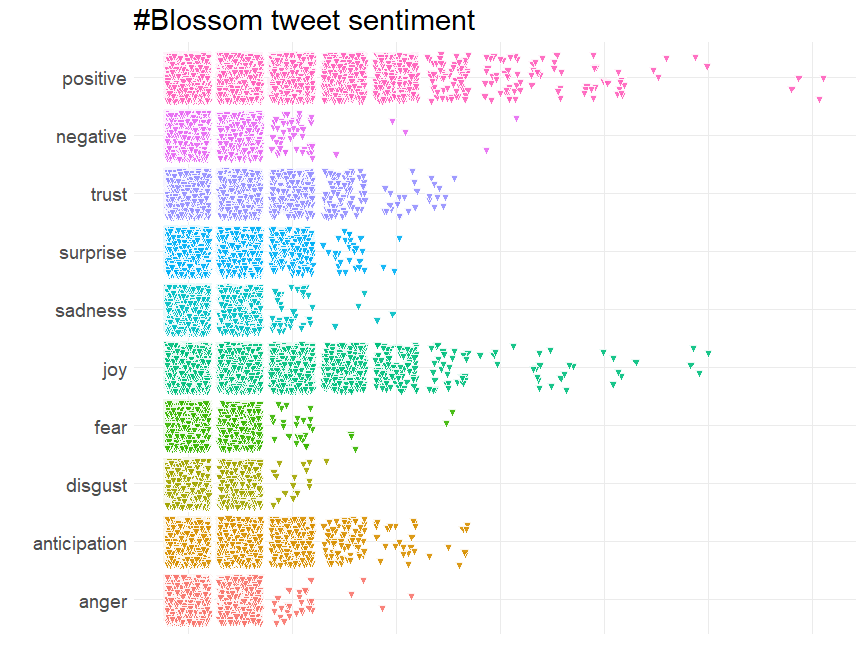

Blossom Watch 2021
================
Alan Millington
2021-03-22 20:48:51

| hashtag                      | count |
| :--------------------------- | ----: |
| blossom                      |  2364 |
| blossomwatch                 |  1549 |
| NationalTrust + BlossomWatch |    37 |
| EveryoneNeedsNature          |   280 |
| None                         |  1824 |

# Timeline

## Tweets by day

<!-- -->

## Tweets by day and time

Filtered for dates March, London time.
<!-- -->

# Users

## Top tweeters

<!-- -->

## Sources

<!-- -->

# Networks

## Replies

The “replies network”, composed from users who reply directly to one
another.

## Mentions

The “mentions network”, where users mention other users in their tweets.

# Retweets

## Retweet proportion

<!-- -->

## Retweet count

<!-- -->

## Top retweets

| screen\_name    | text                                                                                                                                                                                                                                                                                                  | retweet\_count |
| :-------------- | :---------------------------------------------------------------------------------------------------------------------------------------------------------------------------------------------------------------------------------------------------------------------------------------------------- | -------------: |
| nationaltrust   | Pause to soak up the sweet scents and soft songs emanating from blossom branches. These colourful trees are a feast for the senses. \#BlossomWatch <https://t.co/GsXfF5KPAE>                                                                                                                          |            239 |
| DrDarrenRFlower | Central Park New York \#spring \#spring2021 \#blossom \#cherry <https://t.co/Oimq2hRU1k>                                                                                                                                                                                                              |            143 |
| nationaltrust   | Spring is on the way. Celebrate the arrival of blossom near you with \#BlossomWatch: <https://t.co/TaQxr1YkU8> <https://t.co/kQ93UDZlCP>                                                                                                                                                              |            123 |
| nationaltrust   | Everywhere these delicate flowers emerge, they bring delight with them. Thanks to everyone who’s helped spread the joys of blossom so far - keep the photos coming with \#BlossomWatch. Photos: Joanna A, Catherine A, Shonali B, Cara W. <https://t.co/6znNDEdvKC>                                   |            122 |
| nationaltrust   | Happily dancing in the breeze, a golden daffodil is full of cheer. \#EveryoneNeedsNature <https://t.co/hSOWdCCnPL>                                                                                                                                                                                    |            108 |
| nationaltrust   | If you’re lucky enough to spot a hare hopping around, the feeling of elation will stick with you all day. \#EveryoneNeedsNature <https://t.co/Vpo5aADU9Q>                                                                                                                                             |            100 |
| nationaltrust   | \<U+0001F338\>\#BlossomWatch\<U+0001F338\> Lockdowns have changed the nation’s relationship with nature for the better. We are feeling more connected thanks to our daily strolls and taking more notice of the changing seasons. <https://t.co/JtIkqgUorV>                                           |             93 |
| nationaltrust   | One of life’s simple pleasures that can be enjoyed from anywhere. Engross yourself in the calming colours of a sunrise. \#EveryoneNeedsNature <https://t.co/l5xkDICUPn>                                                                                                                               |             69 |
| ampomata        | This is my new painting “Bed Of Roses”. You can check it out here: <https://t.co/GoYnqeM1YY> \#art \#arte \#oleo \#kunst \#oilpainting \#contemporaryart \#ArtistOnTwitter \#blossom \#flower \#floral \#spring \#pink \#red \#roses \#field \#artprints \#flowers \#garden <https://t.co/7y9skbUaMs> |             67 |
| MikeDoylePhotos | Autumnal view at Sheffield Park, East Sussex. \#Sussex \#England \#NationalTrust \#landscape \#landscapephotography \#travel \#travelphotography \#photo \#photography \#photooftheday \#NaturePhotography <https://t.co/FqII3JWs8w>                                                                  |             65 |

# Favourites

## Favourite proportion

<!-- -->

## Favourite count

<!-- -->

## Top favourites

| screen\_name    | text                                                                                                                                                                                                                                                                | favorite\_count |
| :-------------- | :------------------------------------------------------------------------------------------------------------------------------------------------------------------------------------------------------------------------------------------------------------------ | --------------: |
| nationaltrust   | Pause to soak up the sweet scents and soft songs emanating from blossom branches. These colourful trees are a feast for the senses. \#BlossomWatch <https://t.co/GsXfF5KPAE>                                                                                        |            1112 |
| DrDarrenRFlower | Central Park New York \#spring \#spring2021 \#blossom \#cherry <https://t.co/Oimq2hRU1k>                                                                                                                                                                            |             795 |
| nationaltrust   | If you’re lucky enough to spot a hare hopping around, the feeling of elation will stick with you all day. \#EveryoneNeedsNature <https://t.co/Vpo5aADU9Q>                                                                                                           |             698 |
| nationaltrust   | Everywhere these delicate flowers emerge, they bring delight with them. Thanks to everyone who’s helped spread the joys of blossom so far - keep the photos coming with \#BlossomWatch. Photos: Joanna A, Catherine A, Shonali B, Cara W. <https://t.co/6znNDEdvKC> |             693 |
| nationaltrust   | Happily dancing in the breeze, a golden daffodil is full of cheer. \#EveryoneNeedsNature <https://t.co/hSOWdCCnPL>                                                                                                                                                  |             606 |
| nationaltrust   | \<U+0001F338\>\#BlossomWatch\<U+0001F338\> Lockdowns have changed the nation’s relationship with nature for the better. We are feeling more connected thanks to our daily strolls and taking more notice of the changing seasons. <https://t.co/JtIkqgUorV>         |             571 |
| nationaltrust   | Spring is on the way. Celebrate the arrival of blossom near you with \#BlossomWatch: <https://t.co/TaQxr1YkU8> <https://t.co/kQ93UDZlCP>                                                                                                                            |             503 |
| MikeDoylePhotos | Early autumn at Sheffield Park, East Sussex. \#Sussex \#England \#NationalTrust \#landscape \#landscapephotography \#travel \#travelphotography \#photo \#photography \#photooftheday \#NaturePhotography <https://t.co/fqSC6f0xMQ>                                 |             484 |
| MikeDoylePhotos | Spring colour at Sheffield Park, East Sussex. \#Sussex \#England \#NationalTrust \#landscape \#landscapephotography \#travel \#travelphotography \#photo \#photography \#photooftheday \#NaturePhotography <https://t.co/uFdcfnor39>                                |             434 |
| MikeDoylePhotos | Autumnal view at Sheffield Park, East Sussex. \#Sussex \#England \#NationalTrust \#landscape \#landscapephotography \#travel \#travelphotography \#photo \#photography \#photooftheday \#NaturePhotography <https://t.co/FqII3JWs8w>                                |             424 |

# Quotes

## Quote proportion

<!-- -->

## Quote count

<!-- -->

## Top quotes

Joining, by = “quoted\_status\_id”

| screen\_name    | text                                                                                                                                                                                                                                                                                                                               | quote\_count |
| :-------------- | :--------------------------------------------------------------------------------------------------------------------------------------------------------------------------------------------------------------------------------------------------------------------------------------------------------------------------------- | -----------: |
| wearealtervego  | Taking in the \#nature around us…\#andbreathe \#blossomwatch \#savethebees \#savetheworld <https://t.co/9OKBi1ot9E>                                                                                                                                                                                                                |            3 |
| GillianFoxcroft | Wonderful initiative by @nationaltrust Lucky enough to live near @KedlestonNT where this blackthorn was heralding spring, but blossom is accessible in our towns and cities too \#BlossomWatch <https://t.co/l3nMn9dvGe> <https://t.co/Nri4nxd3vL>                                                                                 |            3 |
| MedialabGroup   | For what is probably the most anticipated spring in decades, we are incredibly proud to have supported our partner @nationaltrust in launching their latest Blossom campaign. The National Trust Blossom campaign runs across TV, national press and digital. \#BlossomWatch <https://t.co/wMan1xCxRM>                             |            3 |
| weather2travel  | Will you be joining @nationaltrust \#BlossomWatch? \<U+0001F338\>\<U+0001F440\> \#thursdaymorning \#ThoughtForTheDay \#spring \#bliss <https://t.co/aiQYIY1n5N>                                                                                                                                                                    |            2 |
| HeiniHeikkil    | Mesmerising, refreshing blossom shared by millions in social media \<U+0001F338\>\#UKhanami \#BlossomWatch <https://t.co/Ut9p5H0aEL>                                                                                                                                                                                               |            2 |
| NaturalEngland  | Our research shows that nature is more important than ever to us since the pandemic started. We’re taking more notice of small changes in nature and signs of spring, like beautiful apple blossom. Share your pictures of blossom with @NationalTrust using \<U+0001F338\>\#BlossomWatch \<U+0001F338\> <https://t.co/KlDTIYa46E> |            2 |
| radiowinch      | Spring is on the way. Celebrate the arrival of blossom near you with \#BlossomWatch share your photos <https://t.co/B0TuHmf6Sk>                                                                                                                                                                                                    |            2 |
| LauraSkitt\_    | I love blossom trees so much. It reminds me spring is nearly here which means my birthday is nearly here (end of April, but still\!) \#BlossomWatch \<U+0001F338\> <https://t.co/gB9yiEInEo>                                                                                                                                       |            2 |
| sheffieldparkNT | Here at @Nationaltrust we are celebrating the delicate clusters of flowers that are starting to appear on the trees- \#blossomwatch is here\! Have you spotted any blooms festooning the trees? Share your pics on our blossom map with \#BlossomWatch <https://t.co/Uk6EYfJsV4> <https://t.co/T1QMKLUHwo>                         |            2 |
| DerbyUniPress   | Research @DerbyUni is making important contributions to initiatives designed to enhance our \#wellbeing and strengthen our relationship with \#nature, such as @nationaltrust \#BlossomWatch, which has been launched today. @findingnature <https://t.co/c4ZAhGJs1Q>                                                              |            2 |

# Media

## Media count

<!-- -->

## Top media

| screen\_name    | text                                                                                                                                                                                                                                                                | favorite\_count |
| :-------------- | :------------------------------------------------------------------------------------------------------------------------------------------------------------------------------------------------------------------------------------------------------------------ | --------------: |
| nationaltrust   | Pause to soak up the sweet scents and soft songs emanating from blossom branches. These colourful trees are a feast for the senses. \#BlossomWatch <https://t.co/GsXfF5KPAE>                                                                                        |            1112 |
| DrDarrenRFlower | Central Park New York \#spring \#spring2021 \#blossom \#cherry <https://t.co/Oimq2hRU1k>                                                                                                                                                                            |             795 |
| nationaltrust   | If you’re lucky enough to spot a hare hopping around, the feeling of elation will stick with you all day. \#EveryoneNeedsNature <https://t.co/Vpo5aADU9Q>                                                                                                           |             698 |
| nationaltrust   | Everywhere these delicate flowers emerge, they bring delight with them. Thanks to everyone who’s helped spread the joys of blossom so far - keep the photos coming with \#BlossomWatch. Photos: Joanna A, Catherine A, Shonali B, Cara W. <https://t.co/6znNDEdvKC> |             693 |
| nationaltrust   | Happily dancing in the breeze, a golden daffodil is full of cheer. \#EveryoneNeedsNature <https://t.co/hSOWdCCnPL>                                                                                                                                                  |             606 |
| nationaltrust   | \<U+0001F338\>\#BlossomWatch\<U+0001F338\> Lockdowns have changed the nation’s relationship with nature for the better. We are feeling more connected thanks to our daily strolls and taking more notice of the changing seasons. <https://t.co/JtIkqgUorV>         |             571 |
| nationaltrust   | Spring is on the way. Celebrate the arrival of blossom near you with \#BlossomWatch: <https://t.co/TaQxr1YkU8> <https://t.co/kQ93UDZlCP>                                                                                                                            |             503 |
| MikeDoylePhotos | Early autumn at Sheffield Park, East Sussex. \#Sussex \#England \#NationalTrust \#landscape \#landscapephotography \#travel \#travelphotography \#photo \#photography \#photooftheday \#NaturePhotography <https://t.co/fqSC6f0xMQ>                                 |             484 |
| MikeDoylePhotos | Spring colour at Sheffield Park, East Sussex. \#Sussex \#England \#NationalTrust \#landscape \#landscapephotography \#travel \#travelphotography \#photo \#photography \#photooftheday \#NaturePhotography <https://t.co/uFdcfnor39>                                |             434 |
| MikeDoylePhotos | Autumnal view at Sheffield Park, East Sussex. \#Sussex \#England \#NationalTrust \#landscape \#landscapephotography \#travel \#travelphotography \#photo \#photography \#photooftheday \#NaturePhotography <https://t.co/FqII3JWs8w>                                |             424 |

### Most liked media image

# Tweet text

The 250 words used 3 or more times. Words removed: blossom,
blossomwatch, nationaltrust, everyoneneedsnature.

<!-- -->

## Tweets by Tweet Length

<!-- -->

## Blossom Sentiment Analysis - Visualisation

<!-- -->
