Blossom Watch 2021
================
Alan Millington
2021-03-24 09:10:38

| hashtag                             | count |
| :---------------------------------- | ----: |
| blossom                             |  2545 |
| blossomwatch                        |  1630 |
| NationalTrust + BlossomWatch        |    36 |
| EveryoneNeedsNature                 |   310 |
| No Hashtag (Text contains keywords) |  1870 |

# Timeline

## Tweets by day

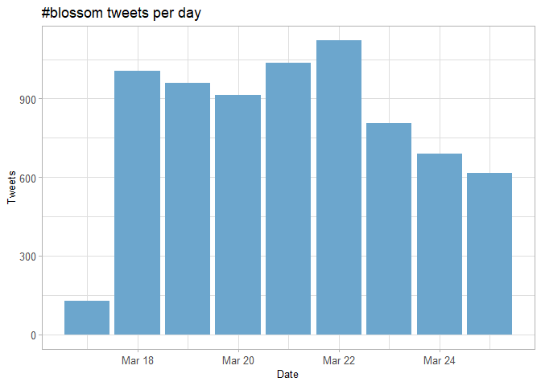<!-- -->

## Tweets by day and time

Filtered for dates March, London time.
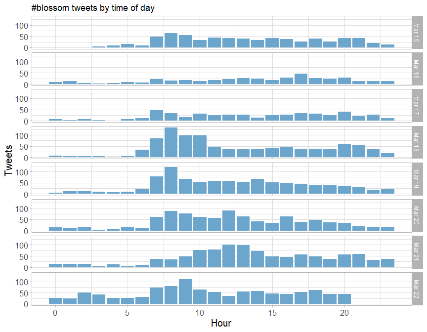<!-- -->

# Users

## Top tweeters

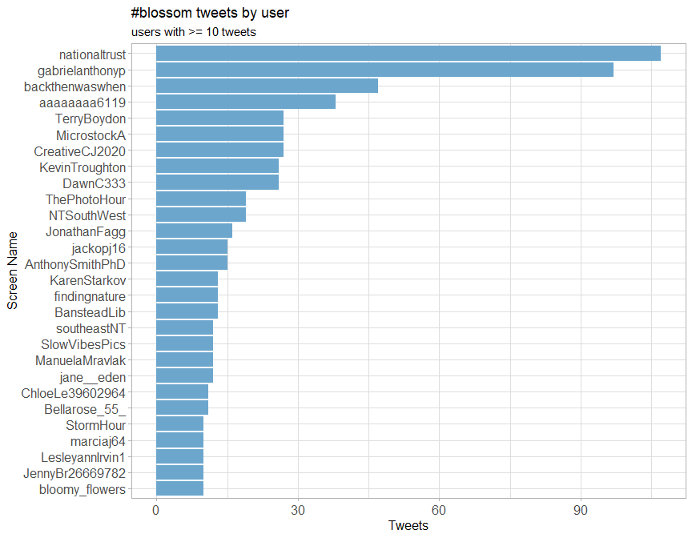<!-- -->

## Sources

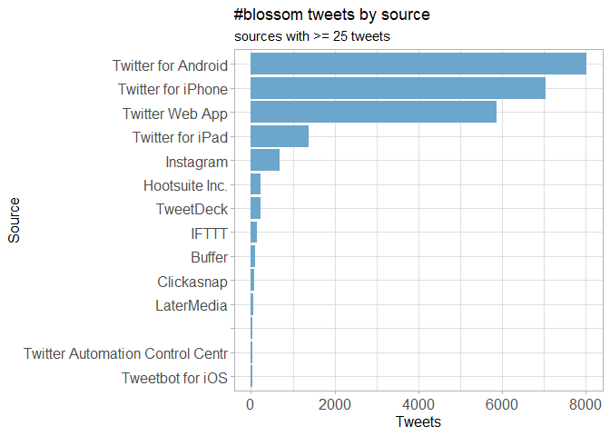<!-- -->

## Network Replies

The “replies network”, composed from users who reply directly to one
another.

## Network Mentions

The “mentions network”, where users mention other users in their tweets.

# Retweets

## Retweet proportion

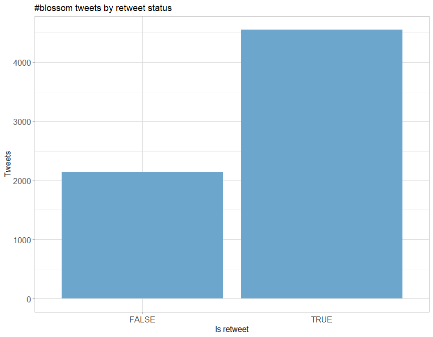<!-- -->

## Retweet count

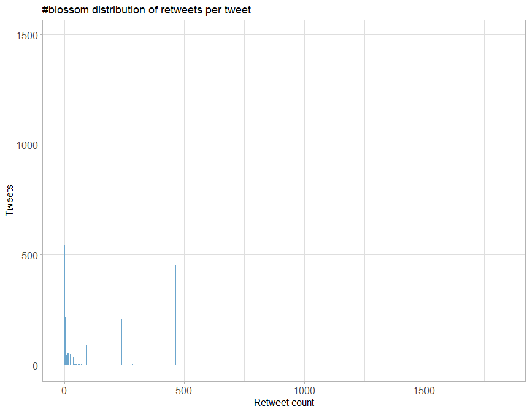<!-- -->

## Top retweets

| screen\_name    | text                                                                                                                                                                                                                                                                                                  | retweet\_count |
| :-------------- | :---------------------------------------------------------------------------------------------------------------------------------------------------------------------------------------------------------------------------------------------------------------------------------------------------- | -------------: |
| nationaltrust   | Pause to soak up the sweet scents and soft songs emanating from blossom branches. These colourful trees are a feast for the senses. \#BlossomWatch <https://t.co/GsXfF5KPAE>                                                                                                                          |            243 |
| DrDarrenRFlower | Central Park New York \#spring \#spring2021 \#blossom \#cherry <https://t.co/Oimq2hRU1k>                                                                                                                                                                                                              |            151 |
| nationaltrust   | Everywhere these delicate flowers emerge, they bring delight with them. Thanks to everyone who’s helped spread the joys of blossom so far - keep the photos coming with \#BlossomWatch. Photos: Joanna A, Catherine A, Shonali B, Cara W. <https://t.co/6znNDEdvKC>                                   |            122 |
| nationaltrust   | Happily dancing in the breeze, a golden daffodil is full of cheer. \#EveryoneNeedsNature <https://t.co/hSOWdCCnPL>                                                                                                                                                                                    |            122 |
| nationaltrust   | \<U+0001F338\>\#BlossomWatch\<U+0001F338\> Lockdowns have changed the nation’s relationship with nature for the better. We are feeling more connected thanks to our daily strolls and taking more notice of the changing seasons. <https://t.co/JtIkqgUorV>                                           |             99 |
| MikeDoylePhotos | Autumnal view at Sheffield Park, East Sussex. \#Sussex \#England \#NationalTrust \#landscape \#landscapephotography \#travel \#travelphotography \#photo \#photography \#photooftheday \#NaturePhotography <https://t.co/FqII3JWs8w>                                                                  |             96 |
| nationaltrust   | When you see the blossom dancing in the breeze, pause to notice the bewitching perfume drifting along with it. \#BlossomWatch <https://t.co/Kh68Hh3iMx>                                                                                                                                               |             76 |
| nationaltrust   | One of life’s simple pleasures that can be enjoyed from anywhere. Engross yourself in the calming colours of a sunrise. \#EveryoneNeedsNature <https://t.co/l5xkDICUPn>                                                                                                                               |             72 |
| ampomata        | This is my new painting “Bed Of Roses”. You can check it out here: <https://t.co/GoYnqeM1YY> \#art \#arte \#oleo \#kunst \#oilpainting \#contemporaryart \#ArtistOnTwitter \#blossom \#flower \#floral \#spring \#pink \#red \#roses \#field \#artprints \#flowers \#garden <https://t.co/7y9skbUaMs> |             69 |
| MikeDoylePhotos | Early autumn at Sheffield Park, East Sussex. \#Sussex \#England \#NationalTrust \#landscape \#landscapephotography \#travel \#travelphotography \#photo \#photography \#photooftheday \#NaturePhotography <https://t.co/fqSC6f0xMQ>                                                                   |             64 |

# Favourites

## Favourite proportion

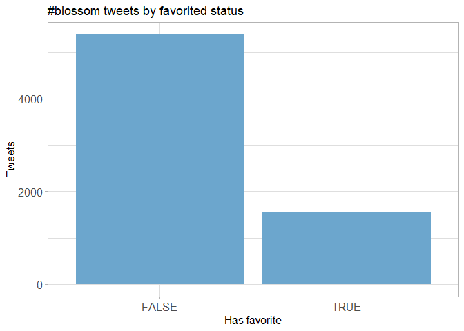<!-- -->

## Favourite count

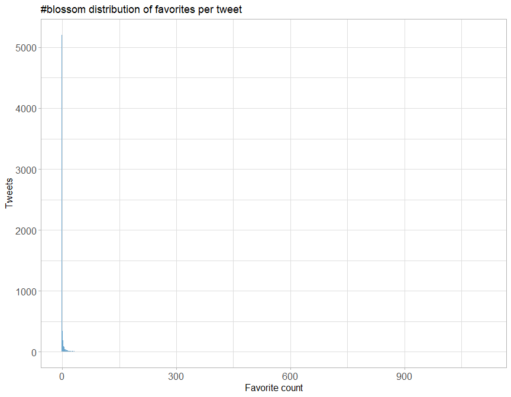<!-- -->

## Top favourites

| screen\_name    | text                                                                                                                                                                                                                                                                                                               | favorite\_count |
| :-------------- | :----------------------------------------------------------------------------------------------------------------------------------------------------------------------------------------------------------------------------------------------------------------------------------------------------------------- | --------------: |
| nationaltrust   | Pause to soak up the sweet scents and soft songs emanating from blossom branches. These colourful trees are a feast for the senses. \#BlossomWatch <https://t.co/GsXfF5KPAE>                                                                                                                                       |            1127 |
| DrDarrenRFlower | Central Park New York \#spring \#spring2021 \#blossom \#cherry <https://t.co/Oimq2hRU1k>                                                                                                                                                                                                                           |             830 |
| nationaltrust   | Everywhere these delicate flowers emerge, they bring delight with them. Thanks to everyone who’s helped spread the joys of blossom so far - keep the photos coming with \#BlossomWatch. Photos: Joanna A, Catherine A, Shonali B, Cara W. <https://t.co/6znNDEdvKC>                                                |             696 |
| nationaltrust   | Happily dancing in the breeze, a golden daffodil is full of cheer. \#EveryoneNeedsNature <https://t.co/hSOWdCCnPL>                                                                                                                                                                                                 |             691 |
| MikeDoylePhotos | Autumnal view at Sheffield Park, East Sussex. \#Sussex \#England \#NationalTrust \#landscape \#landscapephotography \#travel \#travelphotography \#photo \#photography \#photooftheday \#NaturePhotography <https://t.co/FqII3JWs8w>                                                                               |             620 |
| nationaltrust   | \<U+0001F338\>\#BlossomWatch\<U+0001F338\> Lockdowns have changed the nation’s relationship with nature for the better. We are feeling more connected thanks to our daily strolls and taking more notice of the changing seasons. <https://t.co/JtIkqgUorV>                                                        |             593 |
| MikeDoylePhotos | Early autumn at Sheffield Park, East Sussex. \#Sussex \#England \#NationalTrust \#landscape \#landscapephotography \#travel \#travelphotography \#photo \#photography \#photooftheday \#NaturePhotography <https://t.co/fqSC6f0xMQ>                                                                                |             538 |
| nationaltrust   | Who else is buzzing with excitement at the blossom appearing? We love hearing the calming hum of bees enjoying the flowers. \#BlossomWatch Photo: Rosie S, @ClivedenNT <https://t.co/JGcihvsoCV>                                                                                                                   |             535 |
| JuliaBradbury   | Spending time to dwell on nature can improve your wellbeing- research shows that just 20 mins can improve your mood.Only 6% take the time to celebrate things like the first seasonal first day of spring. @nationaltrust is helping to plant more blossom trees \#BlossomWatch \#hanami <https://t.co/UkuU9I6x91> |             520 |
| nationaltrust   | When you see the blossom dancing in the breeze, pause to notice the bewitching perfume drifting along with it. \#BlossomWatch <https://t.co/Kh68Hh3iMx>                                                                                                                                                            |             453 |

# Quotes

## Quote proportion

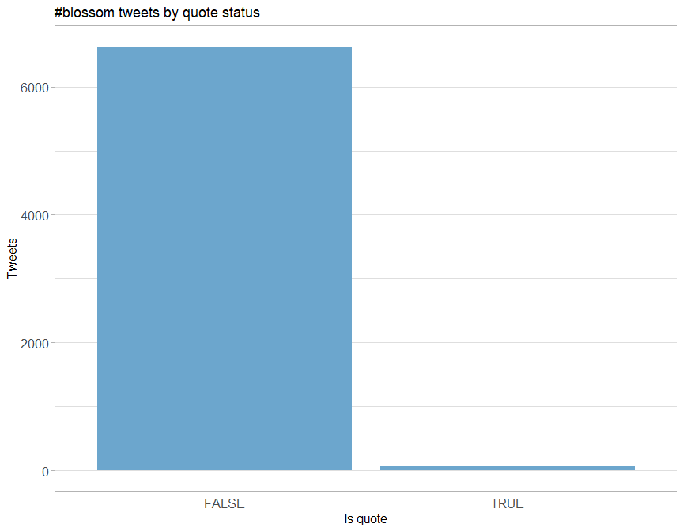<!-- -->

## Quote count

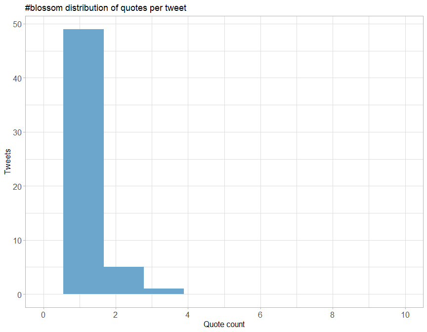<!-- -->

## Top quotes

Joining, by = “quoted\_status\_id”

| screen\_name     | text                                                                                                                                                                                                                                                                                                                               | quote\_count |
| :--------------- | :--------------------------------------------------------------------------------------------------------------------------------------------------------------------------------------------------------------------------------------------------------------------------------------------------------------------------------- | -----------: |
| Ms\_SJP          | Well the National Trust’s \#blossomwatch hashtag is my new favourite thing, I have to say\! \<U+0001F338\> <https://t.co/i4cj9FF1VX>                                                                                                                                                                                               |            4 |
| LBGAmbEast       | Some wonderful images on @nationaltrust’s \#BlossomWatch thread <https://t.co/1XSkaKnQZc>                                                                                                                                                                                                                                          |            4 |
| NaturalEngland   | Our research shows that nature is more important than ever to us since the pandemic started. We’re taking more notice of small changes in nature and signs of spring, like beautiful apple blossom. Share your pictures of blossom with @NationalTrust using \<U+0001F338\>\#BlossomWatch \<U+0001F338\> <https://t.co/KlDTIYa46E> |            4 |
| radiowinch       | Spring is on the way. Celebrate the arrival of blossom near you with \#BlossomWatch share your photos <https://t.co/B0TuHmf6Sk>                                                                                                                                                                                                    |            4 |
| JamesGardening   | Share with everyone your blossom pics using the \#BlossomWatch and national trust. plenty of amazing pictures to view. <https://t.co/57ZDpy4865>                                                                                                                                                                                   |            3 |
| SpiralStripeArt  | Loving the @nationaltrust latest campaign \#BlossomWatch which I know my \#SMM friends will appreciate as a brilliant example of user-generated content\! \<U+0001F338\> The campaign has even been advertised on \<U+0001F4FA\> @1OFFGINGER @sociallymaz @TechPixies @hellosocialLdn @muchmoresocial <https://t.co/EGyVKh0Vht>    |            3 |
| heritage\_lizzie | Yes\! Here’s magnolia on the school run today \#blossomwatch My favourite time of year. @nationaltrust <https://t.co/7nq3iQrw5J> <https://t.co/Mg7BMMOZ4V>                                                                                                                                                                       |            3 |
| wearealtervego   | Taking in the \#nature around us…\#andbreathe \#blossomwatch \#savethebees \#savetheworld <https://t.co/9OKBi1ot9E>                                                                                                                                                                                                                |            2 |
| GillianFoxcroft  | Wonderful initiative by @nationaltrust Lucky enough to live near @KedlestonNT where this blackthorn was heralding spring, but blossom is accessible in our towns and cities too \#BlossomWatch <https://t.co/l3nMn9dvGe> <https://t.co/Nri4nxd3vL>                                                                                 |            2 |
| weather2travel   | Will you be joining @nationaltrust \#BlossomWatch? \<U+0001F338\>\<U+0001F440\> \#thursdaymorning \#ThoughtForTheDay \#spring \#bliss <https://t.co/aiQYIY1n5N>                                                                                                                                                                    |            2 |

# Media

## Media count

<!-- -->

## Top media

| screen\_name    | text                                                                                                                                                                                                                                                                                                               | favorite\_count |
| :-------------- | :----------------------------------------------------------------------------------------------------------------------------------------------------------------------------------------------------------------------------------------------------------------------------------------------------------------- | --------------: |
| nationaltrust   | Pause to soak up the sweet scents and soft songs emanating from blossom branches. These colourful trees are a feast for the senses. \#BlossomWatch <https://t.co/GsXfF5KPAE>                                                                                                                                       |            1127 |
| DrDarrenRFlower | Central Park New York \#spring \#spring2021 \#blossom \#cherry <https://t.co/Oimq2hRU1k>                                                                                                                                                                                                                           |             830 |
| nationaltrust   | Everywhere these delicate flowers emerge, they bring delight with them. Thanks to everyone who’s helped spread the joys of blossom so far - keep the photos coming with \#BlossomWatch. Photos: Joanna A, Catherine A, Shonali B, Cara W. <https://t.co/6znNDEdvKC>                                                |             696 |
| nationaltrust   | Happily dancing in the breeze, a golden daffodil is full of cheer. \#EveryoneNeedsNature <https://t.co/hSOWdCCnPL>                                                                                                                                                                                                 |             691 |
| MikeDoylePhotos | Autumnal view at Sheffield Park, East Sussex. \#Sussex \#England \#NationalTrust \#landscape \#landscapephotography \#travel \#travelphotography \#photo \#photography \#photooftheday \#NaturePhotography <https://t.co/FqII3JWs8w>                                                                               |             620 |
| nationaltrust   | \<U+0001F338\>\#BlossomWatch\<U+0001F338\> Lockdowns have changed the nation’s relationship with nature for the better. We are feeling more connected thanks to our daily strolls and taking more notice of the changing seasons. <https://t.co/JtIkqgUorV>                                                        |             593 |
| MikeDoylePhotos | Early autumn at Sheffield Park, East Sussex. \#Sussex \#England \#NationalTrust \#landscape \#landscapephotography \#travel \#travelphotography \#photo \#photography \#photooftheday \#NaturePhotography <https://t.co/fqSC6f0xMQ>                                                                                |             538 |
| nationaltrust   | Who else is buzzing with excitement at the blossom appearing? We love hearing the calming hum of bees enjoying the flowers. \#BlossomWatch Photo: Rosie S, @ClivedenNT <https://t.co/JGcihvsoCV>                                                                                                                   |             535 |
| JuliaBradbury   | Spending time to dwell on nature can improve your wellbeing- research shows that just 20 mins can improve your mood.Only 6% take the time to celebrate things like the first seasonal first day of spring. @nationaltrust is helping to plant more blossom trees \#BlossomWatch \#hanami <https://t.co/UkuU9I6x91> |             520 |
| nationaltrust   | When you see the blossom dancing in the breeze, pause to notice the bewitching perfume drifting along with it. \#BlossomWatch <https://t.co/Kh68Hh3iMx>                                                                                                                                                            |             453 |

### Most liked media image

# Tweet text

The 150 words used 3 or more times. Words removed: blossom,
blossomwatch, nationaltrust, everyoneneedsnature.

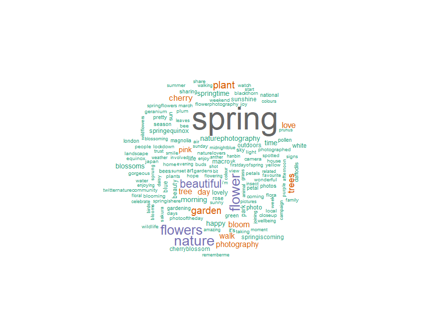<!-- -->

## Tweets by Tweet Length

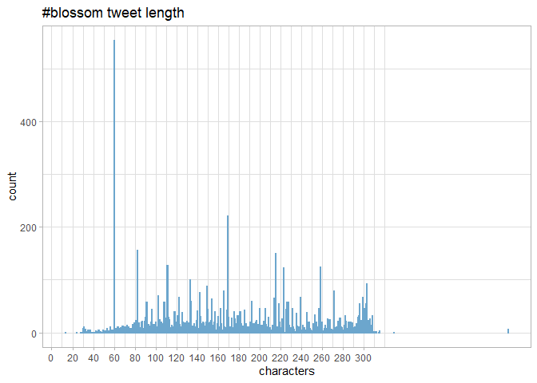<!-- -->

## Blossom Sentiment Analysis - Visualisation

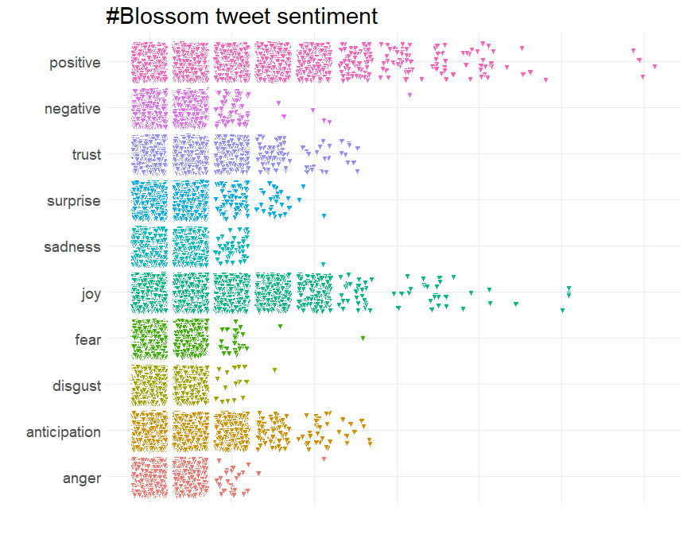<!-- -->
